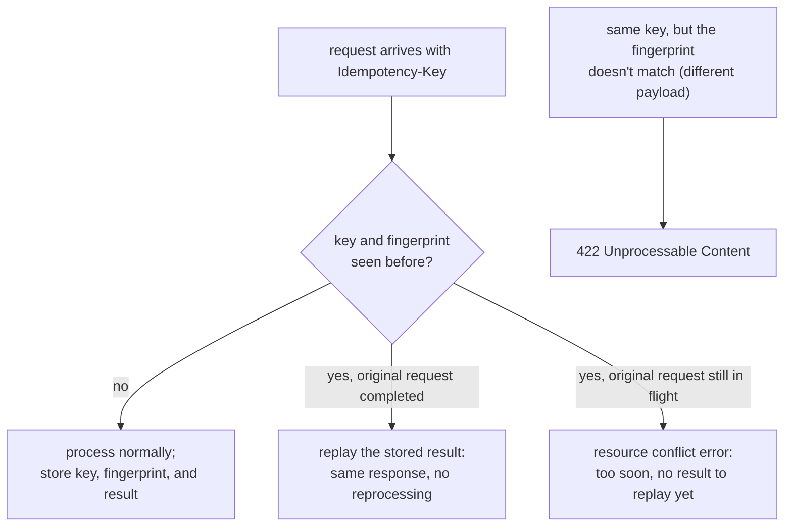

# Lesson 11. Idempotency Keys and Safe Retries

**Mission link:** Lesson 2 named the gap directly: `POST` isn't idempotent by method definition, so retrying a timed-out one risks a duplicate resource unless the API separately provides an idempotency mechanism. This lesson is that mechanism, and the working group is standardizing it as the `Idempotency-Key` header.
**Primary source:** [Draft: "The Idempotency-Key HTTP Header Field", IETF HTTPAPI Working Group](https://datatracker.ietf.org/doc/draft-ietf-httpapi-idempotency-key-header/)
**Prerequisites:** [Lesson 2](0002-http-status-codes-and-error-semantics.md), [Contract](../GLOSSARY.md)

## Warm-up

1. ▢ Why does a `201 Created` response not guarantee the request that produced it is safe to retry?

Check

`201` reports the outcome of one specific attempt; it says nothing about whether the underlying method is safe to repeat, which is a property of the method itself (`POST` is not idempotent by definition), not of any status code the previous attempt happened to return.

2. ▢ A client's `POST` to create an order times out with no response received. What's the risk if the client retries the identical request?

Check

The original request may have actually succeeded server-side even though the client never received the response, so an identical retry risks creating a second, duplicate order, since `POST` isn't idempotent and nothing by default recognizes the retry as "the same request" rather than a new one.

## Know this

### An idempotency key deduplicates; a fingerprint verifies it's actually the same request

A client generates an **idempotency key**, a unique value (a UUID is the recommended form), and attaches it via the `Idempotency-Key` request header to a non-idempotent request like `POST` or `PATCH`. The key alone only tells the server "I've seen this key before"; it doesn't by itself confirm the retried request is identical to the original. That's what an **idempotency fingerprint** is for: a value the server derives from the request payload itself (a checksum of the whole body, a checksum or exact match of specific fields, or a full request digest), checked alongside the key. The key's uniqueness rule is explicit: it must never be reused with a genuinely different request payload, and the fingerprint is the mechanism that actually catches a violation of that rule rather than silently trusting the key alone.

### Three outcomes for the same key, not two

A request carrying a previously-used idempotency key falls into one of three cases, and conflating any two of them is where a naive implementation goes wrong:

- **First time** (key and fingerprint never seen): the resource processes the request normally, and stores the key, fingerprint, and eventual result together.
- **Retry, after the original completed** (same key, same fingerprint, and the original request already finished): the resource replays the *stored result* of that completed operation, success or error, rather than reprocessing anything. This is what actually makes the retry safe: the client gets the same answer without a second side effect ever happening.
- **Concurrent request** (same key, same fingerprint, but the original request is *still in progress*): there's no stored result yet to replay, so the resource responds with a resource conflict error instead. A retry sent too soon, before the first attempt has actually finished, does not get treated the same as a retry sent after completion.

### Two specific error cases the spec calls out

If a documented idempotent-required operation is missing its `Idempotency-Key` header entirely, the resource responds with `400 Bad Request`. If the same key is reused with a request whose fingerprint doesn't match the original (a different payload under an already-used key), the resource responds with `422 Unprocessable Content`, RFC 9110's status for a request that's syntactically fine but semantically invalid in this specific way: reusing a key is only valid when it's genuinely the same request.

### Keys aren't valid forever

A resource may require idempotency keys to be time-bounded so it can eventually purge old ones rather than storing every key indefinitely; when it does, that expiration policy should be documented, since a client relying on retry safety needs to know the actual window during which a retry will still be recognized as a duplicate rather than treated as a brand-new request.

## Practice

1. ▢ A client sends a `POST` with `Idempotency-Key: abc123` and a specific order payload. Minutes later, it sends another `POST` with the same key but a *different* order payload (a different item and quantity). What should the resource do, and why?

Hint

Consider what the fingerprint is specifically for, and which rule this violates.

Check

The resource should respond with `422 Unprocessable Content`, since the fingerprint derived from the second payload won't match the fingerprint stored for the first request under the same key. Reusing an idempotency key with a genuinely different request payload violates the key's uniqueness rule, and the fingerprint is exactly what catches that.

2. ▢ A client's request times out, and it retries with the same idempotency key while the original request is, unknown to the client, still being processed server-side. What does the client get back, and why isn't it the eventual result of the original request?

Check

A resource conflict error, not the eventual result, because there's nothing stored to replay yet: the original request hasn't completed, so no final result exists for the retry to receive. This is the concurrent-request case, distinct from a retry sent after the original has actually finished.

3. ▢ A client retries a `POST` with the same idempotency key several minutes after the original request actually succeeded. What does the resource do, and why does this make the retry safe?

Check

The resource replays the stored result of the already-completed original request rather than processing the retried request as new work; the client receives the same response the original request produced, and no second side effect (like a duplicate order) ever occurs, since the request is never actually reprocessed.

4. ▢ Why does an idempotency key alone, without a fingerprint, fail to fully protect against a client bug that reuses a key across genuinely different requests?

Check

The key by itself only tells the server "this key has been seen before," with nothing checking whether the request attached to it now is the same request as before. Without a fingerprint derived from the payload, a server has no way to detect that a reused key is actually attached to different content, and might incorrectly replay an unrelated stored result instead of rejecting the mismatched reuse.

5. ▢ Which claim correctly describes how idempotency keys make a non-idempotent method safe to retry?

    - a) The idempotency key alone guarantees a retried request will never be reprocessed, with no need for any other mechanism
    - b) A retry with the same key and matching fingerprint, sent after the original request completed, gets the original's stored result replayed; the same retry sent while the original is still in progress instead gets a conflict error, since no result exists yet to replay
    - c) Reusing an idempotency key with a different request payload is always treated identically to reusing it with the same payload
    - d) An idempotency key is valid indefinitely and never needs an expiration policy

Check

**b)** That's the precise three-way outcome (first-time, retry-after-completion, concurrent-in-flight) this mechanism defines. (a) is false: the key alone doesn't distinguish a genuine retry from a different request reusing the same key by mistake; the fingerprint does that work. (c) is false: a mismatched fingerprint under a reused key produces a `422`, a genuinely different outcome from a matching retry. (d) is false: the spec explicitly allows (and expects) a documented expiration policy for stored keys.

## Real-world reps

- [ ] For a `POST` or `PATCH` endpoint you have access to (your own API, or one you integrate with), check whether it supports an idempotency key, and if so, read its documented behavior for a retry sent while the original request is still processing.
- [ ] Find (or design) the specific fingerprinting approach an API you work with would need: a full-body checksum, or specific-field matching, and why one might fit better than the other for that API's payloads.
- [ ] Tomorrow: read the primary source's error-handling section in full, and note the exact `Problem Details` body it recommends for the missing-key and fingerprint-mismatch cases.

## Going further

- [Draft: "The Idempotency-Key HTTP Header Field", IETF HTTPAPI Working Group](https://datatracker.ietf.org/doc/draft-ietf-httpapi-idempotency-key-header/)
- [RFC 9110: "HTTP Semantics", IETF](https://www.rfc-editor.org/rfc/rfc9110)
- [Resources](../RESOURCES.md)

---

Not landing? Reread the primary source at the top, since this lesson compresses it and compression is where understanding leaks. Check the [glossary](../GLOSSARY.md) for any term that felt slippery.

If the lesson itself is unclear rather than the material, that is a defect: [open an issue](https://github.com/TokenCemetery/teach/issues).
