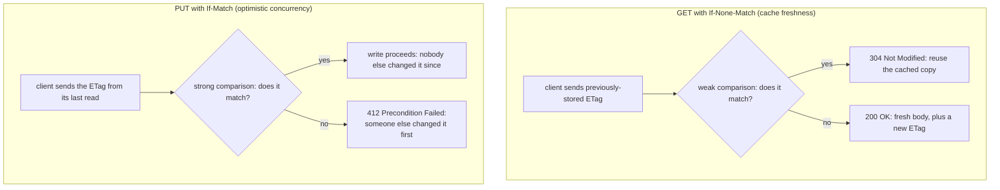

# Lesson 12. HTTP Caching as Contract

**Mission link:** Lesson 11 covered detecting a duplicate request; this lesson covers a related but distinct problem, detecting a *concurrent* one, whether a resource has changed since a client last read it, for two different purposes: avoiding a redundant download, and avoiding an accidental overwrite of someone else's change.
**Primary source:** [RFC 9110: "HTTP Semantics", IETF](https://www.rfc-editor.org/rfc/rfc9110)
**Prerequisites:** [Lesson 11](0011-idempotency-keys-and-safe-retries.md), [Contract](../GLOSSARY.md)

## Warm-up

1. ▢ Why does a resource conflict error, not a replayed result, come back when a retry with the same idempotency key arrives while the original request is still being processed?

Check

There's no stored result yet to replay, since the original request hasn't completed; the concurrent-request case is specifically distinguished from a retry sent after completion, which does get the stored result replayed instead.

2. ▢ Why does an idempotency key alone, without a fingerprint, fail to catch a client bug that reuses a key across genuinely different requests?

Check

The key alone only tells the server a given key has been seen before; nothing about the key itself checks whether the request now attached to it matches the original. The fingerprint, derived from the payload, is what actually detects a mismatched reuse.

## Know this

### `ETag`: an opaque validator, strong or weak

An **`ETag`** identifies a specific state of a resource's representation, an opaque string a server can compare against a value the client sends back later. RFC 9110 splits validators into two kinds: a **strong validator** changes whenever the representation changes at all, byte-for-byte, while a **weak validator** (written with a `W/` prefix, like `W/"xyzzy"`) only changes when the resource changes in a way that's *semantically* significant, meaning two responses with the same weak validator aren't guaranteed to be byte-identical, only equivalent enough for the purpose the server considers meaningful.

### Two comparison functions, and which one each conditional header needs

RFC 9110 defines two ways to compare validators: **weak comparison** considers two ETags equal if their opaque values match, even if one or both are weak, while **strong comparison** requires the values to match *and* neither to be weak. This distinction is exactly why the two most common conditional headers aren't interchangeable: **`If-None-Match`**, used on a `GET` to ask "send me the full body only if it's actually changed," only needs weak comparison, since a semantically-equivalent-but-not-byte-identical match is still a legitimate reason to skip re-sending the body. **`If-Match`**, used on a `PUT` or `DELETE` to ask "only do this if the resource is still exactly what I last read," needs strong comparison: a weak match doesn't guarantee the underlying bytes haven't changed, which is exactly the guarantee an overwrite-safety check depends on.

### `If-Match` is optimistic concurrency, not authentication or authorization

A client that reads a resource, gets back its current `ETag`, and later sends a `PUT` with `If-Match` set to that same value is making an **optimistic concurrency** claim: "apply this write only if the resource is still exactly what I read." If another client modified the resource in between, the strong comparison fails and the server responds `412 Precondition Failed`, rejecting the write outright rather than silently overwriting the intervening change or merging the two. This is a distinctly different failure from an authentication or authorization rejection: the client is fully allowed to write, but the specific write it's attempting is now based on stale information, and it needs to re-read the current state before retrying.

### `no-cache` doesn't mean "don't cache," and that confusion causes real bugs

`Cache-Control: no-cache` is one of the most commonly misread directives in HTTP: it does **not** forbid storing the response at all; it requires a cache to revalidate with the origin server before reusing a stored response for any later request. The directive that actually forbids storage entirely is `no-store`. Confusing the two produces two opposite mistakes: assuming `no-cache` prevents caching (when a compliant cache is allowed to keep the response and simply revalidate it before each reuse), or reaching for `no-cache` when `no-store` was the actual requirement (leaving genuinely sensitive response data cached, just gated behind revalidation rather than absent).

### `must-revalidate` closes the "serve it stale anyway" gap

Ordinary cache freshness rules allow some caches to serve a stale response rather than fail outright if the origin can't be reached. `must-revalidate` closes that specific gap for a given response: once it becomes stale, a cache must not serve it again without successfully revalidating against the origin, and if the origin can't be reached, the cache must fail (with a `504 Gateway Timeout`) rather than serve the stale copy anyway. This matters specifically for responses where serving stale data risks a real error, the RFC's own example being an unexecuted financial transaction shown as though it succeeded.

## Practice

1. ▢ A server returns `ETag: W/"v3"` for a resource. A client later sends a `PUT` with `If-Match: W/"v3"`, intending an optimistic-concurrency-safe update. Is this a safe way to detect a concurrent change?

Hint

Consider which comparison function `If-Match` requires, and what a weak validator does and doesn't guarantee.

Check

No. `If-Match` requires strong comparison, and a weak validator is explicitly not required to change on every byte-level modification, only on semantically significant ones. Using a weak ETag for `If-Match` risks the comparison succeeding even though the underlying bytes actually changed, defeating the overwrite-safety guarantee the check is meant to provide.

2. ▢ A client sends `GET` with `If-None-Match` carrying an ETag that matches via weak comparison but not strong comparison (one of the two values is weak). Should the server return `304 Not Modified`?

Check

Yes. `If-None-Match` on a `GET` only requires weak comparison, since the purpose is skipping a redundant download when the representation is at least semantically equivalent, not verifying byte-for-byte identity. A weak match is sufficient grounds for `304 Not Modified` here, unlike for `If-Match`.

3. ▢ A team wants to prevent a cache from ever storing a response containing sensitive account data, and sets `Cache-Control: no-cache` on it. Does this achieve what they intended?

Check

No. `no-cache` still permits storage; it only requires revalidation with the origin before reuse. Preventing storage entirely requires `no-store` instead; using `no-cache` when `no-store` was actually needed leaves the sensitive response cached, just gated behind a revalidation step rather than genuinely absent from the cache.

4. ▢ Two clients read the same resource and both receive `ETag: "v1"`. Client A successfully updates it with `If-Match: "v1"`, receiving a new `ETag: "v2"`. Client B then attempts its own update with `If-Match: "v1"`. What happens, and why is this the correct outcome?

Check

Client B's request fails with `412 Precondition Failed`, since the resource's current ETag is now `"v2"`, not the `"v1"` Client B last read. This is the correct outcome: Client B's write was based on a now-stale read, and rejecting it (rather than silently overwriting Client A's change or merging the two) is exactly what optimistic concurrency via `If-Match` is meant to guarantee.

5. ▢ Which claim correctly describes the difference between `If-None-Match` and `If-Match`, and between `no-cache` and `no-store`?

    - a) Both conditional headers require the same, strong comparison; the two Cache-Control directives are simply two spellings of the same rule
    - b) `If-None-Match` only needs weak comparison (sufficient for cache freshness); `If-Match` needs strong comparison (required for safe optimistic concurrency); `no-cache` permits storage but requires revalidation before reuse, while `no-store` forbids storage entirely
    - c) `no-cache` prevents a response from ever being stored by any cache
    - d) A weak ETag is always unsafe to use for any purpose, including ordinary cache freshness checks

Check

**b)** That's the precise distinction each pair of terms draws. (a) is false: `If-None-Match` explicitly only requires weak comparison; the two Cache-Control directives govern genuinely different behaviors (revalidate-before-reuse versus forbid storage). (c) is false: that's `no-store`'s job, not `no-cache`'s. (d) is false: a weak ETag is perfectly safe for `If-None-Match`-style freshness checks; it's specifically `If-Match`-style optimistic concurrency that needs a strong validator instead.

## Real-world reps

- [ ] For an API you have access to, check whether its `GET` responses include an `ETag`, and if so, whether it's marked weak (`W/` prefix) or strong.
- [ ] Find an endpoint that supports updates (`PUT` or `PATCH`) and check whether it supports `If-Match` for optimistic concurrency; if it doesn't, consider what happens today when two clients update the same resource concurrently.
- [ ] Tomorrow: read the primary source's sections on validators and conditional requests in full, and note the precedence order RFC 9110 specifies when a request carries more than one conditional header at once.

## Going further

- [RFC 9110: "HTTP Semantics", IETF](https://www.rfc-editor.org/rfc/rfc9110)
- [RFC 9111: "HTTP Caching", IETF](https://www.rfc-editor.org/rfc/rfc9111)
- [Resources](../RESOURCES.md)

---

Not landing? Reread the primary source at the top, since this lesson compresses it and compression is where understanding leaks. Check the [glossary](../GLOSSARY.md) for any term that felt slippery.

If the lesson itself is unclear rather than the material, that is a defect: [open an issue](https://github.com/TokenCemetery/teach/issues).
