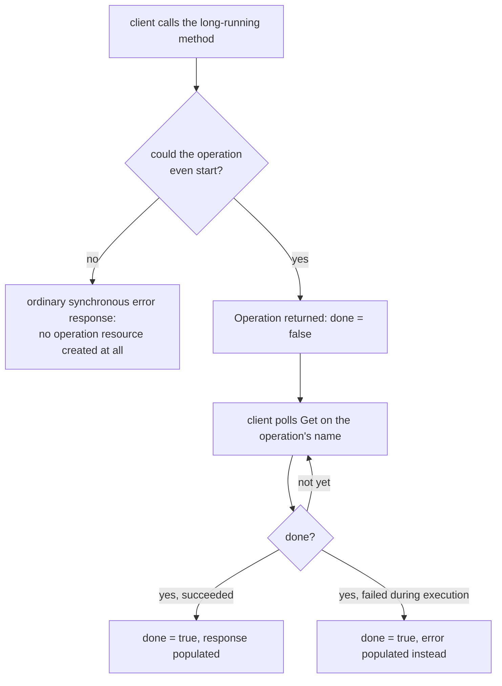

# Lesson 13. The Operation Resource and Polling

**Mission link:** Every method covered so far assumed a response arrives quickly. This lesson covers what a contract owes a client when the actual work takes long enough that blocking the request until it finishes is the wrong design, and the two genuinely different ways that work can end up failing.
**Primary source:** [AIP-151: "Long-running operations", Google](https://google.aip.dev/151)
**Prerequisites:** [Lesson 12](0012-http-caching-as-contract.md), [Contract](../GLOSSARY.md)

## Warm-up

1. ▢ Why is `If-Match` specifically the right tool for optimistic concurrency, rather than `If-None-Match`?

Check

`If-Match` requires strong comparison, byte-for-byte identity, which is what's needed to safely confirm a resource hasn't changed since a client last read it before overwriting it. `If-None-Match` only requires weak comparison, sufficient for cache freshness but not strong enough to guarantee no concurrent change occurred.

2. ▢ Why does `Cache-Control: no-cache` not prevent a response from being stored?

Check

`no-cache` specifically permits storage; it only requires a cache to revalidate with the origin before reusing the stored response. Preventing storage entirely is `no-store`'s job, a genuinely different directive.

## Know this

### Why blocking until a slow operation finishes is the wrong design

A method whose actual work can take anywhere from seconds to hours doesn't fit the ordinary request-response shape a client expects: blocking the connection open that whole time risks timeouts, ties up client and server resources for no good reason, and gives the client no way to check progress or walk away and come back later. The **long-running operation** pattern solves this by returning something promise-shaped immediately, a resource the client can poll, rather than the eventual result itself.

### The operation resource: a token, not the answer

An **operation resource** has, at minimum, a `name` (an identifier the client uses to poll it later), a `done` boolean, and, once `done` is `true`, either a `response` (the actual result) or an `error`. Before `done` becomes `true`, a `metadata` field can carry progress information specific to that operation type. The client calls the original method, gets back an operation with `done: false`, and polls a `Get` call on that operation's `name` until `done` flips to `true`, at which point the actual result (or the failure) is finally available.

### Two failure modes that report completely differently

A long-running operation can fail in two genuinely different ways, and a client that only checks whether the *initial* call succeeded misses one of them entirely. An error that prevents the operation from **starting** at all (bad input, a permission failure) comes back as an ordinary, immediate error response, no operation object is ever created. An error that happens **during execution**, after the operation already started and was returned to the client as `done: false`, instead surfaces later: the operation eventually reaches `done: true`, but with its `error` field populated instead of `response`. A client has to check both places, the immediate call's own success and, separately, the completed operation's `error` field, since a successful *submission* is not the same thing as a successful *result*.

### Operations don't live forever

An operation resource is allowed to expire some time after it completes, a commonly cited rule of thumb being around 30 days, after which the client can no longer poll or retrieve it at all. This means a client can't treat a completed operation as permanent storage for its result: once `done` is observed as `true`, the actual response or error needs to be captured and persisted by the client promptly, not left sitting on the server indefinitely under the assumption that it'll always be retrievable later.

## Practice

1. ▢ A client calls a long-running method and receives an immediate `400 Bad Request`, with no operation object in the response at all. What does this indicate about which of the two failure modes occurred?

Hint

Consider whether an operation resource was ever created at all.

Check

This is the "failed to start" case: the operation never began at all, so no operation resource was created, and the failure is reported as an ordinary, immediate synchronous error response rather than something the client would need to poll for.

2. ▢ A client receives `Operation{done: true, error: {...}}` after polling. Did the original call that started this operation return an HTTP error status?

Check

No, not necessarily, and typically not: the operation started successfully (the initial call likely returned `done: false` with no error), and the failure only surfaced later, during execution, reported in the completed operation's `error` field rather than as an error on the original request.

3. ▢ A client checks only whether its initial request to start a long-running operation returned a 2xx status, and assumes that means the operation will succeed. What's wrong with this assumption?

Check

A successful initial response only confirms the operation started; it says nothing about whether the operation actually completes successfully. The operation can still fail during execution, reported later as `done: true` with `error` populated instead of `response`, something the client would only catch by checking the completed operation's own outcome, not the original request's status code.

4. ▢ A client completes a long-running operation, observes `done: true` with a valid `response`, but doesn't read or store that response, planning to fetch it again in two months. What's the risk?

Check

The operation resource may have expired by then (a common rule of thumb is around 30 days after completion), meaning it may no longer be retrievable at all. The client needs to capture and persist the actual result promptly once `done` is observed as `true`, rather than treating the completed operation as durable, permanent storage for its own result.

5. ▢ Which claim correctly describes the two ways a long-running operation can fail?

    - a) Both failure modes are reported identically, as an immediate error response to the original call
    - b) A failure to start is reported as an immediate, ordinary error response with no operation created; a failure during execution is instead reported later, as a completed operation (`done: true`) with its `error` field populated instead of `response`
    - c) Once an operation returns `done: false`, it's guaranteed to eventually reach `done: true` with a successful `response`
    - d) An operation resource is retrievable indefinitely once it completes, regardless of how much time has passed

Check

**b)** That's the precise distinction this lesson draws, and why a client has to check both places. (a) is false: a failure during execution is specifically not reported as an immediate error to the original call. (c) is false: reaching `done: true` doesn't guarantee success; the completed operation can still carry an `error` instead of a `response`. (d) is false: operations are allowed to expire, commonly around 30 days after completion.

## Real-world reps

- [ ] For an API you have access to that has a long-running or asynchronous method, check how it reports a failure that happens during execution, versus a failure that prevents the operation from starting at all.
- [ ] Check whether that same API documents an expiration policy for completed operations, and whether your own client code actually persists the result promptly rather than relying on being able to re-fetch it later.
- [ ] Tomorrow: read the primary source in full, and note what it says about parallel operations, cases where a single logical operation is actually represented by more than one operation resource at once.

## Going further

- [AIP-151: "Long-running operations", Google](https://google.aip.dev/151)
- [Site: "API Improvement Proposals", Google](https://google.aip.dev/)
- [Resources](../RESOURCES.md)

---

Not landing? Reread the primary source at the top, since this lesson compresses it and compression is where understanding leaks. Check the [glossary](../GLOSSARY.md) for any term that felt slippery.

If the lesson itself is unclear rather than the material, that is a defect: [open an issue](https://github.com/TokenCemetery/teach/issues).
