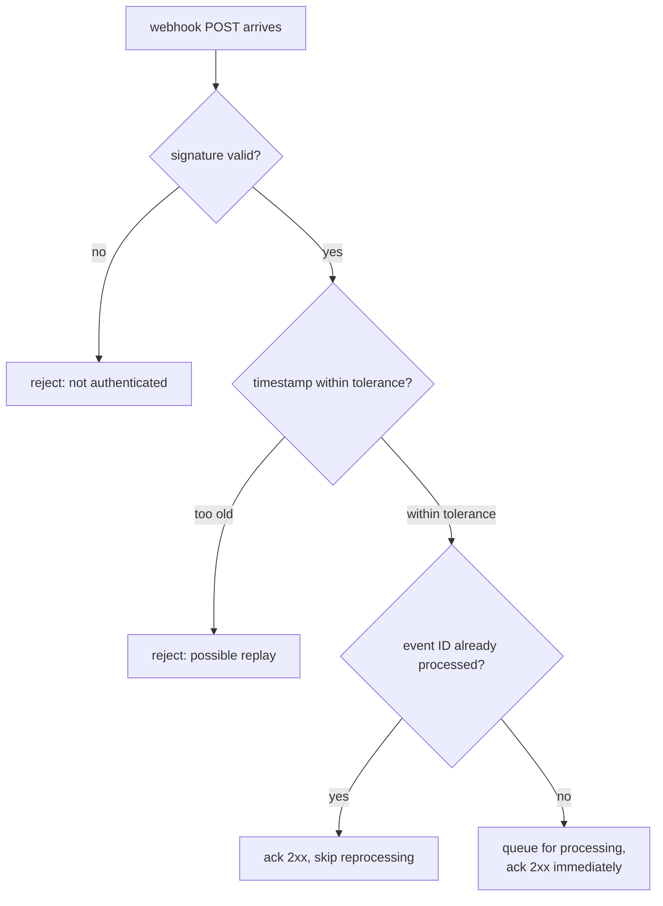

# Lesson 14. Webhooks and Callbacks as Delivery

**Mission link:** Lesson 13's long-running operations still put the client in charge of asking "is it done yet." A **webhook** inverts that: the server pushes a notification to a client-registered URL the moment something happens, trading polling overhead for a new set of obligations the receiving endpoint has to handle correctly.
**Primary source:** [Docs: "Receive Stripe events in your webhook endpoint", Stripe](https://docs.stripe.com/webhooks)
**Prerequisites:** [Lesson 13](0013-the-operation-resource-and-polling.md), [Idempotency key](../GLOSSARY.md)

## Warm-up

1. ▢ Why does a client have to check both the original call's status *and* a completed operation's `error` field, rather than just the original call's status alone?

Check

An operation can fail in two different ways: failing to start at all (reported immediately, on the original call) or failing during execution (reported later, only visible once the operation reaches `done: true` with its `error` field populated instead of `response`). Checking only the original call's status misses the second failure mode entirely.

2. ▢ Why can't a client treat a completed long-running operation as permanent storage for its result?

Check

Operation resources are allowed to expire some time after completion, commonly around 30 days; a client needs to capture and persist the actual result promptly once it's available, rather than assuming it can be re-fetched indefinitely later.

## Know this

### A webhook receiver has to verify the sender before trusting anything it says

Because a webhook is an inbound HTTP request the receiving server didn't initiate, anyone who discovers or guesses the endpoint URL could attempt to send it a fake event unless the receiver actively verifies authenticity. Real implementations sign each delivery: a header (Stripe's is `Stripe-Signature`) carries an HMAC-based signature computed over the payload, so the receiver can confirm the request actually came from the claimed sender and that the payload wasn't altered in transit. Skipping this check means treating an unauthenticated inbound request as trusted input, exactly the mistake authentication exists to prevent everywhere else in a contract.

### The timestamp inside the signature is what stops a captured request from being replayed later

A signature alone doesn't stop a **replay attack**: an attacker who intercepts one genuinely valid, signed delivery could resend that exact same request later, and a receiver checking only "is the signature valid" would accept it again. The fix is including a timestamp as part of what's actually signed, so the timestamp can't be altered independently without invalidating the whole signature, and rejecting any delivery whose timestamp falls outside a short tolerance window (5 minutes is a common default) even when the signature itself checks out. Setting that tolerance to zero doesn't tighten the check, it disables it entirely, since a tolerance of zero means no delivery could ever pass a real-world clock-skew comparison, and implementations that do this typically end up special-casing it to skip the check rather than actually enforcing an impossible window.

### Delivery isn't guaranteed on the first attempt, and the receiver's own job is to acknowledge fast

A real webhook sender retries a failed delivery, one where the receiver's endpoint didn't respond with a success status, on an exponential backoff, typically bounded to a few days rather than indefinitely. This puts a specific obligation on the receiving endpoint: it should acknowledge receipt (return a 2xx status) as soon as the event is durably queued for processing, not only after finishing whatever work the event actually triggers. An endpoint that does its full processing inline before responding risks a slow or failing downstream step making a perfectly-delivered event look like a failed delivery, triggering an unnecessary retry, or worse, timing out and causing the same event to be reprocessed from scratch later.

### Ordering is not guaranteed, and a timestamp can't rescue it

Multiple related events generated by a single action (creating a subscription might generate a subscription-created event, an invoice-created event, and a payment event) are not guaranteed to arrive in the order they were generated, and a coarse, second-granularity timestamp can't be used to reconstruct that order either, since genuinely distinct events can share the same timestamp value. The documented fix is twofold: don't write receiving logic that depends on events arriving in a specific sequence, and use each event's own unique ID, not its timestamp, to detect whether a delivery is a duplicate the receiver has already processed, exactly lesson 11's idempotency-key discipline, applied here on the receiving side of an inbound delivery instead of the sending side of an outbound request.

## Practice

1. ▢ A receiving endpoint checks a webhook delivery's signature and finds it valid, but doesn't check the timestamp inside it at all. What attack does this leave the endpoint open to?

Hint

Consider what an attacker could do with a genuinely valid, previously-captured delivery.

Check

A replay attack: an attacker who captured a genuinely valid, signed delivery earlier could resend that exact same request later, and an endpoint checking only signature validity (with no timestamp/freshness check) would accept it again as if it were a new, legitimate event.

2. ▢ A team sets their webhook signature timestamp tolerance to `0`, believing this makes replay protection stricter. What actually happens?

Check

A tolerance of `0` disables the recency check entirely rather than tightening it, since no real delivery could ever satisfy an exactly-zero tolerance against normal clock skew and network latency; implementations handling this case typically end up skipping the check rather than genuinely enforcing an impossible window.

3. ▢ A webhook receiver's handler fully processes each event, including a slow downstream database write, before returning any HTTP response. What risk does this create?

Check

If the downstream processing is slow or fails, the sender may see that as a failed or timed-out delivery and retry it, even though the event was actually received; the receiver risks an unnecessary retry (and potential reprocessing) purely because it didn't acknowledge receipt until after finishing work that has nothing to do with whether the delivery itself succeeded.

4. ▢ A receiver's logic assumes a `subscription.created` event will always arrive before the corresponding `invoice.created` event for the same subscription. What's wrong with this assumption, and what should the receiver rely on instead?

Check

Webhook delivery order isn't guaranteed, so this assumption can be violated in practice. The receiver should not depend on arrival order for correctness; if it needs current state regardless of which event arrived first, it can fetch the relevant resource via the API directly rather than assuming a specific event sequence.

5. ▢ Which claim correctly describes the obligations a webhook receiver's contract has to satisfy?

    - a) Verifying the signature alone is sufficient; a valid signature means the delivery cannot be a replay
    - b) A receiver should verify the signature and a timestamp tolerance before trusting the payload, acknowledge with a 2xx as soon as the event is durably queued rather than after full processing, and deduplicate by event ID since neither delivery order nor timing is guaranteed
    - c) Full inline processing before acknowledging is the correct approach, since it guarantees the sender only marks delivery successful once processing is truly complete
    - d) Timestamps are reliable enough to reconstruct the order in which distinct events actually occurred

Check

**b)** That's the complete set of obligations this lesson establishes for a receiving endpoint. (a) is false: signature validity alone doesn't stop a replay of a previously valid delivery; the timestamp check inside the signed payload is what does. (c) is false: full inline processing before acknowledging risks unnecessary retries from slow or failing downstream work. (d) is false: distinct events can share a timestamp, and delivery order itself isn't guaranteed regardless.

## Real-world reps

- [ ] For a webhook integration you have access to (your own receiver, or a third-party service you integrate with), check whether it verifies a signature and a timestamp tolerance, or only checks the signature.
- [ ] Check whether that same receiver acknowledges receipt before or after completing its own downstream processing, and what happens if that downstream step is currently slow or failing.
- [ ] Tomorrow: read the primary source's section on event ordering in full, and note its specific recommendation for what to do when a receiver needs the current state of a resource but has only received an out-of-order or partial event about it.

## Going further

- [Docs: "Receive Stripe events in your webhook endpoint", Stripe](https://docs.stripe.com/webhooks)
- [Draft: "The Idempotency-Key HTTP Header Field", IETF HTTPAPI Working Group](https://datatracker.ietf.org/doc/draft-ietf-httpapi-idempotency-key-header/)
- [Resources](../RESOURCES.md)

---

Not landing? Reread the primary source at the top, since this lesson compresses it and compression is where understanding leaks. Check the [glossary](../GLOSSARY.md) for any term that felt slippery.

If the lesson itself is unclear rather than the material, that is a defect: [open an issue](https://github.com/TokenCemetery/teach/issues).
