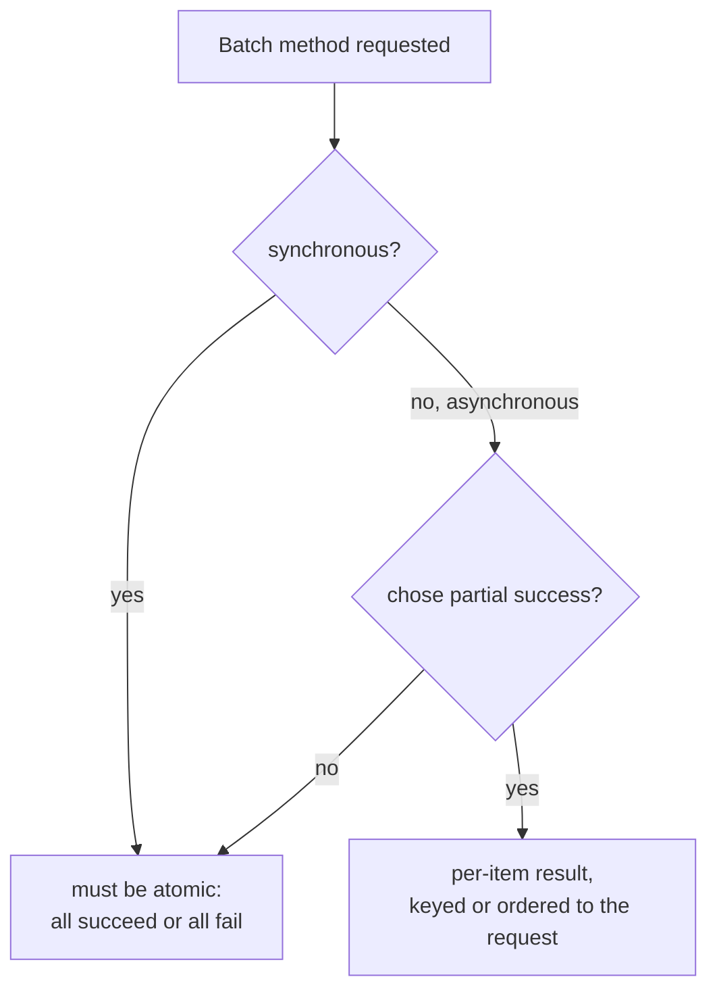

# Lesson 15. Bulk Operations and Partial Responses

**Mission link:** Every method covered so far acts on one resource, or returns the whole shape of the resources it reads. This lesson covers two separate contract questions a client needs answered up front: what does a request touching many resources at once promise when only some of them succeed, and how does a client ask for less than the full shape of a resource without inventing its own convention for it.
**Primary source:** [AIP-233: "Batch methods: Create", Google](https://google.aip.dev/233)
**Prerequisites:** [Lesson 13](0013-the-operation-resource-and-polling.md), [Contract](../GLOSSARY.md)

## Warm-up

1. ▢ Why does a client have to check both the original call's status *and* a completed long-running operation's `error` field, rather than just the original call's status alone?

Check

A long-running operation can fail in two different ways: failing to start at all (reported immediately, on the original call) or failing during execution (reported later, only visible once the operation reaches `done: true` with its `error` field populated instead of `response`). Checking only the original call's status misses the second failure mode entirely.

2. ▢ Why can't a webhook receiver rely on a delivery's timestamp to reconstruct the order several related events actually occurred in?

Check

Timestamps are coarse enough that genuinely distinct events can share the same value, and delivery order itself isn't guaranteed regardless of timestamps; the receiver has to avoid depending on arrival order for correctness at all.

## Know this

### A batch method has to pick, in advance, whether it fails together or fails individually

A **batch operation** acts on several resources in one request instead of one call per resource. The first design decision it forces isn't performance, it's failure semantics: does the whole batch succeed or fail as one unit (**atomic**), or can some items succeed while others fail (**partial success**)? AIP-233 does not leave this open-ended: a *synchronous* batch create **must** be atomic, and only an *asynchronous* batch create may choose partial success. AIP-231's batch get is stricter still and always atomic, explicitly pointing a caller who needs partial failure toward a `List` call instead. The reasoning given is about what's simple to reason about: a passthrough database transaction should stay atomic, while an operation managing genuinely complex, independent resources is the case where forcing atomicity would make one bad item sink an otherwise-fine batch.

### Partial success needs a shape that survives being read

Once a batch method allows partial success, its response has to say which items failed and why, without forcing the client to reconstruct which failure belongs to which request. AIP-233 settled on `map<int32, google.rpc.Status> failed_requests`, keyed by the failed item's index in the original request, after rejecting two alternatives on record: a bare `repeated Status` (the reader can't tell which entry maps to which request) and a map keyed by a request ID (the client would have to maintain its own index-to-ID mapping just to use the response, and populating a request ID purely to report an error can collide with idempotency-key handling for that same request). The lesson generalizes past this one field name: a partial-success response's error-reporting shape has to let the client map a failure back to the specific input that caused it, with no side-channel bookkeeping required to do it.

### A batch response owes the client the same order it was asked in

AIP-231's batch get requires the response's repeated result field to preserve the same order as the names in the request. This isn't a stylistic nicety: without a positional or keyed guarantee, a client that requested five resources and got three back has no reliable way to tell which three, short of matching identifying fields inside each result. An ordering guarantee (or, equivalently, an explicit per-item key) is what makes a bulk response usable without every caller re-deriving correspondence by hand.

### Partial responses: asking for less than the full resource, without touching the body

A **partial response** narrows what fields of a resource are returned, using a `google.protobuf.FieldMask`, a comma-separated (JSON) or repeated (proto) list of field paths like `user.displayName` or `photo`. AIP-157 is specific about where this mask travels: as a query parameter, HTTP header, or gRPC metadata entry, a side channel, not a field inside the request body it's shaping. The mask parameter must be optional, and if omitted it must default to returning every field (`"*"`), unless the API documents otherwise; AIP-157 flags changing that default later as a breaking change in its own right, since every existing caller that omitted the mask was silently relying on getting everything back.

### The same FieldMask type does double duty, with different rules each way

A `FieldMask`'s `paths` are the same mechanism whether they're narrowing a *read* (a partial response) or scoping a *write* (an update mask, telling the server which fields of the request body to actually apply and leave the rest of the resource untouched). AIP-157 calls out one asymmetry between the two uses directly: a read mask may be allowed to include non-terminal repeated fields, but an update mask is not obligated to allow that, since "replace everything under this repeated field on write" is a much more consequential, ambiguous instruction than "include everything under this repeated field when reading." Treating the two masks as interchangeable in behavior, just because they share a message type, misses that a read is reversible and a write is not.

## Practice

1. ▢ A team builds a synchronous `BatchUpdateWidgets` call and wants three widgets to update successfully even though a fourth one in the same request fails validation. Is this allowed?

Hint

Check what AIP-233 requires specifically for *synchronous* batch operations.

Check

No. AIP-233 requires a synchronous batch create (and by the same reasoning, a synchronous batch update) to be atomic: it must fail for all resources or succeed for all of them. Partial success is only available to an asynchronous batch operation.

2. ▢ A batch response reports failures as `repeated google.rpc.Status`, with no index or key tying each status back to a specific input. What problem does AIP-233's rationale say this causes, and what did it choose instead?

Check

A bare repeated list of statuses gives the client no reliable way to tell which failure belongs to which request in the original batch. AIP-233 chose `map<int32, google.rpc.Status> failed_requests`, keyed by each failed item's index in the original request, so a failure can be matched back to its input without extra bookkeeping.

3. ▢ A client omits the field-mask parameter entirely on a read call. What must the server return, and what happens later if the team changes that default to return only a few fields instead?

Check

Omitting the field mask must default to `"*"`, every field, unless the API documents a different default. Changing that default later, so an omitted mask now returns less than before, is a breaking change: every existing caller that omitted the mask was relying on getting the full resource back.

4. ▢ Why does AIP-157 require the field mask to travel as a query parameter, header, or gRPC metadata entry, rather than as a field inside the request body?

Check

The field mask controls the shape of the response, a concern about what to return, not part of the substantive input the request body is describing. Keeping it in a side channel separates "what am I asking you to do" from "how much of the answer do I want back."

5. ▢ Which claim correctly describes the atomicity and ordering rules covered in this lesson?

    - a) A synchronous batch create may support partial success if the client requests it via a header
    - b) A synchronous batch operation must be atomic; an asynchronous one may choose partial success, in which case each result must be traceable back to its specific input, and a batch get's response order must match the request's
    - c) A field mask belongs in the request body, alongside the fields it's meant to filter
    - d) Update masks and read masks must always behave identically, since they share the same FieldMask type

Check

**b)** That's the complete set of rules this lesson establishes. (a) is false: synchronous batch create must be atomic regardless of any client request. (c) is false: AIP-157 requires the mask in a side channel, not the body. (d) is false: AIP-157 explicitly allows read masks to permit non-terminal repeated fields where update masks are not obligated to.

## Real-world reps

- [ ] For a batch or bulk endpoint you have access to, check whether it's documented as atomic or partial-success, and if partial-success, how it reports which items failed.
- [ ] Check whether an API you use supports a field-mask or `fields` parameter for partial responses, and confirm what it returns when the parameter is omitted entirely.
- [ ] Tomorrow: read AIP-231 and AIP-233 in full, and note what each says about the maximum batch size a request is allowed to specify, and what happens when a caller exceeds it.

## Going further

- [AIP-231: "Batch methods: Get", Google](https://google.aip.dev/231)
- [AIP-233: "Batch methods: Create", Google](https://google.aip.dev/233)
- [AIP-157: "Partial responses", Google](https://google.aip.dev/157)
- [Docs: "Well-Known Types: FieldMask", Protocol Buffers](https://protobuf.dev/reference/protobuf/google.protobuf/#field-mask)
- [Resources](../RESOURCES.md)

---

Not landing? Reread the primary source at the top, since this lesson compresses it and compression is where understanding leaks. Check the [glossary](../GLOSSARY.md) for any term that felt slippery.

If the lesson itself is unclear rather than the material, that is a defect: [open an issue](https://github.com/TokenCemetery/teach/issues).
