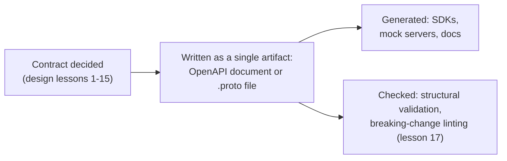

# Lesson 16. OpenAPI and Protobuf as Artifacts

**Mission link:** Every lesson so far has treated the contract as something you design and describe. This lesson is about the difference it makes once that description exists as a single machine-readable document, an **OpenAPI document** for REST or a `.proto` file for gRPC, rather than only as prose in a README that a human wrote down after the API already existed.
**Primary source:** [Docs: "OpenAPI Specification", OpenAPI Initiative](https://spec.openapis.org/oas/latest.html)
**Prerequisites:** [Lesson 4](0004-resource-modeling-for-rest.md), [Lesson 6](0006-proto3-and-grpc-service-design.md), [Contract](../GLOSSARY.md)

## Warm-up

1. ▢ Why must a batch operation's response preserve the same order the client asked for, rather than returning results in whatever order the server happened to finish them?

Check

Without an ordering (or an equivalent per-item key), a client that requested several resources has no reliable way to tell which result corresponds to which request, short of matching identifying fields inside each one by hand.

2. ▢ Why must a field mask travel as a query parameter, header, or metadata entry rather than as a field inside the request body?

Check

The mask controls the shape of the *response*, not the substance of what's being asked for; keeping it in a side channel separates "what to do" from "how much of the answer to send back."

## Know this

### A hand-written description and a machine-readable one make different promises

A README that describes an endpoint is a claim a human wrote down, and nothing checks it against the actual API; it can drift the moment the code changes and nobody updates the prose. An **OpenAPI document** (for REST) or a `.proto` file (for gRPC) is different in kind: it's a single, structured artifact that itself defines the paths, operations, and schemas (OpenAPI) or the messages and RPCs (protobuf), so generating a client SDK, a mock server, or a validating test harness from it is mechanical, not an act of interpretation. The document isn't documentation *about* the contract, it functionally *is* the contract, in a form software can consume directly.

### An OpenAPI document has a required minimum shape, and two version numbers that mean different things

Per the OpenAPI Specification, a document must include at least one of `components`, `paths`, or `webhooks`: an `info` block alone with nothing describing any operation or reusable shape isn't a valid document. It also carries two separate version fields that are easy to conflate: the top-level `openapi` field names which version of the *specification* the document conforms to, while `info.version` is the *API's own* version, the one a consumer actually cares about when checking compatibility. A document can move from `openapi: 3.0.3` to `openapi: 3.1.1` (a tooling-format change) without touching `info.version` at all (no change to what the API itself promises), and the two numbers advancing independently is expected, not a mistake.

### Protobuf's artifact already carries lesson 6's wire contract, and now a generated SDK inherits it directly

Lesson 6 established that a proto3 message's real wire contract is its field numbers, not its field names. Once client and server code are both generated from the same `.proto` file, that guarantee extends automatically to every generated SDK: a client stub built from the same source the server was built from can't silently drift out of sync with it the way a hand-maintained client library can. The artifact being singular and machine-readable is what makes "the client and the server agree" a property of the build process, rather than a property someone has to remember to maintain by hand.

### The artifact makes a class of contract violation checkable by a machine instead of only catchable by a careful reviewer

Because the document is structured rather than prose, a tool can parse it and check specific, precise claims about it: does every operation have a response for each documented status code, does every schema property have the type it claims, is a required field actually marked required. None of this replaces the judgment lesson 1 through lesson 10 covered, deciding what the contract *should* promise is still a design decision, but once that decision is written into the artifact, whether the artifact keeps that promise as it evolves becomes something the next lesson's tooling can check automatically, on every change, rather than something that depends on a human reviewer noticing.

## Practice

1. ▢ A team's OpenAPI document has an `info` block with a title and description, but no `paths`, `components`, or `webhooks` at all. Is this a valid OpenAPI document?

Hint

Check what the specification requires beyond the `info` object.

Check

No. A valid OpenAPI document must include at least one of `components`, `paths`, or `webhooks`; an `info` block alone, with none of the three, does not satisfy the specification's minimum shape.

2. ▢ A document is updated from `openapi: 3.0.3` to `openapi: 3.1.1`, with `info.version` left unchanged at `2.4.0`. Does this mean the API itself changed?

Check

Not necessarily, and often not: `openapi` names which version of the specification format the document conforms to, a tooling-level detail, while `info.version` is the API's own version. The two can and do advance independently; a spec-format upgrade with no `info.version` change means the document's syntax moved forward without the API's actual contract changing.

3. ▢ Two teams hand-write a client library against a gRPC service's documentation instead of generating it from the same `.proto` file the service is built from. What risk does this reintroduce that a generated SDK avoids?

Check

The hand-written client can drift out of sync with the actual service, since nothing mechanically ties its field numbers or message shapes back to the source of truth. A client generated from the same `.proto` file inherits the wire contract directly and can't drift the same way, because there's only one artifact to generate both sides from.

4. ▢ A reviewer wants to confirm every operation in a large OpenAPI document has at least one documented success response. Why is this now something a tool can check, when it wasn't before the contract existed as a single document?

Check

Once the contract is a structured, machine-readable artifact rather than free-form prose, a tool can parse its exact shape and check a precise, mechanical claim like "every operation has a response for at least one 2xx status" across the whole document. A prose description has no equivalent structure for a tool to check against; only a human reading it carefully could catch a gap.

5. ▢ Which claim correctly describes what changes once a contract exists as an OpenAPI document or `.proto` file rather than only as prose?

    - a) The document becomes purely descriptive, exactly like a README, just written in YAML instead of Markdown
    - b) The document is a single machine-readable artifact that SDKs, mock servers, and structural checks can be generated or run from directly, and its own two version fields (`openapi` and `info.version`) track different things
    - c) `info.version` and `openapi` must always change together, since they both describe the same version
    - d) A valid OpenAPI document only needs an `info` block; `paths`, `components`, and `webhooks` are all optional extras

Check

**b)** That's the shift this lesson covers. (a) is false: the document being machine-readable is what lets tooling generate from and check against it, unlike prose. (c) is false: the spec-format version and the API's own version are separate fields that can move independently. (d) is false: at least one of `components`, `paths`, or `webhooks` is required.

## Real-world reps

- [ ] For an API you have access to, find whether it publishes an OpenAPI document or `.proto` file, or only prose documentation, and note what that implies for whether a client SDK could be generated rather than hand-written.
- [ ] If you can find that artifact, check its `openapi` (or `syntax`) version field against its `info.version` (or equivalent), and confirm you can tell the two apart.
- [ ] Tomorrow: read the OpenAPI Specification's own `components` section in full, and note which reusable object types it defines beyond `schemas`.

## Going further

- [Docs: "OpenAPI Specification", OpenAPI Initiative](https://spec.openapis.org/oas/latest.html)
- [Docs: "Language Guide (proto3)", Protocol Buffers](https://protobuf.dev/programming-guides/proto3/)
- [Resources](../RESOURCES.md)

---

Not landing? Reread the primary source at the top, since this lesson compresses it and compression is where understanding leaks. Check the [glossary](../GLOSSARY.md) for any term that felt slippery.

If the lesson itself is unclear rather than the material, that is a defect: [open an issue](https://github.com/TokenCemetery/teach/issues).
