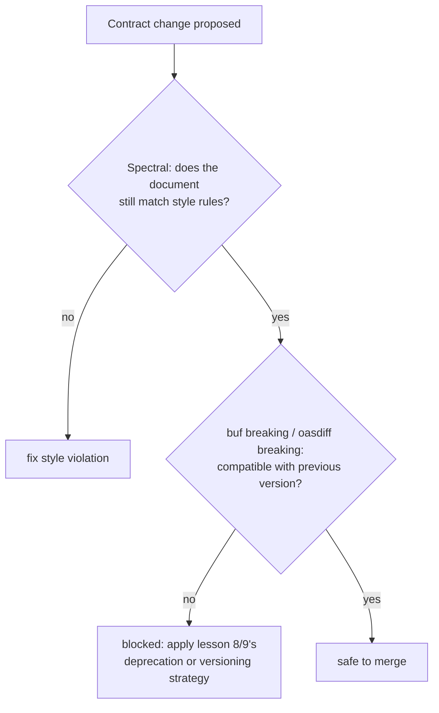

# Lesson 17. Breaking-Change Linting

**Mission link:** Lesson 8 established which kinds of changes break a client and which don't, as something a careful reviewer works out by reasoning about the contract. Lesson 16 made the contract a machine-readable artifact. This lesson is what that artifact buys you: lesson 8's rules stop being something only a reviewer remembers, and become something a tool checks on every change.
**Primary source:** [Docs: `buf breaking`, Buf](https://buf.build/docs/breaking/overview/)
**Prerequisites:** [Lesson 8](0008-additive-changes-and-deprecation.md), [Lesson 16](0016-openapi-and-protobuf-as-artifacts.md)

## Warm-up

1. ▢ A document is updated from `openapi: 3.0.3` to `openapi: 3.1.1`, with `info.version` left unchanged. Does this mean the API itself changed?

Check

Not necessarily: `openapi` names the specification format version the document conforms to, while `info.version` is the API's own version, and the two can advance independently.

2. ▢ Why can a client SDK generated from the same `.proto` file the server was built from not drift out of sync with the server the way a hand-written client library can?

Check

Both are generated from one shared artifact, so there's no separate, hand-maintained copy of the contract on the client side that could silently fall out of step; agreement between client and server becomes a property of the build, not something a person has to remember to keep true.

## Know this

### A style linter and a breaking-change detector check two different things

**Spectral** is a general JSON/YAML linter: it checks a single document, at one point in time, against a **ruleset** of rules with their own severities (`error`, `warn`, `info`, `hint`), typically extending a built-in ruleset like `spectral:oas` and adding custom rules for house style (naming conventions, requiring examples, disallowing certain patterns). It answers "does this document, as it stands right now, follow our style guide?" A **breaking-change detector** like `buf breaking` or `oasdiff breaking` asks a completely different question: not whether a document is well-formed, but whether *this* version of it is compatible with a *previous* version, one lesson 8's additive/breaking distinction was written for. Running only a style linter and assuming it catches a breaking change (or the reverse) misunderstands what each tool was built to check.

### Buf categorizes what "breaking" means by how much of the wire contract moved

`buf breaking` compares a protobuf schema against a previous version (`--against` accepts a git ref, a registry module, a local directory, or a prebuilt image) and reports violations grouped by category, roughly: changes to a file's structure, changes to a package's definitions, and changes to the wire format itself (covering both protobuf's binary wire format and its JSON encoding). Configuring which categories apply is a real design choice: a team whose clients only ever consume the binary wire format can reasonably ignore JSON-wire-only violations, while a team exposing the same service as JSON as well (lesson 6's ProtoJSON caveat) cannot.

### oasdiff separates three different questions a diff tool could be asked

`oasdiff` makes the same distinction Spectral and Buf don't have to, because it operates on two versions of a document instead of one, but it goes further by splitting that comparison into three separate subcommands with three different answers: `diff` reports everything that changed, including documentation-only edits nobody's client would notice; `changelog` reports every change that *could* affect an API consumer, breaking or not; and `breaking` reports only the subset of those that actually break an existing client. Treating "something changed" (`diff`), "a consumer might care" (`changelog`), and "a client will break" (`breaking`) as the same question is exactly the mistake that makes a changelog either too noisy to read or a breaking-change gate too loose to trust.

### The gate lesson 8 needed finally has somewhere to run

Lesson 8's rule, adding is usually safe and removing or changing meaning usually isn't, was a rule for a human to apply while reviewing a diff. Wiring `buf breaking` or `oasdiff breaking` into CI, failing the build the moment a change matches one of lesson 8's breaking categories, turns that rule into a gate nobody has to remember to invoke. It does not remove the design judgment lesson 8 and lesson 9 covered; a genuine breaking change still needs the deprecation and versioning strategy those lessons taught. What it removes is the chance that a breaking change ships *by accident*, undetected until a client's integration breaks in production.

## Practice

1. ▢ A team runs Spectral against their OpenAPI document, it reports zero violations, and they conclude their latest change didn't break any existing client. What's wrong with that conclusion?

Hint

Consider what Spectral actually compares its input against.

Check

Spectral checks a single document, at one point in time, against a style ruleset; it has no concept of a *previous* version to compare against, so passing it says nothing about compatibility with an earlier contract. Detecting a breaking change requires a diff tool like `buf breaking` or `oasdiff breaking`, not a style linter.

2. ▢ A service exposes a gRPC API only over the binary wire format, never as JSON. A `buf breaking` run flags a violation in the JSON-wire category alone. Is this necessarily something the team needs to fix?

Check

Not necessarily: which breaking-change categories actually matter is a real configuration choice tied to how the service is actually consumed. A team that never exposes JSON encoding can reasonably choose not to enforce JSON-wire-only violations, while a team that does (per lesson 6's ProtoJSON caveat) cannot skip them.

3. ▢ A reviewer runs `oasdiff diff` between two spec versions and sees dozens of changes, most of them descriptions and examples with reworded text. They conclude the API had a large, risky release. What tool or subcommand would give a more useful answer to "did this actually break a client"?

Check

`oasdiff breaking` (or `changelog` for the broader "could a consumer notice" question) is the right tool: `diff` deliberately reports everything, including documentation-only edits nobody's client would notice, so a large `diff` output doesn't by itself mean anything broke.

4. ▢ A team wires `buf breaking` into CI so a genuine breaking change fails the build. Does this replace the need for the deprecation and versioning strategy from lessons 8 and 9?

Check

No. The gate only catches a breaking change *before* it ships by accident; it doesn't decide what to do about a breaking change the team actually needs to make. That decision still needs lesson 8's deprecation approach or lesson 9's versioning and migration strategy, applied deliberately rather than skipped.

5. ▢ Which claim correctly distinguishes a style linter from a breaking-change detector?

    - a) Both tools compare two versions of a document; they differ only in output format
    - b) A style linter (Spectral) checks one document against a ruleset at a point in time; a breaking-change detector (`buf breaking`, `oasdiff breaking`) compares two versions and reports incompatibilities, a genuinely different question
    - c) Passing a style linter guarantees no breaking change was introduced
    - d) `oasdiff diff`, `changelog`, and `breaking` all report exactly the same set of changes, just formatted differently

Check

**b)** That's the distinction this lesson draws. (a) is false: a style linter has no previous version to compare against at all. (c) is false: style conformance and backward compatibility are unrelated properties. (d) is false: `diff` includes documentation-only edits, `changelog` narrows to consumer-visible changes, and `breaking` narrows further to only the ones that break a client.

## Real-world reps

- [ ] For an API you maintain or contribute to, check whether CI runs a style linter, a breaking-change detector, both, or neither, and what each is actually configured to check.
- [ ] If a breaking-change tool is wired in, find one example (in its history or docs) of a change it caught, and confirm whether the team's response was a deprecation, a version bump, or a deliberate override.
- [ ] Tomorrow: read the primary source's section on configuring which breaking-change categories apply, and note what happens when a category is disabled entirely versus left at its default.

## Going further

- [Docs: `buf breaking`, Buf](https://buf.build/docs/breaking/overview/)
- [Docs: Spectral rulesets, Stoplight](https://github.com/stoplightio/spectral/blob/develop/docs/getting-started/3-rulesets.md)
- [Docs: oasdiff, Tufin](https://github.com/oasdiff/oasdiff)
- [Resources](../RESOURCES.md)

---

Not landing? Reread the primary source at the top, since this lesson compresses it and compression is where understanding leaks. Check the [glossary](../GLOSSARY.md) for any term that felt slippery.

If the lesson itself is unclear rather than the material, that is a defect: [open an issue](https://github.com/TokenCemetery/teach/issues).
