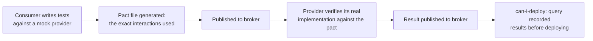

# Lesson 18. Contract Testing

**Mission link:** Lesson 16 made the contract a machine-readable artifact; lesson 17 checked whether a change to that artifact was backward-compatible. Neither one runs the provider's actual code against a consumer's actual expectations. **Contract testing** is the check that does: not "is the schema well-formed" or "did the schema change safely," but "does the provider genuinely behave the way this specific consumer needs it to."
**Primary source:** [Docs: "Consumer Driven Contracts", Pact](https://docs.pact.io/)
**Prerequisites:** [Lesson 17](0017-breaking-change-linting.md), [Contract](../GLOSSARY.md)

## Warm-up

1. ▢ What question does a style linter like Spectral answer, and what question does a breaking-change detector like `buf breaking` or `oasdiff breaking` answer instead?

Check

A style linter checks whether a single document, at one point in time, conforms to a ruleset. A breaking-change detector instead compares two versions of a document and reports whether the newer one is compatible with the older one, a genuinely different question about compatibility rather than style.

2. ▢ Why can't a client SDK generated from a shared `.proto` file drift out of sync with the server the way a hand-written client library can?

Check

Both are generated from the same artifact, so there's no separate, hand-maintained copy of the contract on the client side that could silently fall out of step with the server; agreement becomes a property of the build rather than something a person has to remember to maintain.

## Know this

### A schema can be well-formed, backward-compatible, and still wrong for a real consumer

Neither an OpenAPI document's structural validity nor a clean `buf breaking` run says anything about whether the provider's actual runtime behavior matches what a specific consumer needs. A field can be present, typed correctly, and unchanged between versions, and the provider can still return the wrong value, omit a case a consumer's code depends on, or behave differently from what the consumer's tests assume. Both of the previous lessons' checks operate on the *description* of the contract; **contract testing** is the check that runs against the provider's actual behavior.

### A consumer-driven contract is generated from real usage, not written down separately

Pact's model inverts the usual order: instead of a provider publishing a schema and hoping consumers use it correctly, each **consumer** writes tests against a mock of the provider, and those tests themselves generate a **pact** file, a record of the exact interactions (requests and expected responses) that consumer actually relies on. The provider then **verifies** its real implementation against every consumer's published pact. Because the contract is *derived from actual consumer usage* rather than declared independently, only the interactions a consumer genuinely depends on are tested; provider behavior no consumer uses can change freely without breaking any contract test, since no contract claims it in the first place.

### The check that decides whether it's safe to deploy, without needing a shared staging environment

A **pact broker** is where consumers publish their pacts and providers publish their verification results. The `can-i-deploy` check queries the broker for a specific pacticipant version against a target environment, and answers a concrete question: has every consumer's contract already been verified against this exact provider version (or vice versa)? A "yes" means the two sides are known-compatible from recorded verification results, without spinning up a full end-to-end environment with every service running simultaneously to find out. This is the same shift lesson 16 and 17 made for the contract's shape, applied to actual behavior: a question that used to require a live, synchronized staging environment becomes a query against results already on record.

### Contract by example, not contract by declaration

A schema-based artifact (lesson 16) declares a shape once, in the abstract; a contract test instead accumulates a set of concrete examples, this exact request produced that exact response, and verifies the provider against every one of them. This is why Pact's own documentation calls it "contract by example": the contract isn't one static declaration checked for internal consistency, it's a growing set of real interactions checked for continued truth. The tradeoff is coverage: a contract test only knows about interactions some consumer's tests actually exercised, while a schema declares every field whether or not anything uses it yet.

## Practice

1. ▢ A provider's OpenAPI document is valid, and `buf breaking` reports no incompatibility against the previous version. A consumer's integration still breaks in production. What kind of check would this lesson say could have caught it that the previous two lessons' checks wouldn't?

Hint

Consider what the schema and breaking-change checks actually run against, versus what a contract test runs against.

Check

A contract test, since it runs the provider's actual behavior against a specific consumer's real expectations (recorded interactions), rather than checking only the shape or the compatibility of the schema's *description*. A schema can stay well-formed and backward-compatible while the provider's actual runtime behavior still diverges from what a consumer's code needs.

2. ▢ In Pact's model, who writes the contract, and what does that determine about which interactions get tested?

Check

The consumer writes tests against a mock of the provider, and those tests themselves generate the pact file; only the interactions the consumer's own tests actually exercise end up in the contract. Provider behavior that no consumer's contract covers can change freely without breaking any contract test.

3. ▢ A team wants to know whether it's safe to deploy a new provider version without spinning up every consumer service in a shared staging environment. What does `can-i-deploy` check instead?

Check

It queries the pact broker for whether every relevant consumer's contract has already been verified against this provider version (or the reverse pairing), based on verification results already published, rather than requiring a live end-to-end environment to find out.

4. ▢ Why does Pact's documentation describe its model as "contract by example" rather than "contract by declaration"?

Check

The contract is built from a growing set of concrete, recorded interactions (this exact request produced that exact response) rather than one static, abstract declaration of every field's shape; the provider is verified against each recorded example rather than against a single declared schema.

5. ▢ Which claim correctly distinguishes contract testing from the schema-based checks in the previous two lessons?

    - a) Contract testing is just another name for running a breaking-change detector against an OpenAPI document
    - b) Contract testing verifies a provider's actual runtime behavior against a specific consumer's recorded expectations, a check neither a schema's validity nor its backward-compatibility with a previous version can perform
    - c) A pact file must be written by the provider before any consumer can use the API
    - d) `can-i-deploy` requires a full shared staging environment to determine deployment safety

Check

**b)** That's the distinction this lesson draws. (a) is false: a breaking-change detector compares two versions of a schema's description, not the provider's actual behavior against a consumer's expectations. (c) is false: in Pact's consumer-driven model, the consumer's own tests generate the pact. (d) is false: `can-i-deploy` answers the question from already-published verification results, specifically to avoid needing a live shared environment.

## Real-world reps

- [ ] For a service you work on that has multiple consumers, check whether compatibility between it and its consumers is verified by contract tests, end-to-end tests in a shared environment, or neither.
- [ ] If contract tests exist, find one pact file or equivalent and note whether it covers every field your team assumed was part of the "real" contract, or only what a consumer's own tests happened to exercise.
- [ ] Tomorrow: read the primary source's section on provider states, and note what problem they solve for a provider that needs specific data set up before it can honor a consumer's recorded interaction.

## Going further

- [Docs: "Consumer Driven Contracts", Pact](https://docs.pact.io/)
- [Docs: "5 Minute Getting Started Guide", Pact](https://docs.pact.io/5-minute-getting-started-guide)
- [Resources](../RESOURCES.md)

---

Not landing? Reread the primary source at the top, since this lesson compresses it and compression is where understanding leaks. Check the [glossary](../GLOSSARY.md) for any term that felt slippery.

If the lesson itself is unclear rather than the material, that is a defect: [open an issue](https://github.com/TokenCemetery/teach/issues).
