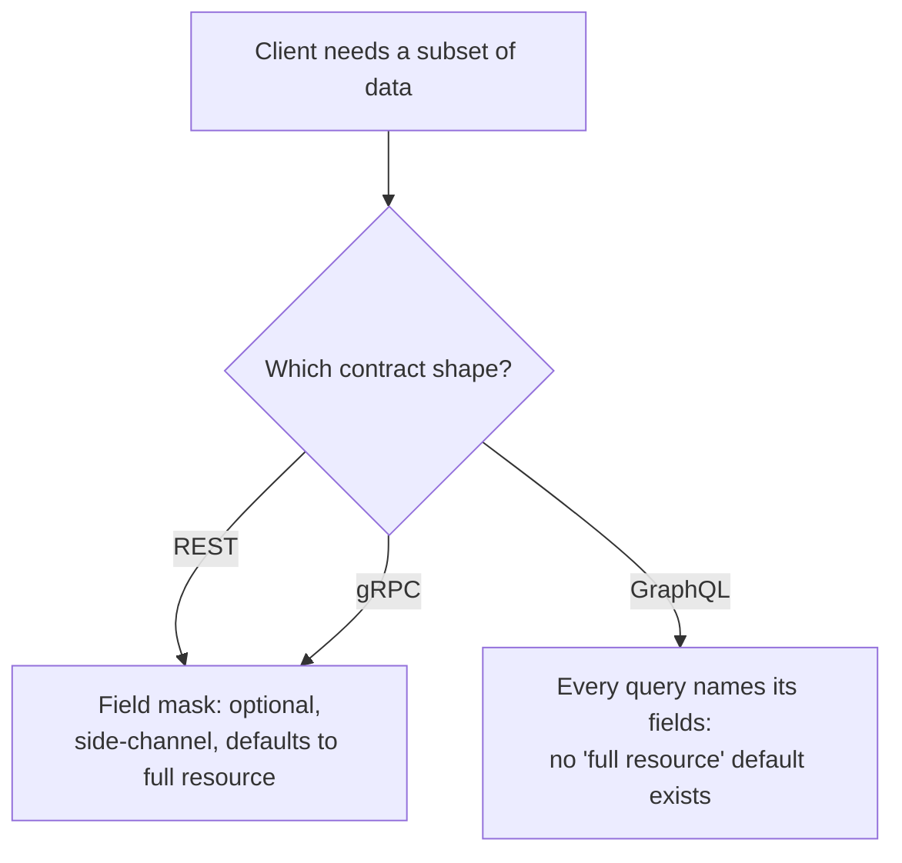

# Lesson 19. Where GraphQL Fits

**Mission link:** This whole arc has covered two contract shapes, REST/HTTP and gRPC, both built on the idea that the server declares the shape of a response and a version or a field mask is how a client narrows it. GraphQL exists as a genuinely third shape, one that inverts that relationship from the start, and this lesson exists only to place it accurately relative to the other two and say plainly why it stops here rather than getting its own arc.
**Primary source:** [Docs: "Schema Design: Versioning", GraphQL](https://graphql.org/learn/schema-design/#versioning)
**Prerequisites:** [Lesson 18](0018-contract-testing.md), [Partial response](../GLOSSARY.md)

## Warm-up

1. ▢ What does a schema's structural validity or a clean breaking-change-detector run *not* tell you about a provider?

Check

Neither says anything about whether the provider's actual runtime behavior matches what a real consumer's code needs; both check the contract's *description*, not the provider's behavior against a concrete consumer's expectations. That's what a contract test checks instead.

2. ▢ In Pact's consumer-driven model, what determines which interactions end up covered by a contract test?

Check

Only the interactions a consumer's own tests actually exercise, since the consumer's tests are what generate the pact file in the first place; provider behavior no consumer's contract covers can change freely.

## Know this

### Every GraphQL request is already what lesson 15 called a field mask

Lesson 15 covered a field mask as an optional, side-channel mechanism a REST or gRPC client uses to ask for less than the full resource. In GraphQL, there's no "full resource" a request defaults to at all: every query names exactly the fields it wants, against a single endpoint, and the server returns exactly that shape and nothing else. What's an opt-in narrowing mechanism in this workspace's other two shapes is the *only* mechanism GraphQL has; a client that wants everything still has to name every field, because there's no equivalent of an omitted mask defaulting to `"*"`.

### GraphQL's answer to lesson 8's versioning problem is to make almost everything additive by construction

Lesson 8 spent real effort on why removing or changing a field's meaning breaks a client while adding one doesn't, and lesson 9 covered the versioning strategy that discipline demands. GraphQL's own documentation states its schema evolution model directly: because a client only ever receives the fields it explicitly asked for, adding a new field or type to the schema can't break an existing query, since that query never asked for the new field and so its response shape is unaffected. This is why GraphQL's stated approach is versionless evolution rather than versioned releases: the discipline lesson 8 required a human or a linter to enforce is instead a structural consequence of how a GraphQL request is shaped in the first place.

### Deprecation still exists, but as a schema directive instead of a header

GraphQL still needs to retire a field, and does so with an `@deprecated(reason: "...")` directive directly in the schema, rather than lesson 8's `Deprecation` response header (RFC 9745). The mechanism differs, but the discipline is the same one this workspace already taught: mark it, give client tooling a reason to react to, and only remove the field once usage data confirms nothing still depends on it. The field keeps working exactly as before for as long as it's merely deprecated; deprecation is a signal, not a behavior change, in both worlds.

### Why this arc stops here instead of teaching GraphQL's contract in full

This workspace's mission is to design and evolve a contract whose guarantees hold across both REST/HTTP and gRPC, the two shapes stated as in scope from lesson 1 onward. GraphQL is a genuinely different shape with its own resolver-level concerns (the N+1 query problem, a single endpoint that can't be rate-limited or cached the way a distinct REST URL per resource can) that don't reduce to anything already covered here, and teaching them properly is its own mission, not an appendix to this one. What this lesson is for is narrower and more useful than a shallow tour: knowing that GraphQL's versionless-evolution claim and this workspace's field-mask and deprecation vocabulary are describing related ideas from two different contract shapes, so neither gets mistaken for a rule that automatically transfers to the other.

## Practice

1. ▢ A team adds a new, optional field to a GraphQL type that no existing query requests. Does this require a new API version the way adding a required field to a REST response body might, per lesson 8's rules?

Hint

Consider what an existing client's query actually asks for, and whether the new field changes what that query receives back.

Check

No. Since a GraphQL response only ever contains the fields a query explicitly names, adding a field that no existing query requests can't change the shape of any existing response; this is exactly why GraphQL's documented model treats this kind of change as safe without a version bump.

2. ▢ A GraphQL schema marks a field `@deprecated(reason: "Use fullName instead")`. Does this stop the field from returning data to a client still using it?

Check

No. Deprecation is a signal for client tooling to react to, not an immediate behavior change; the field continues working as before for as long as it's merely deprecated, the same discipline lesson 8 taught for a REST `Deprecation` header, just expressed through a schema directive instead.

3. ▢ A team designing a REST API assumes an omitted field-mask parameter behaves the way an unrequested GraphQL field does, namely, that it's simply left out of the response. What's wrong with that assumption?

Check

Per AIP-157 (lesson 15), an omitted field mask on a REST or gRPC call must default to returning every field (`"*"`), not to omitting anything; GraphQL has no equivalent default at all; every field a client wants has to be named in the query. The two shapes' "no explicit request" behavior is the opposite of each other, not the same rule expressed differently.

4. ▢ Why does this lesson stop at placing GraphQL relative to REST and gRPC rather than teaching its contract in full?

Check

This workspace's mission is specifically to design and evolve a contract whose guarantees hold across REST/HTTP and gRPC; GraphQL is a genuinely different shape with its own concerns (such as the N+1 resolver problem and single-endpoint rate-limiting and caching) that don't reduce to anything already covered, and teaching that properly is a separate mission rather than an appendix to this one.

5. ▢ Which claim correctly describes GraphQL's relationship to this arc's REST/gRPC material?

    - a) GraphQL's versionless evolution works for the same reason lesson 8's additive-change rule does, since every field it returns behaves like an optional field mask by default
    - b) A field mask and a GraphQL query serve the same purpose but with an important default reversed: an omitted REST/gRPC mask defaults to everything, while GraphQL has no "everything" default at all
    - c) GraphQL requires the same versioned-release strategy lesson 9 taught for REST and gRPC
    - d) GraphQL's `@deprecated` directive immediately stops a field from returning data, unlike lesson 8's `Deprecation` header

Check

**b)** That's the precise, useful distinction this lesson draws. (a) is imprecise: GraphQL's evolution safety follows from every query naming its own fields, not from an optional mask with a default. (c) is false: GraphQL's documented approach is versionless schema evolution, not the versioned-release strategy of lesson 9. (d) is false: `@deprecated` is a signal, not a removal; the field keeps working until it's actually removed.

## Real-world reps

- [ ] For a GraphQL API you have access to (or its public schema), find one field marked `@deprecated` and read its `reason`, then check whether an equivalent, non-deprecated field already exists to migrate to.
- [ ] Compare a REST or gRPC endpoint you know well against a GraphQL query for the same data: write down what an omitted field mask returns on the first, and what an unrequested field returns (or doesn't) on the second.
- [ ] Tomorrow: read the primary source's section on schema evolution in full, and note what it says about the tradeoffs of introducing a new type for a changed use case instead of extending an old one.

## Going further

- [Docs: "Schema Design: Versioning", GraphQL](https://graphql.org/learn/schema-design/#versioning)
- [Docs: "Introduction to GraphQL", GraphQL](https://graphql.org/learn/)
- [Resources](../RESOURCES.md)

---

Not landing? Reread the primary source at the top, since this lesson compresses it and compression is where understanding leaks. Check the [glossary](../GLOSSARY.md) for any term that felt slippery.

If the lesson itself is unclear rather than the material, that is a defect: [open an issue](https://github.com/TokenCemetery/teach/issues).
