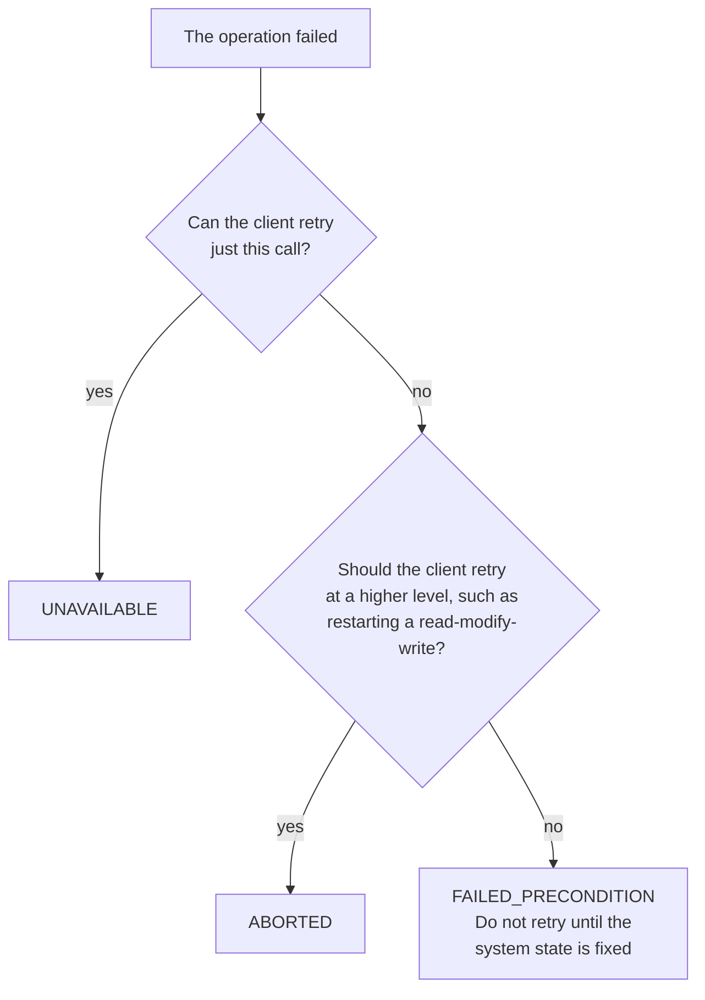

# Error Models: HTTP, Problem Details, and gRPC

Stage 2 compressed for lookup. [Lesson 2](../lessons/0002-http-status-codes-and-error-semantics.md) covers what a status code promises and [lesson 3](../lessons/0003-problem-details-and-grpc-status-codes.md) covers the structured formats; this sheet is what to reach for while designing an error model, not while learning why it is contract.

## Which document settles it

| Question | Source |
|---|---|
| What an HTTP method or status code means | [RFC 9110](https://www.rfc-editor.org/rfc/rfc9110), sections 9 and 15 |
| What `429 Too Many Requests` means | [RFC 6585](https://www.rfc-editor.org/rfc/rfc6585), section 4, not RFC 9110 |
| The structured HTTP error body | [RFC 9457](https://www.rfc-editor.org/rfc/rfc9457), which obsoletes RFC 7807 |
| What a gRPC status code means | [gRPC Status Codes](https://grpc.io/docs/guides/status-codes/) |
| The canonical gRPC to HTTP mapping | [`google.rpc.Code`](https://github.com/googleapis/googleapis/blob/master/google/rpc/code.proto) |

## HTTP status codes worth being exact about

| Code | What RFC 9110 says it indicates | What the client should do |
|---|---|---|
| `400` Bad Request | The server cannot or will not process the request because of something perceived to be a client error | Fix the request. An identical retry fails identically |
| `401` Unauthorized | The request lacks valid authentication credentials for the target resource. The response **must** carry `WWW-Authenticate` | Authenticate, then retry |
| `403` Forbidden | The server understood the request and refuses to fulfil it | Do not re-authenticate. The identity is fine and lacks permission |
| `404` Not Found | No current representation was found, **or** the server is not willing to disclose that one exists | Treat absence and concealment as indistinguishable, by design |
| `409` Conflict | The request conflicts with the current state of the target resource, in a situation the user may be able to resolve | Re-read state, resolve, resubmit |
| `410` Gone | Access is no longer available and the condition is likely permanent | Stop asking. Remove the reference |
| `412` Precondition Failed | One or more request preconditions evaluated false on the server | Re-read, re-evaluate the precondition, retry with a fresh validator |
| `422` Unprocessable Content | The content type is understood and the syntax is correct, and the instructions could not be processed | Fix the semantics, not the encoding. `415` is the wrong code for this |
| `429` Too Many Requests | Too many requests in a given time. Defined by RFC 6585, which also says the response **must not** be stored by a cache | Back off, honour `Retry-After` if present, retry |
| `500` Internal Server Error | An unexpected condition prevented the server from fulfilling the request | Retry cautiously. It is not a promise of transience |
| `503` Service Unavailable | Temporary overload or scheduled maintenance, likely alleviated after a delay | Retry, honouring `Retry-After` |

`404` versus `403` is a design decision, not an accident: returning `404` to an unauthorised caller is how an API avoids confirming that a resource exists.

## Retry-After

RFC 9110 section 10.2.3 defines the field for `503` and for any `3xx`. RFC 6585 says a `429` **may** carry it. Nothing else is specified, so a client that only honours it on `503` is still conformant and a server that relies on more is not.

```text
Retry-After = HTTP-date / delay-seconds

Retry-After: Fri, 31 Dec 1999 23:59:59 GMT
Retry-After: 120
```

## Method safety and idempotency

Idempotency is a property of the method, from RFC 9110's method registry, not of the status code that came back.

| Method | Safe | Idempotent |
|---|---|---|
| `GET` | yes | yes |
| `HEAD` | yes | yes |
| `OPTIONS` | yes | yes |
| `PUT` | no | yes |
| `DELETE` | no | yes |
| `POST` | no | no |

`POST` being the only non-idempotent one in this set is why a timed-out create needs either an idempotency key the server deduplicates on, or a `PUT` with a client-supplied identifier.

## RFC 9457 Problem Details

Media type `application/problem+json`, or `application/problem+xml` for the XML form in appendix B.

| Member | What it holds | Safe for a client to branch on |
|---|---|---|
| `type` | A URI reference identifying the problem **type**. Consumers **must** use it as the primary identifier. Absent means `about:blank` | **Yes.** This is the contract |
| `status` | The HTTP status code for this occurrence. Advisory only, and the generator **must** send the same code in the real response | Only as a cross-check. Generic software uses the real status line |
| `title` | A short human-readable summary of the type, which **should not** change between occurrences except for localisation | No. Advisory, for readers who cannot resolve the type URI |
| `detail` | A human-readable explanation of **this** occurrence, aimed at helping the client correct the problem | No. Consumers **should not** parse it |
| `instance` | A URI reference identifying this specific occurrence. Opaque to the client when it does not dereference | No. It identifies one event, not a class |

```json
{
  "type": "https://api.example.com/errors/insufficient-funds",
  "title": "Insufficient funds",
  "status": 409,
  "detail": "Your balance is 30 and this transfer costs 50.",
  "instance": "/transfers/9f2c1a",
  "balance": 30,
  "shortfall": 20
}
```

Rules that make the format extensible rather than merely conventional:

- Anything beyond the five members is an **extension member**, and that is where machine-readable specifics belong. `balance` and `shortfall` above are extensions.
- A consumer **must ignore** extension members it does not recognise, which is what lets a problem type gain detail without breaking clients.
- A member whose value is the wrong type **must be ignored**, and processing continues as if it were absent.
- Prefer an absolute `type` URI. A relative one resolves against the document's base URI, so the same string under two resources identifies two different problem types.
- The type URI does not have to resolve, and a resolvable one is encouraged. Switching a non-resolvable identifier to a resolvable one later is a breaking change, because it is a new identity for the same problem.

## gRPC status codes

Every RPC ends in a status: an integer code plus a string description. Codes and numbers from the gRPC guide; the HTTP column is the canonical mapping in `google.rpc.Code`.

| # | Code | Use when | Library may generate | Canonical HTTP |
|---|---|---|---|---|
| 0 | `OK` | Success | yes | `200` |
| 1 | `CANCELLED` | The caller cancelled | yes | `499` |
| 2 | `UNKNOWN` | An error from another address space, or one carrying too little information to classify | yes | `500` |
| 3 | `INVALID_ARGUMENT` | The argument is wrong regardless of system state | **no** | `400` |
| 4 | `DEADLINE_EXCEEDED` | The deadline passed, possibly after the work succeeded | yes | `504` |
| 5 | `NOT_FOUND` | The entity was not found, or a whole class of users is denied | **no** | `404` |
| 6 | `ALREADY_EXISTS` | The entity the client tried to create is already there | **no** | `409` |
| 7 | `PERMISSION_DENIED` | The identified caller may not do this | yes | `403` |
| 8 | `RESOURCE_EXHAUSTED` | A quota or a resource ran out | yes | `429` |
| 9 | `FAILED_PRECONDITION` | The system is not in a state where the operation makes sense | **no** | `400` |
| 10 | `ABORTED` | A concurrency conflict, such as a failed test-and-set | **no** | `409` |
| 11 | `OUT_OF_RANGE` | Past the valid range, which a client can detect when the range moves | **no** | `400` |
| 12 | `UNIMPLEMENTED` | Not implemented or not supported here | yes | `501` |
| 13 | `INTERNAL` | An invariant the system depends on is broken | yes | `500` |
| 14 | `UNAVAILABLE` | Transient. The client may retry with backoff | yes | `503` |
| 15 | `DATA_LOSS` | Unrecoverable data loss or corruption | **no** | `500` |
| 16 | `UNAUTHENTICATED` | No valid credentials for the operation | yes | `401` |

The seven marked **no** are never produced by the gRPC libraries, only by user code. Seeing one tells you the application rejected the call rather than the transport failing, which is the fastest triage signal gRPC gives you for free.

The mapping is one-way and lossy. Three gRPC codes collapse onto `400` and two onto `409`, so an HTTP status alone cannot reconstruct which gRPC code produced it. That is the argument for carrying a stable identifier of your own on both sides.

### Retryable, retryable elsewhere, or not retryable

The gRPC guide gives an explicit rule for the three codes teams confuse most.



### Denied, or not there

- Denied for an **entire class** of users, such as a gradual rollout or an undocumented allowlist: `NOT_FOUND` may be used.
- Denied for **some users within** a class, meaning ordinary access control: `PERMISSION_DENIED` **must** be used.
- `PERMISSION_DENIED` **must not** be used when a resource ran out, which is `RESOURCE_EXHAUSTED`, nor when the caller cannot be identified at all, which is `UNAUTHENTICATED`.
- `PERMISSION_DENIED` implies nothing about whether the request was valid or the entity exists.

## One model across both transports

The wire formats cannot be identical. What travels across both is the identifier.

| Conceptual error | HTTP status | Problem Details `type` | gRPC code |
|---|---|---|---|
| Validation failed | `400` | `.../errors/invalid-argument` | `INVALID_ARGUMENT` |
| Not authenticated | `401` | `.../errors/unauthenticated` | `UNAUTHENTICATED` |
| Not permitted | `403` | `.../errors/permission-denied` | `PERMISSION_DENIED` |
| No such resource | `404` | `.../errors/not-found` | `NOT_FOUND` |
| Insufficient funds | `409` | `.../errors/insufficient-funds` | `FAILED_PRECONDITION` |
| Concurrent update lost | `409` | `.../errors/aborted` | `ABORTED` |
| Rate limited | `429` | `.../errors/rate-limited` | `RESOURCE_EXHAUSTED` |
| Temporarily down | `503` | `.../errors/unavailable` | `UNAVAILABLE` |

On the gRPC side the identifier rides in an error detail attached through `google.rpc.Status`, which is the counterpart to the `type` URI, not the status code itself.

## Before shipping an error model

- Every error a client is expected to handle differently has its own stable identifier, and that identifier is documented.
- No client is expected to parse `detail`, a message string, or a status code alone to tell two errors apart.
- The retryable set is explicit, and the codes in it are the ones the specs say are retryable.
- A `429` or `503` that expects a retry says when, using `Retry-After`.
- Every non-idempotent operation a client might retry after a timeout has a deduplication mechanism.
- The identifiers mean the same thing on both transports, and the mapping between them is written down rather than inferred.

## Sources

- [RFC 9110: "HTTP Semantics", IETF](https://www.rfc-editor.org/rfc/rfc9110)
- [RFC 6585: "Additional HTTP Status Codes", IETF](https://www.rfc-editor.org/rfc/rfc6585)
- [RFC 9457: "Problem Details for HTTP APIs", IETF](https://www.rfc-editor.org/rfc/rfc9457)
- [Docs: "Status Codes", gRPC](https://grpc.io/docs/guides/status-codes/)
- [`google.rpc.Code`, googleapis](https://github.com/googleapis/googleapis/blob/master/google/rpc/code.proto)
- [Resources](../RESOURCES.md)
