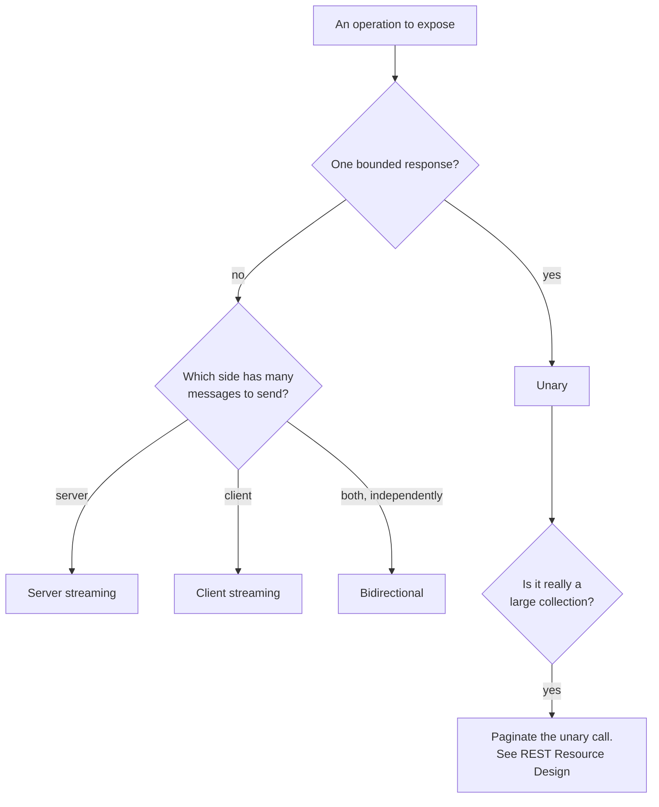

# gRPC Design: proto3, Service Shape, and Call Semantics

Stage 4 compressed for lookup. [Lesson 6](../lessons/0006-proto3-and-grpc-service-design.md) covers why the field number is the contract and [lesson 7](../lessons/0007-grpc-streaming.md) covers choosing an RPC kind; this sheet is what to check a `.proto` change against before shipping it.

## Field numbers

| Property | Value |
|---|---|
| Legal range | 1 to 536,870,911 |
| Why not the full 32 bits | Three bits of the tag carry the wire type, leaving 29 |
| One byte to encode | 1 to 15, so spend these on the most frequently set fields |
| Two bytes to encode | 16 to 2047 |
| Rejected by the compiler | 19,000 to 19,999, reserved for the protobuf implementation |
| Changeable once in use | No. Changing a number is deleting the field and adding a different one |

Reusing a number is the failure that does not announce itself. The wire format has no way to detect a field encoded under one definition and decoded under another, so protobuf's own documentation lists the outcomes as lost debugging time, a parse error in the best case, leaked personal data, and data corruption. Renumbering fields to tidy up the ordering is the common way teams do this by accident.

```proto
message Order {
  reserved 4, 7 to 9;
  reserved "legacy_status";

  string name = 1;
  string customer = 2;
  int64 total_cents = 3;
}
```

`reserved` is the mechanism that makes a deletion permanent. Reserve the number, and the name too if anything reads ProtoJSON.

## Which changes are safe, and on which format

The answer differs by serialization, which is the part that catches teams out. A gRPC service that also exposes a JSON gateway has to satisfy both columns.

| Change | Binary wire | ProtoJSON |
|---|---|---|
| Add a field with a new number | Safe | Safe |
| Remove a field, reserving its number | Safe | **Breaking**, a parse error for anyone sending it |
| Rename a field, keeping the number | Safe | **Breaking**, the name is in the payload |
| Change an existing field's number | **Unsafe** | Not applicable, names are the key |
| Reuse a removed field's number | **Unsafe** | Not applicable |
| Move an existing field into a `oneof` | **Unsafe** | Follows the same shape |
| Add a value to an enum | Safe on the wire | Safe on the wire |
| Change one explicit-presence field into a new single-field `oneof` | Safe | Safe |
| Change a single-field `oneof` back into an explicit-presence field | Safe | Safe |

Two things this table is not saying. A wire-safe change can still break **application code**: adding an enum value compiles fine and breaks any exhaustive switch on that enum downstream. And ProtoJSON does not support unknown fields at all, so it has none of the forward compatibility the binary format gets for free.

### The rename nuance the binary format hides

Lesson 6's rule, that the number is the contract and the name is comparatively free, is exactly right for the binary wire format and only for it. ProtoJSON serialises each key as the **lowerCamelCase of the field name**, so the name is in the payload. Protobuf's own documentation says as much: putting field and enum value names into encoded messages "makes it much harder to change those names later".

So the honest version of the rule is: the number is the contract on the wire, and the name becomes contract the moment anything speaks JSON. Decide which formats your service actually exposes before treating a rename as free.

### Type changes that are compatible but lossy

Safe only if you control the rollout. Protobuf's guidance is not to make these at all on a schema published outside your organisation, because you cannot know when the new range of values becomes safe to write.

| From and to | Catch |
|---|---|
| `int32`, `uint32`, `int64`, `uint64`, `bool` | A value that does not fit is truncated, as a C++ cast would truncate it |
| `sint32` and `sint64` | Compatible with each other only. Outside the 32-bit range the zigzag decoding yields a different value |
| `string` and `bytes` | Compatible while the bytes are valid UTF-8 |
| An embedded message and `bytes` | Compatible while the bytes hold an encoding of that message |
| `fixed32` and `sfixed32`, `fixed64` and `sfixed64` | Compatible pairwise |
| Singular and `repeated` | For `string`, `bytes` and message fields only. **Not** for numeric types, bools or enums, which are packed by default and will not parse as singular |
| `enum` with `int32`, `uint32`, `int64`, `uint64` | Compatible on the wire, and languages differ on how an unrecognised value surfaces |

## The four RPC kinds

```proto
service OrderService {
  rpc GetOrder(GetOrderRequest) returns (Order);
  rpc WatchOrders(WatchOrdersRequest) returns (stream Order);
  rpc UploadReceipts(stream Receipt) returns (UploadSummary);
  rpc Negotiate(stream Offer) returns (stream Offer);
}
```

| Kind | Signature | Fits | Ordering |
|---|---|---|---|
| Unary | `(Req) returns (Res)` | A single bounded request and response, which is most of an API | Not applicable |
| Server streaming | `(Req) returns (stream Res)` | One request producing many results the client wants before all exist | Guaranteed within the call |
| Client streaming | `(stream Req) returns (Res)` | Many messages then one answer, such as a chunked upload | Guaranteed within the call |
| Bidirectional | `(stream Req) returns (stream Res)` | Genuinely interactive exchange, either side sending at any time | Preserved within each stream, independently |

The guarantee is per stream, not across the pair. In a bidirectional call the two streams operate independently, so nothing relates the position of a request to the position of a response unless your own protocol says so.



Reaching for a stream where the real shape is a paginated list buys an open connection and partial-failure handling for nothing.

## Call semantics a gRPC contract inherits

These come with the transport whether or not the service designs for them, which makes them part of what a client depends on.

- **Deadlines.** A client says how long it will wait, and the RPC terminates with `DEADLINE_EXCEEDED`. The server can ask how much time is left. Whether the API is a deadline or a timeout, and whether there is a default, is language specific.
- **Success is decided twice.** Client and server determine the outcome independently and can disagree: the server can have sent every response while the client already treats the call as failed past its deadline. A design that assumes one shared verdict is wrong.
- **Cancellation is immediate and does not roll anything back.** Either side may cancel at any time; work already done stays done. Anything that must be all-or-nothing needs its own mechanism.
- **Metadata has rules.** Keys are case insensitive, made of ASCII letters, digits, and `-`, `_`, `.`, and **must not start with `grpc-`**, which is reserved. A binary-valued key ends in `-bin`.

## The same use case, both transports

"List a user's orders, most recent first, filterable by status."

| Piece | REST | gRPC |
|---|---|---|
| Operation | `GET /v1/users/{user}/orders` | `ListOrders` unary RPC |
| Parent | Path segment | `parent` request field |
| Page controls | `page_size`, `page_token` query parameters | The same names as request fields |
| Continuation | `next_page_token` in the body | `next_page_token` in the response message |
| Filter | Query parameter or filter string | `filter` request field |
| Error | Problem Details with a `type` | Status code plus a detail carrying the same identifier |

Structurally the same design in two encodings, which is the point: reach for server streaming only when the requirement genuinely changes to "emit each match as it is found", a shape plain REST cannot express without inventing something on top.

See [REST Resource Design](rest-resource-design.md) for the pagination and filtering rules, and [Error Models](error-models.md) for the error identifiers.

## Before shipping a proto change

- No existing field number changed, and no removed number reused.
- Every deleted field's number is `reserved`, and its name too if anything reads JSON.
- Every new field has a number never used in this message before.
- Any type change is on the compatible list, and the service is not one you publish outside your organisation.
- New enum values are checked against downstream code that switches exhaustively.
- The RPC kind matches the interaction shape, and a large collection is paginated rather than streamed.
- Deadline behaviour, cancellation semantics and any custom metadata keys are documented, because clients depend on them either way.

## Sources

- [Docs: "Language Guide (proto3)", Protocol Buffers](https://protobuf.dev/programming-guides/proto3/)
- [Docs: "ProtoJSON Format", Protocol Buffers](https://protobuf.dev/programming-guides/json/)
- [Docs: "Core concepts, architecture and lifecycle", gRPC](https://grpc.io/docs/what-is-grpc/core-concepts/)
- [Error Models](error-models.md)
- [REST Resource Design](rest-resource-design.md)
- [Resources](../RESOURCES.md)
