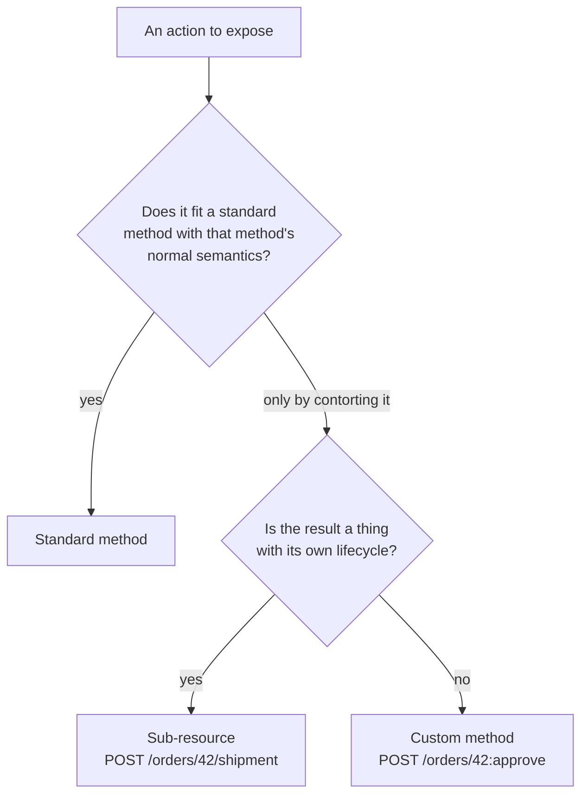

# REST Resource Design: Resources, Methods, Pagination, and Filtering

Stage 3 compressed for lookup. [Lesson 4](../lessons/0004-resource-modeling-for-rest.md) covers why REST models nouns and [lesson 5](../lessons/0005-pagination-and-filtering.md) covers consuming a large collection safely; this sheet is the rule set to check a design against.

Rules below are Google's [API Improvement Proposals](https://google.aip.dev/), the arc's primary source for this stage. They are one house's opinionated guidance, not a standard like RFC 9110, and the AIP number is given so you can read the reasoning and disagree deliberately rather than by accident.

## Naming a resource

A resource name is a URI path without the leading slash, alternating collection identifiers and resource IDs.

```text
publishers/123/books/les-miserables
users/vhugo1802
```

| Rule | AIP-122 |
|---|---|
| Segments are separated by `/`, and no non-terminal segment contains one | must |
| Names use only characters valid in DNS names, per RFC 1123 | should |
| Resource IDs avoid upper-case letters | should |
| Nothing requiring URL-escaping, and nothing outside ASCII | should |
| The resource exposes a `name` field holding its own resource name | must |
| A separate `uid`, or a `<resource>_id`, is output-only | must, if present |
| No tuples, no self-links, no other identification scheme | must not |
| Every ID field is a string | should |

An integer ID that leaks the row number is the classic violation of the last row: it is stable, observable, and clients will count with it.

## Standard methods

Five methods with semantics a client learns once and applies to every resource type in the API.

| Method | HTTP | Path | AIP | Notes |
|---|---|---|---|---|
| List | `GET` | `/v1/{parent}/books` | 132 | Required for every non-singleton resource. `page_size` and `page_token` are mandatory on the request |
| Get | `GET` | `/v1/{name}` | 131 | No side effects |
| Create | `POST` | `/v1/{parent}/books` | 133 | Body is the resource |
| Update | `PATCH` | `/v1/{name}` | 134 | `PATCH` with a field mask, not `PUT`, so a client sends only what it changes |
| Delete | `DELETE` | `/v1/{name}` | 135 | Soft delete is its own decision, AIP-164 |

For List specifically: the parent is the only variable in the path and everything else is a query parameter, the collection identifier is a literal string, and the request carries no body.

## When the action is not one of the five



Rules for a custom method, from AIP-136:

| Rule | Strength |
|---|---|
| The name is a verb followed by a noun | should |
| The name contains no preposition, such as "for" or "with" | must not |
| The verb is not one of `Get`, `List`, `Create`, `Update`, `Delete` | should |
| The name does not contain `Async`. Use a `LongRunning` suffix instead | must not |
| The HTTP method is `GET` or `POST`, and nothing else | must |
| `GET` for retrieving data or state | must |
| `POST` whenever the method has side effects or mutates anything | must |
| `POST` is allowed for retrieval when the request payload could exceed URL length limits | may |
| The URI ends in `:` followed by the custom verb, matching the verb in the method name | must |
| Word separation in the verb uses camelCase | must |

The reason a hidden side effect inside `PATCH` is worse than an ugly URL: a client that updates an unrelated field triggers it without any signal in the request that it did.

## Pagination

| Field | Where | Rule |
|---|---|---|
| `page_size` | request | Must not be required. Absent or `0` means the server picks a documented default and **must not** error |
| `page_size` above the maximum | request | Coerced down to the maximum, not rejected |
| `page_token` | request | Opaque, URL-safe, supplied only from a previous response |
| `next_page_token` | response | Omitted when there are no further pages, which is how a client knows it is done |
| `skip` | request, optional | Counts individual resources, not pages. An unfulfillable skip returns `200` with an empty result set |

Constraints that are easy to get wrong:

- **A page token must not be user-parseable.** Base64 alone is not obfuscation. If clients can deconstruct it they will, and the pagination implementation becomes API surface that can no longer change.
- **A page token carries no authorization.** Authorize the request as you would any other, whether or not a token is present.
- **A page token may expire.** AIP-158 suggests roughly three days as a rule of thumb and does not require documenting the behaviour.
- **Every other parameter must match the call that issued the token.** Changing the filter or the ordering mid-pagination is not a supported operation.

### Adding pagination later is a breaking change

This is the rule that decides the design, and it is the reason to paginate a collection endpoint from the first release even when the collection is small.

Adding pagination fields to a proto is backwards compatible; adding pagination *behaviour* is not. A client whose collection holds 75 resources and whose code assumes it receives all of them starts receiving 50 the day a default page size appears, and it does not know to ask for the rest. Raising the default does not fix it, because the collection keeps growing. Generated client libraries make it worse: they represent a paginated method with a different signature from an unpaginated one, so the change breaks at compile time too.

### Offset versus cursor

| | Offset | Cursor |
|---|---|---|
| Shape | `?offset=100&limit=20` | `?page_token=<opaque>&page_size=20` |
| Means | Position 100 in some ordering | Resume after this specific item |
| Concurrent insert before the window | An item is seen twice | Unaffected |
| Concurrent delete before the window | An item is skipped, silently | Unaffected |
| Server free to change the sort key later | No, if clients compute offsets | Yes, the token is opaque |
| Jump to an arbitrary page | Yes | No, which is usually the honest answer |

The failure is silent in both directions: no error is raised when a page skips an item, which is why an offset endpoint that has never reported a problem is not evidence that it has none.

## Filtering

AIP-160 takes a position that differs from the obvious one, and it is worth knowing before choosing: rather than one query parameter per filterable field, a request should carry **exactly one** `filter` string with a structured syntax. The argument is that filtering requirements change often, and a string field lets the server add capability without every client and UI shipping a change first.

The per-field form (`?status=shipped`) is simpler, easier to validate and easier for a client to construct. The trade is that each new filtering capability is a new parameter, and therefore a new piece of contract.

Whichever form you choose, the discipline from lesson 5 is the same: filterable fields are a deliberate, documented set, not whatever happens to be a column.

### Operators, if you follow AIP-160

| Operator | Example | Meaning |
|---|---|---|
| `AND` | `a AND b` | Both true |
| `OR` | `a OR b` | Either true |
| `NOT`, `-` | `NOT a`, `-a` | Not true. A service supporting negation must support both spellings |
| `=`, `!=` | `a != 42` | Equality, for strings, numbers, timestamps and durations |
| `<`, `>`, `<=`, `>=` | `a >= 42` | Ordering. Should not be offered for booleans or enums |

Three traps in that grammar:

- **`OR` binds tighter than `AND`**, the opposite of most programming languages. `a AND b OR c` evaluates as `a AND (b OR c)`. Documentation should encourage explicit parentheses and must not require them.
- **The field name goes on the left.** The right-hand side accepts only literals and logical operators.
- **A bare literal matches anywhere** in an object's field values by default. A service may restrict which fields it considers and must document which ones.

Values arrive as strings and are converted: enums by their case-sensitive string form, booleans as `true` and `false`, durations as a number with an `s` suffix such as `1.2s`, timestamps as RFC 3339 with UTC offsets supported.

## A worked contract

"List a user's orders, most recent first, filterable by status", resolved against every decision above.

| Decision | Choice | Why |
|---|---|---|
| Resource hierarchy | `users/{user}/orders/{order}` | The nesting states the ownership, and clients will rely on it either way |
| Method | List, `GET /v1/users/{user}/orders` | Standard, so its semantics transfer from every other collection |
| Pagination | `page_size` plus opaque `page_token` | Order history grows, and concurrent inserts must not shift a client's window |
| Default page size | Documented, coerced at a maximum | Required by AIP-158, and it stops an unbounded response |
| Ordering | Documented as part of the contract | A cursor is meaningless without a stable order behind it |
| Filtering | `status`, with the valid values enumerated | Deliberate abstraction, not the storage column |
| Errors | Problem Details with a `type` per failure kind | See [Error Models](error-models.md) |
| Invalid `page_token` | Its own problem type, not a bare `400` | A client must be able to tell a stale cursor from a bad filter |

## Before shipping a collection endpoint

- The URL names a thing, and the HTTP method carries the action.
- Pagination exists, even if the collection is small today.
- The page token is opaque, unauthorised, and not something a client could construct.
- The ordering behind the cursor is documented, because the cursor depends on it.
- The filterable fields are a chosen set, and each one is an abstraction you are willing to keep.
- Every action that is not one of the five standard methods is visible in the URL rather than hidden in an update.
- Nothing in the response exposes an identifier the API is not prepared to keep stable.

## Sources

- [Site: "API Improvement Proposals", Google](https://google.aip.dev/)
- [AIP-122: Resource names](https://google.aip.dev/122)
- [AIP-132: Standard methods: List](https://google.aip.dev/132)
- [AIP-136: Custom methods](https://google.aip.dev/136)
- [AIP-158: Pagination](https://google.aip.dev/158)
- [AIP-160: Filtering](https://google.aip.dev/160)
- [Error Models](error-models.md)
- [Resources](../RESOURCES.md)
