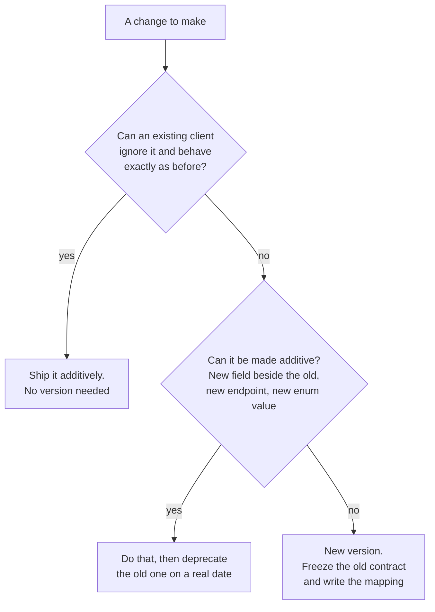

# Versioning and Evolution: Changing a Contract Without Breaking It

Stage 5 compressed for lookup. [Lesson 8](../lessons/0008-additive-changes-and-deprecation.md) covers why additive is safe and [lesson 9](../lessons/0009-versioning-and-migration-strategy.md) covers versioning as a frozen contract; this sheet is what to check a proposed change against.

## Three kinds of compatibility, not one

A change can preserve one and break another, which is why "is this breaking" has no single answer. AIP-180 separates them:

| Kind | Broken when |
|---|---|
| **Source** | Code written against the old surface no longer compiles, or no longer runs, against the new client library |
| **Wire** | Old code can no longer communicate correctly with a newer server, because serialisation expectations diverged |
| **Semantic** | Everything still compiles and parses, and the caller no longer receives what a reasonable developer would expect |

Semantic breakage is the one no tool catches. A field that keeps its name, type and number while quietly changing what it counts passes every compatibility check and breaks every client.

## Classifying a change

| Change | Verdict |
|---|---|
| Add a resource, method, message or endpoint | Safe |
| Add an optional request parameter | Safe |
| Add a property to a response | Safe |
| Add a **required** request field | **Breaking**, even though it is an addition |
| Add an optional field whose default differs from the previous behaviour | **Breaking**, semantically |
| Stop populating a field the server used to populate | **Breaking**, even if it became redundant |
| Add an enum value used only in requests | Safe |
| Add an enum value that can appear in a response | Conditionally safe, and it should have been documented as possible from the start |
| Remove a field, method or resource | **Breaking** |
| Rename anything | **Breaking.** A rename is remove plus add |
| Change a field's type | **Breaking**, unless it is on the compatible list for your encoding |
| Change what a field means | **Breaking**, and invisible to every automated check |
| Tighten validation to reject previously valid input | **Breaking** |
| Change a status code's meaning | **Breaking** |
| Reorder properties in a response | Safe |
| Change the length or format of an opaque string, such as an ID | Safe, if you documented it as opaque |

The last two are Stripe's, and they are the interesting ones: both are safe **only because they were declared out of contract in advance**. An ID's prefix or length is safe to change precisely because clients were told not to parse it. This is lesson 1's accidental contract, prevented rather than repaired.

For proto3 specifically, the wire-versus-JSON split matters and is on [gRPC Design](grpc-design.md).

### The additive changes that are not

- **A new required field is a breaking change.** Any field a client populates must have a default that reproduces the previous behaviour.
- **Adding pagination is the textbook case.** If the new `page_size` defaults to less than clients used to receive, they will conclude they have everything. AIP-180 and AIP-158 both call this out, which is why a collection endpoint paginates from its first release.
- **A field the server once populated must keep being populated**, even if a better field now exists beside it.
- **A new enum value can break an exhaustive switch** in generated client code. Wire-safe is not source-safe.

## Signalling a deprecation

Deprecation is only useful if a client's tooling can see it, not just a human reading a changelog. Since March 2025 there is a standard for it.

```http
Deprecation: @1688169599
Sunset: Sun, 30 Jun 2024 23:59:59 UTC
Link: <https://developer.example.com/deprecation>; rel="deprecation"; type="text/html"
```

| Field | Spec | Rules |
|---|---|---|
| `Deprecation` | RFC 9745 | An Item Structured Header whose value **must** be a Date. Past means already deprecated, future means it will be |
| `Sunset` | RFC 8594 | When the resource is expected to stop responding. **Must not** be earlier than the `Deprecation` date |
| `Link` with `rel="deprecation"` | RFC 9745 | Points at documentation or a policy. May appear **before** anything is deprecated, which is how a policy becomes discoverable |

Note that the two headers use different date formats, which RFC 9745 attributes to history rather than intent: `Deprecation` takes a structured-field Date such as `@1688169599`, and `Sunset` takes an HTTP date.

**`Deprecation: true` is not the standard.** It comes from an earlier draft, and RFC 9745 requires a Date, so a boolean is not a conformant value. If a client parses the field per the RFC, a boolean fails to parse rather than reading as "yes".

Three consequences of what RFC 9745 actually says:

- **Deprecation changes no behaviour.** The header's presence is not a signal that anything works differently; consumers use the resource exactly as before.
- **It is a hint, and it is optional.** Clients must be built to work without it, so a deprecation signal is never a substitute for a migration plan.
- **Its scope is the responding resource** by default. An API may declare a wider scope, for instance announcing on its home document only, and that wider scope is invisible to anyone who has not read the policy.

### A deprecation nobody enforces is worse than none

The scarce resource is a client's willingness to believe the label. A field marked deprecated for years with no removal trains every integrator to ignore the signal, so the one deprecation that does get enforced arrives unread. Announce a date only if you intend to act on it.

## Versioning models

| Model | Where the version lives | Cost |
|---|---|---|
| None, additive only | Nowhere | Free, and cannot express a breaking change |
| URI path, `/v1/`, `/v2/` | The URL | Visible and cacheable, and a resource has two names, so links and identity get awkward |
| Request header | `Stripe-Version`, `Accept` parameters | The URL keeps identifying one resource, and the version is easier to overlook |
| Pinned per account or key | Set once, server-side | Each integration migrates on its own schedule, at the price of running many contracts at once |
| Global dated cutover | A calendar | Simple to reason about, and it forces every client to move on your timetable |

The choice is really about who absorbs the cost of a breaking change. A cutover puts it on every client simultaneously; pinning puts it on the provider, who now maintains every pinned version indefinitely.

## Stripe, as a worked example

The arc's chosen real-world model, and worth reading as it stands today rather than as it is usually described.

- Versions are **named releases**: a major release carries a codename, and monthly releases share the last major's name and contain only backward-compatible changes. A monthly upgrade is safe by construction.
- **Your version is set the first time you make a request**, and you keep it until you choose to move.
- **Per-request override** via a version header, which is how you test a newer version before adopting it. Stripe's own advice is to pin the version in code rather than rely on the account default.
- **Webhook endpoints can carry their own version**, and an endpoint with an explicit version always uses it.
- **A Connect platform's requests on behalf of a connected account use the platform's version**, whatever the connected account's version is. Reasonable, and exactly the sort of rule an integration discovers the hard way.

## Additive, or a new version



Both errors cost something. Versioning a change that could have been additive imposes a migration nobody needed. Shipping a breaking change without a version breaks the clients who trusted the contract, and they find out in production.

## Before shipping a change

- The change is classified against source, wire and semantic compatibility, not just "does it still parse".
- No added field is required, and every added field's default reproduces the old behaviour.
- Nothing the server used to populate has stopped being populated.
- If something is deprecated, there is a date, a `Deprecation` header carrying it, a `Sunset` no earlier than it, and a link to the policy.
- The deprecation date is one you are willing to enforce.
- If a new version was needed, the old one is frozen, and the migration guide gives the mapping rather than announcing the change.
- Anything declared opaque, such as an ID's format, is documented as opaque before you rely on being free to change it.

## Sources

- [Docs: "API versioning", Stripe](https://docs.stripe.com/api/versioning)
- [Docs: "API upgrades", Stripe](https://docs.stripe.com/upgrades)
- [RFC 9745: "The Deprecation HTTP Response Header Field", IETF](https://www.rfc-editor.org/rfc/rfc9745)
- [RFC 8594: "The Sunset HTTP Header Field", IETF](https://www.rfc-editor.org/rfc/rfc8594)
- [AIP-180: Backwards compatibility](https://google.aip.dev/180)
- [gRPC Design](grpc-design.md)
- [Resources](../RESOURCES.md)
