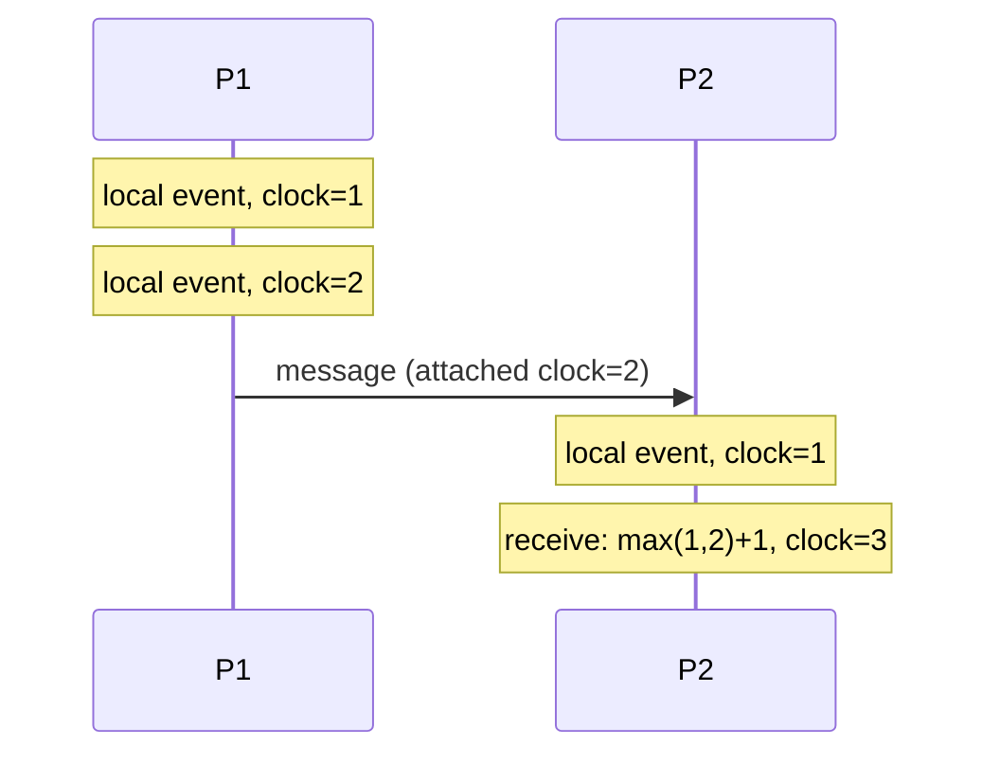

# Lesson 2. Clocks and Ordering

**Mission link:** Stage 2 opens with the first concrete consequence of partial failure (lesson 1): if you can't be sure what's happening on another machine, you also can't trust that machine's clock to agree with yours. This lesson is why physical time fails at ordering events, and what replaces it.
**Primary source:** [Paper: "Time, Clocks, and the Ordering of Events in a Distributed System", Leslie Lamport, 1978](https://lamport.azurewebsites.net/pubs/time-clocks.pdf)
**Prerequisites:** [Lesson 1](0001-partial-failure.md), [Partial failure](../GLOSSARY.md)

## Warm-up

1. ▢ Why can't a caller reliably distinguish a slow node from a dead one?

Check

Because there's no upper bound on message delay over a network, so from the caller's side, silence is consistent with both "the reply is still coming" and "it will never come." This is a structural fact, not an engineering gap waiting to be closed.

2. ▢ Why is a timeout a guess rather than a fact?

Check

Because it's a chosen limit on how long to wait before assuming failure, not a measurement of anything real; there is no timeout value that eliminates the trade-off between declaring a merely-slow node dead too early and delaying recovery from an actually-dead node too long.

## Know this

### Physical clocks on different machines don't agree, and can't be made to

Every machine has its own physical clock, and even with NTP (Network Time Protocol) actively synchronizing them, clocks on different machines drift apart between synchronizations and never read exactly the same value at the same instant. This isn't a bug in NTP; it's a structural limit, since synchronizing clocks itself requires sending messages over the same network whose delay is unpredictable (lesson 1). The practical consequence: two timestamps recorded on two different machines, even microseconds apart in wall-clock time, cannot be trusted to reflect which event actually happened first.

### Why this breaks "just compare the timestamps"

If a system orders events by comparing timestamps from different machines, clock drift can silently reorder them: an event that happened *after* another, causally, can end up with an *earlier* timestamp simply because its machine's clock reads slightly behind. Worse, this failure is invisible in normal operation. Nothing crashes, no error appears; the system just occasionally gets the order of events wrong, in a way that only surfaces once something downstream depends on that order being correct (a database resolving a write conflict, a log being replayed to reconstruct state).

### The happens-before relation: order without synchronized clocks

Lamport's paper defines the **happens-before relation** to describe when we can genuinely say one event preceded another, without appealing to physical time at all. Event A happens-before event B if either: A and B occur in the same process, in that program order; or A is the sending of a message and B is that message's receipt; or the relation is transitive across a chain of either of those. Two events that satisfy neither condition, on different processes, with no message chain connecting them, are **concurrent**: there is no fact of the matter about which "really" happened first, and no clock, physical or otherwise, can manufacture one.

### Logical clocks make happens-before comparable with a number

A **logical clock** (a Lamport clock) is a counter each process keeps, incremented on every local event, and attached to every message it sends; a process receiving a message sets its own counter to one more than the higher of its current value and the message's attached value. This produces a number for every event such that if A happens-before B, A's logical clock value is guaranteed to be lower than B's. It does not run on wall-clock time, doesn't require any two machines' clocks to agree, and gives exactly the ordering guarantee happens-before actually promises, no more and no less: it cannot tell you which of two truly concurrent events "really" came first, because there is no such fact to tell.

## Practice

1. ▢ Why can't NTP-synchronized clocks be trusted to order events across two different machines, even though NTP actively works to keep them in sync?

Check

Clocks on different machines drift apart between synchronizations, and synchronizing them at all requires sending messages over a network with unpredictable delay, the same partial-failure problem from lesson 1. Two timestamps from different machines can therefore disagree about order even when one event genuinely caused the other.

2. ▢ State the happens-before relation's two base cases, and what it means for two events to be "concurrent."

Hint

One case involves a single process; the other involves a message crossing between two.

Check

A happens-before B if either they occur in the same process in program order, or A is a message's send and B is that same message's receipt (plus the transitive closure of these). Two events are concurrent if neither happens-before the other, meaning there's no fact about which came "first"; they're causally unrelated.

3. ▢ How does a Lamport (logical) clock guarantee that A's value is lower than B's whenever A happens-before B, without relying on synchronized physical time?

Check

Each process increments its own counter on every local event, and attaches its current counter value to every outgoing message. A process receiving a message sets its counter to one more than the maximum of its own current value and the received value. This ensures the counter only ever increases along any happens-before chain (same-process order or a message's send-then-receive), so a lower logical-clock value is guaranteed for anything that causally precedes a higher one.

4. ▢ Two events, one on machine X and one on machine Y, have logical clock values 5 and 5 (a tie), with no message chain connecting them. What can you conclude about their actual order?

Check

Nothing: a tie (or any comparison at all) between logical clock values for two events with no happens-before relation between them tells you they're concurrent, not which one "really" happened first. There is no such fact to recover, physical clocks included; happens-before is the only ordering that's actually meaningful here.

5. ▢ Which claim is true about ordering events in a distributed system?

    - a) NTP-synchronized wall-clock timestamps are reliable enough to order events correctly as long as clocks sync every few seconds
    - b) The happens-before relation, and logical clocks that respect it, order events based on actual causal relationships (program order or message passing), not physical time
    - c) Two events with different logical clock values are always causally related
    - d) Concurrent events (per happens-before) genuinely have no correct order, and no clock can recover one

Check

**b and d are both true** and describe the same underlying idea from two angles: happens-before captures actual causality, and (d) states its necessary consequence for events outside that relation. (a) is false: sync frequency doesn't eliminate drift between syncs, and comparing timestamps across machines can still misorder causally related events. (c) is false: a logical clock's *lower* value guarantees "does not happen after," but two different logical clock values don't by themselves prove a happens-before relationship exists, since concurrent events can also end up with different values depending on unrelated local activity on each process.

## Real-world reps

- [ ] Find a place in a system you know of that records event timestamps from more than one machine (a distributed log, a set of microservices, a client and a server). Ask whether anything downstream compares those timestamps to determine order, and if so, whether that comparison could be wrong under clock drift.
- [ ] For that same system, sketch what a logical clock (or a similar causality-tracking mechanism, like a vector clock) would need to track instead, to get a correct happens-before ordering.
- [ ] Tomorrow: read the primary source's definition of the happens-before relation and its logical clock algorithm in full, including the paper's own worked example.

## Going further

- [Paper: "Time, Clocks, and the Ordering of Events in a Distributed System", Leslie Lamport, 1978](https://lamport.azurewebsites.net/pubs/time-clocks.pdf)
- [Article: "Fallacies of distributed computing", Wikipedia](https://en.wikipedia.org/wiki/Fallacies_of_distributed_computing)
- [Resources](../RESOURCES.md)

---

Not landing? Reread the primary source at the top, since this lesson compresses it and compression is where understanding leaks. Check the [glossary](../GLOSSARY.md) for any term that felt slippery.

If the lesson itself is unclear rather than the material, that is a defect: [open an issue](https://github.com/TokenCemetery/teach/issues).
