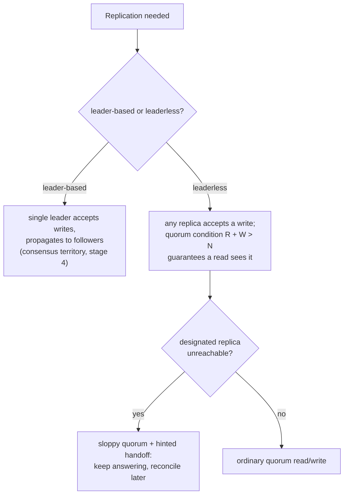

# Lesson 11. Replication and Quorums

**Mission link:** Stage 4 covered consensus, the mechanism that gives a system linearizable, single-leader-style coordination, and stage 3 taught choosing a consistency model in the abstract. This lesson covers the layer underneath both: how data actually gets copied across machines in the first place, the two shapes that takes, and the arithmetic that decides how many replicas a read or a write has to touch.
**Primary source:** [Article: "Dynamo (storage system)", Wikipedia](https://en.wikipedia.org/wiki/Dynamo_(storage_system))
**Prerequisites:** [Lesson 6](0006-sequential-and-eventual-consistency.md), [Lesson 9](0009-what-consensus-costs.md)

## Warm-up

1. ▢ What does eventual consistency guarantee, and what does it explicitly not promise?

Check

It guarantees that if no new writes occur, all replicas will eventually converge to the same value. It does not promise a single agreed order across clients, nor any bound on how long convergence takes.

2. ▢ Why does every write in a consensus-based system pay a round trip to a majority of nodes?

Check

Because a write isn't considered committed until a majority has durably recorded it, which is what guarantees the write survives even if a minority of nodes (including the current leader) subsequently fails; a minority partition therefore loses availability rather than risking inconsistency.

## Know this

### Two shapes for getting the same data onto more than one machine

**Replication** is copying the same data across multiple nodes, and it comes in two shapes. In **leader-based (single-leader) replication**, one designated node accepts all writes and propagates them to followers; this is the shape consensus (stage 4) builds toward, since electing that single leader is exactly the problem Raft solves. In **leaderless replication**, any replica can accept a write directly, and the system relies on other mechanisms, not a single elected coordinator, to keep replicas consistent enough. Amazon's Dynamo is the canonical leaderless design; tellingly, Amazon's own later hosted product **DynamoDB**, despite being described as "built on the principles of Dynamo," switched to single-leader replication instead, a reminder that sharing a name or a lineage doesn't mean sharing a replication shape.

### The quorum condition is a single overlap guarantee, not a vote count

A **quorum** system assigns every replica a vote and requires a read to collect acknowledgment from a **read quorum** of size R, and a write to collect acknowledgment from a **write quorum** of size W, out of N total replicas. The load-bearing rule is `R + W > N`: it guarantees that any read quorum and any write quorum must share at least one common replica, since two subsets of an N-element set whose sizes add to more than N cannot be disjoint. That shared replica is what makes a read quorum reliably include the most recent successful write. A second rule, `W > N/2`, does separate work: it guarantees any two write quorums also overlap with each other, so two concurrent writes can't both succeed without at least one replica seeing both, which is what prevents writes from silently diverging into two unreconciled histories.

### Choosing R and W is choosing where the cost of consistency goes

Because only the sum `R + W > N` matters for the overlap guarantee, a system has real room to choose where R and W individually land, and that choice trades off differently than stage 3's consistency-model choice did. A low R and high W (fast reads, slower writes) suits a read-heavy workload; a high R and low W (fast writes, slower reads) suits a write-heavy one. Setting `R = W = 1` abandons the overlap guarantee entirely (fast in both directions, but a read can miss the latest write), which is why a quorum system's read-your-writes guarantee is a direct, checkable consequence of the R and W values chosen, not an assumption to take on faith.

### Quorums buy availability during a partition that consensus's majority rule doesn't

Stage 4 established that a consensus-based system's minority partition loses availability, refusing to answer rather than risk inconsistency. A quorum system can be configured to keep answering through a partition by using a **sloppy quorum**: if some of the N designated replicas are unreachable, the write is temporarily accepted by other, non-designated nodes instead, later replayed onto the correct replicas once they're reachable again (**hinted handoff**). This is a deliberate, different trade: consensus refuses to answer to preserve a single agreed history; a sloppy quorum keeps answering and accepts that reconciling divergent histories (stage 8's problem) becomes the price of that availability.

## Practice

1. ▢ A system has `N = 5` replicas and sets `R = 2`, `W = 2`. Does this configuration guarantee a read quorum always overlaps with a write quorum?

Hint

Check the arithmetic against the actual rule, not just against intuition about what sounds like "enough."

Check

No. `R + W = 4`, which is not greater than `N = 5`, so the rule `R + W > N` fails; a read quorum of 2 and a write quorum of 2 out of 5 replicas can be entirely disjoint, meaning a read can miss the most recent write.

2. ▢ A team sets `R = 1` and `W = N` (every replica must acknowledge a write). What does this buy for reads, and what does it cost for writes?

Check

Reads become as fast as possible (only one replica needs to respond), and the overlap guarantee still holds since `1 + N > N`. The cost lands entirely on writes: every single replica must acknowledge before a write succeeds, so a write is only as fast and as available as the slowest, least available replica in the whole set.

3. ▢ Why does DynamoDB's use of single-leader replication, despite being built on Dynamo's principles, matter as a lesson about system names and lineage?

Check

It shows that "built on the principles of" doesn't mean "replicates data the same way." Dynamo itself is a leaderless design; DynamoDB is a different, later product that adopted single-leader replication instead, so assuming a shared name implies a shared replication shape would be a mistake here specifically.

4. ▢ A quorum system's designated replicas for a given write are temporarily unreachable due to a network issue. Under a sloppy quorum, what happens to the write, and what has to happen once the designated replicas become reachable again?

Check

The write is accepted by other, non-designated reachable nodes instead of failing outright. Once the correct, designated replicas become reachable again, the write has to be handed off (replayed) onto them via hinted handoff, so the data eventually ends up where it was actually supposed to live.

5. ▢ Which claim correctly describes the quorum condition and what it guarantees?

    - a) `R + W > N` guarantees a read always returns the single most recent write across every replica in the system, with no possibility of a stale value
    - b) `R + W > N` guarantees any read quorum and any write quorum share at least one common replica; a second rule, `W > N/2`, additionally guarantees two write quorums overlap with each other
    - c) Leaderless replication and leader-based replication are two names for the same mechanism, differing only in terminology
    - d) A sloppy quorum refuses to accept a write whenever any designated replica is unreachable, exactly like a consensus protocol's majority rule

Check

**b)** That's the precise guarantee this lesson establishes. (a) is an overstatement: the overlap guarantees a read *quorum* includes the latest acknowledged write among the replicas it queries, not that every replica in the whole system is already caught up. (c) is false: leader-based replication routes every write through one elected node; leaderless replication lets any replica accept a write directly, a structurally different mechanism. (d) is false: a sloppy quorum is specifically the technique that keeps accepting writes through unreachable designated replicas, unlike consensus's refusal.

## Real-world reps

- [ ] For a database or storage system you use, find whether it uses leader-based or leaderless replication, and if it exposes R and W (or equivalent read/write consistency settings) as configuration.
- [ ] If it does expose R and W, check the actual values configured and whether `R + W > N` holds; if it doesn't hold, note whether that was a deliberate trade-off for latency or an oversight.
- [ ] Tomorrow: read the primary source's "Techniques" section in full, and note what anti-entropy via Merkle trees is for, the mechanism this lesson didn't cover.

## Going further

- [Article: "Dynamo (storage system)", Wikipedia](https://en.wikipedia.org/wiki/Dynamo_(storage_system))
- [Article: "Quorum (distributed computing)", Wikipedia](https://en.wikipedia.org/wiki/Quorum_(distributed_computing))
- [Resources](../RESOURCES.md)

---

Not landing? Reread the primary source at the top, since this lesson compresses it and compression is where understanding leaks. Check the [glossary](../GLOSSARY.md) for any term that felt slippery.

If the lesson itself is unclear rather than the material, that is a defect: [open an issue](https://github.com/TokenCemetery/teach/issues).
