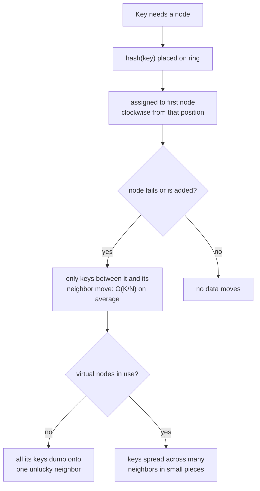

# Lesson 12. Partitioning and Sharding

**Mission link:** Lesson 11 covered replication, keeping copies of the *same* data on multiple nodes. **Partitioning** (also called **sharding**) is the other half of scaling a dataset past one machine: splitting *different* data across nodes so no single node has to hold all of it. This lesson is about the specific technique that makes adding or removing a node cheap instead of catastrophic, and the practical gaps a naive version of it still leaves open.
**Primary source:** [Article: "Consistent hashing", Wikipedia](https://en.wikipedia.org/wiki/Consistent_hashing)
**Prerequisites:** [Lesson 11](0011-replication-and-quorums.md), [Replication](../GLOSSARY.md)

## Warm-up

1. ▢ What single rule guarantees a read quorum and a write quorum always share at least one replica?

Check

`R + W > N`: two subsets of an N-element set whose sizes add to more than N cannot be disjoint, so any read quorum of size R and write quorum of size W must overlap on at least one replica.

2. ▢ What does a sloppy quorum trade away to keep answering through a partition that a consensus protocol's majority rule wouldn't?

Check

It accepts a write onto non-designated, reachable nodes instead of refusing it, and defers reconciling that write onto the correct replicas (via hinted handoff) until they're reachable again; the trade is accepting a temporarily divergent history in exchange for staying available.

## Know this

### Naive hashing makes adding or removing a node a catastrophe, not an inconvenience

The obvious way to spread N keys across M nodes is `hash(key) mod M`. It works, until M changes. Add or remove a single node, and `mod M` becomes `mod (M±1)`, which changes the assignment of nearly every key in the dataset, not just the ones that actually needed to move. Every one of those keys has to be physically relocated at once, exactly when the cluster is already in the middle of a topology change.

### Consistent hashing bounds the damage to what actually needs to move

**Consistent hashing** maps both nodes and keys onto positions on the same ring (conventionally by hashing each to a point on a fixed-size circle), and assigns each key to the first node reached going clockwise from its position. Adding or removing one node only affects the keys between it and its immediate neighbor on the ring; every other key's nearest node hasn't changed and doesn't move. The average cost of a resize is bounded to `O(K/N)` keys reassigned, roughly the dataset size divided by the number of nodes, rather than nearly the whole dataset.

### A bare ring still concentrates a failure's whole load onto one neighbor

Without any further refinement, a consistent-hashing ring has a specific practical flaw: if a node fails, every key it owned falls onto whichever single node is next clockwise, potentially doubling that one node's load right when the cluster can least afford a second failure. **Virtual nodes** fix this by giving each physical node many positions (labels) around the ring instead of one, called that node's *weight*; a failure's keys then land on many different neighbors in small pieces instead of piling entirely onto one. Virtual nodes solve a second problem in the same motion: with only one position per physical node, an unlucky, uneven spacing of nodes around the ring can leave one node responsible for a much larger arc than the others, purely by chance; spreading each node across many positions averages that unevenness out.

### A "hot" key needs a different fix than an unevenly loaded node

Rebalancing solves uneven *node* load; it doesn't help when a single *key* becomes disproportionately popular, since that key still maps to exactly one place on the ring no matter how evenly the ring itself is built. The practical fix is to replicate that specific hot key onto several contiguous nodes going clockwise from its position, spreading its traffic the same way replication (lesson 11) spreads a whole dataset's load. When two unrelated hot keys happen to land near each other on the ring, they'd otherwise share that same set of contiguous nodes; giving each key its own independent hash function onto the ring avoids two hot spots colliding into one.

### Ownership still has to be discoverable, or the ring is theoretical

Knowing that a key maps to a specific ring position doesn't answer how a request actually reaches the node responsible for it; something has to track which node currently owns which arc of the ring and route accordingly, whether that's a client-side routing table, a gossip protocol propagating membership changes (the approach lesson 11's Dynamo uses), or a dedicated routing tier in front of the storage nodes. Consistent hashing decides *where* a key belongs; **request routing** is the separate, necessary mechanism for actually getting a request there.

## Practice

1. ▢ A cluster uses `hash(key) mod M` for partitioning, with `M = 10`. One node is added, making `M = 11`. Roughly how much of the dataset has to move, and why?

Hint

Consider what changes about `key mod 10` versus `key mod 11` for a typical key.

Check

Nearly all of it. Changing the modulus changes the result of `key mod M` for almost every key, not just the ones that logically belong on the new node, so almost the entire dataset has to be relocated for what should have been a small, localized change.

2. ▢ A consistent-hashing ring assigns each physical node exactly one position. A node fails. What happens to its load, and what does adding virtual nodes change about that outcome?

Check

Without virtual nodes, every key the failed node owned falls onto the single next node clockwise, potentially doubling that one node's load. With virtual nodes (multiple positions per physical node), the failed node's keys are spread across many different positions, and therefore many different neighboring nodes, in smaller pieces instead of concentrating on one.

3. ▢ A specific key becomes extremely popular (a "hot" key), while the ring itself is well-balanced overall. Does adding more virtual nodes to the ring fix this?

Check

No. Virtual nodes address uneven *node* load and failure concentration; a single hot key still maps to one position on the ring regardless of how many virtual nodes exist elsewhere. Fixing a hot key requires replicating that specific key onto multiple contiguous nodes, a targeted fix rather than a ring-wide rebalancing one.

4. ▢ Two unrelated keys happen to hash to nearby positions on the ring, and both become hot at the same time. What problem does this create, and what's the documented fix?

Check

Both hot keys would end up replicated onto the same set of contiguous nodes, since they're near each other on the ring, concentrating both hot spots onto the same nodes instead of spreading the load. The fix is giving each key its own independent hash function for placement on the ring, so two keys that are hot at the same time don't necessarily land near each other.

5. ▢ Which claim correctly describes what consistent hashing solves and what it still requires?

    - a) Consistent hashing eliminates the need for any request-routing mechanism, since the ring position alone is enough to deliver a request
    - b) Consistent hashing bounds the keys that move on a resize to roughly `K/N` instead of nearly the whole dataset, but still needs virtual nodes to avoid dumping a failed node's entire load onto one neighbor, and still needs a separate mechanism to route a request to the node that currently owns a key
    - c) Virtual nodes exist specifically to fix a single hot key's disproportionate load
    - d) `hash(key) mod M` and consistent hashing remap the same number of keys on average when a node is added or removed

Check

**b)** That's the complete picture this lesson establishes. (a) is false: the ring only decides ownership; something still has to track and route to the current owner. (c) is false: virtual nodes address uneven node load and failure concentration, not a single popular key, which needs targeted replication instead. (d) is false: `mod M` remaps nearly everything on a resize, while consistent hashing bounds the remapped fraction to roughly `K/N`.

## Real-world reps

- [ ] For a partitioned or sharded system you use, check whether it uses consistent hashing, range-based partitioning, or a fixed hash-mod-N scheme, and what that implies for how expensive adding a node is.
- [ ] If it uses consistent hashing, check whether it documents virtual nodes (sometimes called "vnodes" or "tokens per node") and what value it defaults to.
- [ ] Tomorrow: read the primary source's "Practical extensions" section in full, and note what changes when two hot keys need to be spread using different hash functions rather than the same ring.

## Going further

- [Article: "Consistent hashing", Wikipedia](https://en.wikipedia.org/wiki/Consistent_hashing)
- [Article: "Dynamo (storage system)", Wikipedia](https://en.wikipedia.org/wiki/Dynamo_(storage_system))
- [Resources](../RESOURCES.md)

---

Not landing? Reread the primary source at the top, since this lesson compresses it and compression is where understanding leaks. Check the [glossary](../GLOSSARY.md) for any term that felt slippery.

If the lesson itself is unclear rather than the material, that is a defect: [open an issue](https://github.com/TokenCemetery/teach/issues).
