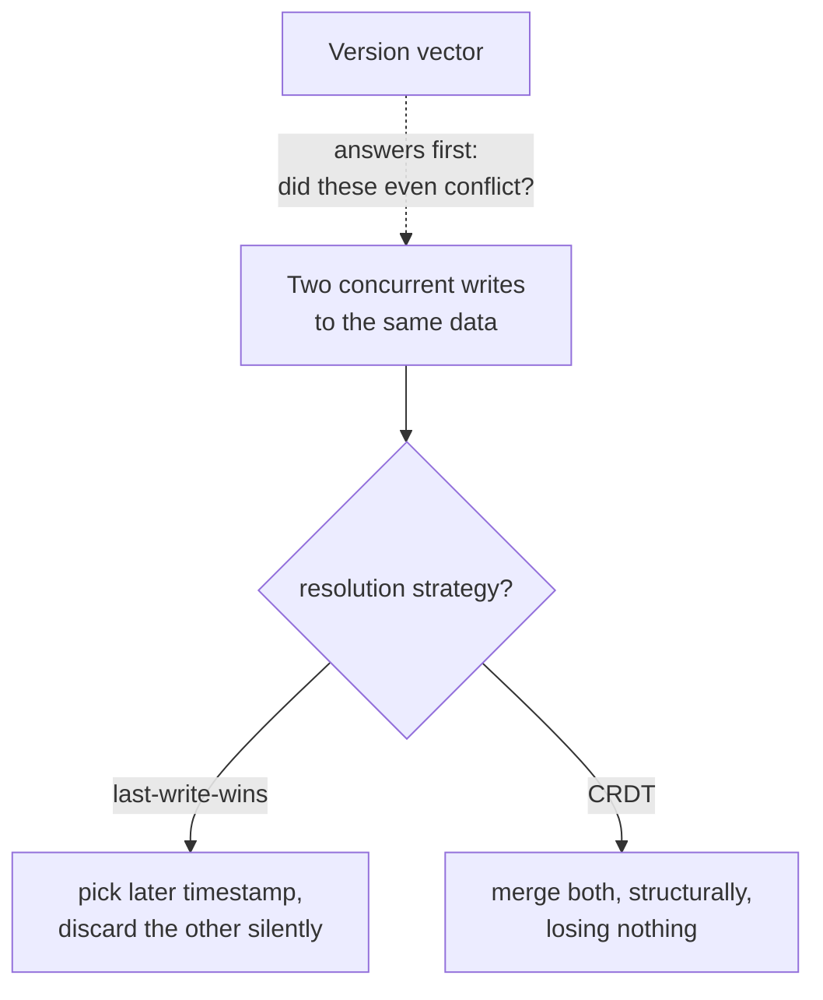

# Lesson 13. Conflict Resolution Under Eventual Consistency

**Mission link:** Lesson 6 established that eventual consistency's whole guarantee is "you'll get there," with no promise about what different clients see in between. This lesson is about exactly that in-between: when two replicas accept genuinely concurrent writes to the same piece of data, something has to decide what the converged value ends up being, and the options range from "silently pick one and discard the other" to "merge both without losing anything."
**Primary source:** [Article: "Conflict-free replicated data type", Wikipedia](https://en.wikipedia.org/wiki/Conflict-free_replicated_data_type)
**Prerequisites:** [Lesson 6](0006-sequential-and-eventual-consistency.md), [Lesson 11](0011-replication-and-quorums.md)

## Warm-up

1. ▢ A quorum system accepts a write onto non-designated nodes via a sloppy quorum, while the designated replicas are temporarily unreachable. What has this deferred, and to when?

Check

It has deferred reconciling that write with whatever happened on the correct, designated replicas in the meantime, until hinted handoff replays it onto them once they're reachable again; in the meantime, the system risks divergent histories that still need resolving.

2. ▢ What does eventual consistency actually guarantee, and what does it not promise about the interval before convergence?

Check

It guarantees that if no new writes occur, all replicas will eventually converge to the same value. It promises nothing about how long that takes, or what different clients might observe from different replicas in the meantime.

## Know this

### Last-write-wins doesn't resolve a conflict, it discards one side of it

**Last-write-wins (LWW)** is the simplest approach: attach a timestamp to every write, and when two writes conflict, keep the one with the later timestamp and discard the other, silently. It's simple to implement and requires no coordination, but "later" depends on comparing timestamps from different machines, which lesson 2 already established can't be trusted to order events correctly without synchronized clocks. Worse, even with perfect clocks, two writes that were genuinely concurrent, neither one happening after the other, still get an arbitrary winner picked, and the loser's update is simply gone. LWW isn't a conflict-resolution strategy so much as a conflict-avoidance one: it guarantees convergence by making sure there's nothing left to reconcile, at the cost of silently losing data.

### A version vector answers a narrower, prior question: did these writes even conflict?

Before deciding what to do about two writes, a system first needs to know whether they actually conflict at all, versus one simply happening after the other. A **version vector** tracks, per replica, how many updates that replica has seen from every other replica, which lets any two versions be compared to determine whether one happened-before the other (no conflict, keep the later one) or whether they're concurrent (a genuine conflict, unresolved by ordering alone). A version vector maintains the same underlying state as a **vector clock** (lesson 2's mechanism for ordering events generally), but the two aren't the same thing: a version vector's update rules are specifically adapted to tracking replica versions rather than general event ordering, so the two terms aren't interchangeable despite the shared structure. Detecting concurrency is necessary before any resolution strategy, LWW included, can be applied correctly, but detecting it isn't itself a resolution.

### CRDTs make the resolution automatic and lossless, by restricting what an update is allowed to do

A **conflict-free replicated data type (CRDT)** sidesteps needing a separate reconciliation step at all, by defining the data type so that concurrent updates always merge to the same result no matter what order they're combined in. There are two shapes. A **state-based CRDT (CvRDT)** sends its whole local state to other replicas, which merge it with their own via a `merge` function; for this to always converge, `merge` must be commutative, associative, and idempotent, so re-ordered or duplicated deliveries can't change the outcome. An **operation-based CRDT (CmRDT)** instead broadcasts the update operations themselves (like "+10"); its operations need only be commutative and associative, not idempotent, but this shifts the burden onto the network: every operation must be delivered to every replica exactly once, with no duplicates, since idempotence was the property that made duplicates harmless for the state-based approach.

### A concrete CRDT: the grow-only counter merges by taking the max, never the sum

A **G-Counter** gives every node its own slot in an array and lets each node only increment its own slot locally; the counter's value is the sum across all slots, but merging two replicas' arrays takes the element-wise maximum of each slot, not the sum. Taking the max instead of adding is exactly what makes merging two replicas' states idempotent (merging the same state into itself twice changes nothing) and safe to apply in any order or any number of times, the properties a state-based CRDT's merge function is required to have.

## Practice

1. ▢ Two replicas of a counter each independently accept a write from a different client at nearly the same real time. Under last-write-wins, what happens to the write with the earlier timestamp?

Hint

Consider what LWW actually does once it picks a winner.

Check

It's silently discarded. LWW keeps only the write with the later timestamp and drops the other entirely, regardless of whether the two writes were genuinely concurrent (neither happening after the other) or the timestamps themselves are trustworthy.

2. ▢ A version vector determines that two writes are concurrent rather than one happening-before the other. Has the version vector resolved the conflict?

Check

No. It has only answered the prior question of whether a conflict exists at all; deciding what the converged value should be (discard one, merge both, ask the application) is a separate step a version vector doesn't perform by itself.

3. ▢ A team implements an operation-based CRDT (CmRDT) but their message transport occasionally redelivers the same operation twice. What guarantee does this violate, and why does it matter for a CmRDT specifically, when it wouldn't for a CvRDT?

Check

It violates the "no duplication" delivery guarantee CmRDTs require in place of idempotence. A CvRDT's merge function is required to be idempotent, so a duplicated state delivery is harmless; a CmRDT's operations are only required to be commutative and associative, not idempotent, so a duplicated operation (like applying "+10" twice) can produce a genuinely wrong result.

4. ▢ A G-Counter's two replicas have arrays `[3, 5, 0]` and `[3, 2, 4]`. What does merging them produce, and why is taking the element-wise maximum, rather than summing the two arrays, the correct merge?

Check

The merge is `[3, 5, 4]` (the max of each position). Summing the arrays would double-count increments a replica had already seen from another replica during a prior merge, since a slot's value can already reflect earlier propagation; taking the max instead makes the merge idempotent, so merging the same state in more than once, or in any order, never produces the wrong total.

5. ▢ Which claim correctly relates last-write-wins, version vectors, and CRDTs?

    - a) A version vector resolves a conflict once it detects one; no further step is needed
    - b) A version vector detects whether two writes are concurrent; last-write-wins resolves a detected conflict by silently discarding one side; a CRDT instead defines the data type so concurrent updates merge without loss, avoiding the need to discard anything
    - c) Last-write-wins and CRDTs are two names for the same underlying mechanism
    - d) An operation-based CRDT requires the same idempotent-merge property a state-based CRDT requires

Check

**b)** That's the relationship this lesson draws between the three. (a) is false: detecting concurrency and deciding what to do about it are separate steps. (c) is false: LWW discards data to force convergence; a CRDT's whole point is converging without discarding anything. (d) is false: a CmRDT trades idempotence for a stronger delivery guarantee (no duplication), it does not require idempotent operations the way a CvRDT requires an idempotent merge.

## Real-world reps

- [ ] For a system you use that replicates writable data (a distributed cache, a mobile app with offline edits, a collaborative document), find out what it does when two replicas accept conflicting concurrent writes: last-write-wins, a CRDT, or something else entirely (like rejecting one write).
- [ ] If it uses last-write-wins, think through one realistic scenario where the discarded write would have mattered to a user, and what it would take to avoid losing it.
- [ ] Tomorrow: read the primary source's list of known CRDTs beyond the G-Counter (a PN-Counter, an OR-Set) and note what problem each one's specific merge rule is designed to solve.

## Going further

- [Article: "Conflict-free replicated data type", Wikipedia](https://en.wikipedia.org/wiki/Conflict-free_replicated_data_type)
- [Article: "Version vector", Wikipedia](https://en.wikipedia.org/wiki/Version_vector)
- [Resources](../RESOURCES.md)

---

Not landing? Reread the primary source at the top, since this lesson compresses it and compression is where understanding leaks. Check the [glossary](../GLOSSARY.md) for any term that felt slippery.

If the lesson itself is unclear rather than the material, that is a defect: [open an issue](https://github.com/TokenCemetery/teach/issues).
