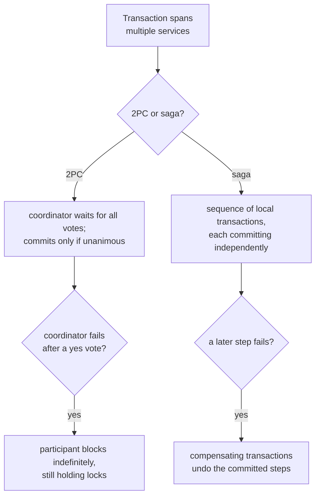

# Lesson 14. Two-Phase Commit and Sagas

**Mission link:** Stage 4 covered what a consensus protocol like Raft costs to keep one agreed history under node failure. **Two-phase commit (2PC)** looks superficially similar, a coordinator, a vote, a decision, but it solves a different problem (committing one transaction atomically across several independent databases or services) and pays a worse price for it. This lesson covers exactly what that price is, and the pattern, **sagas**, that most production systems reach for instead.
**Primary source:** [Article: "Two-phase commit protocol", Wikipedia](https://en.wikipedia.org/wiki/Two-phase_commit_protocol)
**Prerequisites:** [Lesson 9](0009-what-consensus-costs.md), [Lesson 13](0013-conflict-resolution-under-eventual-consistency.md)

## Warm-up

1. ▢ What does last-write-wins do to the write with the earlier timestamp when two writes conflict, and why is this considered discarding rather than resolving the conflict?

Check

It silently drops the earlier write entirely. It's discarding rather than resolving because nothing about the losing write's intent is preserved or merged, it's simply gone, regardless of whether the two writes were genuinely concurrent.

2. ▢ Why does every write in a consensus-based system pay a round trip to a majority of nodes, and what happens to a minority partition as a result?

Check

A write isn't committed until a majority durably records it, guaranteeing it survives even if a minority (including the current leader) later fails. A minority partition loses availability rather than consistency: it can't reach a majority, so it refuses to answer rather than risk an inconsistent commit.

## Know this

### Two-phase commit: a vote, then a decision, across independent participants

**Two-phase commit** coordinates a single transaction across multiple participants (separate databases or services) in two phases. In the **commit-request (voting) phase**, a coordinator asks every participant to prepare the transaction and vote yes (ready to commit) or no (something failed locally). In the **commit phase**, the coordinator commits only if every participant voted yes, and tells everyone to roll back otherwise. A participant that votes yes has to hold its locks and keep the transaction pending until the coordinator's final message arrives, since it's promising it *can* commit, not that it already has.

### The blocking failure mode is 2PC's defining weakness

2PC's documented disadvantage is that it's a **blocking protocol**: once a participant has voted yes, it's committed to waiting for the coordinator's decision, and if the coordinator fails permanently before sending it, that participant blocks indefinitely, still holding its locks, unable to unilaterally decide to commit or abort on its own. It gets worse if the coordinator *and* a participant fail together: a new coordinator can't safely infer what happened, since the failed participant might have already committed before going down, so recovery has to wait for every participant to respond before proceeding at all. This is a meaningfully worse failure mode than consensus's minority-partition behavior (lesson 9): a consensus protocol's minority refuses to answer but the majority keeps making progress; 2PC's remaining participants can be stuck waiting on a single failed coordinator with no majority-based way around it.

### Sagas trade one atomic transaction for a sequence of committed, undoable ones

A **saga** replaces one cross-service atomic transaction with a **sequence of local transactions**, each one committing on its own service and publishing an event to trigger the next. If a local transaction fails partway through, the saga doesn't roll back the way an ACID transaction would; instead it runs **compensating transactions** that explicitly undo what the preceding local transactions already committed. This is a deliberate trade: a saga gives up 2PC's block-until-everyone-agrees atomicity (and its blocking failure mode) in exchange for every step being an ordinary, already-committed local transaction that never holds a lock waiting on another service.

### Two ways to coordinate a saga's steps

A saga's steps can be coordinated by **choreography**, where each local transaction publishes an event and the next service reacts to it, with no central coordinator at all, or by **orchestration**, where a dedicated orchestrator explicitly tells each participant which local transaction to run next. Choreography avoids a single coordinating component but spreads the saga's logic across every participating service's event handlers; orchestration concentrates the saga's logic in one place but reintroduces a coordinator, one that (unlike 2PC's) isn't holding anyone else's locks while it decides.

### What a saga still owes you, and doesn't give for free

Giving up 2PC's atomicity costs more than just needing compensating transactions. A saga also gives up **isolation**: since each local transaction commits independently and immediately, another saga or transaction can observe and act on partially-completed state that a later compensating transaction might still undo, requiring its own deliberate countermeasures rather than relying on ACID's isolation guarantee. And every step in a saga has the same obligation: to be reliable, a service has to atomically update its own database *and* publish the event that triggers the next step, without a distributed transaction spanning the database and the message broker, since that would just reintroduce 2PC at a smaller scale. That specific problem is exactly what the next lesson's pattern solves.

## Practice

1. ▢ A participant in a 2PC transaction votes yes, and the coordinator then fails permanently before sending a commit or rollback message. What happens to that participant?

Hint

Consider what a "yes" vote actually commits the participant to.

Check

It blocks indefinitely, still holding its locks and unable to unilaterally commit or abort, since voting yes was a promise that it can commit, contingent on the coordinator's final decision, which never arrives.

2. ▢ A saga's third local transaction fails after the first two have already committed. What does the saga do, and how does this differ from an ACID transaction's rollback?

Check

The saga runs compensating transactions that explicitly undo what the first two local transactions already committed. This differs from ACID rollback in that nothing is undone automatically; a developer has to have designed a specific compensating transaction for each step, since each step was already a separate, committed local transaction rather than part of one atomic unit.

3. ▢ Why does a saga still risk another transaction observing and acting on data that a later compensating transaction ends up undoing?

Check

Because a saga gives up isolation along with atomicity: each local transaction commits independently and immediately, so its effects are visible to other transactions right away, before the rest of the saga (or a compensating transaction) has run. This requires its own deliberate countermeasures rather than the automatic isolation an ACID transaction provides.

4. ▢ Why can't a service reliably use its own database transaction plus a separate, uncoordinated call to publish a message, when implementing one step of a saga?

Check

Because the database update and the message publish aren't part of the same atomic operation, the service could commit the database change and then fail before publishing (or vice versa), leaving the two out of sync. Reliably doing both atomically without a distributed transaction spanning the database and the message broker is exactly the problem the next lesson's pattern addresses.

5. ▢ Which claim correctly distinguishes 2PC's failure mode from a saga's trade-offs?

    - a) 2PC's minority-partition behavior is identical to a saga's compensating-transaction behavior
    - b) 2PC blocks a participant indefinitely if the coordinator fails after that participant votes yes; a saga avoids this by using a sequence of independently-committed local transactions with compensating transactions for failure, at the cost of giving up atomicity and isolation
    - c) A saga provides the same automatic rollback and isolation guarantees as a 2PC transaction, just spread across more services
    - d) Choreography and orchestration are two names for the same saga-coordination mechanism

Check

**b)** That's the precise trade-off this lesson establishes. (a) is false: 2PC's blocking failure mode and a saga's compensating transactions are different mechanisms solving the failure problem in structurally different ways. (c) is false: a saga explicitly gives up both automatic rollback (replaced by manually-designed compensating transactions) and isolation (requiring its own countermeasures). (d) is false: choreography coordinates via each service reacting to events with no central coordinator, while orchestration uses one dedicated orchestrator directing every participant.

## Real-world reps

- [ ] For a multi-service business transaction you're familiar with (an order that touches inventory, payment, and shipping, for instance), check whether it uses 2PC, a saga, or something else, and if a saga, whether it's choreographed or orchestrated.
- [ ] If it's a saga, find one compensating transaction it defines and confirm it actually undoes what the corresponding local transaction did, rather than just approximating it.
- [ ] Tomorrow: read the primary source's section on the differences between 2PC and three-phase commit, and note what specific failure scenario the extra phase is meant to address.

## Going further

- [Article: "Two-phase commit protocol", Wikipedia](https://en.wikipedia.org/wiki/Two-phase_commit_protocol)
- [Pattern: "Saga", microservices.io](https://microservices.io/patterns/data/saga.html)
- [Resources](../RESOURCES.md)

---

Not landing? Reread the primary source at the top, since this lesson compresses it and compression is where understanding leaks. Check the [glossary](../GLOSSARY.md) for any term that felt slippery.

If the lesson itself is unclear rather than the material, that is a defect: [open an issue](https://github.com/TokenCemetery/teach/issues).
