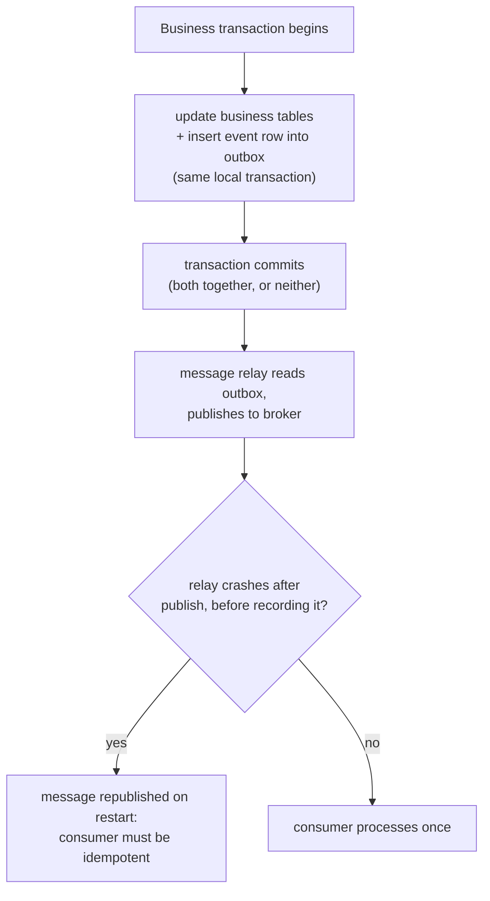

# Lesson 15. The Transactional Outbox and Idempotent Consumers

**Mission link:** Lesson 14 closed on a specific gap every saga step has to solve: a service must atomically update its own database *and* publish the event that triggers the saga's next step, without a distributed transaction spanning both, since that would just reintroduce two-phase commit at a smaller scale. This lesson is the pattern that closes that gap, and the obligation it hands to whoever consumes the event on the other end.
**Primary source:** [Pattern: "Transactional outbox", microservices.io](https://microservices.io/patterns/data/transactional-outbox.html)
**Prerequisites:** [Lesson 14](0014-two-phase-commit-and-sagas.md)

## Warm-up

1. ▢ Why does 2PC's blocking failure mode happen specifically to a participant that already voted yes, rather than to one that voted no?

Check

Voting yes is a promise that the participant *can* commit, so it has to hold its locks and wait for the coordinator's final decision rather than deciding on its own; a participant that voted no has already aborted its own part and isn't waiting on anyone.

2. ▢ What does a saga give up, beyond needing compensating transactions instead of automatic rollback?

Check

Isolation: since each local transaction commits independently and immediately, another transaction can observe and act on partially-completed state before a later compensating transaction has a chance to undo it, requiring its own deliberate countermeasures.

## Know this

### The dual-write problem: two separate systems, one supposed to happen only if the other did

A service that updates its own database and then makes a separate call to publish a message to a broker has two independent operations with no shared atomicity between them. It can commit the database write and then crash before publishing, or publish successfully and then fail to commit the database write, and nothing ties the two together. This is the **dual-write problem**, and it's exactly the gap lesson 14 identified: a distributed transaction spanning a database and a message broker would solve it, but that's 2PC again, with all of 2PC's blocking failure mode, at the scale of every single saga step.

### The outbox pattern turns "publish a message" into "insert a row"

The **transactional outbox pattern** solves this by not calling the message broker directly at all during the business transaction. Instead, the service writes the event as an ordinary row into an **outbox table**, in the exact same local database transaction as the business update it's supposed to accompany. Since it's now just another row in the same transaction, it commits or rolls back atomically with the business data by construction, no distributed transaction required. A separate **message relay** process then reads the outbox table and actually publishes each event to the broker, entirely decoupled from the original request.

### What this buys, precisely

Because the event row and the business update commit together or not at all, this pattern guarantees a message is sent if and only if the database transaction that produced it actually committed, the exact atomicity 2PC would have provided, achieved without 2PC. It also preserves the order events were written in, since the relay reads the outbox in the order rows were committed. Neither guarantee depends on the message broker or the business database coordinating with each other at all; each half only has to be correct on its own.

### The relay's own failure mode is why the consumer still has to be careful

The message relay itself isn't immune to failure: it can publish a message to the broker and then crash before recording that it did so, and on restart, publish that same message again. The pattern's documentation states this plainly rather than treating it as a rare edge case: a message consumer has to be **idempotent**, typically by tracking the IDs of messages it has already processed and ignoring a repeat, because the relay's guarantee is "at least once," not "exactly once." This isn't a special new burden the outbox pattern invents: a message broker can itself redeliver a message more than once for its own reasons, so a consumer usually needed to be idempotent anyway.

## Practice

1. ▢ A service updates its orders table and then makes a direct, separate call to publish an `OrderCreated` event to a message broker. The service crashes after the database commit but before the publish call succeeds. What has gone wrong, and what pattern-level problem does this illustrate?

Hint

Consider what guarantees, if any, tie the database commit and the publish call together.

Check

The order was committed, but the event announcing it was never sent, and nothing detects or corrects this, since the two operations had no shared atomicity. This is the dual-write problem: two independent operations, one of which is supposed to happen only if the other did, with no mechanism enforcing that relationship.

2. ▢ Why does writing an event as a row in an outbox table, inside the same transaction as the business update, avoid needing a distributed transaction across the database and the message broker?

Check

Because the outbox row is just another row in the database's own local transaction, it commits or rolls back atomically with the business update by the database's ordinary transactional guarantees, no coordination with the message broker required at that point. The broker only gets involved later, when the separate message relay reads the already-committed outbox row.

3. ▢ The message relay publishes an event to the broker, then crashes before it can mark that event as sent. On restart, what does it do, and what does this require of the consumer?

Check

It publishes the same event again, since it has no record of having already sent it. This requires the consumer to be idempotent, typically by tracking which message IDs it has already processed and ignoring a duplicate, since the relay's guarantee is at-least-once delivery, not exactly-once.

4. ▢ A developer argues that requiring an idempotent consumer is a drawback unique to the transactional outbox pattern. Is this accurate?

Check

Not entirely: a message broker can itself redeliver a message more than once for reasons unrelated to the outbox pattern, so a consumer typically already needs to be idempotent regardless of whether the outbox pattern is used. The outbox pattern's message relay is simply one more source of the same at-least-once delivery behavior a consumer usually has to handle anyway.

5. ▢ Which claim correctly describes what the transactional outbox pattern guarantees and what it still requires?

    - a) It guarantees exactly-once delivery of every event, so the consumer never needs to handle a duplicate
    - b) It guarantees a message is sent if and only if the database transaction that produced it committed, and preserves event order, but the message relay can still redeliver a message, so the consumer must be idempotent
    - c) It replaces the need for a message broker entirely, since events are stored directly in the outbox table
    - d) It requires a distributed transaction spanning the database and the message broker, the same requirement 2PC has

Check

**b)** That's the precise guarantee and the precise remaining obligation this lesson establishes. (a) is false: the relay's own failure mode means delivery is at-least-once, not exactly-once. (c) is false: the outbox table only holds events until the relay publishes them to the broker; the broker is still the delivery mechanism to consumers. (d) is false: the entire point of the pattern is achieving the atomicity 2PC would provide without using a distributed transaction at all.

## Real-world reps

- [ ] For a service you work on that publishes events after a database write, check whether it uses a transactional outbox, a direct publish call, or change-data-capture on the database log, and what failure mode each exposes.
- [ ] If a consumer you maintain processes messages from a queue or broker, check whether it tracks processed message IDs (or otherwise dedupes) or would double-process a redelivered message.
- [ ] Tomorrow: read the primary source's section on alternative implementations (polling the outbox table versus using change-data-capture on the database's transaction log) and note what each trades off in latency and database load.

## Going further

- [Pattern: "Transactional outbox", microservices.io](https://microservices.io/patterns/data/transactional-outbox.html)
- [Pattern: "Saga", microservices.io](https://microservices.io/patterns/data/saga.html)
- [Resources](../RESOURCES.md)

---

Not landing? Reread the primary source at the top, since this lesson compresses it and compression is where understanding leaks. Check the [glossary](../GLOSSARY.md) for any term that felt slippery.

If the lesson itself is unclear rather than the material, that is a defect: [open an issue](https://github.com/TokenCemetery/teach/issues).
