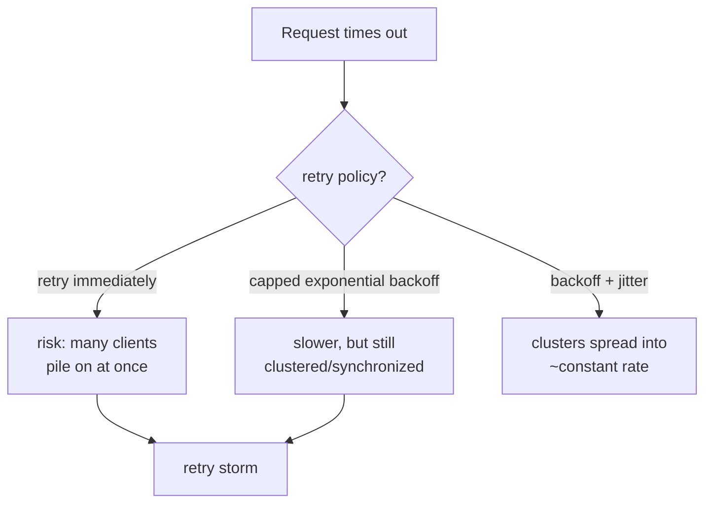

# Lesson 16. Timeouts, Retries, and Backoff

**Mission link:** Lesson 3 established that every practical failure detector is built on a timeout, a guess made under permanent uncertainty. This lesson picks up exactly where that one stopped: a timeout fires, and now something has to decide what to do next. Retrying is the obvious answer, and it's also the specific thing that can make an already-struggling service worse, which is why *how* a retry happens matters as much as whether it happens at all.
**Primary source:** [Article: "Exponential Backoff And Jitter", AWS Architecture Blog](https://aws.amazon.com/blogs/architecture/exponential-backoff-and-jitter/)
**Prerequisites:** [Lesson 3](0003-timeouts-as-failure-detectors.md), [Timeout](../GLOSSARY.md)

## Warm-up

1. ▢ A participant in a 2PC transaction votes yes, and the coordinator then fails permanently before sending a commit or rollback message. What happens to that participant?

Check

It blocks indefinitely, still holding its locks and unable to unilaterally commit or abort, since voting yes was a promise it can commit, contingent on a coordinator decision that never arrives.

2. ▢ Why can't a timeout distinguish a genuinely dead node from one that's merely slow?

Check

A network has no upper bound on message delay, so a response arriving after the chosen timeout window is indistinguishable, from the caller's side, from a response that will never arrive at all; the timeout is a guess about how long is too long, not a fact about what actually happened.

## Know this

### A budget, not a single number: what a timeout actually has to account for

A single request often fans out across several hops, a client calling a service that calls another service that calls a database. A **timeout budget** is the total time the whole chain is allowed to take, divided up across those hops so that each layer's own timeout (and any retries it does) fits inside what's left of the budget by the time it's that layer's turn. Setting every hop's timeout independently, without accounting for the hops before it, means the total worst-case latency can exceed what the caller at the very top was ever willing to wait, even though every individual timeout looked reasonable in isolation.

### Naive retries multiply, they don't just repeat

If every hop in a chain retries independently on its own timeout, one failure at the bottom can multiply into far more attempts than anyone intended: a client retrying 3 times, each of whose attempts triggers a service that itself retries 3 times, produces up to 9 attempts at the next layer down, and the multiplication compounds with every additional hop. This retry amplification is exactly why a retry policy has to be a property of the whole call chain, not a decision made independently at each layer with no awareness of the others.

### Capped exponential backoff slows retries down, but doesn't fix the real problem by itself

**Capped exponential backoff** has clients multiply their wait time by a constant after each failed attempt, up to some maximum, instead of retrying immediately. This does reduce how often clients collectively hammer a struggling service, but it doesn't solve the underlying issue: if many clients all started failing at roughly the same time, backoff alone keeps them roughly synchronized too, so they still retry in **clusters**, bursts of simultaneous attempts spaced further apart, rather than smoothing out into a steady rate.

### Jitter is what actually breaks up the clusters

**Jitter** adds randomness to the sleep duration itself, instead of following a purely deterministic backoff schedule. Spreading each client's exact retry moment out, even by a small random amount, turns those synchronized bursts into an approximately constant rate of calls over time. In AWS's own measurement with 100 contending clients, adding jitter to capped exponential backoff more than halved the total number of retry calls compared to backoff alone, and noticeably improved how long the whole set of clients took to finish, exactly because the retries stopped landing on top of each other.

### A retry storm is what happens when nothing does this

A **retry storm** is the failure mode backoff and jitter exist to prevent: a large number of clients, retrying a failing or recovering service in near-synchronized bursts, can themselves become the reason the service can't recover, since each burst of simultaneous retries adds exactly the kind of load spike a struggling service is least able to absorb. A retry storm isn't a separate mechanism from ordinary retries, it's what unbounded, unjittered, uncoordinated retries turn into at scale.

## Practice

1. ▢ A request chain has a client retrying up to 3 times, calling a service that itself retries up to 3 times on its own downstream call. In the worst case, how many attempts can the downstream dependency see from a single original client request, and what does this illustrate?

Hint

Consider what happens when each layer's retries are multiplied by the layer above it.

Check

Up to 9 attempts (3 client retries, each potentially triggering 3 service-level retries). This illustrates retry amplification: retries decided independently at each layer of a call chain multiply rather than simply add, which is why a retry policy needs to account for the whole chain, not just one hop.

2. ▢ A team implements capped exponential backoff but no jitter. Under a large, simultaneous failure (many clients start failing at once), what problem remains even though each client is now waiting longer between attempts?

Check

The clients remain roughly synchronized with each other, since backoff alone doesn't change their relative timing, so they still retry in clusters, bursts of simultaneous attempts spaced further apart, rather than in a spread-out, steady rate.

3. ▢ What specifically does adding jitter change about a capped-exponential-backoff retry schedule, and what effect did this have in AWS's own measurement?

Check

Jitter adds randomness to the sleep duration itself, so retries that would otherwise land in a synchronized cluster get spread out over time into an approximately constant rate. In AWS's measurement with 100 contending clients, this more than halved the total number of retry calls and improved the time to completion, compared to backoff without jitter.

4. ▢ Is a retry storm a different mechanism from an ordinary retry policy, or a consequence of one?

Check

A consequence, not a different mechanism: a retry storm is what unbounded, unjittered, uncoordinated retries at scale turn into, many clients' bursts of simultaneous retries becoming exactly the load spike a struggling or recovering service can least absorb.

5. ▢ Which claim correctly describes the relationship between backoff, jitter, and retry storms?

    - a) Capped exponential backoff alone is sufficient to prevent synchronized retry clusters
    - b) Capped exponential backoff reduces overall retry frequency but doesn't prevent synchronized clusters by itself; jitter adds randomness to spread those clusters into a steadier rate, and a retry storm is what happens when neither is applied at scale
    - c) A timeout budget is only relevant for a single hop, not a multi-hop call chain
    - d) Retry amplification only occurs when jitter is missing, not when backoff itself is missing

Check

**b)** That's the precise relationship this lesson establishes. (a) is false: backoff alone still leaves synchronized clusters, just spaced further apart. (c) is false: a timeout budget specifically exists to account for multiple hops in a chain, dividing the total allowed time across them. (d) is false: retry amplification (attempts multiplying across layers) is a distinct problem from clustering, caused by uncoordinated retry counts at each layer, independent of whether jitter is used.

## Real-world reps

- [ ] For a service you maintain that calls a downstream dependency, check whether its retry policy uses capped exponential backoff, jitter, both, or neither, and whether the retry count is bounded with awareness of any layers above or below it.
- [ ] If the service is part of a multi-hop call chain, check whether a timeout budget is actually enforced end to end, or whether each hop's timeout was set independently without accounting for the others.
- [ ] Tomorrow: read the primary source in full, and note what the AWS SDKs' own default retry behavior does differently from a naive capped-exponential-backoff-with-jitter implementation.

## Going further

- [Article: "Exponential Backoff And Jitter", AWS Architecture Blog](https://aws.amazon.com/blogs/architecture/exponential-backoff-and-jitter/)
- [Resources](../RESOURCES.md)

---

Not landing? Reread the primary source at the top, since this lesson compresses it and compression is where understanding leaks. Check the [glossary](../GLOSSARY.md) for any term that felt slippery.

If the lesson itself is unclear rather than the material, that is a defect: [open an issue](https://github.com/TokenCemetery/teach/issues).
