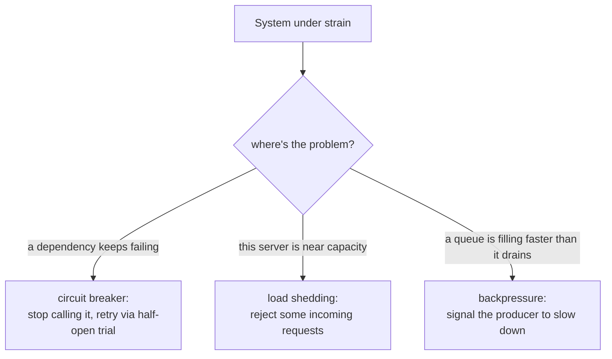

# Lesson 17. Circuit Breakers, Load Shedding, and Backpressure

**Mission link:** Lesson 16 covered how to retry well, spreading retries out instead of piling them on. This lesson covers what to do once retrying isn't the answer at all: a dependency that's genuinely down, a server that's genuinely overloaded, or a queue that's genuinely filling up faster than it drains. Each of these three needs a different response, and reaching for the wrong one doesn't just fail to help, it can make the underlying problem worse.
**Primary source:** [Article: "Circuit Breaker", Martin Fowler](https://martinfowler.com/bliki/CircuitBreaker.html)
**Prerequisites:** [Lesson 16](0016-timeouts-retries-and-backoff.md)

## Warm-up

1. ▢ A team implements capped exponential backoff but no jitter. Under a large, simultaneous failure, what problem remains even though clients wait longer between attempts?

Check

The clients stay roughly synchronized with each other, since backoff alone doesn't change their relative timing, so they still retry in clusters, bursts of simultaneous attempts spaced further apart rather than spread into a steady rate.

2. ▢ What is retry amplification, and why does it make a retry policy a whole-call-chain concern rather than a single-hop one?

Check

It's the multiplying effect of retries decided independently at each layer of a call chain, where a client's retries each trigger a service's own retries, and so on down the chain, producing far more total attempts than any single layer's retry count suggests. This is why a sane retry policy has to account for the whole chain, not just the layer making the decision.

## Know this

### A circuit breaker stops calling a dependency that's already failing

A **circuit breaker** wraps a call to a dependency and tracks its failures. Once failures cross a threshold, the breaker **trips** into an **open** state: every further call fails immediately, without the protected call being attempted at all, for as long as the breaker stays open. This is a deliberate difference from a retry: a retry assumes the call is still worth attempting; an open circuit breaker has decided it currently isn't, and stops wasting the caller's time (and the failing dependency's remaining capacity) on calls likely to fail anyway.

### The half-open state is how a breaker finds out if the problem is over

A tripped breaker doesn't stay open forever without checking. After a reset timeout, it moves to a **half-open** state: the next call is allowed through as a trial. If that trial succeeds, the breaker resets to **closed** (normal operation resumes); if it fails, the breaker reopens and the timeout starts again. This three-state cycle, closed, open, half-open, is what lets a circuit breaker stop hammering a failing dependency while still automatically noticing when it recovers, without a human having to flip it back on.

### Load shedding protects the server, not the caller

**Load shedding** is a server-side decision to deliberately reject some incoming requests, usually the least valuable ones by some policy, once it's already at or near capacity, rather than accepting every request and degrading (or failing) at all of them. Where a circuit breaker protects a *caller* from wasting effort on a dependency that's already failing, load shedding protects the *server itself* from being pushed past the point where it can serve anything reliably. A server that accepts every request under overload risks a worse outcome than a server that sheds some load early: queues grow unbounded, latency climbs for everyone, and the server can collapse entirely instead of degrading gracefully for a subset of callers.

### Backpressure lets a slow consumer say "not yet" instead of drowning

**Backpressure** is a signal a consumer sends back toward a producer to slow down, rather than silently queuing everything the producer sends until memory runs out or requests start timing out anyway. Where load shedding drops some requests to protect the server accepting them, backpressure instead pushes the problem back toward whoever's generating the load, so the producer can slow down, buffer elsewhere, or itself decide what to shed, rather than the consumer being forced to accept an unbounded queue.

### Three mechanisms for three different failure shapes

These three mechanisms aren't interchangeable, because they're not solving the same problem. A circuit breaker answers "is this dependency worth calling right now?" Load shedding answers "can I, the server, safely accept this request at all?" Backpressure answers "should I even let this arrive, or push back on whoever's sending it?" A system under real strain typically needs more than one of these at once, wired to the specific place each failure shape actually occurs, rather than one mechanism doing all three jobs.

## Practice

1. ▢ A circuit breaker trips to open after a dependency starts failing. A caller keeps sending requests anyway. What happens to those requests while the breaker is open, and why is this considered a feature rather than a bug?

Hint

Consider what would happen instead if every call were still attempted against the failing dependency.

Check

They fail immediately, without the protected call being attempted at all. This is deliberate: it stops wasting the caller's time and the already-struggling dependency's remaining capacity on calls likely to fail anyway, rather than piling more load onto something already failing.

2. ▢ A circuit breaker in the open state allows a trial call through and it succeeds. What state does the breaker move to, and what would have happened if the trial had failed instead?

Check

It moves to closed (normal operation resumes). If the trial had failed instead, the breaker would reopen and the reset timeout would start again, keeping it in the open state for another cycle before trying another trial call.

3. ▢ A server under heavy load accepts every incoming request rather than shedding any of them. What risk does this create that load shedding is specifically meant to avoid?

Check

Unbounded queue growth and climbing latency for every caller, potentially leading the server to collapse entirely rather than degrading gracefully for a subset of requests; load shedding avoids this by deliberately rejecting some requests early so the server can keep serving the rest reliably.

4. ▢ A message queue is filling up faster than its consumer can process it. Would a circuit breaker on the consumer's own downstream calls fix this? What mechanism actually addresses it?

Check

No, a circuit breaker addresses a failing dependency the consumer calls, not the rate at which work arrives at the consumer itself. Backpressure is the mechanism that addresses this: the consumer signals back to the producer to slow down, rather than accepting an ever-growing, unbounded queue.

5. ▢ Which claim correctly distinguishes circuit breakers, load shedding, and backpressure?

    - a) All three mechanisms solve the same problem and can be used interchangeably
    - b) A circuit breaker stops calling a dependency that's already failing; load shedding protects an overloaded server by rejecting some incoming requests; backpressure signals a producer to slow down instead of letting a consumer's queue grow unbounded, each aimed at a different failure shape
    - c) Load shedding is a caller-side mechanism that protects a dependency from being called
    - d) A circuit breaker's half-open state permanently disables the circuit until manually reset by an operator

Check

**b)** That's the precise distinction this lesson draws between the three. (a) is false: each answers a different question, about a dependency's health, a server's own capacity, or a queue's growth rate, respectively. (c) is false: load shedding is a server-side decision protecting the server itself, not the caller or a downstream dependency. (d) is false: half-open is an automatic trial state that either resets the breaker to closed or reopens it, with no operator intervention required.

## Real-world reps

- [ ] For a service you maintain or depend on, check whether it uses a circuit breaker around any downstream call, and if so, what its failure threshold and reset timeout are actually configured to.
- [ ] Check whether that same service has any load-shedding policy for its own incoming requests under overload, and what it uses to decide which requests to reject first.
- [ ] Tomorrow: read the primary source in full, and note what Michael Nygard's original "Release It" framing (referenced in the article) adds about cascading failures across multiple systems, beyond the single dependency-call case.

## Going further

- [Article: "Circuit Breaker", Martin Fowler](https://martinfowler.com/bliki/CircuitBreaker.html)
- [Article: "Exponential Backoff And Jitter", AWS Architecture Blog](https://aws.amazon.com/blogs/architecture/exponential-backoff-and-jitter/)
- [Resources](../RESOURCES.md)

---

Not landing? Reread the primary source at the top, since this lesson compresses it and compression is where understanding leaks. Check the [glossary](../GLOSSARY.md) for any term that felt slippery.

If the lesson itself is unclear rather than the material, that is a defect: [open an issue](https://github.com/TokenCemetery/teach/issues).
