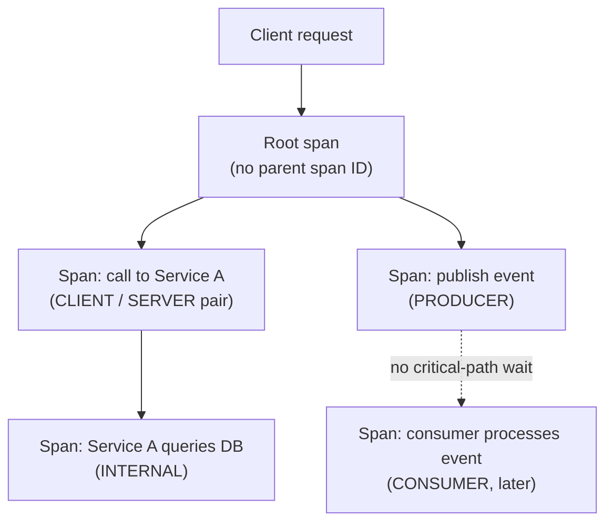

# Lesson 18. Distributed Tracing and Correlation

**Mission link:** Lesson 10 asked you to diagnose an incident by naming the mechanism responsible, timeout, partition, consistency violation, but that lesson could point you straight at the relevant log lines because it already knew which request and which hop mattered. In a real system, a single client request can fan out across a dozen services, and the first problem is just figuring out which one of them was slow or wrong. **Distributed tracing** is the mechanism that answers that, by giving every hop of one logical request a way to be tied back together.
**Primary source:** [Specification: "Trace API", OpenTelemetry](https://github.com/open-telemetry/opentelemetry-specification/blob/main/specification/trace/api.md)
**Prerequisites:** [Lesson 3](0003-timeouts-as-failure-detectors.md), [Lesson 10](0010-diagnosing-a-production-incident.md)

## Warm-up

1. ▢ A circuit breaker trips to open. What happens to further calls to the protected dependency while it stays open, and why is this useful?

Check

Further calls fail immediately without the protected call being attempted at all, which stops wasting the caller's time and the already-struggling dependency's remaining capacity on calls likely to fail anyway.

2. ▢ What is retry amplification, and why does it make a retry policy a whole-call-chain concern?

Check

Retries decided independently at each layer of a call chain multiply rather than add: a client's retries each triggering a service's own retries can produce far more total attempts than any single layer's retry count suggests, which is why a sane policy has to account for the whole chain, not one hop in isolation.

## Know this

### A span is one operation; a trace is the tree they form together

A **span** represents one operation, a single service handling one request, one database call, one step of a saga. Every span carries a **trace ID**, shared by every span that's part of the same logical request no matter how many services it passes through, and its own unique **span ID**. Except for the very first span in the request (the **root span**, which omits it), a span also carries its **parent span ID**, the span that called it. Following parent-span-ID links from any span all the way back to the root reconstructs the entire tree of operations that made up one logical request, a **trace**, across however many services it touched.

### Nothing propagates a trace ID automatically across a network boundary

A trace ID only ties spans together if every hop actually passes it along. Crossing an in-process function call is easy; crossing an HTTP or RPC call to another service means the trace ID (along with the span ID and a few trace flags, together called a **span context**) has to be serialized into the outgoing request and read back out by the receiving service, explicitly, on every single call. The W3C Trace Context standard defines this as a `traceparent` header, and a service has to propagate it deliberately; a service that doesn't forward the header, or a library that doesn't know to read it, breaks the trace into two disconnected pieces with no way to tell they were ever the same request.

### Not every span pair shares the same kind of relationship

A span's **kind** distinguishes what sort of operation it represents: `INTERNAL` for ordinary in-process work, `CLIENT` and `SERVER` for the two sides of a synchronous network call, and `PRODUCER` and `CONSUMER` for the two sides of an asynchronous message. The `CLIENT`/`SERVER` pair models an ordinary request-response latency relationship, the server's span duration is on the critical path the client is waiting on. The `PRODUCER`/`CONSUMER` pair explicitly is not: a producer's span ends the moment a message broker accepts the message, not when a consumer eventually processes it, since (per lesson 9's saga material) nothing about publishing an event to a broker requires anyone to be waiting on the other end. Treating every span relationship as though it were a synchronous call misreads exactly the kind of asynchronous step a saga or an outbox-published event actually is.

### A trace turns "something in this chain was slow" into "this specific hop was slow"

Once a trace ties every span of one request together, its tree structure directly shows which hop took the time, or which hop's error propagated to the ones above it. This is precisely what lesson 10's diagnosis process assumed you already had: knowing which service, which call, in which specific request is the difference between reasoning about "the network" or "consistency" as vague abstractions and actually finding the mechanism responsible for one real incident.

## Practice

1. ▢ Two spans share the same trace ID but were recorded by two different services. What does this tell you about how they relate to each other?

Hint

Consider what a trace ID is shared across, versus what a span ID identifies.

Check

They're both part of the same logical request, the same trace, even though they were recorded by different services; the trace ID is exactly what ties spans together across service boundaries, regardless of which service produced each one.

2. ▢ A request passes through Service A and Service B, but Service A's outgoing call to Service B doesn't forward the `traceparent` header. What happens to the trace?

Check

It breaks into two disconnected pieces: Service A's spans and Service B's spans no longer share a trace ID, so nothing ties them back together as one logical request, even though they actually were one, since propagation across a network boundary has to happen explicitly on every call.

3. ▢ A producer publishes an event to a message broker, and a consumer processes it three seconds later. If both are represented as spans, does the producer's span duration include those three seconds?

Check

No. A `PRODUCER` span ends when the broker accepts the message, not when a consumer eventually processes it; unlike a `CLIENT`/`SERVER` pair, there's no direct critical-path latency relationship between a `PRODUCER` and `CONSUMER` span pair.

4. ▢ Why does lesson 10's incident-diagnosis process depend on tracing (or an equivalent correlation mechanism) actually being in place?

Check

Lesson 10 assumed you already knew which request and which hop mattered before naming the responsible mechanism; without a trace tying a request's spans together across services, you'd first have to figure out which of possibly many services and calls was actually involved, before you could even begin diagnosing what went wrong within it.

5. ▢ Which claim correctly describes how spans, traces, and propagation relate to each other?

    - a) A trace ID is generated fresh by every service a request passes through, and matching span IDs is what ties them together instead
    - b) A trace is the tree of spans sharing one trace ID, reconstructed via parent-span-ID links back to a root span, and this only holds together across services if each one explicitly propagates the span context (like a `traceparent` header) to the next
    - c) A `PRODUCER` span's duration always includes the time until a `CONSUMER` span finishes processing the message
    - d) Propagating a span context across a network boundary happens automatically, without any explicit action by the calling or receiving service

Check

**b)** That's the precise mechanism this lesson establishes. (a) is false: the trace ID is what's shared and preserved across every span in one request; span IDs are each span's own unique identifier. (c) is false: a `PRODUCER` span ends when the broker accepts the message, with no critical-path relationship to the `CONSUMER` span. (d) is false: propagation requires each hop to explicitly serialize and forward the span context, which is exactly why a missing propagation step silently breaks a trace.

## Real-world reps

- [ ] For a multi-service system you have access to, check whether it has distributed tracing set up, and if so, pick one real trace and identify its root span and at least one `CLIENT`/`SERVER` span pair within it.
- [ ] Check whether any asynchronous step in that same system (a queue, an event, a saga step) is represented with `PRODUCER`/`CONSUMER` spans, or whether it's missing from the trace entirely.
- [ ] Tomorrow: read the primary source's section on span links (as opposed to parent-child relationships) and note what problem they solve that a simple parent-span-ID tree can't.

## Going further

- [Specification: "Trace API", OpenTelemetry](https://github.com/open-telemetry/opentelemetry-specification/blob/main/specification/trace/api.md)
- [Specification: "Context Propagation API", OpenTelemetry](https://github.com/open-telemetry/opentelemetry-specification/blob/main/specification/context/api-propagators.md)
- [Resources](../RESOURCES.md)

---

Not landing? Reread the primary source at the top, since this lesson compresses it and compression is where understanding leaks. Check the [glossary](../GLOSSARY.md) for any term that felt slippery.

If the lesson itself is unclear rather than the material, that is a defect: [open an issue](https://github.com/TokenCemetery/teach/issues).
