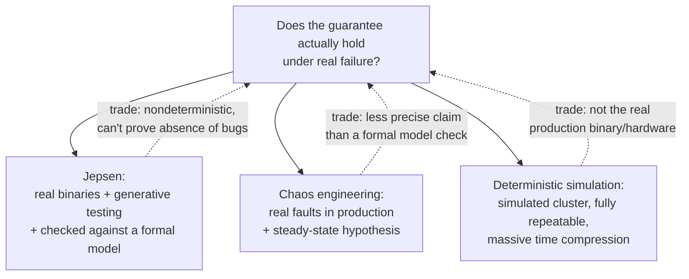

# Lesson 19. Verifying a Claim

**Mission link:** Every stage since lesson 6 has taught a specific guarantee, linearizability, a quorum's overlap, a CRDT's convergence, and a specific mechanism for surviving its absence. None of that is worth anything if the guarantee doesn't actually hold once real failures happen. This lesson is about how to find out whether it does, before an incident (lesson 10) forces the question, and the three genuinely different ways of trying.
**Primary source:** [Article: "Analyses", Jepsen](https://jepsen.io/analyses)
**Prerequisites:** [Lesson 6](0006-sequential-and-eventual-consistency.md), [Lesson 10](0010-diagnosing-a-production-incident.md)

## Warm-up

1. ▢ Two spans share the same trace ID but were recorded by two different services. What does this tell you about how they relate to each other?

Check

They're both part of the same logical request, the same trace, even though they were recorded by different services; the trace ID is exactly what ties spans together across service boundaries.

2. ▢ What does eventual consistency guarantee, and what does it not promise about the interval before convergence?

Check

It guarantees that if no new writes occur, all replicas will eventually converge to the same value. It promises nothing about how long that takes, or what different clients might observe from different replicas in the meantime.

## Know this

### Jepsen: real binaries, real failures, checked against a model

Jepsen's own stated approach is **opaque-box testing**: it runs a system's actual, unmodified binaries on a real cluster, requiring no source access, no formal annotations, no instrumentation of the code under test. It specifically injects the failure modes this workspace has covered, faulty networks, unsynchronized clocks, partial failure, rather than only exercising a healthy cluster. Its verification technique is **generative testing**: construct random operations, apply them to the system under those induced failures, record the concurrent history of what actually happened, then check that history against a formal model of what the system claims to guarantee (linearizable, say, or causally consistent). This is real enough that a bug Jepsen finds is, in its own words, observable in production, not theoretical, but the cost of that realism is that Jepsen's tests are nondeterministic: a run can't be exactly replayed, and Jepsen can find errors but cannot prove their absence.

### Chaos engineering: inject real faults into a live system to build confidence, not to check a model

**Chaos engineering** takes a different angle on the same instinct: instead of comparing a recorded history against a formal model, it experiments directly on a system, often in production itself, by deliberately injecting real faults (Netflix's Chaos Monkey randomly terminates live instances) and observing whether the system holds up under conditions it's expected to survive. Where Jepsen is trying to falsify a specific correctness claim against a model, chaos engineering is closer to a controlled experiment: form a hypothesis about steady-state behavior under a specific kind of turbulence, then actually create that turbulence and see if the hypothesis holds. Both approaches deliberately induce failure rather than waiting for it, but Jepsen is checking a precise claim (does this history violate linearizability), while chaos engineering is checking a broader one (does this system's behavior in production match what we expect it to do under this specific kind of strain).

### Deterministic simulation: give up the real cluster to gain perfect reproducibility

**Deterministic simulation testing** takes the opposite trade from both. Instead of a real, opaque-box cluster with genuinely nondeterministic behavior, a deterministic simulation runs an entire simulated cluster within a single, deterministic process, so the exact same simulated run can be replayed exactly, every time. FoundationDB's own simulation testing is explicit about why this matters: determinism is what makes a failure's root cause something you can actually pin down through controlled, repeatable experiments, rather than something you only saw once and now can't reproduce. It also buys something no real cluster can: massive time compression, representing a large amount of simulated time within a small amount of real execution time, which is how a system can run the equivalent of roughly a trillion CPU-hours of accumulated testing across tens of thousands of simulated failure scenarios every night.

### Same goal, three different trades, and that's why none of them replaces the others

All three exist to answer the same underlying question this whole workspace has been building toward: does the guarantee actually hold once real failure happens? But each one gets there by giving something up. Jepsen keeps the real, unmodified system and a precise formal model, at the cost of nondeterministic, unrepeatable runs. Chaos engineering keeps the real production system and real faults, at the cost of a much less precise claim than "this history violates linearizability." Deterministic simulation keeps perfect reproducibility and enormous testing volume, at the cost of testing a simulated system rather than the actual production binary running on real hardware. Knowing which trade a given test made is what tells you what it actually proved, and what it still couldn't have caught.

## Practice

1. ▢ A Jepsen test finds that a database violates linearizability under a network partition. The team can't reproduce the exact failing run again on a second attempt. Does this mean the bug isn't real?

Hint

Consider what Jepsen's own stated trade-off is between realism and determinism.

Check

No. Jepsen's tests are nondeterministic by design, a trade it makes for opaque-box realism (testing real, unmodified binaries under genuinely random operations and failures). A bug Jepsen found and observed is real and production-observable, even though the exact run that surfaced it may not replay identically on a later attempt.

2. ▢ A team runs Chaos Monkey against their production cluster and it survives an instance termination without customer impact. Has this proven the same thing a Jepsen linearizability check would have?

Check

No. Chaos engineering is checking whether a steady-state hypothesis about production behavior holds under a specific injected fault, a broader, less formally precise claim than "this recorded history is consistent with linearizability." Surviving one instance termination says nothing about whether the system's consistency model actually holds under, say, a network partition or clock skew, the kind of precise claim Jepsen's model-checking targets.

3. ▢ Why can a deterministic simulation run the equivalent of a trillion CPU-hours of testing, in a way that testing against a real cluster couldn't match?

Check

Because the simulation compresses a large amount of simulated time into a small amount of actual execution time, and runs entirely within a single deterministic process rather than needing real, provisioned hardware and real wall-clock time for every scenario; this lets tens of thousands of failure scenarios run every night at a volume a real cluster running in real time never could.

4. ▢ A team argues that since their system passes an extensive deterministic simulation test suite, they no longer need any production-facing chaos testing. What has this argument overlooked?

Check

Deterministic simulation tests a simulated system, not the actual production binary running on real hardware with real operational surroundings; it trades away exactly the opaque-box, real-system realism that chaos engineering (and Jepsen) specifically provide. Passing simulation doesn't establish that the real, deployed system behaves the same way under real production conditions.

5. ▢ Which claim correctly distinguishes Jepsen, chaos engineering, and deterministic simulation testing?

    - a) All three techniques make identical trade-offs and differ only in which company created them
    - b) Jepsen checks a real, opaque-box system's recorded history against a formal model at the cost of nondeterminism; chaos engineering injects real faults into production to test a steady-state hypothesis at the cost of a less formally precise claim; deterministic simulation trades a real system for a fully repeatable, massively time-compressed simulated one
    - c) Deterministic simulation is strictly better than Jepsen and chaos engineering, since it can run more tests per night
    - d) Chaos engineering and Jepsen both require access to the system's source code and formal annotations

Check

**b)** That's the precise, distinct trade each technique makes. (a) is false: the three make genuinely different trade-offs between realism, precision, and reproducibility, not cosmetic differences. (c) is false: more tests per night doesn't substitute for testing the actual production binary under real conditions, which only Jepsen and chaos engineering do. (d) is false: Jepsen's own stated approach is explicitly opaque-box, requiring no source access or formal annotations; chaos engineering likewise operates on a running system rather than requiring source-level instrumentation.

## Real-world reps

- [ ] For a distributed system you operate or depend on, check whether its correctness or resilience has been verified by anything resembling Jepsen-style testing, chaos engineering, deterministic simulation, or none of the three.
- [ ] If it's a database or coordination service, check Jepsen's own published analyses to see whether that specific system (or one like it) has been tested, and what was found.
- [ ] Tomorrow: read the primary source's "Techniques" section in full, and note what a generative test's "model" actually consists of, and how it's built for a given system under test.

## Going further

- [Article: "Analyses", Jepsen](https://jepsen.io/analyses)
- [Article: "Chaos engineering", Wikipedia](https://en.wikipedia.org/wiki/Chaos_engineering)
- [Docs: "Simulation and Testing", FoundationDB](https://apple.github.io/foundationdb/testing.html)
- [Resources](../RESOURCES.md)

---

Not landing? Reread the primary source at the top, since this lesson compresses it and compression is where understanding leaks. Check the [glossary](../GLOSSARY.md) for any term that felt slippery.

If the lesson itself is unclear rather than the material, that is a defect: [open an issue](https://github.com/TokenCemetery/teach/issues).
