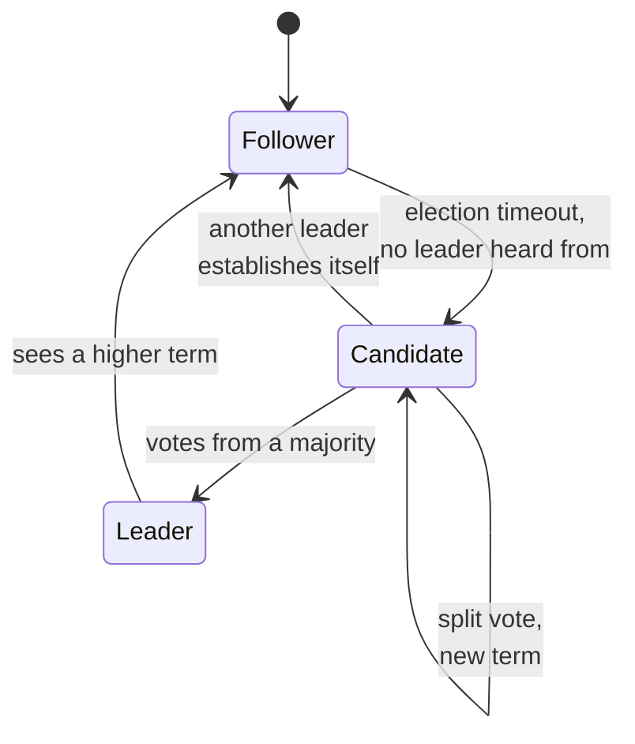

# Consensus: Replicated State Machines and Raft

Stage 4 compressed for lookup. Lessons [7](../lessons/0007-what-consensus-is-for.md), [8](../lessons/0008-raft-leader-election-and-log-replication.md) and [9](../lessons/0009-what-consensus-costs.md) cover the problem, the mechanism and the price; this sheet is the rules and the exact guarantees, for when you are reasoning about a real cluster.

## The problem

A **replicated state machine** is a set of servers each holding an identical copy of some data and applying the same commands in the same order. Consensus is the mechanism that makes them agree on the order, despite crashes, lost messages, and the impossibility of telling a slow server from a dead one.

| Requirement | Strength |
|---|---|
| Safety: never two different values decided for one slot | **Absolute.** Holds under any network behaviour |
| Liveness: new values eventually get decided | **Conditional**, on the network behaving well enough for long enough |

Liveness is conditional because of FLP, covered on [Time and Order](time-and-order.md). No protocol escapes it; protocols choose where to put the assumption instead.

## Raft's five safety properties

The paper states these as holding at all times. Every rule below exists to produce one of them.

| Property | Statement |
|---|---|
| Election Safety | At most one leader can be elected in a given term |
| Leader Append-Only | A leader never overwrites or deletes entries in its log; it only appends |
| Log Matching | If two logs contain an entry with the same index and term, the logs are identical in every entry up through that index |
| Leader Completeness | If an entry is committed in a given term, it is present in the logs of the leaders of all higher terms |
| State Machine Safety | If a server has applied an entry at a given index, no other server will ever apply a different entry at that index |

## States and terms



A **term** is a monotonically increasing number. Every message carries the sender's term, and a server seeing a term higher than its own updates and becomes a follower. That single rule is what dissolves a stale leader: it discovers it is stale the moment it talks to anyone from the newer term.

## Leader election

- A follower that hears nothing from a leader within its election timeout becomes a candidate, increments the term and requests votes.
- A server grants at most one vote per term, first come.
- A **majority of the full cluster** elects. Not unanimity, which is what lets the cluster work with some servers unreachable.
- Election timeouts are randomised, which is how split votes resolve quickly rather than repeating.

### The election restriction, and what "up-to-date" means

A voter denies its vote if its own log is more up-to-date than the candidate's. Comparison is precise:

| Comparison | More up-to-date |
|---|---|
| Last entries have different terms | The log with the later term |
| Last entries have the same term | The longer log |

This is the mechanism behind Leader Completeness. A candidate needs a majority, every committed entry is on a majority, so the two sets intersect: any candidate that can win already holds every committed entry.

## Log replication

The leader appends a client command to its own log and sends `AppendEntries` to followers. An entry is **committed** once the leader knows a majority have stored it. Followers never take commands from clients and never decide order themselves.

### The rule that is easy to miss

**A leader never commits an entry from a previous term by counting replicas.** An old entry sitting on a majority is not thereby committed, and the paper gives a case where such an entry can still be overwritten by a future leader.

Only entries from the leader's **current** term are committed by counting. Once one of those commits, everything before it commits indirectly, by Log Matching. Any implementation or mental model that commits on "it is on a majority now" is wrong in exactly the case that costs data.

## Reads cost a majority too

Lesson 9's "every write pays a majority round trip" is true and incomplete. A **linearizable read** needs two more precautions, because a leader's own state may be stale:

1. **A blank no-op entry committed at the start of each term.** Leader Completeness guarantees a new leader holds every committed entry; it does not tell the leader *which* ones are committed. Committing one entry of its own term is how it finds out.
2. **A heartbeat exchange with a majority before answering.** The leader has to confirm it has not been deposed. A more recent leader may already exist.

The lease alternative avoids that round trip and, in the paper's words, "would rely on timing for safety", assuming bounded clock skew. That is stage 2's problem readmitted into the safety argument deliberately. Know which one a system you depend on has chosen.

## The timing requirement

```text
broadcastTime << electionTimeout << MTBF
```

`broadcastTime` is the average time to send RPCs to the cluster in parallel and get responses; `MTBF` is the average time between failures of a single server. Broadcast should be an order of magnitude below the election timeout, so heartbeats reliably prevent elections. If message exchange takes longer than the typical interval between crashes, no leader survives long enough to make progress, and the cluster does not fail loudly, it simply stops committing.

## What it costs

| Cost | Detail |
|---|---|
| Write latency | At least one round trip to a majority, always, even with nothing failing |
| Read latency | The same, for a linearizable read, unless a lease is used |
| Minority availability | A side without a majority cannot elect a leader and cannot commit. On purpose |
| Cluster sizing | A cluster of `2f + 1` tolerates `f` failures. Five servers tolerate two |
| Even cluster sizes | Buy nothing. Six servers still tolerate two, and add a server to every majority |

The minority losing availability is not a defect being tolerated. Letting the minority elect its own leader is precisely the split brain the majority rule exists to prevent, so CAP's abstract trade-off becomes a mechanical fact: the minority side structurally cannot assemble a quorum.

## Changing the cluster

Switching configurations directly is unsafe, because two overlapping majorities can exist under old and new membership at once. Raft goes through **joint consensus**: a transitional configuration in which entries replicate to servers in both configurations and majorities of both are required, committed as an entry itself before the new configuration takes over. The cluster keeps serving throughout.

## When the cost is worth paying

- A lock service, where two conflicting grants is a correctness failure.
- A configuration store several services must agree on.
- Cluster leadership and failover decisions.
- Anything underneath a linearizable guarantee, since consensus is usually how that guarantee is implemented.

And when it is not: data whose stale or diverging answer is merely inconvenient. Paying a majority round trip per write to protect an invariant nothing depends on is waste rather than safety.

## Sources

- [Paper: "In Search of an Understandable Consensus Algorithm", Ongaro and Ousterhout, 2014](https://raft.github.io/raft.pdf)
- [Site: "The Raft Consensus Algorithm", raft.github.io](https://raft.github.io/)
- [Time and Order](time-and-order.md)
- [Consistency Models](consistency-models.md)
- [Resources](../RESOURCES.md)
