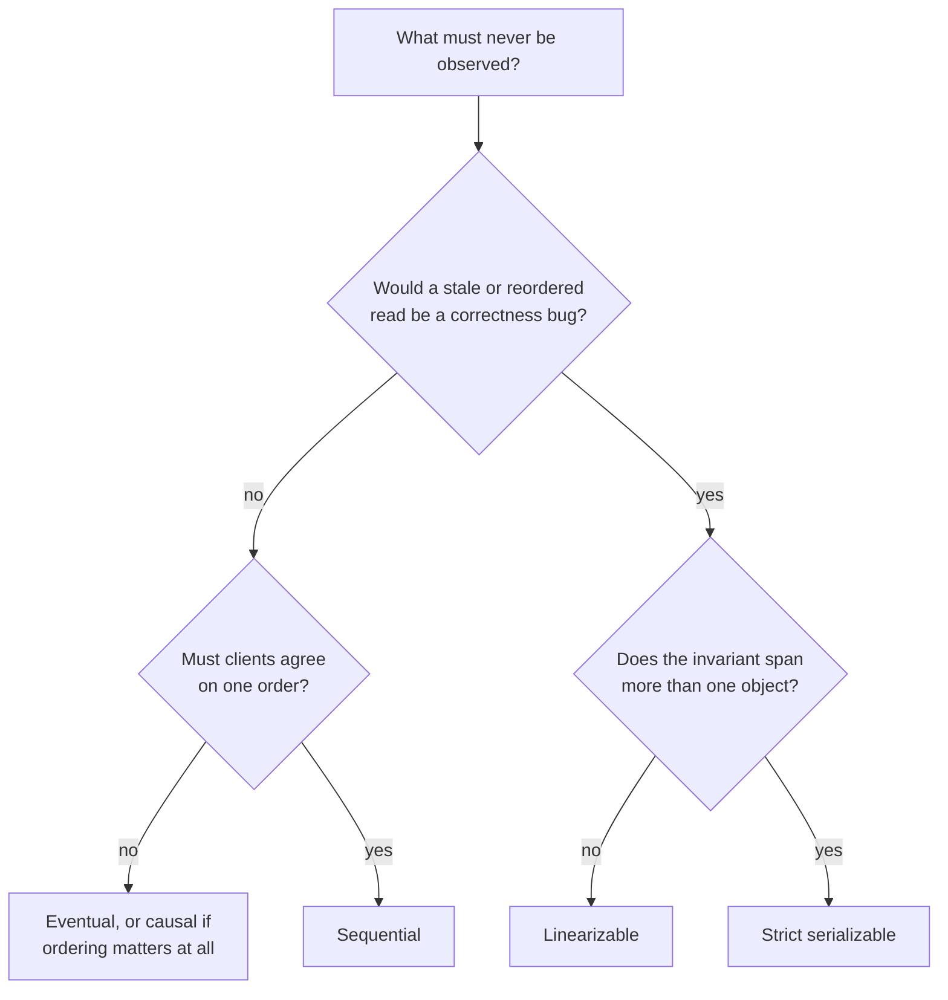

# Consistency Models: CAP, Linearizability, and the Weaker Guarantees

Stage 3 compressed for lookup. Lessons [4](../lessons/0004-the-cap-theorem-precisely.md), [5](../lessons/0005-linearizability.md) and [6](../lessons/0006-sequential-and-eventual-consistency.md) cover why the trade-off exists and how to choose; this sheet is the definitions, for when you are pinning down what a system actually promises.

## CAP, as it was proved

Gilbert and Lynch formalised Brewer's conjecture. Their definitions are narrower than the words suggest.

| Property | What the proof means by it |
|---|---|
| Consistency | Atomic, meaning linearizable, data objects |
| Availability | **Every request received by a non-failing node must result in a response.** The algorithm must terminate |
| Partition tolerance | The network may lose arbitrarily many messages between nodes |

The availability definition is the one worth reading twice. It puts **no bound on how long** a response may take, which makes it weak; and it demands that every request terminate **even under severe network failure**, which makes it strong. It is not a statement about latency and not a statement about uptime.

### The two misreadings

- **"Pick two of three."** Partition tolerance is not a choice. Partial failure is a property of networks, and any system spanning more than one node faces partitions whether or not its designers planned for them. The choice is between C and A, and only during a partition.
- **"The trade-off is always in effect."** It is conditional. With the network behaving, a system can be fully consistent and fully available at once. CAP bites during an actual partition, and only for the requests that partition affects.

### What CAP does not say

Nothing about latency. Nothing about failures other than partitions. Nothing about the models below, since it uses a single binary notion of consistency. PACELC exists precisely because the latency-versus-consistency trade-off persists when nothing is partitioned.

## The models side by side

Availability terms are Jepsen's. **Totally available** means every client on a non-faulty node makes progress. **Sticky available** means the same, provided each client keeps talking to the same server. Neither holds for the strong models.

| Model | Objects | Total order | Real time | During a partition |
|---|---|---|---|---|
| Strict serializable | Multi, transactional | Yes | Yes | Unavailable |
| Linearizable | **Single** | Yes | Yes | Unavailable |
| Serializable | Multi, transactional | Yes | **No** | Unavailable |
| Sequential | Single | Yes | No | Unavailable |
| Causal | Single | No | No | **Sticky available** |
| Eventual | Single | No | No | Totally available |

The column that decides most designs is the last one, and its shape is the point: **dropping real time does not buy availability.** Sequential consistency is genuinely weaker and cheaper than linearizability, and it is still unavailable during a partition, because it still requires everyone to agree on one order. Availability arrives only when the total order goes.

## Linearizability, precisely

Every operation appears to take effect atomically at one instant between invocation and completion, and if A completes before B begins, A precedes B in the single agreed order.

Formally, three constraints:

| Constraint | Meaning |
|---|---|
| SingleOrder | There is some total order of operations |
| RealTime | That order respects the real-time bound between operations |
| RVal | Each operation obeys the single-threaded semantics of its datatype |

**It is a single-object model**, and the scope of "an object" varies by system: one key, or a table, or several tables, but usually not across whatever boundary the implementation drew. A system described as "linearizable" has not thereby promised anything about two objects together. When you need that, the model is strict serializability, which is serializability's multi-object total order plus linearizability's real-time constraint. Equivalently, a strict serializable database is a linearizable object whose state is the whole database.

## Sequential consistency, precisely

Lamport's definition: the result of any execution is the same as if the operations of all the processors were executed in some sequential order, and each processor's operations appear in that sequence in the order its program specified.

Same three constraints as linearizability with RealTime replaced by PRAM: each process's own operations keep their order, and the global order need not match wall-clock time.

What that buys and costs a programmer:

- A process may read **arbitrarily stale** state, far behind another process.
- Once process A has observed an operation from process B, A can never observe a state prior to it. There is no going backwards.
- Everyone still agrees on one order, so no two clients see contradictory sequences.

## The trap in serializability

Serializability sounds stronger than sequential consistency and is not comparable in the way people assume. It imposes **no real-time constraint and no per-process constraint at all**:

- If process A completes a write and process B then begins a read, B is not guaranteed to see the write.
- A process can observe a write and then fail to observe that same write in a later transaction.
- A process can fail to observe **its own** prior write.

None of that violates serializability. If those behaviours would be bugs in your application, the model you need is strict serializable, and saying "we use a serializable database" has not ruled them out.

## Causal, and the limit of always-available

Causal consistency keeps the orderings that matter, so nobody sees an answer before the question, while allowing two clients to see independent events in different orders. It is **sticky available**: clients keep making progress through a partition as long as each stays on one server.

A slightly stronger variant, Real-Time Causal, is proven to be the strongest consistency model achievable in an always-available, one-way convergent system. That is the ceiling. Anything stronger gives up availability during a partition, which is CAP restated as a statement about models rather than about systems.

## Choosing

The question is never "which model is strongest". It is what this particular data must never let a client observe. A distributed lock or a balance immediately after a debit needs real-time ordering; a rough dashboard counter does not, and paying for coordination there is waste.

## Before claiming a system is consistent

- Name the model, not the word. "Consistent" without a model name says nothing.
- Say what an object is, if the claim is linearizability, because the guarantee stops at that boundary.
- Check whether the invariant spans objects. If it does, linearizability is not the model you need.
- Decide what should happen to the affected requests during a partition, because the model has already decided and it may not be what you wanted.
- If the answer is "stay available", accept that no total order survives, and design for clients that read stale and possibly divergent state.
- If a serializable database is the plan, confirm the application tolerates a process not seeing its own earlier write.

## Sources

- [Paper: "Brewer's Conjecture and the Feasibility of Consistent, Available, Partition-Tolerant Web Services", Gilbert and Lynch, 2002](https://www.comp.nus.edu.sg/~gilbert/pubs/BrewersConjecture-SigAct.pdf)
- [Article: "CAP Twelve Years Later: How the 'Rules' Have Changed", Eric Brewer, InfoQ](https://www.infoq.com/articles/cap-twelve-years-later-how-the-rules-have-changed/)
- [Paper: "Linearizability: A Correctness Condition for Concurrent Objects", Herlihy and Wing, 1990](https://cs.brown.edu/~mph/HerlihyW90/p463-herlihy.pdf)
- [Paper: "How to Make a Multiprocessor Computer That Correctly Executes Multiprocess Programs", Leslie Lamport, 1979](https://lamport.azurewebsites.net/pubs/multi.pdf)
- [Site: "Consistency Models", Jepsen](https://jepsen.io/consistency)
- [Time and Order](time-and-order.md)
- [Resources](../RESOURCES.md)
