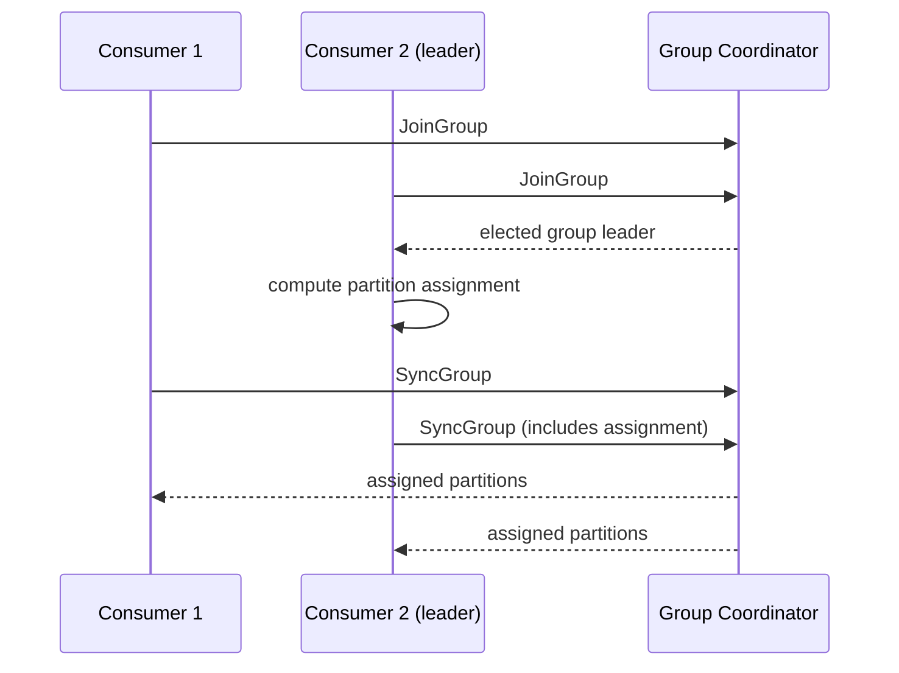

# Lesson 2. Consumer Group Coordination

**Mission link:** Stage 2 opens consumer groups and rebalancing: lesson 1 established that only one consumer in a group reads a given partition at a time; this lesson is the actual mechanism that enforces and maintains that rule as consumers join, leave, and fail.
**Primary source:** [Docs, Apache Kafka](https://kafka.apache.org/documentation/)
**Prerequisites:** [Lesson 1](0001-partitions-and-the-log.md), [Partition](../GLOSSARY.md)

## Warm-up

1. ▢ What is Kafka's ordering guarantee, and at what scope does it apply?

Check

Kafka guarantees message order only within a single partition; it does not guarantee any order between messages in different partitions of the same topic.

2. ▢ A topic has 4 partitions. What determines the maximum number of consumer instances in one consumer group that can be actively processing it in parallel?

Check

The partition count: at most 4, since only one consumer instance in a group reads a given partition at a time; a 5th instance in the same group would sit idle.

## Know this

### One broker tracks the group; one consumer computes the assignment

A **consumer group** is a set of consumer instances sharing a group ID, jointly consuming a topic so that each partition is assigned to exactly one member at a time. One broker in the cluster acts as that group's **group coordinator**, tracking which consumers are currently members and driving the process that assigns partitions to them. The coordinator itself doesn't decide the assignment: when the group needs to reassign partitions, one member is designated the **group leader**, and that consumer computes the actual assignment using whichever strategy is configured (range, round-robin, sticky, and others), which the coordinator then distributes back to every member.

### Heartbeats decide who's still in the group

Each consumer periodically sends a heartbeat to the group coordinator to signal it's still alive. If a consumer's heartbeats stop arriving for longer than `session.timeout.ms`, the coordinator considers that consumer dead, whether it crashed, got stuck, or simply lost its connection, and triggers a **rebalance**: the partitions that dead consumer was reading get reassigned among the remaining members. This is exactly how the rest of the group finds out a member is gone, without needing an explicit shutdown signal from it.

### Rejoining and reassignment

When a rebalance is triggered (a consumer joining, leaving, or being declared dead), members send a JoinGroup request to the coordinator. The elected group leader computes a fresh assignment, and every member receives its portion back through a SyncGroup response. Coordination lives entirely in this join/sync exchange between consumers and the coordinator; no consumer needs to know about any other member's identity beyond what the coordinator and leader tell it.

### Committed offsets track progress independently of who's consuming

A group's progress through each partition is tracked as a **committed offset**, typically stored in Kafka's internal `__consumer_offsets` topic, recording the last message position that group has successfully processed for that partition. This is what lets a restarted consumer, or a partition reassigned to a different member after a rebalance, pick up exactly where the group left off, rather than restarting from the beginning or losing track of progress entirely. The offset belongs to the group and the partition, not to any specific consumer instance, which is precisely what makes reassignment during a rebalance work without losing the group's place.

## Practice

1. ▢ What role does the group coordinator play, and what specifically triggers it to consider a consumer dead and start a rebalance?

Check

The group coordinator (one broker) tracks group membership and drives partition assignment for the group. It considers a consumer dead, triggering a rebalance, once that consumer's heartbeats stop arriving for longer than `session.timeout.ms`.

2. ▢ Distinguish the group coordinator from the group leader. Which one actually computes the partition assignment?

Check

The group coordinator is a broker that tracks membership and orchestrates the join/sync process. The group leader is a consumer, elected from among the group's members, and it's the leader that actually computes the partition assignment, using whichever strategy is configured; the coordinator distributes that computed assignment back to the group.

3. ▢ Why does Kafka track a committed offset per partition per group, rather than relying on some other mechanism like per-message acknowledgment?

Hint

Consider what happens to a partition's assignment after a rebalance.

Check

A committed offset belongs to the group and the partition, not to any one consumer instance, so when a partition gets reassigned to a different member during a rebalance, or a consumer restarts, the group's progress is still known and picked up from exactly where it left off. Tracking acknowledgment per message per consumer instance instead would lose that continuity the moment a partition moved to a different consumer.

4. ▢ A consumer instance crashes without a clean shutdown. How does the rest of the group find out it's gone, and what setting controls how quickly that happens?

Check

The crashed consumer stops sending heartbeats to the group coordinator. Once its heartbeats have been missing for longer than `session.timeout.ms`, the coordinator considers it dead and triggers a rebalance to reassign its partitions among the remaining members; `session.timeout.ms` is what controls how quickly that detection happens.

5. ▢ Which claim is true of consumer group coordination?

    - a) The group coordinator itself computes the partition assignment for every rebalance
    - b) One broker (the coordinator) tracks membership and orchestrates rebalances, while an elected consumer (the leader) computes the actual assignment
    - c) A consumer's committed offset is tied to that specific consumer instance and is lost if the partition is reassigned
    - d) Heartbeats are only used at startup, not to detect a consumer that later crashes

Check

**b)** That division of labor, coordinator versus leader, is exactly how the mechanism works. (a) is false: the leader, a consumer, computes the assignment; the coordinator distributes it. (c) is false: the committed offset belongs to the group and partition, which is what lets reassignment preserve progress. (d) is false: ongoing heartbeats are exactly what detects a consumer that crashes after joining, not just at startup.

## Real-world reps

- [ ] On a Kafka cluster you can access, run a consumer group describe command and identify the current group coordinator and each partition's assigned consumer.
- [ ] Check what `session.timeout.ms` is currently set to for a consumer group you have access to, and what that implies for how quickly a crashed consumer's partitions get reassigned.
- [ ] Tomorrow: stop a consumer instance in a running group (without a clean shutdown) and observe how long it takes for the group to detect it and reassign its partitions.

## Going further

- [Docs, Apache Kafka](https://kafka.apache.org/documentation/)
- [Article: "Incremental Cooperative Rebalancing in Apache Kafka", Confluent](https://www.confluent.io/blog/incremental-cooperative-rebalancing-in-kafka/)
- [Resources](../RESOURCES.md)

---

Not landing? Reread the primary source at the top, since this lesson compresses it and compression is where understanding leaks. Check the [glossary](../GLOSSARY.md) for any term that felt slippery.

If the lesson itself is unclear rather than the material, that is a defect: [open an issue](https://github.com/TokenCemetery/teach/issues).
