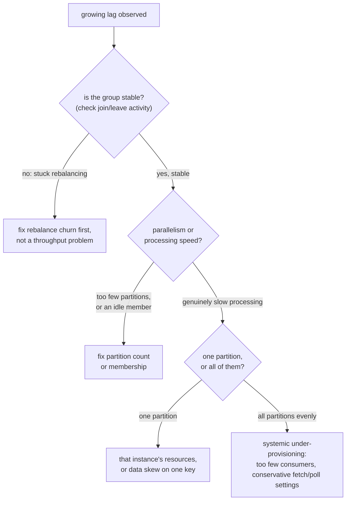

# Lesson 3. Cooperative Rebalancing and Diagnosing Consumer Lag

**Mission link:** This is stage 2's capstone: lesson 2 gave rebalancing its mechanism; this lesson is what goes wrong when it happens too often, and how to tell a rebalancing problem apart from a genuine consumer-lag problem before touching a setting.
**Primary source:** [Article: "Incremental Cooperative Rebalancing in Apache Kafka", Confluent](https://www.confluent.io/blog/incremental-cooperative-rebalancing-in-kafka/)
**Prerequisites:** [Lesson 2](0002-consumer-group-coordination.md), [Partition](../GLOSSARY.md)

## Warm-up

1. ▢ Distinguish the group coordinator from the group leader. Which one computes the partition assignment?

Check

The group coordinator is a broker that tracks membership and orchestrates the join/sync process. The group leader is a consumer, elected from the group, and it's the leader that computes the actual partition assignment.

2. ▢ What triggers a rebalance when a consumer crashes without a clean shutdown?

Check

Its heartbeats stop arriving at the group coordinator; once they've been missing longer than `session.timeout.ms`, the coordinator considers it dead and triggers a rebalance to reassign its partitions.

## Know this

### The original protocol stops the whole group, not just the affected member

Kafka's original ("eager") rebalance protocol is **stop-the-world**: when a rebalance is triggered, every consumer in the group revokes all of its currently assigned partitions first, waits through a fresh join/sync round, and only then receives a new assignment, even for partitions that end up going right back to the same consumer that already had them. This means the entire group stops consuming for the rebalance's duration, not merely the member that joined, left, or failed. Under frequent membership churn, a rolling deployment restarting instances one at a time, or a flaky consumer bouncing in and out, this produces a **rebalancing storm**: repeated stop-the-world pauses, each one halting the whole group's consumption, sometimes cascading if one rebalance's own timing triggers another before the group ever settles.

### Cooperative rebalancing narrows the blast radius

**Cooperative (incremental) rebalancing** only revokes the specific partitions that actually need to move to a different consumer, letting every other consumer keep processing its still-assigned partitions throughout the rebalance. It does this across two rounds instead of eager rebalancing's single round trip: the first round determines which partitions must actually move, and the second reassigns only those. The trade is a bit more protocol complexity in exchange for shrinking a rebalance's disruption from "the whole group stops" to "only the partitions changing hands pause," which is exactly what prevents ordinary membership churn from becoming a storm.

### Consumer lag: what it measures

**Consumer lag** is the gap between a partition's latest produced offset (its log-end-offset) and a consumer group's committed offset for that partition, how many messages are sitting produced but not yet consumed. It's visible directly from a consumer-group describe command (`CURRENT-OFFSET` versus `LOG-END-OFFSET`, with `LAG` computed as their difference) or through metrics like `records-lag-max`. A stable lag that isn't growing means the group is keeping pace with production, even if it never reaches zero; a lag that keeps growing over time means the group is falling behind.

### A diagnostic order, not a single check

Growing lag has more than one possible cause, and checking in order avoids fixing the wrong thing:

1. **Is the group even stable?** A group stuck in repeated rebalances can't make consumption progress during each pause, which shows up as lag even though nothing is wrong with processing speed itself. Check for frequent join and leave activity (in broker logs or the consumer group's state) before assuming lag is a throughput problem at all.
2. **If the group is stable, is the bottleneck parallelism or processing speed?** Too few partitions for the actual throughput needed, or a consumer instance that's technically a member but not actually pulling messages, looks like lag from an entirely different cause than genuinely slow per-message processing (a slow downstream write per message, for instance).
3. **If it's specifically slow processing, is it one partition or all of them?** Lag concentrated on one partition or consumer points at that instance's own resource constraints, or uneven data skew across keys landing disproportionately on one partition. Lag spread evenly across every partition points at systemic under-provisioning: not enough consumer instances for the group as a whole, or fetch and poll settings tuned too conservatively across the board.

## Practice

1. ▢ Describe the "stop-the-world" behavior of the original eager rebalance protocol, and explain why it causes a rebalancing storm under frequent membership churn, such as a rolling deployment.

Check

Every consumer in the group revokes all its assigned partitions and waits through a fresh join/sync round before receiving any new assignment, even for partitions it ends up keeping. Under frequent churn, each consumer joining or leaving (as a rolling deployment restarts instances one at a time) triggers this entire stop-the-world cycle again, so the group repeatedly halts consumption in cascading pauses rather than settling.

2. ▢ How does cooperative rebalancing narrow that disruption, and what does it trade in exchange?

Check

It revokes only the specific partitions that actually need to move to a different consumer, letting every other consumer keep processing its unaffected partitions throughout the rebalance. It trades a bit more protocol complexity, splitting the process into two rounds (determining what moves, then reassigning only that) instead of eager rebalancing's single round trip.

3. ▢ A partition shows `CURRENT-OFFSET = 8000` and `LOG-END-OFFSET = 8500`. What is the lag, and what does it mean if this number keeps growing over time versus staying roughly the same?

Hint

Lag is the difference between the two offsets; growth over time is what actually signals a problem.

Check

Lag is `8500 − 8000 = 500` messages. A lag that stays roughly the same over time means the group is keeping pace with production, even without reaching zero. A lag that keeps growing means the group is genuinely falling behind and something needs attention.

4. ▢ A consumer group shows steadily growing lag on every partition roughly equally. Is this more likely a rebalance-storm problem, an uneven-skew problem, or a systemic under-provisioning problem, and why?

Check

Systemic under-provisioning. A rebalance storm would show up as repeated join/leave activity and stalled progress across pauses, not steadily growing lag; uneven skew would concentrate lag on specific partitions rather than spreading it evenly. Lag growing roughly equally everywhere points at the group as a whole not having enough consuming capacity or throughput for the incoming rate, not a localized cause.

5. ▢ Which claim is true of diagnosing consumer lag?

    - a) Growing lag always means the consumers' processing logic is too slow
    - b) Whether the group is stable (not stuck rebalancing) should be checked before assuming lag reflects a processing-speed problem
    - c) Cooperative rebalancing eliminates the need to ever check for rebalance-related disruption
    - d) Lag concentrated on a single partition and lag spread evenly across all partitions point at the same underlying cause

Check

**b)** A group stuck rebalancing can show lag-like symptoms with nothing wrong with processing speed at all, which is why group stability is the first check. (a) is false: a rebalance storm or insufficient parallelism can produce the same symptom without processing logic being slow at all. (c) is false: cooperative rebalancing narrows disruption, it doesn't eliminate rebalances or the need to check for them. (d) is false: concentrated lag points at a localized cause (one instance's resources, or skew), while even lag points at a systemic one.

## Real-world reps

- [ ] On a Kafka cluster you can access, run a consumer group describe command and record the `CURRENT-OFFSET`, `LOG-END-OFFSET`, and `LAG` for each partition in a group.
- [ ] Check whether that group is configured for cooperative or eager rebalancing, and if eager, consider what a rolling deployment against it would look like.
- [ ] Tomorrow: if you observe any lag, walk this lesson's diagnostic order (group stability, then parallelism vs. processing speed, then concentrated vs. even) to find where it actually comes from.

## Going further

- [Article: "Incremental Cooperative Rebalancing in Apache Kafka", Confluent](https://www.confluent.io/blog/incremental-cooperative-rebalancing-in-kafka/)
- [Docs, Apache Kafka](https://kafka.apache.org/documentation/)
- [Resources](../RESOURCES.md)

---

Not landing? Reread the primary source at the top, since this lesson compresses it and compression is where understanding leaks. Check the [glossary](../GLOSSARY.md) for any term that felt slippery.

If the lesson itself is unclear rather than the material, that is a defect: [open an issue](https://github.com/TokenCemetery/teach/issues).
