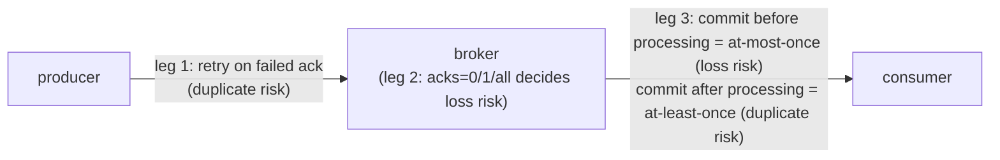

# Lesson 4. At-Most-Once, At-Least-Once, and Exactly-Once

**Mission link:** Stage 3 opens delivery guarantees: "own the log" means being able to state precisely which of these three semantics a system actually has, not assume the strongest one by default, and this lesson names where each is won or lost.
**Primary source:** [Docs: "Message Delivery Semantics", Apache Kafka](https://kafka.apache.org/documentation/#semantics)
**Prerequisites:** [Lesson 3](0003-cooperative-rebalancing-and-lag.md), [Partition](../GLOSSARY.md)

## Warm-up

1. ▢ How does cooperative rebalancing narrow a rebalance's disruption compared to the original eager protocol?

Check

It revokes only the specific partitions that actually need to move to a different consumer, letting every other consumer keep processing its unaffected partitions, rather than every member revoking everything and waiting through a fresh join/sync round.

2. ▢ What does consumer lag measure?

Check

The gap between a partition's latest produced offset and a consumer group's committed offset for that partition, how many messages have been produced but not yet consumed.

## Know this

### Three legs of the path, each capable of losing or duplicating a message independently

A delivery guarantee has to be stated precisely, because loss and duplication can each happen at three separate points, and a guarantee that covers one leg says nothing about the others:

- **Producer to broker**: does the producer retry a send whose acknowledgment failed or never arrived, risking a duplicate if the original send actually succeeded, or does it not retry, risking loss if the send actually failed?
- **The broker's own durability**: does the broker acknowledge a produced message before or after it's been replicated to enough other brokers, which decides whether a leader crash right after acking can still lose the message?
- **Consumer to processing**: does the consumer commit its offset before or after actually processing the message, which decides what happens to that message if the consumer crashes in between?

### At-most-once: commit before processing

**At-most-once** means a message may be lost, but is never processed more than once. On the consumer side, this comes from committing the offset **before** processing the message. If the consumer crashes after committing but before finishing the work, the message is never reprocessed on restart: the group's recorded progress already moved past it, so it's simply skipped, lost from the consumer's perspective even though it was correctly delivered.

### At-least-once: commit after processing

**At-least-once** means a message is never lost, but may be processed more than once. This comes from committing the offset **after** processing the message. If the consumer crashes after finishing the work but before committing, the message gets redelivered and reprocessed on restart, since the group's recorded progress never advanced past it, producing a duplicate.

### Exactly-once needs more than reordering the commit

Simply choosing between "commit first" and "commit after" only trades one failure mode for the other; neither ordering eliminates both loss and duplication at once. **Exactly-once** semantics, a message processed exactly one time with neither loss nor duplication, requires additional coordination beyond commit ordering: the idempotent producer and transaction mechanisms lesson 5 covers, which are what actually close the gap that reordering alone can't.

### `acks`: the producer's lever over broker-side durability

The `acks` setting governs the second leg, the broker's own durability, independently of anything on the consumer side. `acks=0` means the producer doesn't wait for any acknowledgment at all: fastest, but any broker-side failure loses the message with the producer never even aware. `acks=1` means the producer waits for the partition leader's acknowledgment: safe against the message never reaching a broker, but if that leader crashes before followers replicate it, the message can still be lost even though the producer received a successful ack. `acks=all` (or `-1`) means the producer waits for every in-sync replica to acknowledge: the message survives a leader failure, since it's already replicated before the producer is told it succeeded, at the cost of higher produce latency, waiting on the slowest in-sync replica rather than just the leader.

## Practice

1. ▢ Describe how committing the offset before processing versus after processing produces at-most-once versus at-least-once semantics, and what specifically happens on a crash in each case.

Check

Committing before processing gives at-most-once: if the consumer crashes after committing but before finishing the work, the message is never reprocessed, since the group's recorded progress already moved past it, so it's lost. Committing after processing gives at-least-once: if the consumer crashes after finishing the work but before committing, the message gets redelivered and reprocessed on restart, producing a duplicate.

2. ▢ Why isn't simply reordering commit-before-versus-after-processing sufficient to achieve exactly-once semantics?

Check

Each ordering only eliminates one failure mode at the cost of risking the other: commit-before risks loss, commit-after risks duplication. Neither ordering alone eliminates both simultaneously; achieving that requires additional coordination beyond commit ordering, the idempotent producer and transaction mechanisms lesson 5 covers.

3. ▢ Contrast `acks=0`, `acks=1`, and `acks=all`. Which failure mode does each protect against, and what does the strongest option cost?

Check

`acks=0` protects against nothing on the broker side; a failure there loses the message with the producer never knowing. `acks=1` protects against the message never reaching a broker at all, but a leader crash before replication can still lose it despite a successful ack. `acks=all` protects against a leader crash too, since the message is replicated to every in-sync replica before being acknowledged, at the cost of higher produce latency, waiting on the slowest in-sync replica.

4. ▢ A team using `acks=1` observes an occasional lost message, specifically correlated with leader-broker crashes rather than producer crashes. What's the likely fix from the `acks` setting alone?

Hint

Consider which `acks` value protects specifically against a leader crashing right after acknowledging.

Check

Switching to `acks=all` (`-1`), so the producer only receives a successful acknowledgment after the message has been replicated to every in-sync replica, meaning a subsequent leader crash no longer loses a message that was already acknowledged, at the cost of the added latency of waiting for that replication.

5. ▢ Which claim is true of at-most-once, at-least-once, and exactly-once delivery semantics?

    - a) At-least-once guarantees no duplicates, only that no message is lost
    - b) A delivery guarantee has to be stated across producer-to-broker, broker durability, and consumer-to-processing legs, since loss or duplication can occur independently at each one
    - c) Exactly-once is achieved simply by committing the consumer offset after processing rather than before
    - d) The acks setting has no effect on whether a message can be lost after the producer receives a successful acknowledgment

Check

**b)** That's exactly why a bare claim like "we use at-least-once" isn't complete without specifying which leg it applies to. (a) is false: at-least-once explicitly allows duplicates, trading that risk for no loss. (c) is false: that ordering alone produces at-least-once, not exactly-once, which needs additional coordination. (d) is false: `acks=1` versus `acks=all` directly determines whether a leader crash after acknowledgment can still lose the message.

## Real-world reps

- [ ] For a producer you use or plan to use, check its current `acks` setting and decide whether it matches the durability the workload actually needs.
- [ ] For a consumer you use or plan to use, check whether it commits offsets before or after processing, and name which delivery semantics that ordering produces.
- [ ] Tomorrow: read the primary source's section on exactly-once in full, and note what mechanism it names as necessary beyond commit ordering, before reading lesson 5's derivation of it.

## Going further

- [Docs: "Message Delivery Semantics", Apache Kafka](https://kafka.apache.org/documentation/#semantics)
- [Article: "Exactly-once Semantics is Possible: Here's How Kafka Does it", Gustafson and Mehta, Confluent](https://www.confluent.io/blog/exactly-once-semantics-are-possible-heres-how-apache-kafka-does-it/)
- [Resources](../RESOURCES.md)

---

Not landing? Reread the primary source at the top, since this lesson compresses it and compression is where understanding leaks. Check the [glossary](../GLOSSARY.md) for any term that felt slippery.

If the lesson itself is unclear rather than the material, that is a defect: [open an issue](https://github.com/TokenCemetery/teach/issues).
