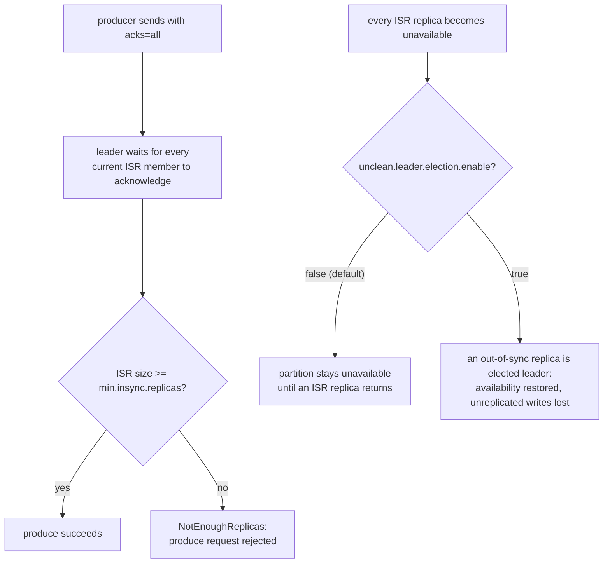

# Lesson 11. Replication, ISR, acks, and Unclean Leader Election

**Mission link:** This is stage 6's capstone. Lesson 10 named how long data lives; this lesson names the durability configuration a defended layout has to state explicitly, the setting that decides whether an acknowledged write can actually survive a broker failure, which lessons 4 and 5 already used in passing without giving it a home of its own.
**Primary source:** [Docs: "Topic Configs", Apache Kafka](https://kafka.apache.org/documentation/#topicconfigs)
**Prerequisites:** [Lesson 10](0010-retention-and-log-compaction.md), [Partition](../GLOSSARY.md)

## Warm-up

1. ▢ What's the practical difference between a message aging past `retention.ms` under `cleanup.policy=delete` and a key's older value disappearing under `cleanup.policy=compact`?

Check

`delete` removes whole segments once every message in them is older than `retention.ms`, a time-bounded, full-history model. `compact` retains only the latest value per key regardless of age, via a periodic log cleaner, a materialized-state model rather than a time window.

2. ▢ Why doesn't a message get deleted the instant it individually crosses `retention.ms`?

Check

Kafka deletes at the granularity of a whole segment, not one message at a time; a message can survive somewhat past its own age cutoff if the segment it's stored in also holds other messages that haven't yet all aged past retention.

## Know this

### Replication factor and the in-sync replica (ISR) set

Each partition has a **replication factor** of N, one **leader** replica handling all reads and writes plus N-1 **follower** replicas copying its log. The **in-sync replica set (ISR)** is the subset of a partition's replicas, leader included, that have replicated recently enough to be considered caught up (governed by `replica.lag.time.max.ms`); a follower that falls behind, a slow disk, a network blip, gets removed from the ISR until it catches back up, and only ISR members are eligible to become the next leader without losing data.

### `acks=all` waits for the current ISR, not the full replication factor

`acks=all` (or `-1`) means the producer waits for every member of the **current ISR** to acknowledge a write before it's reported successful, which is a subtly different promise than "every replica the topic was configured with": if the ISR has already shrunk to 2 out of a replication factor of 3 (one follower fell behind), `acks=all` only waits for those 2, not the original 3. This isn't a bug; it's what lets the partition keep accepting writes while temporarily down a replica, but it does mean "acks=all" alone doesn't say anything about how many replicas are actually still in sync at any given moment.

### `min.insync.replicas`: the floor that stops "acks=all" from meaning less than it sounds like

**`min.insync.replicas`** sets a floor under the ISR shrinkage `acks=all` alone tolerates silently: if the ISR ever drops below this configured minimum, the broker rejects further produce requests outright (`NotEnoughReplicas`) rather than accepting a write acknowledged by fewer in-sync replicas than the durability requirement calls for. A replication factor of 3 with `min.insync.replicas=2` and `acks=all` is the standard recipe for "survive one broker failure without losing an acknowledged write, and refuse to silently accept writes with weaker durability than that if a second failure drops the ISR further."

### Unclean leader election: choosing availability over the durability guarantee just established

If every ISR replica for a partition becomes unavailable at once, the partition has no in-sync replica left to safely promote. **`unclean.leader.election.enable`** (`false` by default in modern Kafka) decides what happens next: left disabled, the partition simply stays unavailable until an actual ISR member comes back, honoring the durability guarantee `min.insync.replicas` was configured to protect. Enabled, an out-of-sync replica, one that was behind and therefore excluded from the ISR, can be elected leader anyway to restore availability, but any writes that replica never received are gone the moment it becomes the new leader. This is the same consistency-versus-availability trade-off `architecture/distributed-systems`'s consistency-models material names in the abstract, made concrete here as one specific, named configuration flag rather than a general theoretical choice.

## Practice

1. ▢ A partition has replication factor 3, `min.insync.replicas=2`, and `acks=all`. One follower falls behind and drops out of the ISR, leaving 2 members (the leader and one follower). Does `acks=all` still let produces succeed, and why?

Hint

Consider what `acks=all` actually counts against: the configured replication factor, or the current ISR.

Check

Yes. `acks=all` waits for the current ISR, which now has 2 members, not the original replication factor of 3; since 2 still meets `min.insync.replicas=2`, produces continue succeeding, just with one fewer replica actually holding each acknowledged write than when all 3 were in sync.

2. ▢ Using the same setup, a second follower also falls behind, leaving only the leader in the ISR (1 member). What happens to new produce requests, and why?

Check

New produce requests are rejected with `NotEnoughReplicas`, since the ISR (now 1) has dropped below `min.insync.replicas=2`. This is the floor doing its job: rather than silently accepting a write acknowledged by only the leader (with no follower copy at all), the broker refuses to accept it, since that would fall below the durability level the topic was configured to guarantee.

3. ▢ In the scenario above, every remaining follower (not just the ISR) then also fails, and the leader itself crashes, leaving only out-of-sync followers alive. With `unclean.leader.election.enable=false` (the default), what happens to the partition?

Check

The partition becomes unavailable: with no ISR replica left alive to promote safely, and unclean election disabled, Kafka refuses to elect an out-of-sync replica as leader, leaving the partition unable to serve reads or writes until an actual ISR member (or the original leader) comes back online.

4. ▢ A team enables `unclean.leader.election.enable=true` specifically to avoid the outage in the previous question. What do they gain, and what specifically do they risk in exchange?

Check

They gain availability: an out-of-sync replica can be promoted to leader, letting the partition resume serving reads and writes instead of staying unavailable. In exchange, they risk losing any writes that out-of-sync replica never received before becoming leader, since those writes existed only on replicas that are now gone; the new leader has no record of them at all.

5. ▢ Which claim correctly describes how `acks=all`, `min.insync.replicas`, and unclean leader election fit together?

    - a) `acks=all` always waits for the full configured replication factor, regardless of the current ISR
    - b) `acks=all` waits for the current ISR; `min.insync.replicas` sets a floor below which produces are rejected rather than silently accepted with weaker durability; unclean leader election trades that durability guarantee for availability when every ISR member is gone
    - c) Unclean leader election, once enabled, never actually loses any data, since Kafka reconstructs missing writes from the promoted replica automatically
    - d) `min.insync.replicas` and `acks=all` control the same thing and are redundant to configure together

Check

**b)** That's the precise chain of guarantees, from what `acks=all` counts, to the floor that catches its silent weakening, to the explicit trade-off when that floor can't be met at all. (a) is false: `acks=all` counts the current ISR, which can be smaller than the configured replication factor. (c) is false: an out-of-sync replica promoted via unclean election has no way to recover writes it never received. (d) is false: they're complementary, not redundant, `acks=all` decides what one write waits for, `min.insync.replicas` decides when the broker refuses to accept a write at all.

## Real-world reps

- [ ] For a topic you have access to, find its replication factor, `min.insync.replicas`, and its producers' `acks` setting. Confirm whether the combination actually delivers the durability the workload needs, or is weaker than assumed.
- [ ] Check whether `unclean.leader.election.enable` is set on a cluster you have access to, and if it's enabled, understand which specific topics that decision applies to and why.
- [ ] Tomorrow: read the primary source's section on replication and the ISR in full, and note the exact condition (beyond a fixed lag time) that can also remove a follower from the ISR.

## Going further

- [Docs: "Topic Configs", Apache Kafka](https://kafka.apache.org/documentation/#topicconfigs)
- [Docs: "Design", Apache Kafka](https://kafka.apache.org/documentation/#design)
- [Consistency Models](../../../architecture/distributed-systems/reference/consistency-models.md): `architecture/distributed-systems`'s reference on the consistency-versus-availability trade-off unclean leader election makes concrete
- [Resources](../RESOURCES.md)

---

Not landing? Reread the primary source at the top, since this lesson compresses it and compression is where understanding leaks. Check the [glossary](../GLOSSARY.md) for any term that felt slippery.

If the lesson itself is unclear rather than the material, that is a defect: [open an issue](https://github.com/TokenCemetery/teach/issues).
