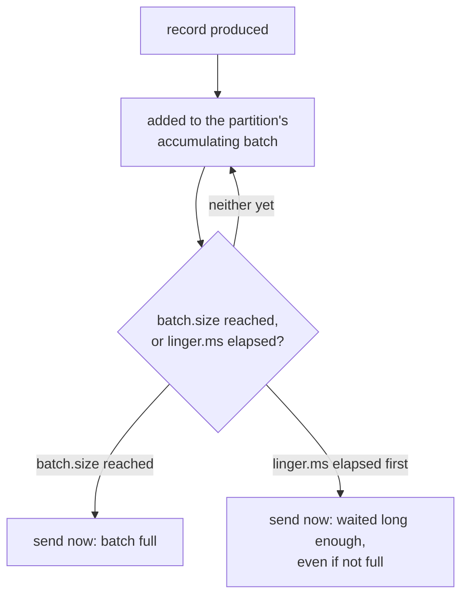

# Lesson 12. Producer and Consumer Configuration Under Load

**Mission link:** Stage 7 opens the client-side settings a defended layout has left unstated so far. Lesson 7 already noted that more partitions shrinks a producer's per-partition batch; this lesson names the actual settings that control that batch, and the consumer-side setting most responsible for a "why did my healthy consumer get rebalanced" incident.
**Primary source:** [Docs: "Producer Configs", Apache Kafka](https://kafka.apache.org/documentation/#producerconfigs)
**Prerequisites:** [Lesson 11](0011-replication-isr-acks-and-unclean-leader-election.md), [Partition](../GLOSSARY.md)

## Warm-up

1. ▢ Why does `acks=all` wait for the current ISR rather than the topic's full configured replication factor?

Check

The ISR can shrink below the configured replication factor if a follower falls behind and gets excluded; `acks=all` counts whatever the ISR actually is at that moment, which is what lets a partition keep accepting writes while temporarily down a replica, at the cost of `acks=all` alone not saying how many replicas are currently in sync.

2. ▢ What does `min.insync.replicas` protect against that `acks=all` alone doesn't?

Check

`acks=all` can silently mean fewer replicas than the configured replication factor once the ISR shrinks; `min.insync.replicas` sets a floor, rejecting a produce request outright once the ISR drops below it, rather than accepting a write with weaker durability than the topic was configured to guarantee.

## Know this

### `batch.size` and `linger.ms`: send once one of two conditions is met

A producer accumulates records destined for the same partition into a **batch** before sending, rather than sending each one as its own request. **`batch.size`** caps how large that batch can grow, in bytes, before it's sent; **`linger.ms`** caps how long the producer will wait, accumulating more records into the batch, before sending it anyway even if `batch.size` hasn't been reached. A batch is sent the moment *either* condition is met, whichever comes first: full before the linger time elapses, or the linger time elapses first with a partially-filled batch. A larger `batch.size` and a longer `linger.ms` both trade added latency (waiting longer, or for more data, before sending) for better throughput and compression efficiency (a bigger batch compresses better and amortizes per-request overhead across more records); this is exactly the batching-efficiency cost lesson 7 named for a topic with too many partitions, now traceable to the two specific settings that decide it.

### `fetch.min.bytes`: the same trade-off, on the read side

A consumer's fetch request can specify **`fetch.min.bytes`**, the minimum amount of data the broker should have available before responding to that request at all; the broker holds the request open (up to `fetch.max.wait.ms`, a cap on how long it'll wait for that minimum to accumulate) rather than returning immediately with whatever little data happens to be ready. This is the producer-side batching trade-off's mirror image: a consumer willing to wait slightly longer per fetch gets larger, more efficient responses instead of many small, mostly-empty ones.

### `max.poll.interval.ms`: protecting against a false rebalance from slow processing, not a dead consumer

**`max.poll.interval.ms`** bounds the time allowed between two successive calls to `poll()`, not the time since the last heartbeat; a consumer's background thread can keep sending heartbeats (satisfying `session.timeout.ms`, lesson 2's liveness check) while its main processing loop is still stuck working through the last batch `poll()` returned, for instance a slow downstream database write per record. If that processing takes longer than `max.poll.interval.ms` before the next `poll()` call, the group considers the consumer dead and triggers exactly the rebalance lesson 3 covers, even though the consumer was never actually unreachable, just slow to finish its own work. This is a distinct failure mode from lesson 3's rebalancing-storm cause: not the network or a crash, but the processing loop itself taking longer than the group is configured to tolerate between polls.

### Matching the setting to the actual bottleneck, not raising every timeout by default

Each of these settings addresses a specific, different symptom: slow producer throughput points at `batch.size`/`linger.ms`; inefficient, chatty consumer fetches point at `fetch.min.bytes`/`fetch.max.wait.ms`; a consumer group rebalancing during legitimately slow per-record processing points at `max.poll.interval.ms` specifically, not `session.timeout.ms` (which governs heartbeat-based liveness, a different question `max.poll.interval.ms` doesn't answer). Raising every timeout across the board "to be safe" masks which specific bottleneck a workload actually has, and can hide a real problem (a consumer that's actually stuck, not just slow) behind a timeout generous enough to never trigger at all.

## Practice

1. ▢ A producer has `batch.size=16384` (16KB) and `linger.ms=5`. A burst of records fills a partition's batch to 16KB after only 2ms. Does the producer wait the remaining 3ms before sending?

Hint

Consider which of the two conditions actually triggers a send: whichever is configured, or whichever happens first.

Check

No. The batch is sent the moment either condition is met, and `batch.size` was reached first (at 2ms, before the 5ms linger elapsed), so the producer sends immediately rather than waiting out the remaining linger time.

2. ▢ A consumer's processing loop takes 90 seconds per batch due to a slow downstream write, while `max.poll.interval.ms` is set to 60 seconds (a common default order of magnitude) and `session.timeout.ms` is comfortably satisfied by a healthy heartbeat thread. What happens to this consumer, and why is it misleading to describe it as "the consumer died"?

Check

The group considers it dead and triggers a rebalance, since more than `max.poll.interval.ms` passed between successive `poll()` calls, even though the consumer's heartbeat thread kept satisfying `session.timeout.ms` the whole time. Describing it as "the consumer died" is misleading because the process was alive and reachable the entire time; it was simply still working through its last batch, a processing-time problem `max.poll.interval.ms` specifically exists to catch, not a liveness problem `session.timeout.ms` already covers.

3. ▢ Why does a consumer configured with a larger `fetch.min.bytes` trade some latency for fewer, more efficient fetch requests, rather than getting something for nothing?

Check

Requiring more data to accumulate before the broker responds means the consumer sometimes waits longer for that threshold to be met (up to `fetch.max.wait.ms`) instead of getting an immediate, possibly near-empty response right away. The trade is real: less per-request overhead and fewer round trips, paid for with added latency on any given fetch that has to wait for enough data to accumulate.

4. ▢ A team, unsure which specific setting is causing spurious rebalances during a slow batch-processing period, raises `session.timeout.ms` instead of `max.poll.interval.ms`. Why does this likely fail to fix the actual problem?

Check

`session.timeout.ms` governs heartbeat-based liveness, a check the consumer's background thread was already satisfying the whole time; the actual problem is the processing loop taking longer than `max.poll.interval.ms` between `poll()` calls, a distinct setting `session.timeout.ms` doesn't affect at all. Raising the wrong timeout leaves the real bottleneck (slow per-batch processing exceeding the poll interval) completely unaddressed.

5. ▢ Which claim correctly matches a symptom to the setting that actually addresses it?

    - a) `session.timeout.ms` and `max.poll.interval.ms` govern the exact same thing, so either can be raised to fix a rebalance caused by slow processing
    - b) `batch.size`/`linger.ms` govern producer-side batching efficiency, `fetch.min.bytes`/`fetch.max.wait.ms` govern the same trade-off on the consumer's read side, and `max.poll.interval.ms` specifically bounds time between `poll()` calls, distinct from heartbeat-based liveness
    - c) Raising every client timeout uniformly is always a safe way to eliminate rebalances with no downside
    - d) `fetch.min.bytes` has no effect on latency, only on throughput

Check

**b)** That's the precise mapping of setting to symptom this lesson establishes. (a) is false: `session.timeout.ms` checks heartbeat liveness; `max.poll.interval.ms` checks time between polls, a genuinely different question. (c) is false: raising timeouts broadly can mask a consumer that's actually stuck rather than merely slow, delaying detection of a real failure. (d) is false: waiting for `fetch.min.bytes` to accumulate is exactly what trades added latency for more efficient fetches.

## Real-world reps

- [ ] For a producer you have access to, check its `batch.size` and `linger.ms`, and estimate whether either is tuned toward latency or toward throughput for its actual workload.
- [ ] Find a consumer group that has experienced unexplained rebalances during periods of heavy processing. Check whether `max.poll.interval.ms` (not `session.timeout.ms`) was actually the setting responsible.
- [ ] Tomorrow: read the primary source's producer and consumer configuration references in full, and note the current default values for `batch.size`, `linger.ms`, `max.poll.interval.ms`, and `fetch.min.bytes` for the version you run.

## Going further

- [Docs: "Producer Configs", Apache Kafka](https://kafka.apache.org/documentation/#producerconfigs)
- [Docs: "Consumer Configs", Apache Kafka](https://kafka.apache.org/documentation/#consumerconfigs)
- [Resources](../RESOURCES.md)

---

Not landing? Reread the primary source at the top, since this lesson compresses it and compression is where understanding leaks. Check the [glossary](../GLOSSARY.md) for any term that felt slippery.

If the lesson itself is unclear rather than the material, that is a defect: [open an issue](https://github.com/TokenCemetery/teach/issues).
