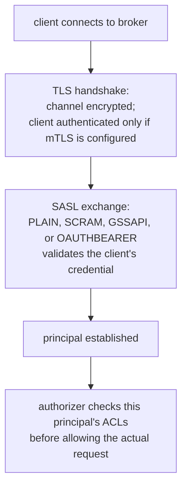

# Lesson 14. TLS and SASL: Authenticating to a Cluster

**Mission link:** Stage 9 opens the question a KRaft cluster's controller quorum (lesson 13) never had to answer on its own: once a cluster exists, who is allowed to connect to it, and how does the broker know a client is who it claims to be? This lesson separates that question, authentication, from encryption, and leaves what an authenticated client is actually allowed to do, authorization, to the next lesson.
**Primary source:** [Docs: "Security", Apache Kafka](https://kafka.apache.org/documentation/#security)
**Prerequisites:** [Lesson 13](0013-kraft-and-what-replaced-zookeeper.md), [Partition](../GLOSSARY.md)

## Warm-up

1. ▢ Why does a KRaft cluster's newly active controller not need to re-fetch the full cluster state from an external store, unlike an old ZooKeeper-mode cluster's new controller?

Check

Every controller in the quorum, active or standby, continuously replays the same replicated metadata log as it arrives, so a standby is already caught up on the cluster's current state before it's ever promoted. Failover is that already-current standby becoming active, not a fresh full-state read from an external system.

2. ▢ What does `process.roles=broker,controller` mean for a single node?

Check

That one node both serves broker traffic (produce and fetch requests) and participates in the controller quorum (replicating and processing metadata changes), rather than those being split across dedicated nodes; this combined mode is common for a small or development cluster.

## Know this

### Two separate jobs `security.protocol` bundles into one setting

Securing a connection to a Kafka broker actually answers two independent questions: is this channel encrypted (so nobody listening on the network can read the traffic), and who is the client (so the broker knows which principal is making the request)? Kafka's **`security.protocol`** picks one combination of the two: `PLAINTEXT` (neither), `SSL` (encrypted channel, with client authentication only if mutual TLS is configured), `SASL_PLAINTEXT` (client authenticated via SASL, channel not encrypted), and `SASL_SSL` (both: encrypted channel and SASL-based client authentication), which is the standard production combination. Treating `security.protocol=SSL` alone as "the cluster is secured" misses that, without a client certificate requirement, TLS by itself only encrypts the channel; it doesn't tell the broker who's on the other end.

### TLS: encrypts the channel, and authenticates the client only as mutual TLS

**TLS** (`ssl.keystore`/`ssl.truststore` configuration on both broker and client) encrypts traffic between client and broker and lets the client verify the broker's identity via its certificate, the same as a browser verifying a website. By default this is one-directional: the broker doesn't learn who the client is just from TLS. **Mutual TLS (mTLS)**, requiring the client to also present a certificate the broker validates, extends TLS to authenticate the client too, but this is a separate, explicit configuration, not something plain TLS provides for free.

### SASL: the framework Kafka actually uses to authenticate a client

**SASL** (Simple Authentication and Security Layer) is the mechanism Kafka layers on top of the connection, usually over TLS as `SASL_SSL`, to establish who the client is. Kafka supports several SASL mechanisms, chosen per listener: **PLAIN** (a plaintext username and password, safe only because `SASL_SSL`'s TLS layer already encrypts the channel it travels over), **SCRAM** (a salted, challenge-response mechanism where the broker never needs the plaintext password, only a stored hash, an improvement over PLAIN even before considering encryption), **GSSAPI** (Kerberos, common where a cluster integrates with existing enterprise single sign-on), and **OAUTHBEARER** (token-based, delegating identity to an external identity provider). Each mechanism answers "who is this client," a distinct question from "is this channel encrypted," which is TLS's job.

### Why `SASL_PLAINTEXT` is a real but usually wrong combination

`SASL_PLAINTEXT` authenticates the client via SASL while leaving the channel itself unencrypted, which means a mechanism like PLAIN sends a username and password that anyone observing the network traffic can read in the clear; even SCRAM's stronger credential handling doesn't protect the rest of the traffic, the actual message data, from being read by an eavesdropper. This combination exists and is occasionally used inside a network boundary already considered fully trusted, but for any connection crossing a boundary that isn't fully trusted, `SASL_SSL` is the combination that actually protects both the credential exchange and the data itself.

## Practice

1. ▢ A cluster is configured with `security.protocol=SSL` and no mutual TLS requirement. A client connects successfully over this encrypted channel. Does the broker now know which principal this client is?

Hint

Consider what plain, one-directional TLS actually establishes versus what it doesn't.

Check

No. Without mutual TLS, `SSL` alone encrypts the channel and lets the client verify the broker's certificate, but the broker doesn't learn who the client is from that handshake; establishing the client's identity requires either mutual TLS (a client certificate the broker validates) or a SASL exchange layered on top.

2. ▢ Why is SCRAM considered an improvement over PLAIN even before factoring in whether the channel is encrypted?

Check

SCRAM is a salted, challenge-response mechanism where the broker only ever needs to store a hash of the credential, never the plaintext password itself; PLAIN sends the actual plaintext username and password, meaning anyone who can read the broker's credential store (or intercept a badly configured, unencrypted exchange) sees the real password, not just a hash of it.

3. ▢ A team runs `SASL_PLAINTEXT` with the SCRAM mechanism, reasoning that "SCRAM doesn't send a plaintext password, so this is secure." What does this miss?

Check

SCRAM protects the credential exchange itself, but `SASL_PLAINTEXT` still leaves the channel unencrypted, so the actual message traffic (the data being produced and consumed) travels in the clear and can be read by anyone observing the network. SCRAM being stronger than PLAIN doesn't substitute for the channel encryption that `SASL_SSL` would add.

4. ▢ What has to be configured, beyond ordinary TLS, for the broker to authenticate a client using its certificate rather than a SASL exchange?

Check

Mutual TLS: the broker has to be configured to require and validate a client certificate as part of the TLS handshake, rather than TLS's default one-directional mode where only the client verifies the broker's certificate.

5. ▢ Which claim correctly distinguishes what TLS and SASL each contribute to `SASL_SSL`?

    - a) TLS and SASL both authenticate the client; `SASL_SSL` just runs both checks redundantly for extra safety
    - b) TLS encrypts the channel (and authenticates the broker to the client, or the client too if mTLS is configured); SASL authenticates the client to the broker via a mechanism like PLAIN, SCRAM, GSSAPI, or OAUTHBEARER
    - c) SASL encrypts the channel; TLS only authenticates the client
    - d) `security.protocol=SSL` alone is sufficient to establish which principal a client is, with no further configuration

Check

**b)** That's the actual division of labor `SASL_SSL` combines. (a) is false: TLS's default job is channel encryption and broker authentication, not client authentication, unless mTLS is added. (c) is false: it reverses the two mechanisms' jobs. (d) is false: plain `SSL` without mutual TLS never tells the broker who the client is.

## Real-world reps

- [ ] For a Kafka cluster you have access to, check its `security.protocol` and, if SASL is used, which mechanism (PLAIN, SCRAM, GSSAPI, or OAUTHBEARER) is configured.
- [ ] Check whether that cluster requires mutual TLS, or relies on SASL alone (over `SASL_SSL`) to authenticate clients.
- [ ] Tomorrow: read the primary source's security documentation in full, and note which SASL mechanism it recommends when a cluster has no existing Kerberos or OAuth identity provider to integrate with.

## Going further

- [Docs: "Security", Apache Kafka](https://kafka.apache.org/documentation/#security)
- [Docs: "Broker Configs", Apache Kafka](https://kafka.apache.org/documentation/#brokerconfigs)
- [Resources](../RESOURCES.md)

---

Not landing? Reread the primary source at the top, since this lesson compresses it and compression is where understanding leaks. Check the [glossary](../GLOSSARY.md) for any term that felt slippery.

If the lesson itself is unclear rather than the material, that is a defect: [open an issue](https://github.com/TokenCemetery/teach/issues).
