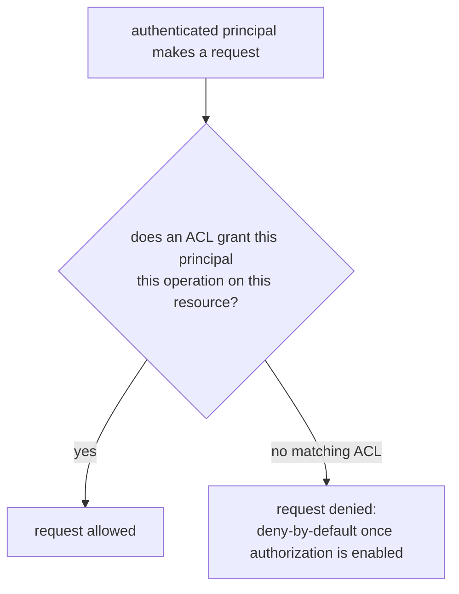

# Lesson 15. ACLs and Quotas: Authorization and Multi-Tenancy

**Mission link:** Lesson 14 established who a client is, TLS for the channel, SASL for the credential. This lesson picks up the next two questions a shared cluster has to answer: what is that authenticated principal actually allowed to do, and what stops one tenant's traffic from starving every other tenant's share of the cluster's capacity? Stage 9 closes here, having named authentication, authorization, and resource isolation as three genuinely separate concerns.
**Primary source:** [Docs: "Security", Apache Kafka](https://kafka.apache.org/documentation/#security)
**Prerequisites:** [Lesson 14](0014-tls-and-sasl-authenticating-to-a-cluster.md), [Partition](../GLOSSARY.md)

## Warm-up

1. ▢ A client connects over `SASL_SSL` using SCRAM. What has this established about the client, and what hasn't it established yet?

Check

It has established the client's identity, an authenticated principal, and encrypted the channel. It hasn't established anything about what that principal is actually allowed to do; authentication answers "who is this," not "what can they do."

2. ▢ Why is `SASL_PLAINTEXT` with SCRAM still a weaker choice than `SASL_SSL` with SCRAM, even though SCRAM itself never sends a plaintext password?

Check

SCRAM protects only the credential exchange; `SASL_PLAINTEXT` still leaves the rest of the channel, the actual message traffic, unencrypted and readable by anyone observing the network. `SASL_SSL` adds the channel encryption SCRAM alone doesn't provide.

## Know this

### ACLs: authorization is a separate decision from authentication

An **ACL** (Access Control List) grants a specific **principal** (the identity a client authenticated as) permission to perform a specific **operation** (Read, Write, Create, Describe, Alter, and others) on a specific **resource** (a Topic, a consumer Group, or the Cluster itself). Authentication answers "who is this"; authorization, what ACLs decide, answers "is this specific principal allowed to do this specific thing to this specific resource," a genuinely separate question a successfully authenticated client still has to pass. Managed via `kafka-acls.sh`, an ACL is scoped as narrowly as the operator wants: a principal might be granted `Write` on one topic and nothing else, or `Describe` on the whole cluster but no ability to alter anything.

### Deny-by-default: once authorization is enabled, an unlisted action is refused, not allowed

Once a cluster has an authorizer configured, the default posture is **deny-by-default**: an operation with no matching ACL granting it is refused, not silently allowed. This is the opposite of an easy-to-assume default, "no rule against it, so it's fine," and it's deliberate: a shared, multi-tenant cluster where every team's access has to be explicitly granted is far safer than one where forgetting to write a deny rule quietly leaves a door open.

### Quotas: protecting shared capacity from one tenant, independent of whether they're authorized

An ACL only decides whether a request is permitted at all; it says nothing about how much of the cluster's actual capacity, network bandwidth, request-handling threads, that permitted traffic can consume. **Quotas** address that separately: a **produce/consume byte-rate quota** caps how much data a given client (identified by user principal, or by `client.id`) can push or pull per second, and a **request-percentage quota** caps how much of a broker's request-handling capacity a client can occupy, protecting against a client that isn't necessarily moving much data but is issuing enough requests to monopolize CPU time. A fully authorized client, one with every ACL it needs, can still be throttled by a quota; the two mechanisms answer different questions and both are necessary for real multi-tenancy.

### Why multi-tenancy needs both, not either alone

A cluster shared across independent teams or applications needs isolation on two separate axes: who can access what (ACLs), and how much of the shared, finite capacity each tenant can consume (quotas). ACLs without quotas leave every authorized tenant free to monopolize the cluster's bandwidth or request capacity, degrading every other tenant's traffic even though nothing unauthorized happened. Quotas without ACLs leave the cluster open to anyone who can authenticate, rate-limited but with no actual access control. A defended multi-tenant deployment states both explicitly, the same way lesson 10 argued a defended topic layout has to state `cleanup.policy` explicitly rather than leaving it as whatever the cluster default happens to be.

## Practice

1. ▢ A principal has no ACL at all configured for a given topic on a cluster with an authorizer enabled. Can that principal read from the topic?

Hint

Consider what the default posture is once an authorizer is actually configured, not what happens with no authorizer at all.

Check

No. Deny-by-default means an operation with no matching ACL is refused, not permitted; the principal would need an explicit ACL granting `Read` on that topic before the request would succeed.

2. ▢ A client has every ACL it needs to produce to a topic, but a produce byte-rate quota throttles it to a fraction of the throughput it's requesting. Is this an authorization failure?

Check

No. The client is fully authorized, the ACL check passes, but the quota is a separate mechanism limiting how much of the cluster's shared bandwidth this client can consume, regardless of whether it's allowed to produce at all. Authorization and resource-consumption limits are independent checks.

3. ▢ A cluster grants broad ACLs to every team (effectively "anyone authenticated can do anything") but configures no quotas. What failure mode does this leave open?

Check

One team's traffic, whether from a bug, a traffic spike, or just an unusually heavy workload, can consume enough of the cluster's bandwidth or request-handling capacity to degrade every other team's traffic, since nothing limits how much of that shared, finite capacity any single tenant can use.

4. ▢ Why does a request-percentage quota matter even for a client that isn't moving much data?

Check

A client can issue a high volume of small requests that consume broker CPU and request-handling threads without necessarily moving much data volume; a byte-rate quota alone wouldn't catch this, since it measures data volume, not request count or processing time, which is exactly what a request-percentage quota is designed to bound instead.

5. ▢ Which claim correctly describes how ACLs and quotas fit together for multi-tenancy?

    - a) ACLs and quotas both control the same thing, request throughput, and configuring both is redundant
    - b) ACLs decide whether a principal may perform an operation on a resource at all; quotas separately bound how much of the cluster's shared capacity an authorized client can consume; real multi-tenancy needs both
    - c) Once deny-by-default is enabled, quotas become unnecessary, since only explicitly authorized traffic exists on the cluster
    - d) A produce byte-rate quota also functions as an authorization check, rejecting requests from principals with no matching ACL

Check

**b)** That's the precise division: ACLs gate whether an action is permitted, quotas gate how much of the shared capacity a permitted action can consume. (a) is false: they answer different questions, permission versus resource share. (c) is false: authorized traffic can still monopolize shared capacity with no quota in place. (d) is false: a quota throttles an already-authorized client; it doesn't perform the authorization check itself.

## Real-world reps

- [ ] For a Kafka cluster you have access to, check whether an authorizer is enabled, and if so, look up the ACLs granted to a principal you use.
- [ ] Check whether that cluster has produce/consume byte-rate quotas or request-percentage quotas configured, and for which principals or client IDs.
- [ ] Tomorrow: read the primary source's authorization section in full, and note what the default behavior is for a cluster that has no authorizer configured at all, as distinct from one that has an authorizer with no ACLs yet granted.

## Going further

- [Docs: "Security", Apache Kafka](https://kafka.apache.org/documentation/#security)
- [Docs: "Broker Configs", Apache Kafka](https://kafka.apache.org/documentation/#brokerconfigs)
- [Resources](../RESOURCES.md)

---

Not landing? Reread the primary source at the top, since this lesson compresses it and compression is where understanding leaks. Check the [glossary](../GLOSSARY.md) for any term that felt slippery.

If the lesson itself is unclear rather than the material, that is a defect: [open an issue](https://github.com/TokenCemetery/teach/issues).
