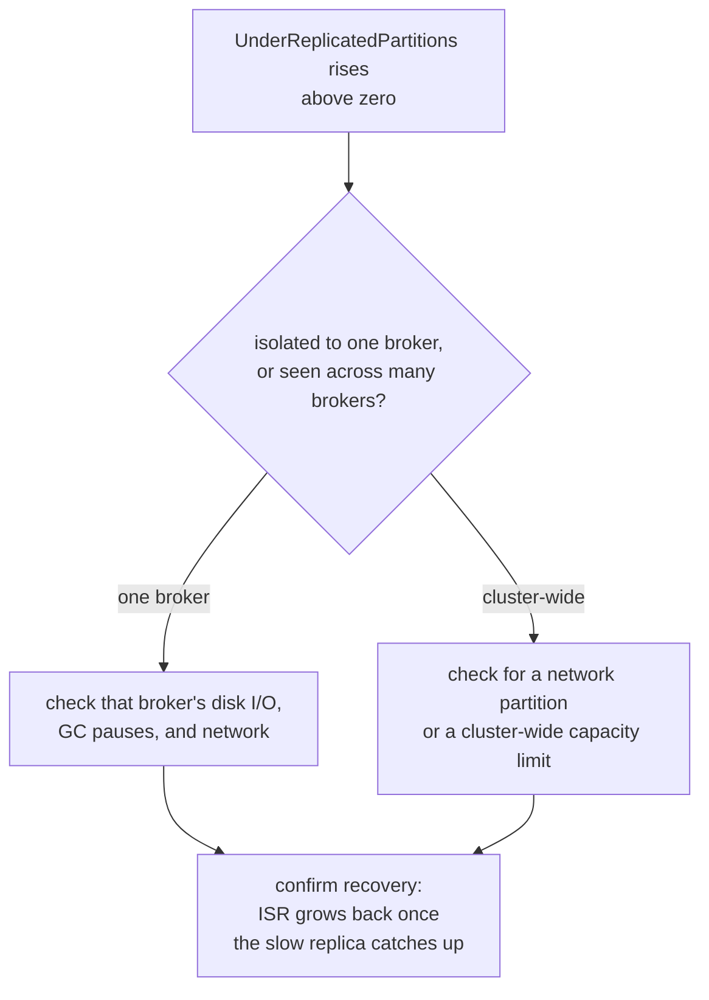

# Lesson 16. The Metrics That Matter for Operating a Cluster

**Mission link:** Stage 10 closes the mission: every earlier stage named a guarantee or a setting; this lesson names the broker-exposed signals that tell an operator whether those guarantees are actually holding right now, and gives a diagnostic order for the most common one, rising under-replicated partitions, the way lesson 3 gave one for consumer lag.
**Primary source:** [Docs: "Monitoring", Apache Kafka](https://kafka.apache.org/documentation/#monitoring)
**Prerequisites:** [Lesson 15](0015-acls-and-quotas-authorization-and-multi-tenancy.md), [In-sync replica set (ISR)](../GLOSSARY.md)

## Warm-up

1. ▢ What does deny-by-default mean once a cluster has an authorizer configured?

Check

An operation with no matching ACL is refused, not silently allowed; a principal needs an explicit ACL granting a specific operation on a specific resource before that action succeeds.

2. ▢ Why can a fully authorized client still be throttled?

Check

Quotas are a separate mechanism from ACLs, limiting how much of the cluster's shared byte-rate or request-handling capacity a client can consume regardless of whether it's authorized to act at all; passing the ACL check says nothing about a client's quota.

## Know this

### Under-replicated partitions: the earliest broker-exposed sign that lesson 11's durability guarantee is degraded

Every broker exposes a per-partition **`UnderReplicated`** gauge, and the cluster-wide count of partitions currently under-replicated is the single most watched Kafka metric for a reason: a partition becomes under-replicated the moment its **ISR** (lesson 11) shrinks below its configured replication factor, which is the earliest signal that the replication guarantee a topic was designed around is currently weaker than intended. This is a distinct, earlier warning than **`UnderMinIsr`**, a separate gauge marking a partition whose ISR has dropped all the way to (or below) `min.insync.replicas`, the point at which lesson 11's floor actually starts rejecting produce requests. A rising `UnderReplicatedPartitions` count with `UnderMinIsr` still at zero is a real problem worth investigating, but not yet one actively rejecting writes; the two gauges answer different urgency questions from the same underlying condition.

### Disk headroom: a partition's size against its retention cap is not the same question as a broker running out of disk

Each partition exposes its physical on-disk `Size` and a `RetentionSizeInPercent` gauge, showing how close that partition is to its configured `retention.bytes` cap, lesson 10's size-based retention limit. A partition approaching its own retention cap is expected and by design, the cleanup policy will trim it. A broker running low on disk space overall is a different, more urgent question entirely: it isn't bounded by any single topic's retention setting, and once a broker's disk actually fills, it can't accept new writes for any partition it hosts, regardless of what any individual topic's retention policy allows. Watching per-topic retention headroom and watching broker-wide disk capacity are both necessary, and neither substitutes for the other.

### Request latency and request-handler idle percent: queued versus actually slow

Kafka's request-handling metrics separate **`RequestQueueTimeMs`** (time a request spends waiting for a free request-handler thread before any processing starts) from **`LocalTimeMs`** (time the broker actually spends processing it) and **`TotalTimeMs`** (the full end-to-end request time a client experiences). A broker whose queue time is rising while local processing time stays flat is saturated, out of spare request-handler capacity, which is exactly what the broker-level **`RequestHandlerAvgIdlePercent`** gauge (falling toward zero) confirms directly. A broker whose local processing time itself is rising, queue time flat, points somewhere else entirely: slow disk I/O, an overloaded leader, or a follower struggling to keep up, not a lack of free threads.

### What to do when one moves: isolated versus cluster-wide points to a different root cause

The same triage shape applies across all three signals: is the problem isolated to one broker, or visible across many at once? An under-replicated-partitions spike confined to one broker usually points at that broker's own local resource contention, a slow disk, a long garbage-collection pause, a flaky network interface, while the same spike appearing broadly across the cluster more often points at a shared cause, a network partition affecting inter-broker replication traffic, or the whole cluster genuinely running past its aggregate capacity. Reaching for the same isolated-versus-cluster-wide question first, rather than guessing at a specific fix immediately, is the same diagnostic discipline lesson 3 established for consumer lag, applied here to the broker side of the cluster instead.

## Practice

1. ▢ A partition's `UnderReplicated` gauge reads 1, but its `UnderMinIsr` gauge reads 0. Are produce requests to this partition currently being rejected?

Hint

Consider which gauge specifically marks the point where `min.insync.replicas` starts refusing writes.

Check

No, not yet. `UnderReplicated` alone means the ISR has shrunk below the replication factor, a real but earlier warning; `UnderMinIsr` is the gauge that specifically marks the ISR dropping to or below `min.insync.replicas`, the point where produce requests actually start being rejected. With `UnderMinIsr` still at 0, the ISR, while smaller than the full replication factor, still satisfies the configured minimum.

2. ▢ A specific topic's partitions are consistently near their configured `retention.bytes` cap. Is this, by itself, a sign of a problem?

Check

Not by itself. A partition approaching its own configured retention cap is expected and by design, the cleanup policy exists to trim it back down; this is a distinct, separate question from whether the broker hosting it is running low on disk space overall, which is bounded by nothing a single topic's retention setting controls.

3. ▢ A broker's `RequestQueueTimeMs` is rising while its `LocalTimeMs` stays flat. What does this combination point to, and what broker-level gauge would confirm it?

Check

Rising queue time with flat local processing time points to the broker being saturated, out of spare request-handler thread capacity, rather than any single request actually taking longer to process once it starts. `RequestHandlerAvgIdlePercent` falling toward zero would confirm the broker has little to no spare handler capacity left.

4. ▢ `UnderReplicatedPartitions` spikes simultaneously across every broker in the cluster at once. Does this pattern point toward one broker's local disk problem, or something else?

Check

Something else: a spike isolated to one broker points at that broker's own local resource contention, but a spike appearing broadly across the whole cluster at once more often points at a shared cause, such as a network partition disrupting inter-broker replication traffic, or the cluster genuinely running past its aggregate capacity.

5. ▢ Which claim correctly distinguishes the three metric families this lesson covers?

    - a) `UnderReplicatedPartitions`, disk headroom, and request latency all measure the same underlying broker health and any one of them is sufficient to monitor on its own
    - b) `UnderReplicatedPartitions` signals a replication guarantee currently weaker than configured; disk headroom separates a topic nearing its own retention cap from a broker actually running low on disk; request latency separates thread-pool saturation (rising queue time) from genuinely slow processing (rising local time)
    - c) `UnderMinIsr` and `UnderReplicated` are the same gauge under two different names
    - d) A broker's disk filling up only affects the specific topic whose retention cap it's closest to

Check

**b)** That's the precise distinction each metric family draws. (a) is false: each signal points to a different failure mode, and watching only one misses the others entirely. (c) is false: `UnderReplicated` marks the ISR falling below the full replication factor, an earlier warning than `UnderMinIsr`, which marks the ISR falling to or below `min.insync.replicas`. (d) is false: a broker fully out of disk can't accept writes for any partition it hosts, not only the one closest to its own retention cap.

## Real-world reps

- [ ] For a Kafka cluster you have access to, check its current `UnderReplicatedPartitions` count and, if it's non-zero, whether the affected partitions are also `UnderMinIsr`.
- [ ] Check a broker's `RequestHandlerAvgIdlePercent` and compare it against that broker's `RequestQueueTimeMs` for produce or fetch requests, to see whether the two signals agree.
- [ ] Tomorrow: read the primary source's monitoring documentation in full, and note which additional metrics it recommends alerting on that this lesson didn't cover.

## Going further

- [Docs: "Monitoring", Apache Kafka](https://kafka.apache.org/documentation/#monitoring)
- [Docs: "Topic Configs", Apache Kafka](https://kafka.apache.org/documentation/#topicconfigs)
- [Resources](../RESOURCES.md)

---

Not landing? Reread the primary source at the top, since this lesson compresses it and compression is where understanding leaks. Check the [glossary](../GLOSSARY.md) for any term that felt slippery.

If the lesson itself is unclear rather than the material, that is a defect: [open an issue](https://github.com/TokenCemetery/teach/issues).
