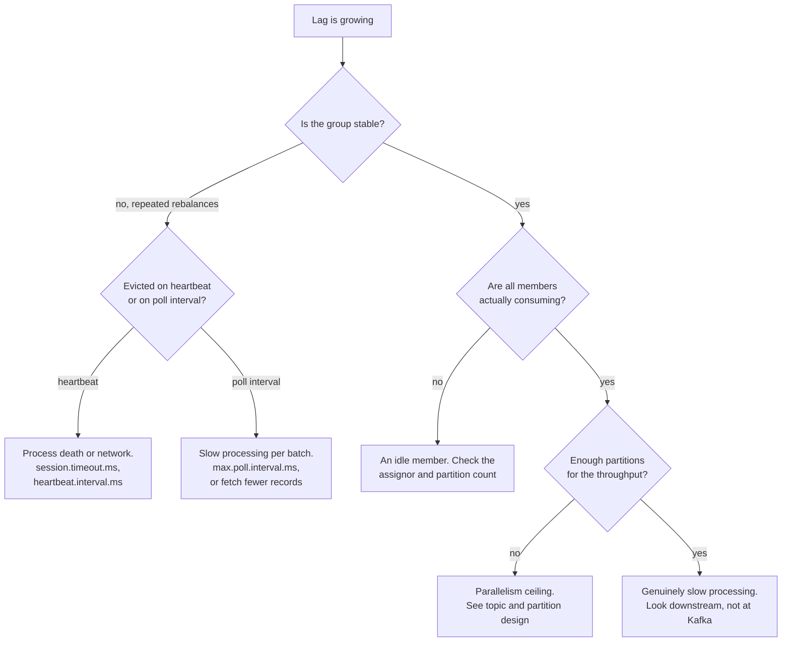

# Consumer Groups and Rebalancing

Stage 2 compressed for lookup. [Lesson 2](../lessons/0002-consumer-group-coordination.md) covers coordination and [lesson 3](../lessons/0003-cooperative-rebalancing-and-lag.md) covers cooperative rebalancing and lag; this sheet is the mechanics and the configuration names, for when something is lagging now.

Values below are from the Kafka 4.3 configuration reference. Defaults move between releases, so check yours before copying a number.

## Two protocols, and the default is still the old one

`group.protocol` selects between them, and its default is `classic`.

| | `classic` | `consumer` |
|---|---|---|
| Who computes the assignment | A member, elected group leader | The **broker**, through the group coordinator |
| Assignor configured by | `partition.assignment.strategy`, on the client | `group.remote.assignor`, chosen from the broker's `group.consumer.assignors` |
| Heartbeat interval set by | The client, `heartbeat.interval.ms` | The **broker**, `group.consumer.heartbeat.interval.ms`, default 5 s |
| Session timeout set by | The client, `session.timeout.ms` | The broker, `group.consumer.session.timeout.ms`, default 45 s |
| Rebalance shape | Eager or cooperative, by assignor choice | Incremental, no global sync barrier |

The direction is the same in every row: coordination moves off the clients and onto the broker. Under `consumer`, `heartbeat.interval.ms` and `session.timeout.ms` are **not supported** on the client at all, which is a startup surprise if a config file carries them over.

The broker's `group.coordinator.rebalance.protocols` is deprecated and goes away in Kafka 5.0, where every protocol is always enabled and feature versions manage this instead.

## Liveness has two independent mechanisms

This is the distinction that decides most lag investigations, and neither lesson names it. Under the classic protocol a consumer can be removed from the group by **either** of two timers, and they measure different things.

| | `session.timeout.ms` | `max.poll.interval.ms` |
|---|---|---|
| Measures | Time since the last heartbeat | Time since the last `poll()` |
| Sent by | A background thread | The application's own loop |
| Fires when | The process died, hung, or lost its connection | The process is alive and **stuck processing a batch** |
| Related config | `heartbeat.interval.ms`, no higher than a third of the session timeout | The batch size, since a bigger batch takes longer to process |

A consumer whose processing has slowed keeps heartbeating happily from its background thread and still gets evicted, by the second timer. So "the consumer looks healthy and keeps getting kicked out" is not a network symptom; it is a processing-time symptom, and raising `session.timeout.ms` will not touch it.

## Eager and cooperative

| | Eager | Cooperative, incremental |
|---|---|---|
| On rebalance | **Every** member revokes **every** partition, then rejoins | Only partitions actually changing hands are revoked |
| Rounds | One join and sync | Two, the first deciding what must move |
| Blast radius | The whole group stops consuming | Only the moving partitions pause |

Under membership churn, a rolling deploy or a flapping consumer, the eager protocol produces a **rebalancing storm**: repeated whole-group pauses, sometimes triggering each other before the group ever settles.

### How you actually get cooperative

The default `partition.assignment.strategy` is already the list `[RangeAssignor, CooperativeStickyAssignor]`. That uses `RangeAssignor`, and it exists in that shape so the upgrade is **one rolling bounce that removes `RangeAssignor` from the list**. Cooperative rebalancing is not something to build; it is a list edit and a restart.

| Assignor | Behaviour |
|---|---|
| `RangeAssignor` | Per topic. The default, and it can leave later consumers idle when partition counts are uneven |
| `RoundRobinAssignor` | Across all subscribed partitions in turn |
| `StickyAssignor` | Maximally balanced while preserving as many existing assignments as possible |
| `CooperativeStickyAssignor` | Sticky logic, plus cooperative rebalancing |

## Static membership

Setting `group.instance.id` makes a consumer a **static member**: exactly one instance with that ID may be in the group, and, with a larger session timeout, a restart no longer triggers a rebalance at all. That is the direct answer to "our rolling deploy causes a rebalancing storm", and it is a config change rather than a protocol change.

One consequence to know: a static member that hits `max.poll.interval.ms` does not have its partitions reassigned immediately, which is the trade for surviving a restart quietly.

## Consumer lag

**Lag** is the log-end-offset minus the group's committed offset, per partition. Read it from a consumer-group describe (`CURRENT-OFFSET`, `LOG-END-OFFSET`, `LAG`) or from the `records-lag-max` metric.

Stable lag is not a problem, even if it never reaches zero. **Growing** lag is.

### Diagnostic order

Checking in this order stops you fixing the wrong thing.

The first branch is the one people skip. A group stuck rebalancing cannot consume during each pause, so it shows growing lag with nothing whatsoever wrong with its throughput.

### The parallelism ceiling

A partition is assigned to at most one member of a group. So consumers beyond the partition count sit idle, and adding instances stops helping the moment there is one per partition. When the answer is "more partitions", that decision has its own costs.

## Configuration quick reference

| Config | Where | Default in 4.3 | Governs |
|---|---|---|---|
| `group.protocol` | consumer | `classic` | Which rebalance protocol the client speaks |
| `session.timeout.ms` | consumer, classic only | 45 s | Eviction on missing heartbeats |
| `heartbeat.interval.ms` | consumer, classic only | 3 s | Heartbeat cadence, keep at or below a third of the session timeout |
| `max.poll.interval.ms` | consumer | 5 min | Eviction on a slow processing loop |
| `partition.assignment.strategy` | consumer, classic only | `[Range, CooperativeSticky]` | Assignment, and eager versus cooperative |
| `group.remote.assignor` | consumer, new protocol only | null | Which broker-side assignor to request |
| `group.instance.id` | consumer | null | Static membership |
| `group.consumer.assignors` | broker | `uniform,range` | The server-side assignors available |
| `group.consumer.heartbeat.interval.ms` | broker | 5 s | Heartbeat cadence under the new protocol |
| `group.consumer.session.timeout.ms` | broker | 45 s | Failure detection under the new protocol |

## Before blaming throughput

- Check the group's state first. Repeated rebalances look exactly like slow consumption.
- Establish which timer evicted the member. Heartbeat and poll interval mean opposite things.
- Confirm no member is a member without actually consuming.
- Count partitions against instances. Extra consumers past the partition count do nothing.
- If deploys cause the churn, reach for `group.instance.id` before tuning timeouts.
- If the group is on `classic` with `RangeAssignor` first in the list, the cooperative upgrade is one rolling bounce away.

## Sources

- [Docs: "Consumer Configs", Apache Kafka](https://kafka.apache.org/documentation/#consumerconfigs)
- [Docs: "Broker Configs", Apache Kafka](https://kafka.apache.org/documentation/#brokerconfigs)
- [Article: "Incremental Cooperative Rebalancing in Apache Kafka", Confluent](https://www.confluent.io/blog/incremental-cooperative-rebalancing-in-kafka/)
- [Resources](../RESOURCES.md)
