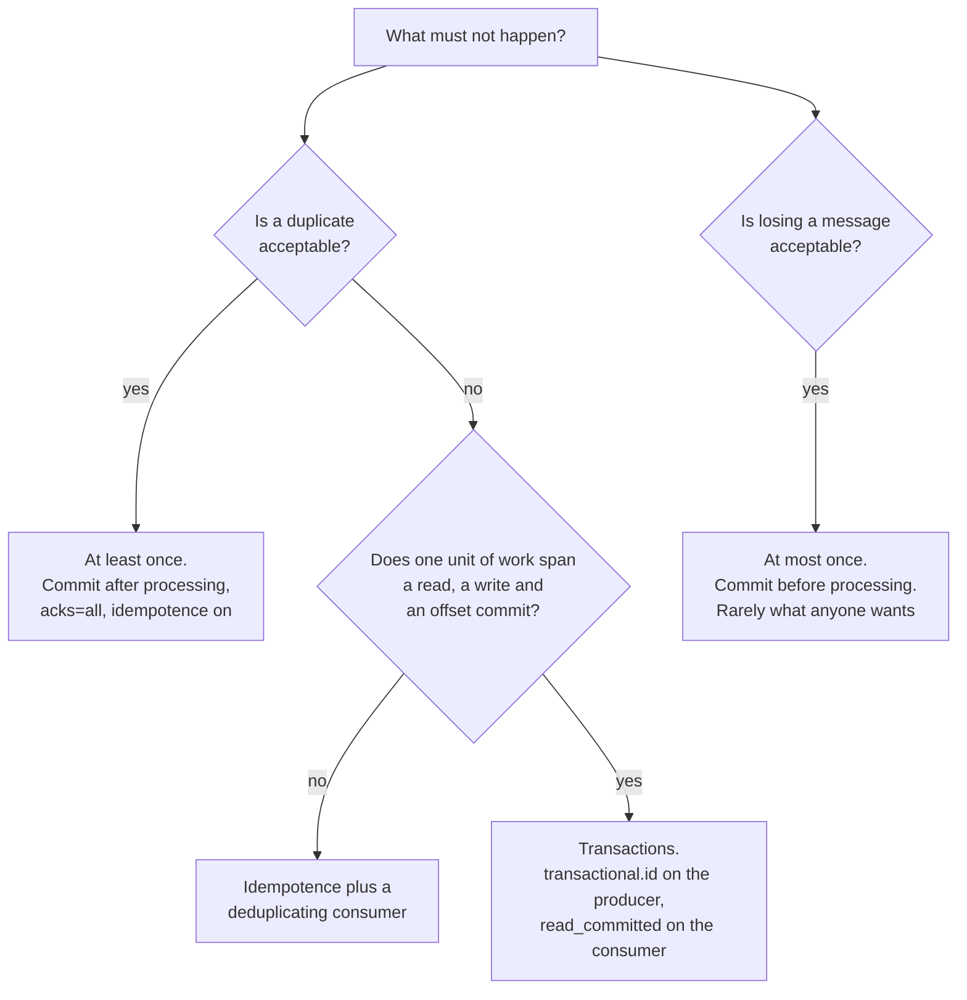

# Delivery Guarantees

Stage 3 compressed for lookup. [Lesson 4](../lessons/0004-delivery-semantics.md) covers where each guarantee is won or lost and [lesson 5](../lessons/0005-idempotent-producers-and-transactions.md) covers idempotence and transactions; this sheet is the settings that decide it, with the traps that make a system quieter than it is safe.

Values are from the Kafka 4.3 configuration reference. Check yours; these defaults have changed before.

## Three legs, three controls

| Leg | Failure it can produce | Controlled by |
|---|---|---|
| Producer to broker | Duplicate, from a retry after a lost acknowledgement | `enable.idempotence` |
| Broker durability | Loss, from a leader crash after acknowledging | `acks`, and `min.insync.replicas` on the topic |
| Consumer to processing | Loss or duplicate, depending on commit order | Where you commit the offset, and `isolation.level` |

A guarantee that names only one leg says nothing about the other two. "We use at-least-once" is a statement about the third leg only.

## The producer leg

| `acks` | The leader | Risk |
|---|---|---|
| `0` | Is not waited for at all | Loss. `retries` has no effect, and the returned offset is always `-1` |
| `1` | Writes locally, does not wait for followers | Loss if the leader fails before followers catch up |
| `all`, equivalently `-1` | Waits for the **full set of in-sync replicas** | None, as long as one in-sync replica survives. The default |

### Idempotence, and the way it turns itself off

`enable.idempotence` defaults to `true`, and it **requires** three things:

- `acks` must be `all`
- `retries` must be greater than zero
- `max.in.flight.requests.per.connection` must be **5 or fewer**, because a broker retains at most five batches per producer

The rule that catches people:

| What you set | What happens |
|---|---|
| Nothing conflicting | Idempotence is on |
| A conflicting value, without setting `enable.idempotence` | **Idempotence is silently disabled** |
| A conflicting value, with `enable.idempotence=true` | `ConfigException` at startup |

So a config that sets `acks=1` for latency, and never mentions idempotence, has turned off duplicate protection without saying so. The loud failure only happens when you asked for idempotence explicitly.

## The broker durability leg

`acks=all` alone is not the whole story, because it means "every replica currently in sync", and the in-sync set can shrink.

- With `acks=all`, **every** in-sync replica must acknowledge, even if `min.insync.replicas` is lower. A replication factor of 3 with all three in sync needs all three.
- If the in-sync set has fewer members than `min.insync.replicas`, the producer gets `NotEnoughReplicas` or `NotEnoughReplicasAfterAppend`. That is the setting doing its job: refusing a write it cannot make durable.
- **Regardless of `acks`, consumers do not see a message until it is replicated to all in-sync replicas and the `min.insync.replicas` condition holds.** `acks` decides when the *producer* is told, not when *readers* can see it.

`acks=all` with `min.insync.replicas=1` is the combination that reads as safe and is not: one surviving replica satisfies it, so a single failure can still lose acknowledged data.

## The consumer leg

| Commit relative to processing | Guarantee | Failure mode |
|---|---|---|
| Commit **before** processing | At most once | Crash between the two loses the message |
| Commit **after** processing | At least once | Crash between the two reprocesses it |

There is no third option on this leg alone. Exactly-once is not a commit ordering; it is a transaction that makes the processing and the commit one unit.

## Transactions

A transaction wraps a producer's writes to several partitions and topics, **including the write to `__consumer_offsets`**, into one atomic unit. A transaction coordinator writes markers recording commit or abort.

| Config | Default | Note |
|---|---|---|
| `transactional.id` | null | Setting it **implies** `enable.idempotence`. Without it, only idempotent delivery is available |
| `transaction.timeout.ms` | 1 min | The clock starts when the **first partition is added** to the transaction, not at `beginTransaction` |
| Broker `transaction.max.timeout.ms` | | A client asking for more fails with `InvalidTxnTimeoutException` |
| `isolation.level` | `read_uncommitted` | A consumer must **opt in** to `read_committed` |

Two things that surprise teams:

- **Transactions need at least three brokers by default**, because `transaction.state.log.replication.factor` is set for production. A single-broker development cluster needs that lowered.
- **`read_uncommitted` is the default.** Producing transactionally while consumers keep the default means aborted messages are still delivered. The write side alone buys nothing.

### What `read_committed` actually waits for

A `read_committed` consumer reads only up to the **last stable offset**, which is one less than the offset of the first **open** transaction. Anything after a message belonging to an ongoing transaction is withheld until that transaction finishes, whether it commits or aborts.

So one slow or stuck transaction stalls a `read_committed` consumer on that partition, even though every other message behind it is perfectly committed. That, and not the commit marker round trip, is where the throughput cost usually shows up. Non-transactional messages are returned unconditionally in both modes.

## Cost tiers

| | Idempotence | Transactions |
|---|---|---|
| Latency | Negligible | An extra round trip for the commit marker |
| Consumer throughput | Unchanged | Reduced for `read_committed`, waiting on the last stable offset |
| Operational burden | None | A transactional ID managed across restarts, or fencing kicks in |
| Cluster requirement | None | Three brokers by default |

Enable idempotence essentially always. Reach for transactions when read-process-write atomicity is genuinely required, not as a default.

## Choosing

## Configuration quick reference

| Config | Where | Default in 4.3 |
|---|---|---|
| `acks` | producer | `all` |
| `enable.idempotence` | producer | `true` |
| `max.in.flight.requests.per.connection` | producer | 5 |
| `delivery.timeout.ms` | producer | 2 min, and at least `request.timeout.ms` plus `linger.ms` |
| `transactional.id` | producer | null |
| `transaction.timeout.ms` | producer | 1 min |
| `isolation.level` | consumer | `read_uncommitted` |
| `min.insync.replicas` | topic or broker | Set it deliberately |

## Traps worth checking

- An `acks` override that silently disabled idempotence, because nothing mentioned `enable.idempotence`.
- `min.insync.replicas=1` alongside `acks=all`, which reads as durable and is not.
- Transactional producing with consumers left on `read_uncommitted`.
- A transaction timeout measured from the first partition added, not from the call that opened it.
- A rolling deploy that briefly runs two producers under one transactional ID, which fencing will stop and which will look like a mysterious producer error.
- Treating exactly-once as one feature. Idempotence is nearly free; transactions are not.

## Sources

- [Docs: "Message Delivery Semantics", Apache Kafka](https://kafka.apache.org/documentation/#semantics)
- [Docs: "Producer Configs", Apache Kafka](https://kafka.apache.org/documentation/#producerconfigs)
- [Docs: "Topic Configs", Apache Kafka](https://kafka.apache.org/documentation/#topicconfigs)
- [Docs: "Consumer Configs", Apache Kafka](https://kafka.apache.org/documentation/#consumerconfigs)
- [Article: "Exactly-once Semantics is Possible: Here's How Kafka Does it", Gustafson and Mehta, Confluent](https://www.confluent.io/blog/exactly-once-semantics-are-possible-heres-how-apache-kafka-does-it/)
- [Resources](../RESOURCES.md)
