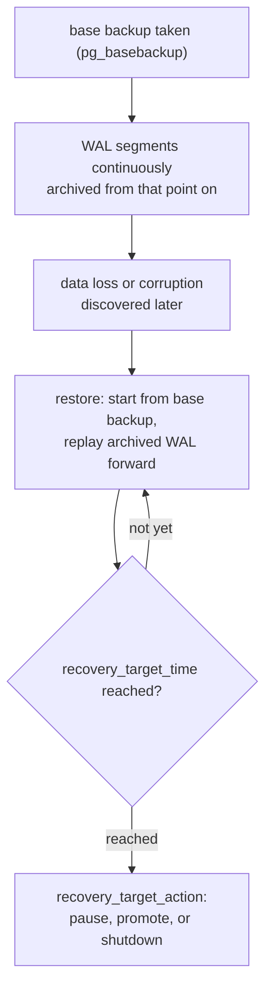

# Lesson 11. Backup and Point-in-Time Recovery

**Mission link:** Stage 6 opens the part of operating a real instance every earlier stage assumed away: eventually something is lost, corrupted, or deleted by mistake, and there has to be a way back. Lesson 1 established that the WAL is what crash recovery and streaming replication both replay; this lesson is the third thing built on the exact same mechanism, replaying WAL deliberately, on demand, to reconstruct a specific past moment rather than just the most recent consistent state.
**Primary source:** [Docs: "Continuous Archiving and Point-in-Time Recovery (PITR)", PostgreSQL](https://www.postgresql.org/docs/current/continuous-archiving.html)
**Prerequisites:** [Lesson 1](0001-the-write-ahead-log.md), [Write-ahead log (WAL)](../GLOSSARY.md)

## Warm-up

1. ▢ Why does streaming replication ship WAL records to a standby instead of periodically copying the database's data files?

Check

Because the standby replays those WAL records the same way crash recovery does locally; shipping the log itself, rather than snapshots of the data files, is what lets the standby stay continuously caught up instead of only ever reflecting whatever moment the last file copy happened to capture.

2. ▢ What does a checkpoint bound, and what does checkpointing more often trade away?

Check

A checkpoint bounds how far back crash recovery has to replay WAL from; checkpointing more often tightens that recovery-time bound but costs more I/O while the server is running, since every checkpoint flushes all currently-dirty data pages to disk.

## Know this

### A logical dump and continuous archiving solve different problems

`pg_dump`/`pg_dumpall` capture a **logical** snapshot: a script of SQL statements that reproduces the schema and data as of the moment the dump ran. That's useful for migrating a database or restoring a specific point in time you dumped, but a logical dump contains none of the information WAL replay needs, so it cannot be combined with WAL archives to reconstruct an arbitrary moment. **Continuous archiving** solves a different problem: a **physical** base backup (a copy of the actual data files, taken with `pg_basebackup`) combined with every WAL segment generated since, so that any moment from the base backup forward, not only the exact instant the backup finished, can be reconstructed by replaying WAL up to that point.

### The base backup doesn't need to be perfectly consistent by itself

A `pg_basebackup` copy of the data files doesn't have to represent one single consistent instant on its own, since files copied over time while the database keeps running will disagree with each other. This is fine: replaying the WAL generated from the start of the backup forward corrects those internal inconsistencies during recovery, the same replay mechanism lesson 1 described for crash recovery, just starting from a base backup's files instead of yesterday's checkpoint.

### The archive has to be gapless, and has to exist before the first base backup

Point-in-time recovery depends on a continuous, unbroken sequence of archived WAL segments extending back to the start of the base backup; a single missing segment anywhere in that chain breaks recovery past that gap, since replay can't skip over a record it never received. This is why WAL archiving has to be configured and verified as actually working *before* the first base backup is taken, not set up afterward as an afterthought: a base backup with no working archive behind it, or an archive with a gap in it, isn't a working backup at all, it just looks like one until the day it's needed.

### Restoring to a specific moment: `recovery_target_time` and what happens once it's reached

Restoring starts from a base backup's files, creates a `recovery.signal` file in the data directory, and sets a `restore_command` telling Postgres how to fetch each archived WAL segment as recovery needs it. Left alone, recovery would replay every available WAL segment forward to the end of the archive; a **recovery target**, most commonly `recovery_target_time`, tells it to stop replaying at a specific timestamp instead, which is what "point-in-time" actually means: reconstructing the database as it existed at that moment, not as it exists now. One hard constraint follows directly from what a base backup contains: the target has to be strictly after the base backup's own completion time, since there's no WAL to replay backward past that point; recovering to an earlier moment requires an earlier base backup instead. Once the target is reached, **`recovery_target_action`** decides what happens next: `pause` (the default, holding recovery there so the restored state can be inspected before deciding whether to commit to it), `promote` (finish recovery and start accepting connections immediately), or `shutdown` (stop the server exactly at that replay point).

### An untested restore isn't a verified backup

A base backup and an archiving pipeline that have never actually been restored are an assumption, not a verified backup: a silently misconfigured `restore_command`, a gap that crept into the archive, or a base backup that was itself corrupted in flight are all failures that look identical to a healthy backup right up until the moment a restore is actually attempted. The only way to know a specific base backup and its WAL archive actually reconstruct a working database is to periodically run the full restore procedure, on a separate instance, and confirm the result is queryable and correct, not to trust that the backup job reporting success means the backup itself is trustworthy.

## Practice

1. ▢ A team relies on nightly `pg_dump` exports and separately wants the ability to restore to any moment in the last 24 hours, not just to midnight when the dump ran. Does their current backup strategy support that?

Hint

Consider what information a logical dump does and doesn't contain, versus what continuous archiving requires.

Check

No. `pg_dump` produces a logical snapshot of one instant; it contains none of the WAL information point-in-time recovery needs to replay forward from that instant. Reconstructing an arbitrary moment in between requires continuous archiving instead: a physical base backup plus every WAL segment generated since.

2. ▢ A `pg_basebackup` copy was taken while the database was under active write load, so the files it copied don't represent one single consistent instant. Does this make the backup unusable?

Check

No. The base backup doesn't need to be internally consistent on its own; replaying the WAL generated during and after the backup corrects those inconsistencies during recovery, the same way WAL replay reconstructs consistent data pages during ordinary crash recovery.

3. ▢ A team discovers a one-hour gap in their archived WAL segments, caused by a full disk on the archiving server three weeks ago. Can they still restore to a point in time from before that gap?

Check

They can restore up to the start of the gap, but not to any point after it: point-in-time recovery depends on an unbroken sequence of WAL segments, and a missing segment breaks replay past that point, since there's no way to skip over a change the archive never received.

4. ▢ A team wants to restore to 2:00 PM yesterday, but their most recent base backup finished at 3:00 PM yesterday. Can they set `recovery_target_time` to 2:00 PM using that base backup?

Check

No. A recovery target has to be strictly after the base backup's own completion time, since the base backup's files already reflect state up to (and inconsistently around) that time, with no earlier WAL available to replay backward from. Restoring to 2:00 PM requires an earlier base backup, one that completed before that target time, combined with the WAL archive from that point forward.

5. ▢ Which claim correctly describes what makes a backup strategy actually trustworthy?

    - a) A nightly `pg_basebackup` alone is sufficient for point-in-time recovery, with no WAL archive needed
    - b) A base backup and a gapless WAL archive from its start, verified by an actual periodic restore, is what point-in-time recovery depends on; an untested backup pipeline is an assumption, not a verified one
    - c) `recovery_target_time` can target any moment at all, including before the base backup completed, since WAL can be replayed backward
    - d) A backup job reporting success is sufficient confirmation that a restore from it would work

Check

**b)** That's the precise combination point-in-time recovery requires, and the discipline (an actual test restore) that confirms it works. (a) is false: a base backup alone can only restore to its own (internally inconsistent) endpoint; the WAL archive is what makes any later point reconstructable. (c) is false: a recovery target must be strictly after the base backup's completion. (d) is false: a reporting success only confirms the job ran, not that the resulting backup and archive actually reconstruct a working database, which only an actual restore attempt confirms.

## Real-world reps

- [ ] For a Postgres instance you operate or have access to, check whether it has WAL archiving configured at all, and if so, when the archive's most recent gap-free window actually starts.
- [ ] Find out when that instance's backup strategy was last actually tested with a real restore, not just checked for a "success" status in a backup job's logs.
- [ ] Tomorrow: read the primary source's section on recovery targets in full, and note the difference between `recovery_target_lsn`, `recovery_target_name`, and `recovery_target_time`, and when a named restore point (set in advance with `pg_create_restore_point`) is more useful than a timestamp.

## Going further

- [Docs: "Continuous Archiving and Point-in-Time Recovery (PITR)", PostgreSQL](https://www.postgresql.org/docs/current/continuous-archiving.html)
- [Docs: "Write Ahead Log" configuration, PostgreSQL](https://www.postgresql.org/docs/current/runtime-config-wal.html)
- [Resources](../RESOURCES.md)

---

Not landing? Reread the primary source at the top, since this lesson compresses it and compression is where understanding leaks. Check the [glossary](../GLOSSARY.md) for any term that felt slippery.

If the lesson itself is unclear rather than the material, that is a defect: [open an issue](https://github.com/TokenCemetery/teach/issues).
