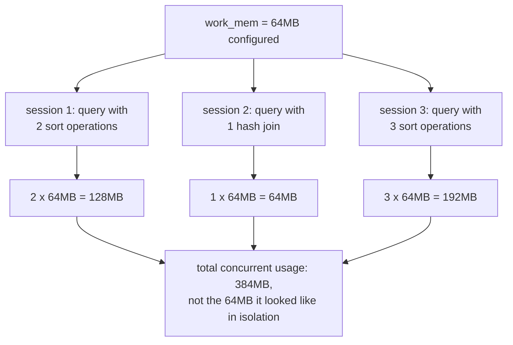

# Lesson 12. Configuration and Memory Tuning

**Mission link:** Lesson 1 described the dirty data pages sitting in memory before a checkpoint flushes them; this lesson names the setting that actually sizes that memory (`shared_buffers`), and the two other memory settings operating a real instance depends on getting right, `work_mem` and `maintenance_work_mem`, which answer genuinely different questions from `shared_buffers` and from each other.
**Primary source:** [Docs: "Resource Consumption", PostgreSQL](https://www.postgresql.org/docs/current/runtime-config-resource.html)
**Prerequisites:** [Lesson 11](0011-backup-and-point-in-time-recovery.md), [Checkpoint](../GLOSSARY.md)

## Warm-up

1. ▢ Why doesn't a base backup need to be internally consistent by itself?

Check

Because replaying the WAL generated during and after the backup corrects those inconsistencies during recovery, the same replay mechanism crash recovery uses, just starting from a base backup's files instead of the last checkpoint.

2. ▢ Why must a recovery target for point-in-time recovery fall strictly after the base backup's own completion time?

Check

The base backup's files already reflect state up to (and inconsistently around) that completion time, with no WAL available to replay backward past it; reaching an earlier moment requires an earlier base backup and its own WAL archive instead.

## Know this

### `shared_buffers`: Postgres's own cache, sized against the OS's

**`shared_buffers`** is the memory Postgres reserves for its own cache of data pages, the same dirty pages lesson 1 described sitting in memory before a checkpoint flushes them to disk. A commonly cited starting point for a dedicated database server is 25% of system memory, rarely raised past 40%, and that ceiling isn't arbitrary: Postgres relies on the operating system's own disk cache as well, so pushing `shared_buffers` far higher risks caching the same pages twice, once in Postgres's own buffers and again in the OS cache, without a proportional benefit. Raising `shared_buffers` substantially also typically requires raising `max_wal_size` alongside it, since a larger buffer pool tends to accumulate more dirty pages between checkpoints, which a too-small `max_wal_size` would otherwise force to checkpoint away sooner than intended.

### `work_mem`: per operation, not per connection, and not even per query

**`work_mem`** sets the memory one sort or hash operation is allowed before spilling to a temporary file on disk, and the trap in tuning it is assuming it's a per-connection or per-query ceiling. It isn't: a single complex query can run several sort or hash operations concurrently, each claiming up to `work_mem` independently, and a busy server runs many such queries across many sessions at once. A value that looks perfectly reasonable tested against one query in isolation can multiply, unnoticed, into far more total memory than the server actually has once real concurrent load hits it.

### `maintenance_work_mem`: safe to set higher, but with its own multiplication trap

**`maintenance_work_mem`** bounds memory for maintenance operations, `VACUUM`, `CREATE INDEX`, `ALTER TABLE ADD FOREIGN KEY`, and because these rarely all run in large numbers concurrently the way ordinary queries do, it's normally safe to set well above `work_mem`. But this setting has its own version of `work_mem`'s multiplication trap: **autovacuum** can allocate up to `maintenance_work_mem` *per worker*, up to `autovacuum_max_workers` workers running at once, unless **`autovacuum_work_mem`** is configured separately to cap autovacuum's own usage independently. A `maintenance_work_mem` sized generously for an occasional manual `CREATE INDEX` can, left uncapped for autovacuum specifically, multiply by however many autovacuum workers happen to be active simultaneously.

### Checkpoint tuning: `checkpoint_timeout` and `max_wal_size` trigger it, `checkpoint_completion_target` shapes it

Lesson 1 established the trade-off checkpoints make: more frequent checkpoints bound crash-recovery time more tightly at the cost of more day-to-day I/O. The actual triggers are **`checkpoint_timeout`** (a checkpoint at least this often, 5 minutes by default) and **`max_wal_size`** (a checkpoint once WAL volume approaches this size), whichever comes first, so a burst of write activity can trigger a checkpoint well before the timeout elapses if `max_wal_size` is set too small for that burst's volume. **`checkpoint_completion_target`** (0.9 by default) doesn't change how often checkpoints happen; it spreads a checkpoint's own dirty-page-flushing I/O across roughly that fraction of the interval until the next one, trading a smoother, sustained I/O rate for a checkpoint that takes nearly the whole interval to finish, rather than bursting all its writes immediately and then sitting idle.

## Practice

1. ▢ A server has 32GB of RAM and is configured with `shared_buffers` set to 28GB, reasoning "more cache is always better." What's the problem with this configuration?

Hint

Consider what else on the server also wants to cache the same data pages.

Check

This leaves very little memory for the operating system's own disk cache, and for `work_mem`/`maintenance_work_mem` allocations, connection overhead, and everything else the server needs. Since Postgres already relies on the OS cache as a second layer, an oversized `shared_buffers` risks double-caching the same pages in both layers rather than actually expanding how much distinct data can be cached, which is why guidance caps it well below 100% of RAM.

2. ▢ A team tests a report query in isolation, sees it uses about 100MB with `work_mem = 100MB`, and concludes that's a safe setting for the whole server. What did their test miss?

Check

`work_mem` is a per-operation limit, not a per-query or per-connection one: a single query can run multiple sorts or hash joins concurrently, and a real production server runs many queries across many sessions at once, each independently able to claim up to `work_mem` per operation. Their isolated single-query test never exercised that concurrency, so it never revealed how large the real, simultaneous total could get under actual load.

3. ▢ `maintenance_work_mem` is set to 1GB to speed up occasional manual `CREATE INDEX` runs, and `autovacuum_max_workers` is left at its default. What additional setting should be checked before assuming this is safe, and why?

Check

`autovacuum_work_mem`, which defaults to inheriting `maintenance_work_mem` unless configured separately. Without capping it independently, every concurrently running autovacuum worker, up to `autovacuum_max_workers` of them, can allocate up to the full 1GB each, multiplying the same way `work_mem` does across concurrent operations, just in a maintenance-memory disguise.

4. ▢ A server's `max_wal_size` is left at its low default, but a batch job generates a large burst of write traffic that fills that much WAL well before `checkpoint_timeout` would have elapsed. What happens, and why?

Check

A checkpoint triggers early, driven by `max_wal_size` rather than `checkpoint_timeout`, since a checkpoint happens whichever of the two conditions is reached first. A `max_wal_size` sized too small for the write volume the server actually sees means checkpoints trigger more often than the timeout alone would suggest, adding I/O overhead beyond what the timeout setting implied on its own.

5. ▢ Which claim correctly distinguishes what these settings each control?

    - a) `shared_buffers`, `work_mem`, and `maintenance_work_mem` all draw from the same memory pool, so raising one automatically lowers what's available to the others at runtime
    - b) `shared_buffers` sizes Postgres's own page cache against the OS's; `work_mem` bounds one sort/hash operation and multiplies by however many run concurrently; `maintenance_work_mem` bounds maintenance operations and multiplies by concurrent autovacuum workers unless `autovacuum_work_mem` caps that separately
    - c) `checkpoint_completion_target` controls how often checkpoints happen, the same job `checkpoint_timeout` and `max_wal_size` do
    - d) Setting `work_mem` based on a single isolated query test reliably predicts total memory use under concurrent production load

Check

**b)** That's the precise question each setting answers, and the multiplication trap specific to each of the two per-operation ones. (a) is false: these are independent configuration values, not a shared, dynamically-divided pool. (c) is false: `checkpoint_completion_target` shapes how a checkpoint's I/O is spread across its interval, not how often checkpoints are triggered. (d) is false: a single-query test never exercises the concurrency that makes `work_mem`'s real total usage far larger in production.

## Real-world reps

- [ ] For a Postgres instance you have access to, check its current `shared_buffers` as a percentage of total system RAM, and whether that instance's workload actually benefits from raising or lowering it.
- [ ] Check that instance's `work_mem` and estimate, from its typical concurrent connection count and query complexity, roughly how much total memory could be claimed under peak concurrent load rather than in an isolated test.
- [ ] Tomorrow: read the primary source's resource-consumption chapter in full, and note what `autovacuum_work_mem` is currently set to on an instance you operate, and whether it's actually capping autovacuum's memory independently of `maintenance_work_mem` or just inheriting it.

## Going further

- [Docs: "Resource Consumption", PostgreSQL](https://www.postgresql.org/docs/current/runtime-config-resource.html)
- [Docs: "Write Ahead Log" configuration, PostgreSQL](https://www.postgresql.org/docs/current/runtime-config-wal.html)
- [Resources](../RESOURCES.md)

---

Not landing? Reread the primary source at the top, since this lesson compresses it and compression is where understanding leaks. Check the [glossary](../GLOSSARY.md) for any term that felt slippery.

If the lesson itself is unclear rather than the material, that is a defect: [open an issue](https://github.com/TokenCemetery/teach/issues).
