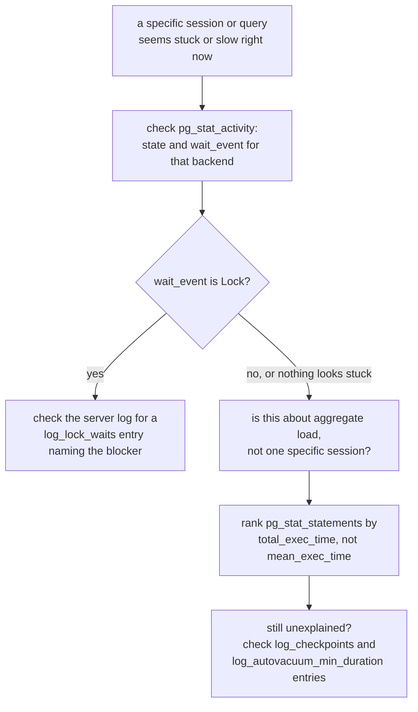

# Lesson 13. Monitoring: Activity, Statements, and the Log

**Mission link:** Lesson 3 already named `pg_stat_activity` in passing as one of the views that reveals what's holding back the vacuum horizon. This lesson gives that view, and the two other monitoring surfaces operating a real instance depends on, `pg_stat_statements` and the server log, their own full treatment, and a diagnostic order for combining them.
**Primary source:** [Docs: "The Statistics Collector", PostgreSQL](https://www.postgresql.org/docs/current/monitoring-stats.html)
**Prerequisites:** [Lesson 12](0012-configuration-and-memory-tuning.md), [Checkpoint](../GLOSSARY.md)

## Warm-up

1. ▢ Why is `work_mem` a per-operation limit rather than a per-connection one, and what does that mean for tuning it?

Check

A single query can run multiple sorts or hash joins concurrently, each independently claiming up to `work_mem`, and a busy server runs many such queries across many sessions at once; a value that looks safe tested against one query in isolation can multiply into far more total memory than the server has once real concurrent load hits it.

2. ▢ What does `checkpoint_completion_target` actually control, as distinct from `checkpoint_timeout` and `max_wal_size`?

Check

`checkpoint_timeout` and `max_wal_size` decide how often a checkpoint is triggered; `checkpoint_completion_target` decides how a triggered checkpoint's own I/O is spread across the interval until the next one, trading a smoother sustained rate for one that takes nearly the whole interval instead of bursting immediately.

## Know this

### `pg_stat_activity`: a live snapshot, and why `state` and `wait_event` are two separate questions

**`pg_stat_activity`** shows every current backend and its **`state`** (`active`, `idle`, `idle in transaction`, `idle in transaction (aborted)`, and a few others). A backend can also have a non-null **`wait_event`**/**`wait_event_type`**, and these columns operate independently from `state`: a backend showing `state = active` with a non-null `wait_event` means a query is genuinely running but currently stalled waiting on something specific, a lock, an I/O operation, an internal lightweight lock, rather than actually executing code at that instant. Joining against `pg_wait_events` turns the wait event's short code into a human-readable description of exactly what it's stuck on.

**`idle in transaction`** deserves particular attention: a session that opened a transaction and then went idle without committing or rolling back still holds whatever snapshot and locks that transaction acquired. This is precisely the kind of session lesson 3 pointed at as one of the things `pg_stat_activity` reveals holding back the vacuum horizon; an application bug that opens a transaction and forgets to close it can quietly block vacuum from reclaiming dead tuples cluster-wide, long after the query that started it has finished.

### `pg_stat_statements`: aggregate cost across every execution, not a live snapshot

**`pg_stat_statements`** is a different kind of view entirely: an extension (loaded via `shared_preload_libraries` and `CREATE EXTENSION`) that accumulates statistics across every execution of a query since the last reset, one row per distinct combination of database, user, and **query ID**. It **normalizes** queries first, replacing literal constants with placeholders (`$1`, `$2`, ...), so that semantically identical queries differing only in their literal values, or even in how many elements a value list contains, collapse into the same row rather than fragmenting into many nearly-identical entries.

The skill worth having here is ranking by the right column for the actual question: **`total_exec_time`** (the aggregate time this query has cost the server across every call) answers "what's actually costing the most, overall," while **`mean_exec_time`** (`total_exec_time` divided by `calls`) answers "what's slowest per call." A query executed 100,000 times at 2 milliseconds each can dominate a server's total load far more than a rare query that takes 5 seconds once, even though the rare query looks alarming by itself; ranking by mean time alone would miss that entirely.

### Wait events turn "it's slow" into "it's waiting on this, specifically"

A query that's simply taking a long time to run and a query that's stalled behind a lock look identical from the outside, both just appear slow, but `pg_stat_activity`'s `wait_event`/`wait_event_type` columns distinguish them directly: a `Lock` wait event means the backend is blocked behind another session holding a conflicting lock, an `IO` wait event points at storage, and an `LWLock` wait event points at internal contention over a specific piece of shared server state. This is a genuinely more actionable signal than duration alone, since "slow" by itself gives no lead on where to look next, while a specific wait event does.

### The server log: the settings that turn silent background work into a paper trail

Several logging settings turn otherwise-invisible background activity into log entries worth watching. **`log_min_duration_statement`** logs any statement running at least the configured duration, and crucially forces the query text itself to be logged once a statement exceeds it, unlike `log_duration` alone. **`log_lock_waits`** logs a message once a backend has waited longer than `deadlock_timeout` for a lock, naming exactly what it's stuck behind rather than leaving it as an unexplained `Lock` wait event with no further detail. **`log_checkpoints`** (on by default) logs each checkpoint's buffer-write statistics and duration, the direct evidence of whether the checkpoint tuning from lesson 12 is actually behaving as intended rather than a guess. **`log_autovacuum_min_duration`** (a 10-minute threshold by default) logs any autovacuum run taking at least that long, catching a table's autovacuum quietly falling behind, lesson 3's bloat-diagnosis concern, directly in the log rather than only inferring it after the fact from bloat symptoms.

## Practice

1. ▢ A backend in `pg_stat_activity` shows `state = active` and `wait_event_type = Lock`. Is this backend currently executing its query's logic?

Hint

Consider what `state` and `wait_event` each report, and whether they always move together.

Check

No, not at that instant. `state` and `wait_event` operate independently; `active` with a non-null `wait_event` means a query is genuinely running but currently stalled waiting on something specific, in this case a lock held by another session, rather than actively executing code right now.

2. ▢ A session opens a transaction, runs one query, and then the application hangs without ever committing or rolling back. What does `pg_stat_activity` show for this session, and why does it matter beyond that one session?

Check

It shows `state = idle in transaction`. It matters beyond the one session because that open transaction still holds whatever snapshot and locks it acquired; lesson 3 identified exactly this kind of session as something that can hold back the vacuum horizon cluster-wide, blocking dead-tuple reclamation everywhere, not just in the table this session touched.

3. ▢ A team ranks `pg_stat_statements` by `mean_exec_time` and finds a rarely-run report query at the top, taking 8 seconds per call. They conclude this is the query costing the server the most. What might this conclusion miss?

Check

Ranking by `mean_exec_time` surfaces the slowest query per call, not the query costing the server the most in aggregate; a query called far more often at a much smaller per-call time can have a larger `total_exec_time` and therefore be consuming more of the server's actual total capacity, even though it never looks alarming in any single execution.

4. ▢ A query appears to be running slowly, and its `pg_stat_activity` row shows `wait_event_type = Lock`. What server log setting would name specifically what it's blocked behind, rather than leaving it as an unexplained wait?

Check

`log_lock_waits`, which logs a message once a backend has waited longer than `deadlock_timeout` for a lock, naming the specific lock contention rather than leaving the diagnosis at "it's waiting on some lock."

5. ▢ Which claim correctly distinguishes the three monitoring surfaces this lesson covers?

    - a) `pg_stat_activity`, `pg_stat_statements`, and the server log all report the exact same information in different formats
    - b) `pg_stat_activity` is a live snapshot of current backend state and wait events; `pg_stat_statements` is an aggregate, cross-execution view of query cost since the last reset; the server log turns specific background events (slow statements, lock waits, checkpoints, slow autovacuum runs) into a searchable record
    - c) Ranking `pg_stat_statements` by `mean_exec_time` and by `total_exec_time` always surfaces the same query at the top
    - d) A backend with `state = active` is always executing its query's logic at that instant, regardless of its `wait_event` column

Check

**b)** That's the precise distinction each surface draws. (a) is false: each answers a genuinely different question, live per-backend state, aggregate per-query cost, and specific logged events, respectively. (c) is false: a high-call-count, low-latency query and a rare, high-latency query rank very differently depending on which column is used. (d) is false: `state` and `wait_event` are independent, and `active` with a non-null `wait_event` means the query is currently stalled, not actively executing.

## Real-world reps

- [ ] On a Postgres instance you have access to, run a query against `pg_stat_activity` filtered to non-null `wait_event`, and note what, if anything, is currently waiting and on what.
- [ ] If `pg_stat_statements` is enabled on an instance you operate, rank its entries by `total_exec_time` and separately by `mean_exec_time`, and compare which queries top each list.
- [ ] Tomorrow: read the primary source's statistics-collector chapter in full, and check whether `log_lock_waits`, `log_checkpoints`, and `log_autovacuum_min_duration` are actually enabled on an instance you operate, or left at whatever the distribution's default happened to set.

## Going further

- [Docs: "The Statistics Collector", PostgreSQL](https://www.postgresql.org/docs/current/monitoring-stats.html)
- [Docs: "pg_stat_statements", PostgreSQL](https://www.postgresql.org/docs/current/pgstatstatements.html)
- [Docs: "Error Reporting and Logging", PostgreSQL](https://www.postgresql.org/docs/current/runtime-config-logging.html)
- [Resources](../RESOURCES.md)

---

Not landing? Reread the primary source at the top, since this lesson compresses it and compression is where understanding leaks. Check the [glossary](../GLOSSARY.md) for any term that felt slippery.

If the lesson itself is unclear rather than the material, that is a defect: [open an issue](https://github.com/TokenCemetery/teach/issues).
