# Lesson 14. Connection Management and PgBouncer

**Mission link:** Lesson 13's `pg_stat_activity` showed every current backend; this lesson explains why that backend count can't just be raised without limit whenever an application wants more concurrency, and the tool most deployments reach for once it can't.
**Primary source:** [Docs: "Connection Settings", PostgreSQL](https://www.postgresql.org/docs/current/runtime-config-connection.html)
**Prerequisites:** [Lesson 13](0013-monitoring-activity-statements-and-the-log.md), [Checkpoint](../GLOSSARY.md)

## Warm-up

1. ▢ A backend in `pg_stat_activity` shows `state = idle in transaction`. Why does this matter beyond that one session?

Check

That session still holds the snapshot and locks its open transaction acquired, and this is one of the states that can hold back the vacuum horizon cluster-wide, blocking dead-tuple reclamation everywhere, not only in whatever table this session touched.

2. ▢ Why does ranking `pg_stat_statements` by `total_exec_time` sometimes surface a different query at the top than ranking by `mean_exec_time`?

Check

`total_exec_time` answers what's costing the server the most in aggregate, while `mean_exec_time` answers what's slowest per call; a query executed enormously often at a small per-call cost can have a larger aggregate total than a rare, individually slow query, so the two rankings can point at genuinely different queries.

## Know this

### Every connection is a full OS process, not a lightweight handle

Postgres uses a **process-per-connection** model: each client connection gets its own dedicated backend OS process, not a lightweight thread or a shared worker pulled from some smaller internal pool. **`max_connections`** (100 by default) caps how many of these processes can exist at once, and it's expensive to raise carelessly for two reasons: every additional connection costs real memory whether or not it's currently doing anything, and Postgres sizes certain shared-memory resources directly based on `max_connections` at server startup, which is why changing it requires a restart rather than taking effect live. An idle connection isn't free just because it's idle.

### Why "just open more connections" doesn't scale the way it seems like it should

An application under load that responds to slowness by opening more database connections runs directly into the cost `max_connections` represents: more connections means more OS processes and more of that startup-sized shared memory in use, and past a certain point the overhead of managing that many processes competes with the actual query work those processes are trying to do. A **connection pooler** solves this by reusing a much smaller number of actual Postgres server connections across a much larger number of client connections, so the application-facing connection count and the number of real backend processes Postgres has to run are no longer the same number at all.

### PgBouncer's three pooling modes bind a client to a server connection for a different length of time

**PgBouncer**'s `pool_mode` setting decides exactly when a server connection gets released back to the pool for another client to use, and that choice is also what decides which client behaviors still work correctly. **Session mode** (the default) releases the server connection only when the client disconnects, preserving full session semantics, but with the least pooling benefit, since one client ties up one server connection for as long as it stays connected, active or not. **Transaction mode** releases the server connection the moment a transaction finishes, letting far more client connections share the same pool of server connections, but a client's next transaction can land on a completely different server connection with different session state, so anything depending on session state surviving across transactions, `SET` (outside a transaction), `LISTEN`/`NOTIFY`, session-level advisory locks, and SQL-level `PREPARE`/`EXECUTE` (PgBouncer doesn't track or rewrite these across pooled connections) can silently break or behave inconsistently. **Statement mode** releases the server connection after every single query, which is the most aggressive reuse but disallows multi-statement transactions outright: a client simply cannot hold a transaction open across more than one statement in this mode.

```mermaid
flowchart TD
    subgraph Session["session mode (default)"]
        S1["client connects"] --> S2["bound to one server connection<br>for the entire session"]
        S2 --> S3["released only when the client disconnects"]
    end
    subgraph Transaction["transaction mode"]
        T1["client starts a transaction"] --> T2["bound to a server connection<br>for that transaction only"]
        T2 --> T3["released the instant the transaction ends;<br>the next transaction may land elsewhere"]
    end
    subgraph Statement["statement mode"]
        M1["client sends one query"] --> M2["bound to a server connection<br>for that query only"]
        M2 --> M3["released immediately;<br>multi-statement transactions disallowed"]
    end
```

### What actually happens when a server connection is handed back to the pool

In session mode, PgBouncer runs **`server_reset_query`** (`DISCARD ALL` by default) on a server connection before handing it to the next client, clearing session state like prepared statements and temporary tables so the next client gets a clean slate rather than inheriting leftovers from whoever used that connection before. This reset step is deliberately skipped in transaction mode: since clients in that mode are already expected not to rely on session-based features surviving between transactions, resetting per-transaction would be redundant overhead for a guarantee the mode doesn't offer anyway.

## Practice

1. ▢ A team notices their application's response to increased load is to open more database connections, and that this eventually makes performance worse rather than better. Why does raising connection count past a certain point work against them rather than for them?

Hint

Consider what each additional connection actually is in Postgres's process model, not just a number in a counter.

Check

Each connection is a full OS process, and Postgres sizes shared-memory resources based on `max_connections` at startup, so more connections means more real memory and process-management overhead regardless of whether those connections are doing useful work. Past a point, that overhead competes with the actual query processing capacity the extra connections were meant to provide.

2. ▢ Why does raising `max_connections` require a server restart rather than taking effect immediately?

Check

Postgres sizes certain shared-memory resources directly based on `max_connections` when the server starts, so changing the value means the server needs to reallocate that shared memory at startup rather than resize it on the fly while running.

3. ▢ An application uses PgBouncer in transaction mode and relies on a session-level advisory lock acquired in one transaction still being held during a later, separate transaction from the same client. Does this work reliably?

Check

No. In transaction mode, a server connection is released back to the pool the instant a transaction finishes, and the client's next transaction can land on an entirely different server connection with different session state; a session-level advisory lock tied to the first connection would not carry over to whichever connection the next transaction happens to use.

4. ▢ A client attempts to run a multi-statement transaction (`BEGIN`, then several separate statements, then `COMMIT`) against PgBouncer configured in statement mode. What happens?

Check

This isn't allowed: statement mode releases the server connection after every single query, and multi-statement transactions are explicitly disallowed in this mode, since there's no way to keep one transaction bound to one server connection across more than a single statement.

5. ▢ Which claim correctly distinguishes PgBouncer's three pooling modes?

    - a) All three modes preserve full session state identically; they only differ in how quickly the connection is returned to the pool
    - b) Session mode releases on client disconnect, preserving full session semantics; transaction mode releases per-transaction, breaking session-dependent features like advisory locks and `LISTEN`/`NOTIFY`; statement mode releases per-query and disallows multi-statement transactions entirely
    - c) Transaction mode is strictly safer than session mode, since it reuses connections more efficiently
    - d) `server_reset_query` runs identically in all three modes to guarantee a clean session for the next client

Check

**b)** That's the exact trade each mode makes between reuse efficiency and preserved session semantics. (a) is false: the three modes differ specifically in what session-level behavior survives, not just timing. (c) is false: "safer" depends on what the application actually needs; transaction mode is more efficient but breaks features an application might depend on, which isn't automatically safer. (d) is false: `server_reset_query` is specifically skipped in transaction mode, since clients there aren't meant to rely on session state surviving at all.

## Real-world reps

- [ ] For a Postgres instance you operate or have access to, check its current `max_connections` and estimate how much of that is actually needed at peak, versus how many connections sit mostly idle.
- [ ] If your application uses PgBouncer or a similar pooler, check which `pool_mode` it's configured with, and confirm that mode against what your application actually depends on (session state, advisory locks, prepared statements, or multi-statement transactions).
- [ ] Tomorrow: read the primary source's connection-settings section in full, and note what `reserved_connections` and `superuser_reserved_connections` are set to on an instance you operate, and whether those reserved slots would actually be available in a real connection-exhaustion incident.

## Going further

- [Docs: "Connection Settings", PostgreSQL](https://www.postgresql.org/docs/current/runtime-config-connection.html)
- [Docs: "pgbouncer.ini", PgBouncer](https://www.pgbouncer.org/config.html)
- [Resources](../RESOURCES.md)

---

Not landing? Reread the primary source at the top, since this lesson compresses it and compression is where understanding leaks. Check the [glossary](../GLOSSARY.md) for any term that felt slippery.

If the lesson itself is unclear rather than the material, that is a defect: [open an issue](https://github.com/TokenCemetery/teach/issues).
