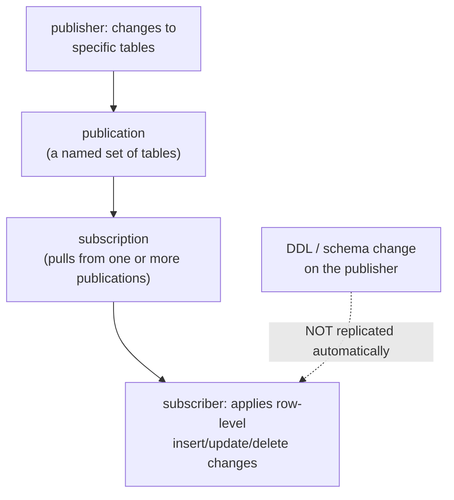

# Lesson 15. Logical Replication, Publications, and Subscriptions

**Mission link:** Lessons 4 through 6 covered streaming replication: an identical, whole-cluster standby built by replaying raw WAL. This lesson covers a genuinely different tool built on the same underlying log, one that decodes those WAL records into row-level changes a subscriber can apply selectively, which is what makes the low-downtime major-version upgrade in lesson 16 possible in the first place.
**Primary source:** [Docs: "Logical Replication", PostgreSQL](https://www.postgresql.org/docs/current/logical-replication.html)
**Prerequisites:** [Lesson 4](0004-streaming-replication-and-slots.md), [Write-ahead log (WAL)](../GLOSSARY.md)

## Warm-up

1. ▢ Why does Postgres's process-per-connection model make raising `max_connections` an expensive, restart-only decision?

Check

Each connection is a full OS process, costing real memory whether or not it's active, and Postgres sizes certain shared-memory resources directly based on `max_connections` at startup, so changing the setting requires reallocating that memory at server start rather than adjusting it live.

2. ▢ In PgBouncer's transaction pooling mode, why can a session-level advisory lock acquired in one transaction fail to carry over to a later transaction from the same client?

Check

Transaction mode releases a server connection back to the pool the instant a transaction finishes, and the client's next transaction can land on an entirely different server connection with different session state; a session-level lock tied to the first connection doesn't follow the client to whichever connection its next transaction happens to use.

## Know this

### Streaming replication ships WAL bytes; logical replication decodes them into row-level changes

Streaming replication (lessons 4 through 6) ships the primary's raw WAL records to a standby, which replays them the same way crash recovery would, byte-for-byte, whole-cluster, and only between servers running the same major version. **Logical replication** starts from that same WAL stream but decodes it into a sequence of row-level change events, insert, update, delete, tied to each table's **replication identity** (typically its primary key), rather than raw physical byte changes to disk pages. That decoding step is what makes everything else about logical replication different: it can replicate a chosen subset of tables instead of the whole cluster, and it can replicate between servers running different major versions, since it operates on logical row changes rather than a physical, version-specific disk format.

### Publications and subscriptions: a publish-and-subscribe model, not a fixed primary/standby pair

Logical replication follows a **publish-and-subscribe** model: a **publication**, created on the source server, names a specific set of tables whose changes should be exposed. A **subscription**, created on the destination server, connects to one or more publications and pulls their changes. Replication for a new subscription begins with an initial snapshot copy of the published tables' existing data, after which incremental changes stream continuously and get applied in the same commit order the publisher used, preserving transactional consistency, the same ordering guarantee streaming replication's WAL replay provides, just delivered as decoded row changes instead of raw WAL.

### The restriction that matters most: DDL isn't replicated at all

Logical replication does not automatically replicate schema changes: a `CREATE TABLE`, `ALTER TABLE`, or any other DDL command run on the publisher has no effect on the subscriber's schema on its own. The initial schema for a new subscription has to be copied manually (`pg_dump --schema-only` is the documented approach), and every later schema change has to be applied to the subscriber by hand as well. If a row arrives that doesn't fit the subscriber's current table shape, replication doesn't silently drop or reshape it; it **pauses with an error** until the subscriber's schema is manually brought up to date. Applying additive schema changes (like adding a nullable column) to the subscriber *first*, before the publisher, is the documented way to avoid that pause entirely, since the subscriber's wider schema can already accept rows shaped either the old or new way.

### Why the combination of row-level scope and cross-version support matters

Streaming replication's whole-cluster, same-version copy is exactly the right tool for a hot standby ready to take over on failover, lesson 5's concern. Logical replication's selective, cross-version replication is the right tool for a different job entirely: migrating a subset of data somewhere else, feeding a different system that only needs certain tables, or, as lesson 16 covers, standing up a copy of the database running a *different* major version of Postgres while the original keeps serving traffic, something streaming replication's same-version requirement makes impossible on its own.

## Practice

1. ▢ A team runs `ALTER TABLE orders ADD COLUMN discount numeric;` on a publisher with an active logical replication subscription, expecting the subscriber's table to pick up the new column automatically. What actually happens?

Hint

Consider what kind of change logical replication decodes from the WAL, versus what kind of change this is.

Check

Nothing happens to the subscriber's schema automatically; DDL is not replicated by logical replication at all. The subscriber's table keeps its old shape until the same `ALTER TABLE` is applied to it manually, and if a row referencing the new column arrives before that happens, replication pauses with an error rather than silently adapting.

2. ▢ Why does applying an additive schema change (adding a new nullable column) to the subscriber *before* the publisher avoid a replication pause, when doing it in the opposite order might not?

Check

If the subscriber's schema already has the wider shape (with the new column) before the publisher starts sending rows that include it, incoming rows continue fitting the subscriber's table regardless of which shape they were written in on the publisher's side. Applying the change to the publisher first, before the subscriber, risks rows arriving that don't yet fit the subscriber's still-old schema, which is exactly the mismatch that pauses replication with an error.

3. ▢ Can logical replication be used to replicate a Postgres 15 publisher to a Postgres 18 subscriber, something streaming replication cannot do?

Check

Yes. Logical replication decodes WAL into logical, row-level change events rather than replaying raw, version-specific physical WAL, so it isn't tied to matching major versions the way streaming replication is; this cross-version capability is exactly what makes it usable as a major-version upgrade path.

4. ▢ A team wants to replicate only their `orders` and `customers` tables to a reporting database, leaving the rest of the schema out entirely. Which replication approach fits, and why wouldn't streaming replication work for this?

Check

Logical replication fits, since a publication can name a specific subset of tables. Streaming replication wouldn't work for this because it replicates the whole cluster's WAL, producing an identical, complete copy of every database and table, with no mechanism to select only certain tables.

5. ▢ Which claim correctly distinguishes logical replication from streaming replication?

    - a) Logical replication ships the same raw WAL bytes as streaming replication, just to a differently-configured standby
    - b) Logical replication decodes WAL into row-level changes, allowing per-table selection and cross-major-version replication, but does not automatically replicate DDL, unlike streaming replication's whole-cluster, byte-level copy
    - c) DDL changes are replicated by logical replication just as automatically as row-level data changes
    - d) Streaming replication can select a subset of tables to replicate, the same way a logical replication publication can

Check

**b)** That's the precise trade this lesson establishes: selectivity and cross-version support, at the cost of manual DDL handling. (a) is false: logical replication decodes WAL into logical row changes rather than shipping the same physical bytes. (c) is false: DDL is explicitly not replicated automatically, one of logical replication's stated restrictions. (d) is false: streaming replication copies the whole cluster; it has no per-table selection mechanism at all.

## Real-world reps

- [ ] If you have access to a Postgres instance using logical replication, check what publications and subscriptions currently exist, and confirm whether the subscriber's schema is actually kept in sync manually, or has ever drifted.
- [ ] For a table you might want to replicate selectively (to a reporting system, for example), sketch what a publication and subscription for just that table would look like.
- [ ] Tomorrow: read the primary source's restrictions section in full, and note what else besides DDL is listed as not replicated by logical replication (sequences and large objects are worth checking specifically).

## Going further

- [Docs: "Logical Replication", PostgreSQL](https://www.postgresql.org/docs/current/logical-replication.html)
- [Docs: "High Availability, Load Balancing, and Replication", PostgreSQL](https://www.postgresql.org/docs/current/high-availability.html)
- [Resources](../RESOURCES.md)

---

Not landing? Reread the primary source at the top, since this lesson compresses it and compression is where understanding leaks. Check the [glossary](../GLOSSARY.md) for any term that felt slippery.

If the lesson itself is unclear rather than the material, that is a defect: [open an issue](https://github.com/TokenCemetery/teach/issues).
