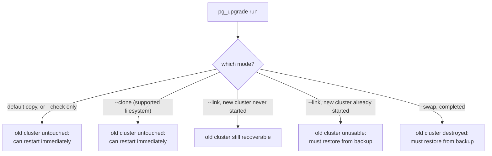

# Lesson 16. Major-Version Upgrades and pg_upgrade

**Mission link:** Lesson 15's logical replication, decoding WAL into row-level changes a subscriber on a different major version can apply, is what makes this lesson's low-downtime upgrade path possible. This lesson covers the other route, `pg_upgrade`'s in-place transfer, what its faster modes cost in revert safety, and when reaching for logical replication instead is the better trade.
**Primary source:** [Docs: "pg_upgrade", PostgreSQL](https://www.postgresql.org/docs/current/pgupgrade.html)
**Prerequisites:** [Lesson 15](0015-logical-replication-publications-and-subscriptions.md), [Base backup](../GLOSSARY.md)

## Warm-up

1. ▢ Why does logical replication support replicating between different major versions of Postgres, when streaming replication cannot?

Check

Logical replication decodes WAL into logical, row-level change events rather than replaying raw, version-specific physical WAL bytes, so it isn't tied to matching major versions the way streaming replication's byte-level replay is.

2. ▢ Why does a DDL change made only on a logical replication publisher not automatically appear on the subscriber?

Check

Logical replication does not replicate schema changes at all; the initial schema has to be copied manually, and every later DDL change has to be applied to the subscriber by hand, or replication pauses with an error once a row arrives that doesn't fit the subscriber's current schema.

## Know this

### `pg_upgrade`: transferring data files directly instead of a full dump and reload

**`pg_upgrade`** upgrades a Postgres instance to a new major version by transferring its actual data files to a new cluster running the new version, rather than dumping every row out and reloading it, which is what made major-version upgrades painfully slow before `pg_upgrade` existed. Before doing anything, it runs compatibility checks (available standalone via `--check`) that can surface real blockers: extensions that need to be upgraded to versions compatible with the new server first, or object types that changed between versions, are common reasons a check fails and has to be resolved before the actual upgrade can run.

### The transfer modes trade speed for whether the old cluster survives

`pg_upgrade` supports several ways to actually move the data:

- **Copy mode** (the default): fully copies every data file to the new cluster. Slowest, but the old cluster is completely untouched and can be restarted immediately if anything about the upgrade goes wrong.
- **Link mode** (`-k`/`--link`): uses hard links instead of copying, much faster and using no extra disk space, but once the new cluster has been started, the old cluster is disabled and cannot simply be restarted; recovering it requires restoring from a backup.
- **Clone mode** (`--clone`): uses filesystem-level file cloning (reflinks, on filesystems that support it, such as Btrfs, XFS, or APFS) for near-instant transfer while leaving the old cluster fully intact, effectively combining link mode's speed with copy mode's safety, where the filesystem allows it.
- **Swap mode**: the fastest option for installations with many relations, but destructive: once it completes, the old cluster cannot be recovered without restoring from backup.

### Statistics don't fully carry over, even though most of them now do

`pg_upgrade` transfers most optimizer statistics from the old cluster to the new one automatically (unless `--no-statistics` is specified), but this transfer explicitly excludes extended statistics created with `CREATE STATISTICS`, custom extension-defined statistics, and cumulative statistics. The documented follow-up is to run `vacuumdb --analyze-in-stages --missing-stats-only` to quickly produce usable statistics for whatever wasn't transferred, followed by `vacuumdb --analyze-only` to bring cumulative statistics up to date across every relation. Assuming the upgrade alone leaves every table's statistics fully current is the mistake worth naming here: most are carried over, but not all, and skipping the follow-up `vacuumdb` steps can leave the query planner working from incomplete information on exactly the statistics types that weren't transferred.

### Logical replication as the low-downtime alternative

Instead of taking the whole cluster offline for `pg_upgrade`'s in-place transfer, a standby running the new major version can be stood up as a logical replication subscriber (lesson 15) while the old primary keeps serving live traffic. Once that subscriber has caught up, cutting over, redirecting clients to the new version and stopping writes to the old one, reduces the actual downtime to roughly the time it takes to make that switch, on the order of seconds, rather than however long an in-place `pg_upgrade` run and its verification would take. The cost is exactly lesson 15's restriction: schema changes during that migration window still have to be applied to the subscriber by hand, and the whole logical-replication setup and catch-up process is more operational work up front than running `pg_upgrade` directly.

## Practice

1. ▢ A team runs `pg_upgrade` in link mode, starts the new cluster, and then discovers a serious problem with the upgraded data. Can they simply restart the old cluster to recover?

Hint

Consider what link mode does to the old cluster specifically once the new cluster has actually started.

Check

No. Once the new cluster has been started after a link-mode upgrade, the old cluster is disabled and cannot simply be restarted; recovering at that point requires restoring from a backup taken before the upgrade, which is exactly why lesson 11's tested-restore discipline matters before attempting an upgrade like this.

2. ▢ A team on a filesystem that supports reflinks (such as Btrfs or XFS) wants both `pg_upgrade`'s fastest possible transfer and the ability to fall back to the old cluster if something goes wrong. Which mode fits, and why does it succeed at both where link mode doesn't?

Check

Clone mode (`--clone`). It uses filesystem-level file cloning for a transfer nearly as fast as link mode's hard links, but unlike link mode, it leaves the old cluster fully intact and restartable, since cloning doesn't disable the source files the way link mode's hard-linking approach does.

3. ▢ After a `pg_upgrade` run, a team assumes every table's query planner statistics are fully up to date because "pg_upgrade handles statistics now." What might they be missing?

Check

`pg_upgrade` transfers most optimizer statistics automatically, but explicitly excludes extended statistics from `CREATE STATISTICS`, custom extension-defined statistics, and cumulative statistics. Without the documented follow-up, running `vacuumdb --analyze-in-stages --missing-stats-only` and then `vacuumdb --analyze-only`, those specific categories can be left stale or missing even though most statistics did carry over.

4. ▢ A team needs their upgrade's actual downtime to be as close to zero as possible, since their application can't tolerate an extended maintenance window. Which approach fits better, `pg_upgrade` run directly, or a logical-replication-based upgrade, and what do they give up by choosing it?

Check

A logical-replication-based upgrade fits better: standing up a new-version subscriber, letting it catch up while the old primary keeps serving traffic, and cutting over reduces downtime to roughly the time needed to switch which server is primary. What they give up is having to manage schema changes on the subscriber manually throughout the migration window, plus the extra operational setup of standing up and monitoring the replication itself, compared to running `pg_upgrade` directly against a single offline window.

5. ▢ Which claim correctly describes the trade-offs among `pg_upgrade`'s transfer modes and the logical-replication upgrade path?

    - a) Every `pg_upgrade` transfer mode leaves the old cluster equally recoverable regardless of which one is chosen
    - b) Link and swap modes trade the ability to simply revert for speed; clone mode (where the filesystem supports it) gets both speed and revertibility; logical replication trades manual DDL handling and more setup work for near-zero downtime
    - c) `pg_upgrade` fully transfers every category of optimizer statistics automatically, making a post-upgrade `vacuumdb` pass unnecessary
    - d) Logical replication-based upgrades require no more operational effort than running `pg_upgrade` directly

Check

**b)** That's the precise set of trades this lesson lays out. (a) is false: copy and clone modes leave the old cluster intact, while link mode (once the new cluster starts) and completed swap mode do not. (c) is false: extended statistics, custom extension statistics, and cumulative statistics are explicitly excluded from the automatic transfer. (d) is false: a logical-replication upgrade requires standing up and monitoring the replication setup and manually managing schema changes throughout, genuinely more upfront work than a direct `pg_upgrade` run.

## Real-world reps

- [ ] For an instance you operate or might need to upgrade, check which `pg_upgrade` transfer mode would be appropriate given its filesystem, and confirm a tested backup (lesson 11) exists before ever considering link or swap mode.
- [ ] If you've been through a major-version upgrade before, check whether the post-upgrade `vacuumdb --analyze-in-stages`/`vacuumdb --analyze-only` steps were actually run, or skipped.
- [ ] Tomorrow: read the primary source's pg_upgrade documentation in full, and note what its `--check` mode reports for extensions on an instance you operate, before ever attempting a real upgrade.

## Going further

- [Docs: "pg_upgrade", PostgreSQL](https://www.postgresql.org/docs/current/pgupgrade.html)
- [Docs: "Logical Replication", PostgreSQL](https://www.postgresql.org/docs/current/logical-replication.html)
- [Resources](../RESOURCES.md)

---

Not landing? Reread the primary source at the top, since this lesson compresses it and compression is where understanding leaks. Check the [glossary](../GLOSSARY.md) for any term that felt slippery.

If the lesson itself is unclear rather than the material, that is a defect: [open an issue](https://github.com/TokenCemetery/teach/issues).
