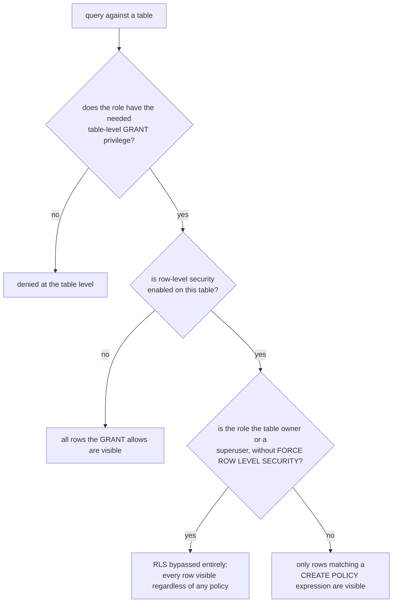

# Lesson 17. Roles, Privileges, and Row-Level Security

**Mission link:** Every earlier stage assumed a single trusted operator running the show. Real deployments have more than one: multiple applications, multiple teams, sometimes multiple tenants sharing tables. This stage names the mechanisms that control who can do what, from whole-table privileges down to which individual rows a specific role can even see.
**Primary source:** [Docs: "Database Roles", PostgreSQL](https://www.postgresql.org/docs/current/user-manag.html)
**Prerequisites:** [Lesson 16](0016-major-version-upgrades-and-pg-upgrade.md), [Checkpoint](../GLOSSARY.md)

## Warm-up

1. ▢ Why can't `pg_upgrade`'s link mode simply be reverted once the new cluster has been started?

Check

Link mode uses hard links rather than copying data files, and once the new cluster has started, the old cluster is disabled; recovering it at that point requires restoring from a backup rather than simply restarting the old cluster's files.

2. ▢ Why is DDL the one thing logical replication never replicates automatically?

Check

Logical replication decodes WAL into row-level data-change events, not schema-change events; it has no mechanism for propagating a `CREATE TABLE` or `ALTER TABLE` on its own, so the initial schema and every later schema change both have to be applied to the subscriber manually.

## Know this

### There is no separate "user" concept: everything is a role

Postgres has a single underlying concept, the **role**, rather than separate "user" and "group" concepts some other databases have; `CREATE USER` is literally an alias for `CREATE ROLE ... LOGIN`. A role can log in (given the `LOGIN` attribute), own objects, and be granted membership in, or grant membership to, other roles, whether or not it can itself log in. A role with no `LOGIN` attribute is exactly what other systems would call a "group": nothing prevents connecting as it directly, but it's meant to be assumed via membership instead.

### Role membership grants ordinary privileges, but never special attributes

`GRANT role_name TO other_role` gives `other_role` membership in `role_name`. Whether that membership automatically hands over `role_name`'s ordinary object privileges (the ability to `SELECT` from a table it owns, say) depends on the `INHERIT` option on that specific grant: `WITH INHERIT TRUE` (commonly the default) means those privileges apply automatically; `WITH INHERIT FALSE` means they don't, unless the member explicitly switches into that role. A separate `SET` option on the same grant controls whether the member is even allowed to explicitly become that role via `SET ROLE` at all, independent of whether privileges are inherited automatically. Critically, **special role attributes**, `LOGIN`, `SUPERUSER`, `CREATEDB`, `CREATEROLE`, `REPLICATION`, `BYPASSRLS`, are never inherited through membership under any combination of these options: a role granted membership in a superuser role does not itself become a superuser just by virtue of that membership. Actually using such an attribute requires a session to explicitly `SET ROLE` to the specific role that holds it directly.

### Table-level `GRANT`: the coarse layer, whole-table or nothing

Ordinary `GRANT`/`REVOKE` (`SELECT`, `INSERT`, `UPDATE`, `DELETE`, and others) on a table, schema, or database is the coarse authorization layer: a role either has a given privilege on the whole object or it doesn't. This says nothing about which specific *rows* within a table a role is allowed to see or touch, which is exactly the gap row-level security fills.

### Row-level security: policies filter which rows are visible or writable, not whether the table is accessible at all

**Row-level security (RLS)**, enabled per table with `ALTER TABLE ... ENABLE ROW LEVEL SECURITY`, adds a row-filtering layer beneath the table-level `GRANT` check. A `CREATE POLICY` defines a `USING` expression, which rows an existing query is allowed to see or modify, and a `WITH CHECK` expression, which rows a new or updated row is allowed to end up as. Enabling RLS on a table with no policies defined yet doesn't leave it wide open; it defaults to denying every row to everyone except the table owner and superusers, the same deny-by-default posture as an authorization system with no matching rule.

### The gotcha: RLS doesn't restrict the table owner unless you force it to

Enabling row-level security on a table does not, by itself, apply that security to the table's own owner, or to superusers, both bypass RLS entirely by default. A role granted the `BYPASSRLS` attribute skips it as well, regardless of ownership. Testing a policy's correctness while connected as the table's owner is the specific trap this causes: every row appears visible not because the policy is too permissive, but because the identity being used to test it bypasses RLS altogether. Getting the table's own owner actually subject to its policies requires the explicit `FORCE ROW LEVEL SECURITY` option on the table.

## Practice

1. ▢ A role is granted membership in a role that has the `SUPERUSER` attribute, with `WITH INHERIT TRUE`. Does the member automatically gain superuser privileges?

Hint

Consider which category of privilege the `INHERIT` option actually governs.

Check

No. `INHERIT` only governs ordinary object privileges (like `SELECT` on a table the granted role owns); special role attributes such as `SUPERUSER` are never inherited through membership under any combination of grant options. The member would need to explicitly `SET ROLE` to the superuser role itself to use that attribute.

2. ▢ A table has `ALTER TABLE accounts ENABLE ROW LEVEL SECURITY;` run on it, with no `CREATE POLICY` defined yet. A non-owner, non-superuser role queries it. What do they see?

Check

Nothing. Enabling RLS with no policies defined defaults to denying every row to any role that isn't the table owner or a superuser, rather than leaving the table open by default.

3. ▢ A developer enables RLS on a table, writes a policy intended to restrict each customer to their own rows, and then tests it by querying as the table's owner. Every row is visible. Does this mean the policy is broken?

Check

Not necessarily. The table owner bypasses row-level security entirely by default, regardless of any policy defined, so seeing every row while connected as the owner doesn't indicate the policy failed; it indicates the test was run under an identity RLS doesn't apply to at all. Testing properly requires connecting as a role that isn't the owner or a superuser, or enabling `FORCE ROW LEVEL SECURITY`.

4. ▢ What does a policy's `USING` expression govern, as distinct from its `WITH CHECK` expression?

Check

`USING` governs which existing rows a query is allowed to see or modify; `WITH CHECK` governs whether a new or updated row is allowed to end up in the state it's being written as. They answer different questions: what's visible now, versus what's allowed to be written.

5. ▢ Which claim correctly describes how table-level `GRANT`s and row-level security relate?

    - a) Row-level security replaces the need for table-level `GRANT`s entirely
    - b) Table-level `GRANT`s decide whether a role can access a table at all; row-level security, layered beneath that, further restricts which specific rows are visible or writable, and does not itself restrict the table owner unless `FORCE ROW LEVEL SECURITY` is set
    - c) A role granted membership in a role `WITH INHERIT TRUE` automatically gains that role's `LOGIN`, `SUPERUSER`, and other special attributes
    - d) Enabling row-level security on a table with no policies defined leaves every row visible to every role, by default

Check

**b)** That's the precise two-layer relationship, and the owner-bypass gotcha specific to RLS. (a) is false: table-level `GRANT`s are still the first, coarser check; RLS only applies once that check already passes. (c) is false: special attributes are never inherited through role membership, regardless of the `INHERIT` option. (d) is false: enabling RLS with no policies denies every row by default to anyone but the owner or a superuser, rather than leaving the table open.

## Real-world reps

- [ ] For a database you have access to, check whether any table has row-level security enabled, and if so, whether `FORCE ROW LEVEL SECURITY` is set for that table.
- [ ] Find a role granted membership in another role, and check its `INHERIT` and `SET` options specifically, rather than assuming a default.
- [ ] Tomorrow: read the primary source's chapter on database roles in full, and note what `pg_read_all_stats` and other predefined roles grant, as an alternative to granting the full `SUPERUSER` attribute for narrower administrative tasks.

## Going further

- [Docs: "Database Roles", PostgreSQL](https://www.postgresql.org/docs/current/user-manag.html)
- [Docs: "Row Security Policies", PostgreSQL](https://www.postgresql.org/docs/current/ddl-rowsecurity.html)
- [Resources](../RESOURCES.md)

---

Not landing? Reread the primary source at the top, since this lesson compresses it and compression is where understanding leaks. Check the [glossary](../GLOSSARY.md) for any term that felt slippery.

If the lesson itself is unclear rather than the material, that is a defect: [open an issue](https://github.com/TokenCemetery/teach/issues).
