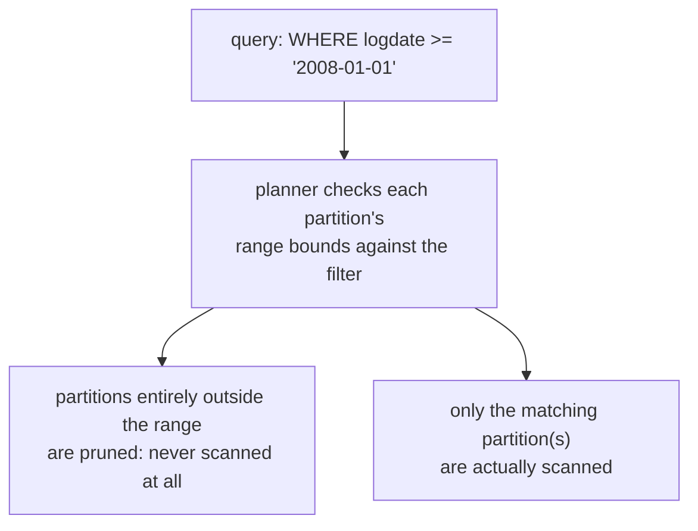

# Lesson 18. Partitioning and TOAST

**Mission link:** This closes the mission's arc: two table-level mechanisms that show up specifically at scale, one for splitting a very large table into manageable pieces, one for storing a single value too large to fit in an ordinary page at all. Both connect directly back to lesson 2 and 3's vacuum and bloat mechanics and lesson 7's index maintenance cost, rather than being separate concerns.
**Primary source:** [Docs: "Table Partitioning", PostgreSQL](https://www.postgresql.org/docs/current/ddl-partitioning.html)
**Prerequisites:** [Lesson 17](0017-roles-privileges-and-row-level-security.md), [Checkpoint](../GLOSSARY.md)

## Warm-up

1. ▢ Why doesn't a role automatically become a superuser just by being granted membership in a role that has the `SUPERUSER` attribute?

Check

Special role attributes like `SUPERUSER` are never inherited through role membership, regardless of the grant's `INHERIT` option; a session has to explicitly `SET ROLE` to the specific role that holds the attribute directly to actually use it.

2. ▢ Why can a policy appear to have no effect when tested while connected as the table's own owner?

Check

The table owner (and superusers) bypass row-level security entirely by default, regardless of what any policy says; seeing every row while connected as the owner reflects that bypass, not a broken or overly permissive policy. `FORCE ROW LEVEL SECURITY` is required to subject the owner to the table's own policies.

## Know this

### Partitioning: one logical table, split into several physical ones

**Partitioning** splits one large table into several physical **partitions**, each holding a distinct subset of rows, using one of three built-in strategies: **range** (non-overlapping ranges of a key, such as a date column split by month), **list** (an explicit set of key values per partition), or **hash** (rows spread across partitions by the hash of a key). A partitioned table stores no data directly; every inserted row is routed automatically to whichever partition its partition key actually belongs in.

### Partition pruning: skipping partitions that can't possibly match, not just scanning faster

The planner performs **partition pruning**: given a query's `WHERE` clause, it can determine which partitions couldn't possibly contain a matching row, based on each partition's range, list, or hash bounds, and skip scanning them entirely rather than merely scanning them faster. A query filtered to a single month's data against a table partitioned by month can end up scanning exactly one partition instead of the whole table, turning what would otherwise be a full-table scan into a scan sized to the relevant slice alone.

### Why partitioning helps at scale beyond query speed: bulk deletion without bloat

Dropping an entire partition (`DROP TABLE` on the child, or detaching it) is a fast, metadata-level operation that removes every row it held instantly and generates no dead tuples at all. A bulk `DELETE` removing that same set of rows from an unpartitioned table, by contrast, is exactly lesson 2's dead-tuple mechanism: every deleted row becomes a dead tuple autovacuum still has to clean up later, potentially a very large bloat event all at once. Partitioning a table by the dimension data actually gets purged by, typically time, turns routine data lifecycle management (dropping data older than a retention window) from a bloat-generating bulk delete into a bloat-free structural operation.

### Indexes on a partitioned table are virtual at the parent, real per partition

Creating an index on a partitioned table's parent automatically creates a matching index on every current partition, and on any partition added later, but the parent-level index itself is virtual: it's a catalog entry with no data of its own, while the actual index data lives in each partition's own physical index. This means lesson 7's per-write index maintenance cost is still paid independently by each partition's own index, not eliminated by partitioning; partitioning changes how much of the table a query touches, not how much an index costs to maintain per row. One practical limitation follows directly from this: `CREATE INDEX CONCURRENTLY` isn't supported directly against a partitioned parent, so avoiding long lock times on a large, already-populated partitioned table requires creating an invalid index on the parent with `ONLY`, building each partition's index individually with `CONCURRENTLY`, and attaching them one at a time.

### TOAST: why a single value can exceed what an 8kB page would otherwise allow

Postgres uses a fixed page size (8kB by default) and never lets a single row span more than one page. **TOAST** (The Oversized-Attribute Storage Technique) is what makes storing a value larger than that limit possible anyway: a variable-length value (`text`, `bytea`, and similar types) that's too large to fit can be transparently compressed, moved out-of-line into a separate TOAST table, or both, while the main table keeps only a small pointer to it. This is why a single `text` column can hold megabytes of data despite the page size limit; the row itself never actually has to contain that much data inline.

### The four storage strategies, and the real trade `EXTERNAL` makes

A column's **storage strategy** decides how TOAST treats it: `PLAIN` disallows both compression and out-of-line storage (used for fixed-length types that never need TOAST at all), `MAIN` (compressible types' typical default for some columns) allows compression and only moves data out-of-line as a last resort, `EXTENDED` (the actual default for most variable-length types) tries compression first and falls back to out-of-line storage if the value is still too large, and `EXTERNAL` allows out-of-line storage but disallows compression entirely. `EXTERNAL`'s trade is a genuine one, not a strictly worse option: an operation like a substring extraction on a very large value has to fully decompress a compressed value before it can pull out even a small piece of it, while `EXTERNAL`'s uncompressed, out-of-line chunks can potentially be accessed more directly, at the cost of losing compression's space savings entirely.

### The TOAST table is a real table, with its own vacuum needs

Values moved out-of-line don't disappear into some separate, exempt storage layer; they live in an actual **TOAST table** associated with the original table, with its own index and its own bloat and vacuum behavior, exactly the mechanics lessons 2 and 3 already established for ordinary tables. A table with many large, frequently-updated TOASTed values can develop bloat concentrated in its TOAST table specifically, a detail invisible if only the main table's own bloat is being checked.

## Practice

1. ▢ A table is partitioned by month using range partitioning on a `logdate` column. A query filters to `WHERE logdate >= '2024-06-01' AND logdate < '2024-07-01'`. What does partition pruning do for this query?

Hint

Consider what the planner can determine about every partition outside June 2024 before scanning anything.

Check

The planner determines that partitions covering any month other than June 2024 cannot contain a matching row, based on their range bounds, and skips scanning them entirely; only the June 2024 partition actually gets scanned, rather than the whole table.

2. ▢ A team needs to purge data older than two years from a very large, time-partitioned table. Why does dropping the oldest partitions avoid the bloat a bulk `DELETE` of the same rows would cause?

Check

Dropping a partition is a metadata-level operation that removes every row it held instantly, generating no dead tuples at all. A bulk `DELETE` targeting the same rows in an unpartitioned table would instead leave that many dead tuples behind for autovacuum to reclaim later, exactly the bloat mechanism lesson 2 described.

3. ▢ A team runs `CREATE INDEX ON large_partitioned_table (customer_id);` and expects this to add one index total. What actually happens, and where does the write cost from lesson 7 actually land?

Check

This creates a matching index on every existing partition (and on any partition added later), not one single index; the parent-level index is a virtual catalog entry with no data of its own. Lesson 7's per-write index maintenance cost is paid independently by each partition's own physical index, not by some single shared structure.

4. ▢ Why can't a team simply run `CREATE INDEX CONCURRENTLY` directly against a large, already-populated partitioned table's parent to avoid long lock times?

Check

`CREATE INDEX CONCURRENTLY` isn't supported directly against a partitioned parent; the documented approach instead is to create an invalid index on the parent with `ONLY`, build each partition's own index individually using `CONCURRENTLY`, and attach each one, which achieves the same low-lock-time goal without needing direct concurrent-index support on the parent itself.

5. ▢ A column storing very large text values is set to `EXTERNAL` storage instead of the default `EXTENDED`. What does this trade away, and what does it gain?

Check

It gains faster substring or prefix access to the value, since `EXTERNAL` stores it out-of-line without compression, while a compressed value under `EXTENDED` would need to be fully decompressed before any substring operation could run. It trades away compression's space savings entirely, since `EXTERNAL` disallows compression outright regardless of how compressible the value actually is.

## Real-world reps

- [ ] For a large table you have access to, check whether it's partitioned, and if so, by which strategy and key, and confirm `enable_partition_pruning` is actually on.
- [ ] Find a table with large `text` or `bytea` columns and check each one's storage strategy (`PLAIN`, `MAIN`, `EXTENDED`, or `EXTERNAL`) via its column's storage setting, rather than assuming the default applies.
- [ ] Tomorrow: read the primary source's partitioning chapter in full, and note what it says about partitioning a table by a key that isn't part of that table's primary key or unique constraints, and what limitation that creates.

## Going further

- [Docs: "Table Partitioning", PostgreSQL](https://www.postgresql.org/docs/current/ddl-partitioning.html)
- [Docs: "TOAST", PostgreSQL](https://www.postgresql.org/docs/current/storage-toast.html)
- [Resources](../RESOURCES.md)

---

Not landing? Reread the primary source at the top, since this lesson compresses it and compression is where understanding leaks. Check the [glossary](../GLOSSARY.md) for any term that felt slippery.

If the lesson itself is unclear rather than the material, that is a defect: [open an issue](https://github.com/TokenCemetery/teach/issues).
