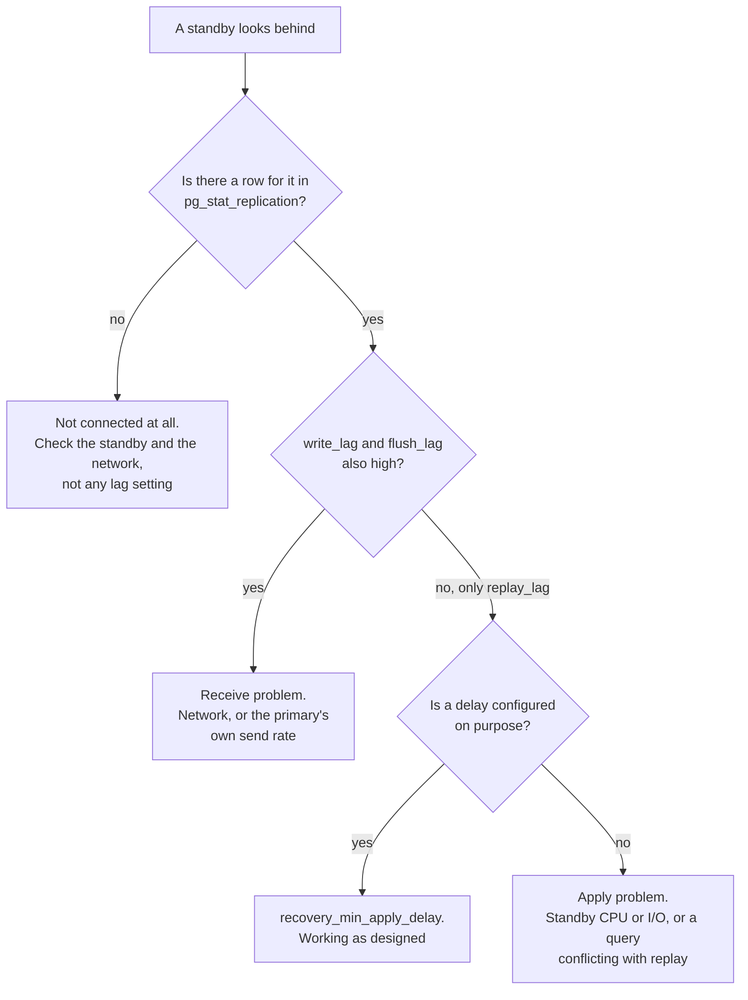

# Replication

Stage 3 compressed for lookup. Lessons [4](../lessons/0004-streaming-replication-and-slots.md), [5](../lessons/0005-failover-mechanics.md) and [6](../lessons/0006-diagnosing-replication-lag.md) cover the mechanism, the failover and the diagnosis; this sheet is the settings and the columns, for when a standby is behind now.

Values are from the PostgreSQL 18 documentation.

## Two mechanisms

| | Physical, streaming | Logical |
|---|---|---|
| Ships | Raw WAL records | Row-level changes decoded from WAL |
| Copies | The whole cluster, byte for byte | A chosen set of tables, by publication and subscription |
| Standby is | An exact binary copy replaying as crash recovery would | An independent server applying changes |

Everything below is physical unless stated.

## WAL retention, and the hazard a slot introduces

Without a slot, the primary recycles WAL on its own schedule. A standby gone too long finds the segments it needs are gone, and needs a fresh base backup.

| Setting | Default | Does |
|---|---|---|
| `wal_keep_size` | 0 | A **minimum** kept in `pg_wal`. Fall behind by more and the replication connection is terminated, recoverable from archive if archiving is on |
| `max_slot_wal_keep_size` | **-1** | A **maximum** slots may retain. `-1` means **unlimited** |

A slot solves the lesson's problem, that the primary discards WAL a standby still needs, by trading it for a different one. With the default of `-1`, a slot for a standby that never comes back will retain WAL **without limit** until `pg_wal` fills the disk and the primary stops. That is the failure mode slots create, and it is on by default.

Setting `max_slot_wal_keep_size` bounds it, and the trade is explicit: past the limit, the standby using that slot may no longer be able to continue, exactly as if there had been no slot. `pg_replication_slots` shows each slot's WAL availability, which is where you find a slot that has been cut loose.

A slot also holds back the primary's `xmin` horizon, which is one of the bloat causes on [Vacuum and Bloat](vacuum-and-bloat.md). One abandoned slot causes both problems at once.

## Synchronous commit

`synchronous_commit` decides how much has to happen before the client is told "committed". Default is `on`.

| Level | Commit waits for | Survives |
|---|---|---|
| `off` | Nothing. Up to three times `wal_writer_delay` may pass | Nothing extra. Recent commits can vanish, though the database stays **consistent** |
| `local` | Local WAL flushed to disk | A crash of the primary |
| `remote_write` | The standby has **written** the record to its file system | A PostgreSQL crash on the standby, **not** an OS crash there |
| `on` | The standby has **flushed** the record to durable storage | Anything short of both primary and all synchronous standbys losing storage |
| `remote_apply` | The standby has applied it, so it is **visible to queries** there | The same, plus read-your-writes on the standby. Much larger commit delays |

**The trap: with `synchronous_standby_names` empty, only `on` and `off` mean anything.** `remote_apply`, `remote_write` and `local` all collapse to the same local level as `on`. Setting `remote_apply` and naming no standbys buys precisely nothing, and looks like it bought the strongest guarantee available.

A standby counts as synchronous only while it is connected and in state `streaming`, visible in `pg_stat_replication`.

## Failover

| | Switchover | Failover |
|---|---|---|
| Planned | Yes | No |
| Final WAL confirmed received | Yes | No |
| Data loss | None | Bounded only by your synchronous setting |

PostgreSQL does not detect failure and promote by itself. Promotion is triggered by an administrator or an external tool.

### Why the old primary cannot just come back

Promotion increments the **timeline ID**. A former primary may have WAL past the point the histories diverged, so letting it continue is a split-brain risk. It has to be reset onto the new primary's timeline, which is what `pg_rewind` does, or rebuilt from a base backup.

## The two lags

They are different measurements and they have different causes.

| Question | Lag | Read on |
|---|---|---|
| Has the WAL arrived? | Receive, or write | `write_lag`, `flush_lag` |
| Has it been applied and become visible? | Replay, or apply | `replay_lag` |

`pg_stat_replication`, on the **primary**, gives a row per connected standby: `sent_lsn`, `write_lsn`, `flush_lsn`, `replay_lsn` as positions, and `write_lag`, `flush_lag`, `replay_lag` as time intervals. `pg_stat_wal_receiver`, on the **standby**, gives that server's own view of the connection.

## When a standby query fights replay

Replaying WAL can require removing rows a query on the standby is still reading. Something has to give.

| Setting | Default | Effect |
|---|---|---|
| `max_standby_streaming_delay` | 30 s | How long replay waits before **cancelling** the conflicting query. `-1` waits forever, so replay can stall indefinitely |
| `hot_standby_feedback` | **off** | The standby tells the primary what its queries still need, which prevents the cancellations |
| `recovery_min_apply_delay` | 0 | A deliberate delay, for a time-lagged copy you can read before a mistake propagates |

`hot_standby_feedback` is the one to think about twice. It removes query cancellations on the standby by holding back the primary's cleanup horizon, and the documentation says plainly that it "can cause database bloat on the primary for some workloads". Turning it on to fix a reporting replica is a decision to move the problem to [Vacuum and Bloat](vacuum-and-bloat.md).

## Before trusting a topology

- Every slot has a known owner. An abandoned one retains WAL without limit by default and holds the vacuum horizon too.
- `max_slot_wal_keep_size` is set, or somebody has decided consciously that an unbounded `pg_wal` is acceptable.
- If `synchronous_commit` is set above `local`, `synchronous_standby_names` actually names something.
- The synchronous level matches the data loss you can accept, and somebody has said out loud what that is.
- There is a documented plan for the old primary after a failover, `pg_rewind` or rebuild, decided before it is needed.
- Lag alerting distinguishes receive from apply, because the fixes have nothing in common.
- If `hot_standby_feedback` is on, the primary's bloat is being watched.

## Sources

- [Docs: "High Availability, Load Balancing, and Replication", PostgreSQL](https://www.postgresql.org/docs/current/high-availability.html)
- [Docs: "Replication" configuration, PostgreSQL](https://www.postgresql.org/docs/current/runtime-config-replication.html)
- [Docs: "Write Ahead Log" configuration, PostgreSQL](https://www.postgresql.org/docs/current/runtime-config-wal.html)
- [Vacuum and Bloat](vacuum-and-bloat.md)
- [Resources](../RESOURCES.md)
