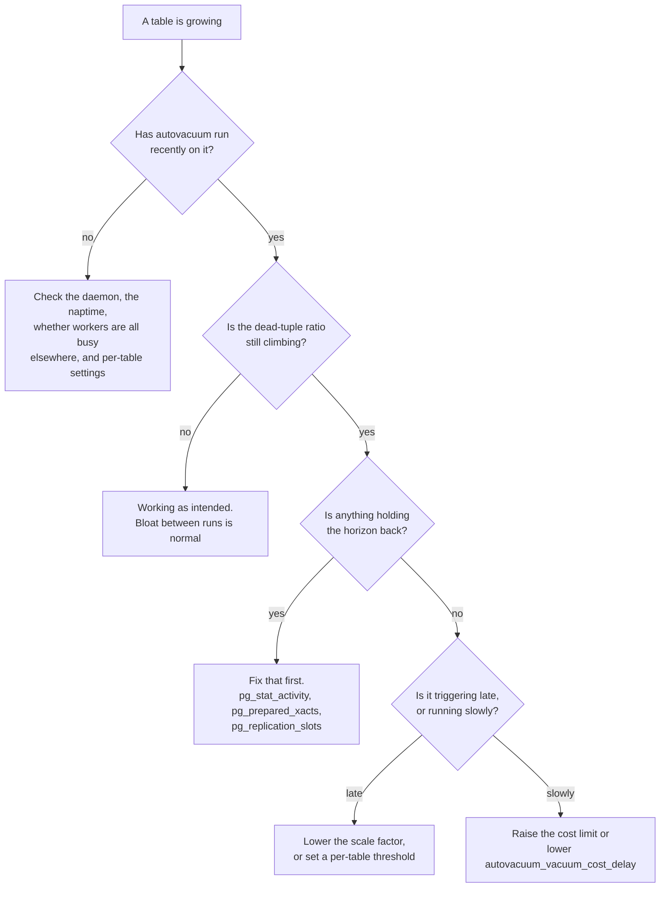

# Vacuum and Bloat

Stage 2 compressed for lookup. [Lesson 2](../lessons/0002-mvcc-and-dead-tuples.md) covers why dead tuples exist and [lesson 3](../lessons/0003-bloat-diagnosis-and-autovacuum-tuning.md) covers diagnosing bloat; this sheet is the formulas, the defaults and the exact views, for when a table is growing now.

Values are from the PostgreSQL 18 documentation. Several of these changed recently, so check the version you run.

## Why vacuum has to run at all

The documentation gives four reasons, and only the first is the one people think of:

| Reason | What is lost without it |
|---|---|
| Reclaim space from updated or deleted rows | Bloat |
| Update planner statistics | Bad plans |
| Update the **visibility map** | Index-only scans stop being index-only |
| Prevent transaction ID and multixact ID wraparound | Loss of very old data |

The third and fourth mean a table that only receives `INSERT` still needs vacuum, which is why there is an insert-driven trigger below.

## `VACUUM` against `VACUUM FULL`

| | `VACUUM` | `VACUUM FULL` |
|---|---|---|
| Space returned to the OS | No, only made reusable in the table | Yes, the table is rewritten |
| Lock | Runs alongside `SELECT`, `INSERT`, `UPDATE`, `DELETE`. Blocks `ALTER TABLE` | `ACCESS EXCLUSIVE`. Nothing else touches the table |
| Speed | Normal | Much slower |

The documentation's own advice is to strive to use standard `VACUUM` and avoid `VACUUM FULL`.

## When autovacuum fires

Three independent triggers. A table is vacuumed if **any** applies.

**Wraparound**, which overrides everything:

```text
relfrozenxid older than autovacuum_freeze_max_age  ->  always vacuumed
```

**Dead tuples**, and note the ceiling, which is newer than most tuning advice:

```text
vacuum threshold = Minimum(
    autovacuum_vacuum_max_threshold,
    autovacuum_vacuum_threshold + autovacuum_vacuum_scale_factor * reltuples
)
```

**Inserts**, weighted by how much of the table is not yet frozen:

```text
insert threshold = autovacuum_vacuum_insert_threshold
                 + autovacuum_vacuum_insert_scale_factor * reltuples
                   * (1 - relallfrozen / relpages)
```

### What the ceiling does and does not fix

`autovacuum_vacuum_max_threshold` defaults to **100,000,000** tuples, so the scale factor stops being the whole story only once `0.2 * reltuples` exceeds that, meaning tables above roughly half a billion rows. Below that the scale factor still governs completely.

So lesson 3's point stands for ordinary large tables: at a million rows, 20 percent is still 200,000 dead tuples before autovacuum considers the table, and the ceiling is nowhere near. The cap bounds the pathological end; it does not remove the need to lower the scale factor on a high-churn table of moderate size.

## Parameters and defaults

| Parameter | Default | Notes |
|---|---|---|
| `autovacuum_vacuum_threshold` | 50 tuples | Base of the dead-tuple formula |
| `autovacuum_vacuum_scale_factor` | 0.2 | Fraction of table size added to it |
| `autovacuum_vacuum_max_threshold` | 100,000,000 | Ceiling on the two above. `-1` removes the ceiling |
| `autovacuum_vacuum_insert_threshold` | 1000 tuples | `-1` disables insert-driven vacuum entirely |
| `autovacuum_vacuum_insert_scale_factor` | 0.2 | Of **unfrozen pages**, not of table size |
| `autovacuum_analyze_threshold` | 50 tuples | Analyze is a separate trigger |
| `autovacuum_analyze_scale_factor` | 0.1 | Half the vacuum scale factor |
| `autovacuum_naptime` | 1 min | Minimum delay between rounds per database |
| `autovacuum_max_workers` | 3 | Capped by `autovacuum_worker_slots`, typically 16 |
| `autovacuum_vacuum_cost_delay` | 2 ms | `-1` falls back to `vacuum_cost_delay`. This is the throttle |
| `autovacuum_freeze_max_age` | 200 million | Autovacuum runs for wraparound **even when autovacuum is disabled** |

Every one of the trigger settings can be overridden per table through storage parameters, which is the right tool for one hot table rather than shifting the global default.

## The thing that makes vacuum look broken

Vacuum cannot remove a dead tuple that any still-possible snapshot might need. When something holds that horizon back, autovacuum runs on schedule, reports success, and reclaims nothing. This is the case that wastes the most investigation time.

| Holder | Where to look | What to look for |
|---|---|---|
| A long-running or idle-in-transaction session | `pg_stat_activity` | A large `age(backend_xid)` or `age(backend_xmin)` |
| An uncommitted prepared transaction | `pg_prepared_xacts` | A large `age(transactionid)` |
| A stale replication slot | `pg_replication_slots` | A large `age(xmin)` or `age(catalog_xmin)` |

The remedies differ: commit, roll back, or terminate the session; commit or roll back the prepared transaction; drop the slot. **Dropping a slot is the one with a consequence.** If it belongs to a replica that still exists and may reconnect, that replica may have to be rebuilt. Slots for servers that no longer exist are the safe case, and the common one.

## Diagnostic order



Checking in this order matters because the middle branch is invisible from the outside: the logs show vacuum ran, and the bloat still climbs.

## Measuring

- `pg_stat_user_tables`: `n_dead_tup` against `n_live_tup` is a **directional** ratio, not a size. Read `last_autovacuum` beside it.
- A dedicated bloat-estimation query for the actual size gap, which the tuple ratio cannot give.
- `pg_stat_progress_vacuum` for a vacuum that is running right now, when the question is whether it is progressing or stuck.

## Before tuning anything

- Confirm autovacuum ran at all before concluding it is too slow.
- Rule out a held-back horizon before touching any threshold, because no threshold fixes it.
- Distinguish "triggering late" from "running slowly". The first is a threshold, the second is the cost delay.
- Prefer a per-table storage parameter over a global change made for one table.
- Remember that an insert-only table still needs vacuum, for freezing and for the visibility map.
- Reach for `VACUUM FULL` only knowing it takes an `ACCESS EXCLUSIVE` lock for the duration.

## Sources

- [Docs: "Routine Vacuuming", PostgreSQL](https://www.postgresql.org/docs/current/routine-vacuuming.html)
- [Docs: "Automatic Vacuuming" configuration, PostgreSQL](https://www.postgresql.org/docs/current/runtime-config-autovacuum.html)
- [Resources](../RESOURCES.md)
