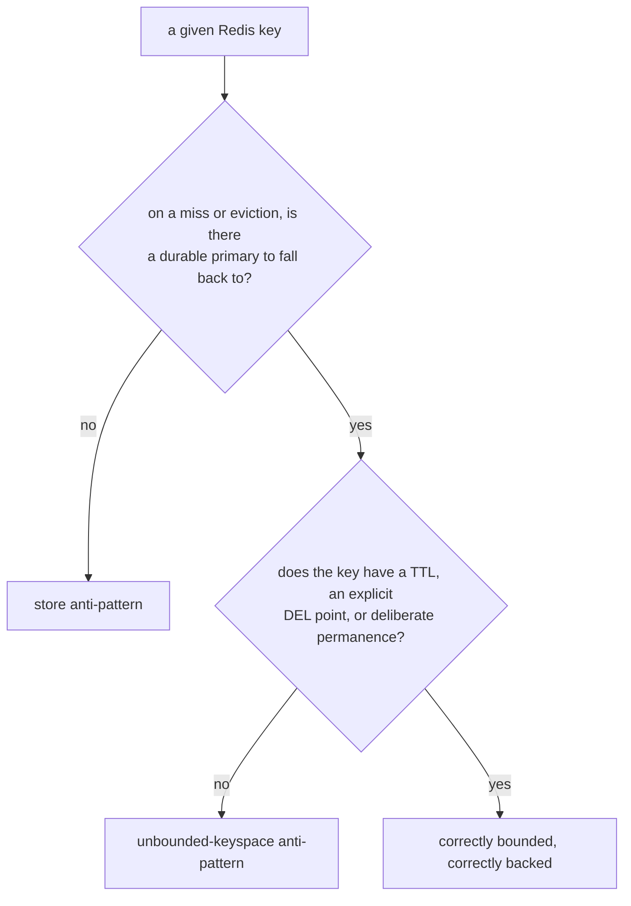

# Lesson 7. The Unbounded-Keyspace Anti-Pattern and Spotting Misuse

**Mission link:** This is stage 4's capstone: lesson 6 covered the store anti-pattern (a cache with no durable backing); this lesson covers the mission's other cache-vs-store failure, a keyspace nobody bounded, and closes stage 4 by turning both into a repeatable diagnostic for an existing system.
**Primary source:** [Docs: "Key eviction", Redis](https://redis.io/docs/latest/develop/reference/eviction/)
**Prerequisites:** [Lesson 6](0006-cache-aside-and-the-store-anti-pattern.md), [Eviction policy](../GLOSSARY.md)

## Warm-up

1. ▢ In correct cache-aside usage, what does a cache miss cost? In the store anti-pattern, what does it cost instead?

Check

In cache-aside, a miss costs a slower read from the primary database, since the primary always has the data. In the store anti-pattern, a miss means the data is actually gone, since Redis was the only copy and there's no primary to fall back to.

2. ▢ Why does cache-aside delete the cache key on a write instead of writing the new value into Redis directly?

Check

Deleting guarantees the next read always falls back to the primary and refills correctly, which is what makes cache-aside safe even under concurrent writes and reads; writing the new value directly risks a race where a read that already fetched the old value overwrites the just-updated key with stale data.

## Know this

### The pattern: keys that accumulate with nothing bounding them

The **unbounded-keyspace anti-pattern** is what happens when keys get created (a session, a per-user counter, a rate-limit bucket, a feature flag cache entry, one key per request ID) with no TTL and no eviction policy actually configured to reclaim them. Under `noeviction`, the default, Redis's answer to a full `maxmemory` isn't to make room; it's to reject further writes outright once the ceiling is hit. A keyspace that only grows, with nothing built to shrink it, is a countdown to that ceiling, not a stable design.

### Why this is easy to miss until it's already a problem

Nothing about creating a key without a TTL fails immediately. The application works exactly as intended for as long as memory has room, which can be a long time on a system with headroom or low traffic. The failure only surfaces once `maxmemory` (or physical memory, if unset) is actually reached, at which point it's `noeviction` rejecting writes across the whole instance, not just the unbounded key pattern, or an eviction policy silently deleting keys nobody meant to be evictable, including ones that were never a cache in the first place. Either way, the symptom shows up in production, and by then the root cause (which code path never set a TTL) is often long separated in time from the outage it causes.

### The fix is naming an owner for every key's lifetime

Every key in a Redis instance should have an answer to "what removes this key eventually, and when": a TTL set at write time (the common case for cache-aside and rate limiters), an explicit `DEL` at a known point in the application's logic (a session ending, a job completing), or a deliberate choice that it's meant to live forever and is accounted for in capacity planning, not an accident. A key with none of these is exactly the unbounded-keyspace anti-pattern, regardless of how small or reasonable each individual key looked when it was added.

### A spotting checklist, for both stage-4 anti-patterns

For any Redis usage in an existing system, two questions cover both anti-patterns this stage names: first, on a miss or an eviction of this key, is there a durable system of record to fall back to, or is the data actually gone (lesson 6's store anti-pattern)? Second, does this key have a TTL, an explicit deletion point, or a deliberate justification for living forever, or does it just accumulate (this lesson's unbounded-keyspace anti-pattern)? A key can fail either question independently: a session cache with a TTL can still be a store anti-pattern if there's no database backing it, and a properly backed cache entry can still be unbounded if its write path forgot the TTL.

## Practice

1. ▢ What does Redis do by default (`noeviction`) when `maxmemory` is reached and a write comes in?

Check

It rejects the write outright, returning an error, rather than making room by evicting anything; `noeviction` doesn't delete keys to free space.

2. ▢ Why can an unbounded-keyspace problem go unnoticed for a long time before it causes an outage?

Hint

Consider what has to actually happen before the failure becomes visible.

Check

Creating a key without a TTL doesn't fail immediately; the system works fine as long as memory has room, which can be a long time under low traffic or with headroom. The problem only becomes visible once `maxmemory` (or physical memory) is actually reached, at which point either writes across the whole instance start failing (`noeviction`) or an eviction policy starts silently deleting keys, by which point the root cause is often disconnected in time from the code that introduced it.

3. ▢ State the "named owner" test for whether a given key is safely bounded.

Check

Every key should have an answer to what removes it eventually and when: a TTL set at write time, an explicit `DEL` at a known application event, or a deliberate, capacity-planned decision that it lives forever. A key with none of these is an instance of the unbounded-keyspace anti-pattern.

4. ▢ A system stores a rate-limit counter per user per day in Redis, each key set with a TTL, and also stores each user's current shopping cart in Redis with no TTL and no corresponding database table. Evaluate both key types against the two-question spotting checklist.

Check

The rate-limit counter passes both questions: it has a named owner (its TTL), and a miss simply means a fresh count for a new period, not lost correctness-critical data, so it isn't a store anti-pattern. The shopping cart fails both: it has no TTL and no explicit deletion point (unbounded keyspace), and it has no durable backing (store anti-pattern), so an eviction or a crash before persistence catches up is an actual data-loss incident for the user, not a cheap miss.

5. ▢ Which claim correctly distinguishes the store anti-pattern from the unbounded-keyspace anti-pattern?

    - a) They are the same failure described two ways
    - b) The store anti-pattern is about whether a durable primary copy exists on a miss; the unbounded-keyspace anti-pattern is about whether a key has any mechanism that eventually removes it
    - c) Setting a TTL on every key automatically prevents the store anti-pattern
    - d) The unbounded-keyspace anti-pattern only matters under `allkeys-lru`, never under `noeviction`

Check

**b)** They're independent properties: a key can fail one, the other, both, or neither. (a) is false, as the shopping-cart example shows a key failing both for different reasons. (c) is false: a TTL bounds the keyspace but says nothing about whether a durable copy exists elsewhere, so a TTL'd key can still be a pure store anti-pattern if it's the only copy of the data until it expires. (d) is false: `noeviction` is exactly where an unbounded keyspace causes the more disruptive failure, rejecting all writes, rather than a milder one.

## Real-world reps

- [ ] For a Redis-backed system you know of, list every distinct key pattern it writes and answer the "named owner" question for each: TTL, explicit deletion point, or deliberate permanence.
- [ ] For the same system, run both stage-4 checklist questions (durable backing on a miss? named owner for removal?) against its riskiest-looking key pattern, and write down which anti-pattern, if either, it's actually exposed to.
- [ ] Tomorrow: read the primary source's section on `maxmemory-policy` options in full, and identify which policy (if any) the system from this rep's first task is actually configured with.

## Going further

- [Docs: "Key eviction", Redis](https://redis.io/docs/latest/develop/reference/eviction/)
- [Docs: "Redis cache-aside", Redis](https://redis.io/docs/latest/develop/use-cases/cache-aside/)
- [Resources](../RESOURCES.md)

---

Not landing? Reread the primary source at the top, since this lesson compresses it and compression is where understanding leaks. Check the [glossary](../GLOSSARY.md) for any term that felt slippery.

If the lesson itself is unclear rather than the material, that is a defect: [open an issue](https://github.com/TokenCemetery/teach/issues).
