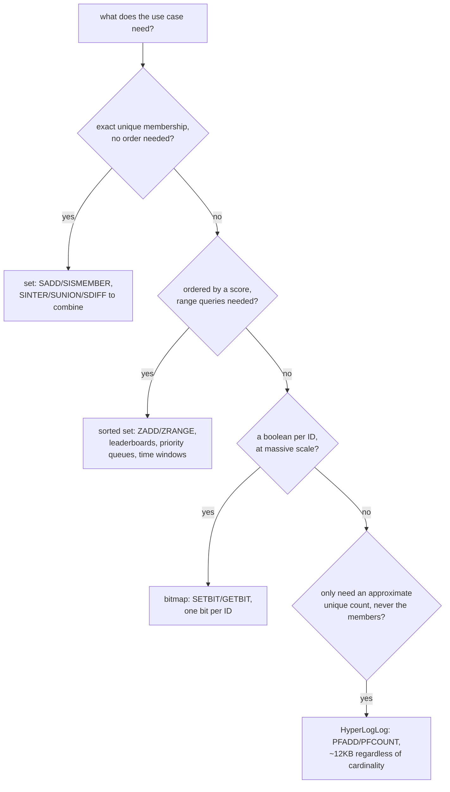

# Lesson 10. Sets, Sorted Sets, and Probabilistic Structures

**Mission link:** This is stage 6's capstone. Lesson 9 covered the three structures every prior lesson implicitly assumed; this lesson covers the ones that actually make "design correct usage from scratch" a real choice, since each one exists specifically because a string, hash, or list is the wrong shape for what it solves.
**Primary source:** [Docs: "Data types", Redis](https://redis.io/docs/latest/develop/data-types/)
**Prerequisites:** [Lesson 9](0009-strings-hashes-and-lists.md), [maxmemory](../GLOSSARY.md)

## Warm-up

1. ▢ Why is `LINDEX` at an arbitrary middle position O(N) on a Redis list, while `LPUSH`/`RPOP` at the ends stay O(1) regardless of length?

Check

A Redis list is a quicklist, a linked structure with no way to jump directly to an arbitrary position; reaching the middle means walking from an end. The two ends themselves are always directly reachable, which is what keeps push and pop there O(1) no matter how long the list grows.

2. ▢ What does consolidating five related fields into one Redis hash save, compared to five separate string keys?

Check

The per-key overhead Redis maintains for every individually tracked key; one hash with five fields pays that overhead once instead of five times, a real memory saving for small, related data.

## Know this

### A set: exact membership, no order, and combining sets server-side

A **set** holds unique members with no defined order, `SADD tags:post42 redis database caching`, `SISMEMBER tags:post42 redis`, both O(1). Its real strength beyond membership testing is combining sets **on the server**: `SINTER`, `SUNION`, and `SDIFF` compute an intersection, union, or difference across multiple sets without a client ever pulling every member across the network to compute it locally, useful for something like "users who have both tag A and tag B" computed directly in Redis rather than fetched and intersected client-side.

### A sorted set: a score buys ordering and range queries, at O(log N)

A **sorted set** (ZSET) attaches a numeric **score** to every member, `ZADD leaderboard 1500 alice`, `ZADD leaderboard 1800 bob`, and keeps members ordered by that score automatically, backed internally by a skip list. `ZRANGE leaderboard 0 9` returns the top 10 in order; `ZRANGEBYSCORE` returns everyone within a score range. This is the structure behind a leaderboard, a priority queue (score as priority), or a sliding time window (score as a timestamp, `ZREMRANGEBYSCORE` to expire anything older than a cutoff): all of it at O(log N) insertion and range-query cost, the specific reason a sorted set beats keeping a plain list sorted by hand, which would cost O(N) to re-sort or to insert into the correct position every time.

### Bitmaps: one bit per ID, at a scale a set couldn't touch

A **bitmap** is an ordinary string addressed by individual bit offset, `SETBIT active:2024-01-15 4291 1` (mark user ID 4291 active that day), `GETBIT active:2024-01-15 4291`, `BITCOUNT active:2024-01-15` for a total. Tracking a single boolean per user ID this way costs one bit per ID, not a whole set entry per active user; for a boolean tracked across millions of IDs (daily-active tracking, a per-user feature flag), a bitmap can be an order of magnitude more memory-efficient than a set holding the same information as individual member entries.

### HyperLogLog: an approximate count, in a fixed, tiny footprint

**HyperLogLog** (PFADD/PFCOUNT) estimates the number of *unique* elements added to it, `PFADD visitors:2024-01-15 user123`, `PFCOUNT visitors:2024-01-15`, without ever storing the elements themselves, in roughly 12KB of memory regardless of whether a million or a billion unique elements were added, at the cost of a small, known standard error (about 0.81%) rather than an exact count. This is the right structure specifically when the question is "how many unique X" and never "which specific X," since a set doing the same job would grow with the actual number of unique elements stored, while HyperLogLog's footprint stays flat.

## Practice

1. ▢ A product needs "users who liked post A and also liked post B," where each post's likers are tracked in a Redis set. Which command computes this directly, and why is doing it server-side better than pulling both sets to a client and intersecting them there?

Check

`SINTER likes:postA likes:postB`. Computing the intersection inside Redis avoids transferring every member of both sets across the network just to discard everything that isn't in both; the server already has both sets in memory and can compute the result directly, sending back only the (typically much smaller) final answer.

2. ▢ Why does a sorted set beat a plain list for implementing a leaderboard that needs to stay ordered by score as scores keep changing?

Hint

Consider what re-inserting a member at the correct position would cost in each structure.

Check

A sorted set's skip-list backing keeps members ordered automatically at O(log N) per insertion or score update; a plain list has no ordering machinery of its own, so keeping it sorted by hand means finding and inserting at the correct position manually, an O(N) operation every time a score changes, far more expensive as the leaderboard grows.

3. ▢ A team wants to track which of 50 million user IDs were active today, as a simple yes/no per ID. Why might a bitmap beat a set here, even though a set could technically store the same information?

Check

A bitmap costs one bit per ID regardless of how many are actually active, so tracking 50 million IDs costs a fixed, predictable footprint (roughly 6.25MB for 50 million bits) that doesn't grow with how many are actually marked active. A set storing the same information as individual member entries carries far more per-member overhead than a single bit, making it meaningfully more expensive at this scale for a plain boolean.

4. ▢ A team wants to know how many unique visitors a page had today, but has no need to know which specific visitors they were. Why is HyperLogLog a better fit than a set for exactly this question, and what's the real cost of choosing it?

Check

A set storing every unique visitor's identifier grows in memory with the actual number of unique visitors, potentially large; HyperLogLog's footprint stays fixed at roughly 12KB no matter how many unique elements were added, since it never stores the elements themselves, only a compact structure that estimates their count. The real cost is accuracy: HyperLogLog's count is an estimate with roughly 0.81% standard error, not an exact number, and it can never answer "was this specific visitor here," only "roughly how many were."

5. ▢ Which claim correctly matches a use case to the right structure?

    - a) A leaderboard should use a plain Redis list, since lists are already ordered by insertion
    - b) A sorted set fits ordered-by-score data needing range queries; a set fits exact unique membership with no order; a bitmap fits a per-ID boolean at large scale; HyperLogLog fits an approximate unique count when the members themselves don't matter
    - c) HyperLogLog and a set solve the same problem equally well, so the choice between them is arbitrary
    - d) Bitmaps and sorted sets are interchangeable, since both eventually store data "in order"

Check

**b)** That's the precise mapping this lesson's decision points establish. (a) is false: a list's insertion order isn't the same as staying sorted by a changing score, which is exactly what a sorted set provides instead. (c) is false: a set stores exact members at a cost that grows with cardinality; HyperLogLog trades exactness for a fixed, tiny footprint, a real and different trade-off. (d) is false: a bitmap addresses individual bits by ID with no notion of score-based ordering at all, a different shape of structure entirely.

## Real-world reps

- [ ] Find a feature you have access to that needs a leaderboard, a priority queue, or anything ordered by a changing numeric value. Check whether it's implemented with a sorted set, and if not, what it costs to keep sorted the way it currently is.
- [ ] For a metric you track (daily active users, unique page views), decide whether it actually needs exact counts (a set) or would be a defensible fit for HyperLogLog's approximate, fixed-footprint count instead.
- [ ] Tomorrow: read the primary source's sections on sets, sorted sets, bitmaps, and HyperLogLog in full, and note any command or use case this lesson didn't cover.

## Going further

- [Docs: "Data types", Redis](https://redis.io/docs/latest/develop/data-types/)
- [Docs: "Key eviction", Redis](https://redis.io/docs/latest/develop/reference/eviction/)
- [Resources](../RESOURCES.md)

---

Not landing? Reread the primary source at the top, since this lesson compresses it and compression is where understanding leaks. Check the [glossary](../GLOSSARY.md) for any term that felt slippery.

If the lesson itself is unclear rather than the material, that is a defect: [open an issue](https://github.com/TokenCemetery/teach/issues).
