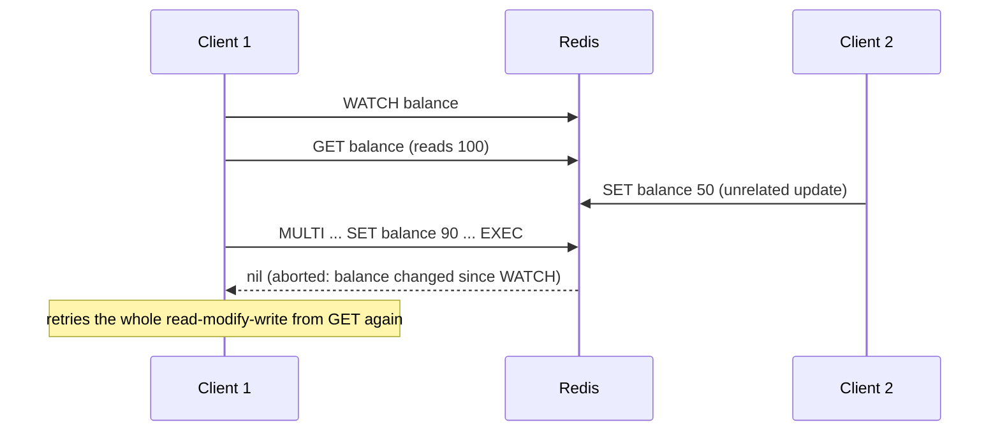

# Lesson 13. MULTI/EXEC and Optimistic Locking with WATCH

**Mission link:** Stage 8 opens the mechanism that actually makes a check-then-act sequence safe against another client acting in between, the same problem lesson 4's naive lock existed to solve at a coarser grain. This lesson is Redis's own transaction primitive, and where it falls short of a real lock.
**Primary source:** [Docs: "Data types", Redis](https://redis.io/docs/latest/develop/data-types/)
**Prerequisites:** [Lesson 12](0012-key-expiration-lazy-vs-active.md), [Eviction policy](../GLOSSARY.md)

## Warm-up

1. ▢ Why does active expiration exist, given that lazy expiration alone already guarantees a client never sees an expired value?

Check

Lazy expiration only removes a key when something accesses it; a key nobody ever reads again after its TTL passes would sit in memory indefinitely without active expiration's background sweep reclaiming it regardless of access.

2. ▢ Why doesn't a Redis replica expire a key on its own local clock?

Check

Clock differences between the primary and the replica could make the replica decide a key expired at a different moment than the primary did; the primary performs the actual deletion and propagates it as an explicit `DEL`, while the replica masks an expired-but-not-yet-deleted key from reads in the meantime.

## Know this

### `MULTI`/`EXEC`: queue several commands, run them without anything interleaving

`MULTI` starts queuing every subsequent command on that connection instead of running it immediately; `EXEC` runs the entire queued batch as one uninterruptible block, no other client's command can execute in between any two of them. `DISCARD` abandons a queued transaction before `EXEC` runs it at all. This gives a script "do these several things together, with nothing else able to interleave," the same property a database transaction's isolation guarantees, applied here to a sequence of Redis commands rather than SQL statements.

### What `MULTI`/`EXEC` doesn't give you: no rollback on a runtime error

A command queued inside `MULTI` that fails at actual execution time (incrementing a key that holds a string, say) doesn't roll back the whole transaction the way a SQL transaction would; the other queued commands still run, and the failing one simply reports its own error inline in the results `EXEC` returns. Only an error caught *before* `EXEC` even runs (queuing a genuinely unknown command) aborts the batch entirely. This is a real, narrower guarantee than "transaction" tends to imply in a relational-database context: atomic as in "nothing interleaves," not atomic as in "all or nothing on a failure."

### `WATCH`: detecting that a value changed before you act on it

`WATCH key` marks a key for optimistic monitoring before a `MULTI` block begins; if any client modifies that key between the `WATCH` and the eventual `EXEC`, Redis aborts the transaction entirely, `EXEC` returns nil, and nothing in the queued block runs at all. This is **optimistic concurrency control**: rather than blocking other clients from touching the key (the way lesson 4's lock tries to, at a real correctness cost lesson 5 exposed), a `WATCH`-based sequence proceeds hopefully and detects, after the fact, whether it was actually safe to have proceeded, retrying the whole read-modify-write sequence from scratch if not.

### Why this is a distinct tool from a lock, not a replacement for one

A `WATCH`/`MULTI`/`EXEC` sequence solves "did the value I based my write on change before I could commit it," a compare-and-swap pattern, useful for a counter or a balance update that has to account for a concurrent change rather than blindly overwrite it. It does not solve lesson 4 and 5's problem, coordinating exclusive access across a longer critical section that isn't just "read one value, compute, write it back." A client holding a lock is claiming "nobody else may act at all until I'm done"; a client using `WATCH` is claiming nothing about what other clients may do, only detecting, after the fact, whether its own specific read-then-write was still valid.

## Practice

1. ▢ A script does `MULTI`, queues `INCR counter`, queues `LPUSH mylist item` where `counter` unexpectedly holds a string value (not an integer), then calls `EXEC`. What happens to `LPUSH mylist item`?

Hint

Consider whether the failing command was caught before `EXEC` ran or only once `EXEC` actually executed the queue.

Check

`LPUSH mylist item` still runs. `INCR counter` fails at execution time (a runtime error, since the queued command was valid syntax but the key's actual value doesn't support it), and `MULTI`/`EXEC` doesn't roll back the rest of the batch for a runtime failure; only an error caught before `EXEC` starts (like queuing a genuinely unknown command) would abort the whole transaction.

2. ▢ A client does `WATCH balance`, reads the current value, computes a new one, then calls `MULTI`/`SET balance <new value>`/`EXEC`. Another client updates `balance` after the `WATCH` but before this client's `EXEC`. What does `EXEC` return, and what should the client do next?

Check

`EXEC` returns nil; the queued `SET` never runs at all, since `balance` changed after being watched. The client should retry the entire sequence from the beginning, `WATCH balance` again, re-read the (now-current) value, recompute, and attempt `MULTI`/`EXEC` again.

3. ▢ Why is `WATCH`/`MULTI`/`EXEC` described as optimistic concurrency control, in contrast to lesson 4's lock, which is pessimistic?

Check

A lock (pessimistic) prevents other clients from touching a resource at all while one client holds it, assuming a conflict is likely enough to block for. `WATCH` (optimistic) lets every client proceed without blocking anyone, and only checks, at commit time, whether a conflict actually happened, retrying if it did; it assumes a conflict is uncommon enough that detecting and retrying is cheaper than blocking upfront.

4. ▢ A team uses `WATCH`/`MULTI`/`EXEC` to implement what they call "a distributed lock." Is this the right tool for holding exclusive access across a multi-step critical section that involves more than a single read-modify-write? Why or why not?

Check

No. `WATCH` only detects whether one specific watched key changed between the watch and the commit; it says nothing about excluding other clients from a longer critical section, and doesn't block anyone from doing anything in the meantime. A real distributed lock (lesson 4's naive attempt, or Redlock in lesson 5) is the tool for claiming exclusive access across an extended section of work; `WATCH` is a narrower tool for a single compare-and-swap-shaped update.

5. ▢ Which claim correctly describes `MULTI`/`EXEC` and `WATCH`?

    - a) `MULTI`/`EXEC` rolls back every queued command if any one of them fails at execution time, exactly like a SQL transaction
    - b) `MULTI`/`EXEC` runs a queued batch without any other client's command interleaving, but doesn't roll back on a runtime error; `WATCH` aborts the transaction if a watched key changes before `EXEC`, implementing optimistic concurrency control
    - c) `WATCH` blocks other clients from modifying the watched key until the transaction commits
    - d) `WATCH`/`MULTI`/`EXEC` is a complete substitute for the distributed lock lessons 4 and 5 cover

Check

**b)** That's the precise pair of guarantees this lesson establishes. (a) is false: a runtime failure inside the queue doesn't roll back the rest, unlike a SQL transaction. (c) is false: `WATCH` never blocks anyone; it only detects a conflict after the fact, which is exactly what makes it optimistic rather than a lock. (d) is false: `WATCH` solves a narrower compare-and-swap problem, not the broader exclusive-access problem a real lock addresses.

## Real-world reps

- [ ] Find (or design) a counter or balance update in a system you have access to. Check whether it's vulnerable to a lost-update race (read, compute, write, with no protection against a concurrent write in between), and whether `WATCH`/`MULTI`/`EXEC` would close that gap.
- [ ] Confirm, for any `MULTI`/`EXEC` usage you find, whether the assumption "if one command fails, the rest still ran" is actually accounted for, or whether the code assumes SQL-style all-or-nothing rollback that Redis doesn't provide.
- [ ] Tomorrow: read the primary source's section on transactions in full, and note its own wording for what does and doesn't get rolled back on a runtime error.

## Going further

- [Docs: "Data types", Redis](https://redis.io/docs/latest/develop/data-types/)
- [Docs: "Distributed locks with Redis", Redis](https://redis.io/docs/latest/develop/clients/patterns/distributed-locks/)
- [Resources](../RESOURCES.md)

---

Not landing? Reread the primary source at the top, since this lesson compresses it and compression is where understanding leaks. Check the [glossary](../GLOSSARY.md) for any term that felt slippery.

If the lesson itself is unclear rather than the material, that is a defect: [open an issue](https://github.com/TokenCemetery/teach/issues).
