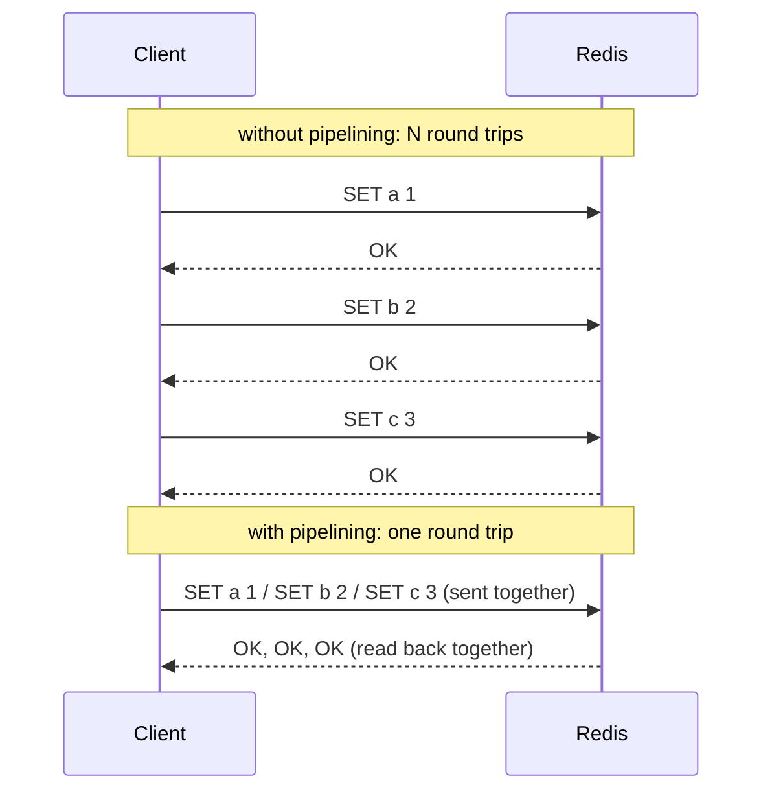

# Lesson 15. Pipelining, Round-Trip Cost, and Connection Pooling

**Mission link:** Stage 9 opens the mission's performance half. Every prior lesson assumed a command's own execution cost; this lesson is the cost that has nothing to do with what a command actually does, the network round trip surrounding it, and the two independent levers that address it.
**Primary source:** [Docs: "Data types", Redis](https://redis.io/docs/latest/develop/data-types/)
**Prerequisites:** [Lesson 14](0014-lua-scripting-and-redis-functions.md), [Eviction policy](../GLOSSARY.md)

## Warm-up

1. ▢ Why must a Lua script declare its keys via `KEYS[]` rather than embedding them directly in the script's own logic?

Check

Redis Cluster needs to know, before running a script, which keys it touches, so it can verify they all hash to the same slot before allowing the script to run at all; keys embedded in the script's own string logic aren't visible to Redis without executing the script, defeating that upfront check.

2. ▢ Why does a Lua script's check-and-delete close the race a client-side `GET` then `DEL` leaves open when releasing a lock?

Check

The script runs as one atomic unit, since Redis is single-threaded for command execution; nothing else can run between the check and the delete inside it, closing the window where the lock could expire and be reacquired by another client between two separate client round trips.

## Know this

### A command's own cost and the network round trip around it are two different numbers

Redis executes most commands in microseconds; the actual bottleneck for a client issuing many commands one at a time is almost never the server's own execution time, it's the **round trip**, the time spent sending a request and waiting for the response before the next command can even be sent. For N sequential commands issued one at a time, total latency is roughly N times the round-trip time, even if the server itself finishes each command instantly, since the client is spending most of that time waiting on the network, not on Redis actually doing anything.

### Pipelining: batching the requests, not the guarantee

**Pipelining** sends several commands to Redis in one write, without waiting for each individual response before sending the next, then reads all the responses back together once they arrive. This collapses N round trips into roughly one, since the client is no longer alternating "send, wait, send, wait" for every single command. Pipelining is not the same guarantee as `MULTI`/`EXEC` (lesson 13): pipelined commands can still be interleaved with another client's commands between them, since pipelining is purely a network-efficiency optimization, not an atomicity guarantee. Wrapping a pipelined batch in `MULTI`/`EXEC` gets both: fewer round trips *and* no interleaving, which is the common combination for a bulk write that also needs to be atomic.

### Connection pooling: the other cost, paid once per connection instead of once per command

Establishing a new connection (a TCP handshake, and a TLS handshake if the connection is encrypted) costs real time on its own, separate from any command's round trip. A client that opens a fresh connection for every command (or every request in a short-lived process) pays that setup cost repeatedly, on top of the round-trip cost pipelining addresses. **Connection pooling** keeps a set of already-established connections open and reuses them across requests, so the connection-setup cost is paid once per pooled connection rather than once per command; most production Redis clients maintain a pool for exactly this reason; reaching for one instead of opening a connection per operation is a separate, independent fix from pipelining, since it addresses connection setup, not per-command round trips.

### Two separate costs, two separate levers

Pipelining reduces how many round trips a batch of commands costs; connection pooling reduces how often the cost of establishing a connection is paid at all. A client issuing many commands over one already-pooled, persistent connection, batched via pipelining, has addressed both costs; fixing only one (pipelining commands over a connection that gets torn down and reopened constantly, or pooling connections but still issuing every command as its own round trip) still leaves the other cost in place.

## Practice

1. ▢ A client issues 1,000 `SET` commands one at a time over a connection with a 2ms round-trip time. Roughly how long does this take, and why is Redis's own per-command execution speed almost irrelevant to that number?

Hint

Consider what the client is actually spending most of its time doing between commands.

Check

Roughly 2 seconds (1,000 × 2ms), dominated almost entirely by round-trip time, since the client waits for each response before sending the next command. Redis's own execution time per command (microseconds) is negligible next to the network round trip the client pays 1,000 times over.

2. ▢ Rewriting the same 1,000 `SET` commands as one pipelined batch, roughly how many round trips does this cost instead, and why doesn't this alone guarantee no other client's command can interleave with them?

Check

Roughly one round trip (all 1,000 commands sent together, all 1,000 responses read back together), instead of 1,000 separate ones. It doesn't guarantee non-interleaving because pipelining is purely a network-batching optimization; Redis still processes each pipelined command as its own individual operation, and another client's command can still run between any two of them unless the batch is also wrapped in `MULTI`/`EXEC`.

3. ▢ A short-lived script opens a brand-new connection to Redis for every single command it issues, rather than reusing one connection. What cost does this add beyond the round-trip cost of the commands themselves?

Check

The cost of establishing a new connection (a TCP handshake, plus a TLS handshake if encrypted) on every single command, paid repeatedly instead of once. This is a separate cost from the per-command round trip; connection pooling, reusing already-established connections across commands, is what avoids paying it over and over.

4. ▢ A team pipelines a batch of commands but doesn't wrap them in `MULTI`/`EXEC`, then is surprised that another client's write appears to have happened "in the middle" of their batch. Explain what actually happened.

Check

Pipelining only batches how the commands are sent and their responses read back; it says nothing about whether other clients' commands can run between them on the server. Without `MULTI`/`EXEC` wrapping the batch, Redis is free to process another client's command between any two pipelined commands, exactly the interleaving the team observed; wrapping the same batch in `MULTI`/`EXEC` would have prevented it.

5. ▢ Which claim correctly distinguishes pipelining from connection pooling?

    - a) Both address the exact same cost, so using one makes the other unnecessary
    - b) Pipelining reduces the number of round trips a batch of commands costs; connection pooling reduces how often the cost of establishing a connection is paid, two independent costs addressed by two independent fixes
    - c) Pipelining guarantees no other client's command interleaves with a batch, the same way `MULTI`/`EXEC` does
    - d) Connection pooling eliminates the need for a client to ever wait for a response from Redis

Check

**b)** That's the precise, independent pair of costs and fixes this lesson describes. (a) is false: round-trip cost and connection-setup cost are different costs, and fixing one doesn't address the other. (c) is false: pipelining alone doesn't prevent interleaving, only `MULTI`/`EXEC` (or a script) does. (d) is false: pooling only avoids repeated connection setup; a client still waits for command responses over whatever connection it's using.

## Real-world reps

- [ ] Find a script or service you have access to that issues many Redis commands in a loop, one at a time. Estimate how much latency pipelining them into one batch would save, given the round-trip time to that Redis instance.
- [ ] Check whether a client library you use maintains a connection pool by default, and if so, what its default pool size is.
- [ ] Tomorrow: read the primary source's guidance on pipelining in full, and note any limit it mentions on how many commands are safe to pipeline in a single batch.

## Going further

- [Docs: "Data types", Redis](https://redis.io/docs/latest/develop/data-types/)
- [Docs: "Distributed locks with Redis", Redis](https://redis.io/docs/latest/develop/clients/patterns/distributed-locks/)
- [Resources](../RESOURCES.md)

---

Not landing? Reread the primary source at the top, since this lesson compresses it and compression is where understanding leaks. Check the [glossary](../GLOSSARY.md) for any term that felt slippery.

If the lesson itself is unclear rather than the material, that is a defect: [open an issue](https://github.com/TokenCemetery/teach/issues).
