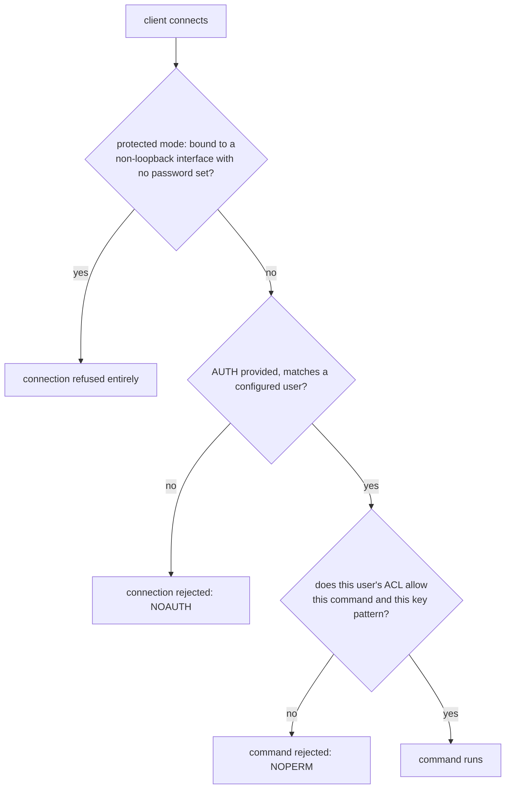

# Lesson 17. ACLs and Protected Mode

**Mission link:** This is the final lesson of the extended arc. Every prior lesson assumed a client that's already allowed to talk to Redis; this lesson is what stops the wrong client from ever reaching it in the first place, and scopes what a legitimate one is actually permitted to do once it has, closing the mission's "quietly misusing Redis" theme at the access-control layer.
**Primary source:** [Docs: "Key eviction", Redis](https://redis.io/docs/latest/develop/reference/eviction/)
**Prerequisites:** [Lesson 16](0016-operational-visibility.md), [Eviction policy](../GLOSSARY.md)

## Warm-up

1. ▢ Why does running `KEYS *` against a large production keyspace risk freezing the entire instance, in a way `SCAN` doesn't?

Check

Redis is single-threaded, and `KEYS` computes its entire result as one uninterruptible call, blocking every other client for however long that takes on a large keyspace. `SCAN` returns a small batch per call, letting other clients run in the gaps between successive calls instead.

2. ▢ What does the latency monitor catch that `SLOWLOG` wouldn't?

Check

The latency monitor tracks latency by event class, including internal operations like a `fork` for an RDB snapshot or a long expire cycle, neither of which is a "slow command" `SLOWLOG` records, since `SLOWLOG` only logs commands that individually exceed its threshold.

## Know this

### Protected mode: refusing to be reachable at all, by default

**Protected mode** is a safety default that refuses any connection from a non-loopback address the moment Redis is bound to a network interface with no password configured and no explicit `bind` directive restricting access; the instance simply won't accept remote connections until an operator deliberately configures either a password or an explicit bind address, forcing the decision to be made rather than defaulted into. This exists directly because of a real, repeated production failure mode: an internet-exposed Redis instance with no authentication at all, reachable by anyone, has been the root cause of numerous actual incidents (data wiped and held for ransom, an instance conscripted for something else entirely) that had nothing to do with a bug in Redis itself, only with nothing standing between the open network and a fully capable, unauthenticated instance.

### ACLs: named users, scoped to specific commands and specific keys

Before **ACLs** (access control lists), Redis had one mechanism, `requirepass`, a single shared password with no way to distinguish one authenticated client's permissions from another's: anyone who knew the password could run any command against any key. ACLs (`ACL SETUSER username on >password ~pattern +@category -command`) let an operator define named users, each with their own password, a set of key patterns they're allowed to touch (`~cache:*` for a client that should only ever see keys under that prefix), and specific commands or command categories they're allowed or denied. `ACL WHOAMI` reports the currently authenticated user; `ACL LIST` shows every configured user and their rules.

### Command categories: restricting a whole class of risk in one rule

`ACL CAT` lists Redis's built-in command categories (`@read`, `@write`, `@admin`, `@dangerous`, and others); a user created with `-@dangerous` is denied every command in that category (`FLUSHALL`, `CONFIG`, `SHUTDOWN`, and more) in one rule, rather than an operator having to enumerate every individual command that could cause serious damage. A cache client genuinely only needs something like `+@read +@write ~cache:*`, read and write access to its own key namespace, nothing else; giving it broader access than that is exactly the kind of accidental over-permissioning that turns a compromised application into a compromised database.

### The default user, and why it needs deliberate attention

Redis ships with a `default` user that, historically, has full access with no password unless `requirepass` is set; a real deployment has to either give the `default` user a real password (or disable it outright) and create named, narrowly-scoped users for each actual application, rather than leaving every client authenticating as one shared, unrestricted identity. Skipping this and relying on `requirepass` alone reproduces the exact single-shared-secret, all-or-nothing access ACLs exist to replace, just with an extra password check in front of it.

## Practice

1. ▢ An operator spins up a fresh Redis instance, binds it to `0.0.0.0` (all interfaces) for convenience, and sets no password. What does protected mode do in this situation, and why does that matter for a real deployment?

Hint

Consider what "no password and bound to a non-loopback interface" specifically triggers.

Check

Protected mode refuses any remote (non-loopback) connection entirely, since the instance is bound to a real network interface with no password configured. This matters because it prevents exactly the accidental, internet-exposed, unauthenticated Redis scenario that has caused real production incidents; the operator has to deliberately set a password or an explicit, restrictive bind address before remote clients can connect at all.

2. ▢ Before ACLs, what was the single access-control mechanism Redis had, and what specifically could it not distinguish?

Check

`requirepass`, a single shared password. It couldn't distinguish one authenticated client's permissions from another's at all: anyone who knew the password could run any command against any key, with no way to give one client narrower access than another.

3. ▢ A cache client only ever needs to read and write keys under `cache:*`. Write, in words, an ACL rule for a user scoped to exactly that, and explain what restricting it to `@read` and `@write` (rather than granting all commands) actually buys.

Check

Something like `ACL SETUSER cacheapp on >password ~cache:* +@read +@write`: a user that can authenticate, touch only keys under the `cache:` prefix, and run only read and write commands. Restricting to `@read`/`@write` specifically denies everything in `@admin` or `@dangerous` (like `FLUSHALL` or `CONFIG`), so even a fully compromised cache-application credential can't wipe the database or reconfigure the server, only read and write within its own narrow key namespace.

4. ▢ A team leaves the `default` user active with no password, since `requirepass` was never configured, and creates narrowly-scoped named users for their actual applications anyway. What real risk does this still leave open?

Check

The `default` user, with no password and (by default) full access, is still reachable and fully capable; anyone who can authenticate as `default` (which requires no password at all in this configuration) bypasses every narrow scoping the team set up for its named users entirely. Creating scoped users doesn't help if the unrestricted default identity is still open and unauthenticated alongside them.

5. ▢ Which claim correctly describes protected mode and ACLs together?

    - a) Protected mode scopes what an authenticated client can do; ACLs decide whether a connection is accepted at all
    - b) Protected mode refuses non-loopback connections to an unauthenticated instance by default; ACLs then scope what an authenticated user is actually permitted to do, by command and by key pattern
    - c) `requirepass` and ACLs provide identical, interchangeable access control, so configuring both is redundant
    - d) A user restricted with `-@dangerous` still retains the ability to run `FLUSHALL` and `CONFIG`, since those aren't included in that category

Check

**b)** That's the precise division of labor: protected mode gates reachability, ACLs gate permitted actions once connected. (a) is false and reverses the two mechanisms' roles. (c) is false: `requirepass` is a single shared secret with no per-user distinction, a narrower tool ACLs supersede for anything needing scoped access. (d) is false: `FLUSHALL`, `CONFIG`, and `SHUTDOWN` are exactly the kind of commands the `@dangerous` category groups together, denied by `-@dangerous`.

## Real-world reps

- [ ] Check whether a Redis instance you have access to (or are responsible for) has protected mode's conditions actually satisfied (a real password or an explicit, restrictive bind address), rather than relying on a network firewall alone to keep it safe.
- [ ] Run `ACL LIST` against an instance you can access, and check whether the `default` user still has a blank password and full access, or has been given a real password or been disabled in favor of named, scoped users.
- [ ] Tomorrow: design an ACL rule (on paper) for one real application you know of that talks to Redis, naming exactly the key pattern and command categories it should be restricted to, then compare that against what access it's actually been granted.

## Going further

- [Docs: "Key eviction", Redis](https://redis.io/docs/latest/develop/reference/eviction/)
- [Docs: "Data types", Redis](https://redis.io/docs/latest/develop/data-types/)
- [Resources](../RESOURCES.md)

---

Not landing? Reread the primary source at the top, since this lesson compresses it and compression is where understanding leaks. Check the [glossary](../GLOSSARY.md) for any term that felt slippery.

If the lesson itself is unclear rather than the material, that is a defect: [open an issue](https://github.com/TokenCemetery/teach/issues).
